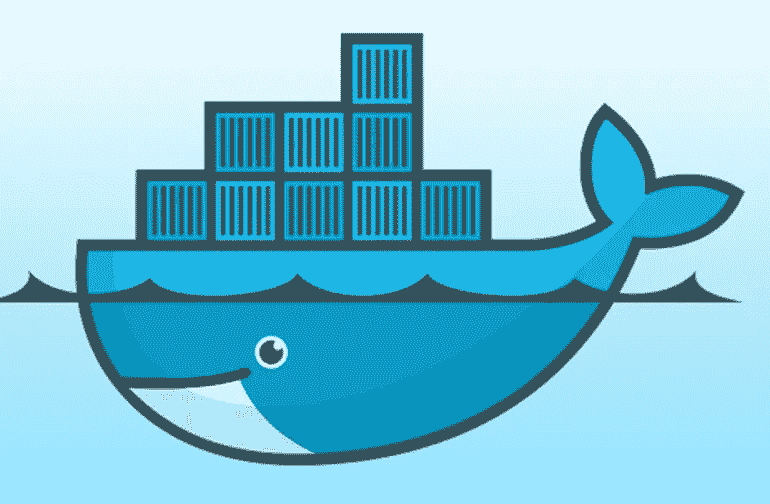

# 如何为 Rails 构建 Docker 基础映像

> 原文：<https://betterprogramming.pub/build-docker-base-images-for-rails-2258ea2f11dc>

## 通过使用自定义基础映像，简化 Docker 文件并减少 Docker 构建时间



Docker 标志

Docker 为在隔离环境中运行应用程序提供了一种简单的方法，它也有助于将应用程序与它们的依赖项打包在一起。

为您的应用程序构建 docker 映像并管理这些 Docker 映像可能是一项具有挑战性的任务(取决于您想要实现的目标)。

在这篇文章中，我将解释如何创建 Docker 映像来作为 Rails 应用程序的基础映像。该职位将涵盖以下几点。

*   为基础图像创建`Dockerfiles`。
*   自动创建 Docker 文件。
*   使用 GitHub 和 [Travis](https://travis-ci.org/) 自动化构建过程。
*   为 Rails 应用程序使用 Docker 基本映像。

# **问题**

如上所述，Docker 映像是一种将应用程序与它应该运行的主机环境隔离的方法。这个特性允许我们将应用程序部署到任何 Docker 主机上，而不需要关心在主机上安装和管理软件依赖。

为了实现这个目标，每个创建的 Docker 映像都必须包含运行相应应用程序所需的所有依赖项。

例如，对于使用`wkhtmltopdf`二进制文件生成 PDF 文档的 Rails 应用程序，该应用程序的 Docker 映像必须包含`wkhtmltopdf`二进制文件才能生成 PDF 文件。

对于 Rails 应用程序，应用程序依赖项可能是以下项目之一(这也可能适用于非 Rails 应用程序)。在构建期间，需要考虑这些项目并将其包含在 Docker 映像中。

1.  对应的 Ruby 编程语言版本。
2.  像`mysql2`这样的系统包。
3.  配置和环境变量。
4.  Rails 应用程序使用的 Ruby/Rails gems。

为具有上述所有依赖关系的多个应用程序(微服务架构软件)构建 Docker 映像可能会花费大量时间，因为对于每个服务，我们需要下载并安装所有提到的依赖关系。

# **提议的解决方案**

因为多个 Rails 应用程序可能有相同的 Ruby 版本、系统包和配置，所以我们可以构建包含这些项目的 Docker 映像，然后使用这些 Docker 映像作为 Rails 应用程序的基本映像。

这个想法将帮助我们减少为我们的服务/应用程序构建 Docker 映像所需的时间。

## **Docker 文件内容**

我们可以构建 Docker 基本映像，包括上面列表中的前三项，Ruby 和 Rails gems 是特定于应用程序的，不应该属于基本映像。

幸运的是，我们可以使用 [Ruby 官方图片](https://hub.docker.com/_/ruby/)来覆盖我们列表中的第一项。

为了实现这一点，我们需要将下面一行作为第一行包含在基本图像 Dockerfile 文件中。这一行将告诉 Docker，我们希望构建一个基于 [Alpine](https://alpinelinux.org/about/) 作为操作系统的 Docker 映像，并且安装了 Ruby“2 . 6 . 4”。

```
FROM ruby:2.6.4-alpine
```

下一步是定义一些被多个 Rails 应用程序使用的共享环境变量。

例如，为了确保我们所有的服务都在 Docker 的生产模式下运行，我们可以在基本映像中设置`RAILS_ENV`。此外，我们可以为所有应用程序公开相同的端口，这将有助于我们维护服务之间的一致性。

以下是可设置项目的建议列表，该列表不限于这些变量或配置。

下一步是准备 Docker 映像操作系统，以便能够托管我们的应用程序。在这一步中，我们将创建一个服务用户来使用它运行我们的应用程序，并安装运行我们的应用程序所需的必要系统包。

这一步中包含的系统包列表取决于您正在构建的 Rails 应用程序。例如，如果不止一个应用程序在使用`wkhtmltopdf`，您可以将库包含在其中一个基本映像中。

下一步是切换到创建的用户，并确保安装了`bundler`,以便以后能够安装 gems。

最后一步是定义在子 Docker 映像(Rails 应用程序映像)构建期间需要执行的步骤。

为此，我们需要确保将应用程序的源代码复制到前面定义的相应文件夹中，并确保我们的用户是该文件夹的所有者。

以下是建议的 Docker 文件的全部内容。注意，这个文件只能用于支持 ruby 2.6.4 的 Rails 应用程序。

为了能够支持多个 Ruby 版本，我们需要为我们想要支持的每个版本创建多个 Docker 文件。

Docker 基本图像

## **管理 Docker 图像的创建**

除了为每个受支持的 Ruby 版本手动复制基本 Docker 文件之外，我们还可以尝试通过将建议的 Docker 文件转换为模板来自动创建这些文件，并使用 Ruby 从模板中自动创建 Docker 文件。

要将我们的 Docker 文件转换为模板，我们需要在建议的 Docker 文件中添加两个占位符。第一行与我们的 Docker 映像中使用的 Ruby 版本相关。

```
FROM ruby:<%= ruby_version %>-alpine
```

第二行与需要包含在 Docker 基本映像中的系统包列表相关

有了这些改变，我们有能力用不同的 Ruby 版本和不同的系统包创建多个 Docker 文件。这些更改的完整结果如下所示。

下一步是自动创建受支持的 Docker 文件，为此我们可以编写一个简单的 Ruby 代码，读取受支持的 Docker 映像及其依赖关系的列表，并为每个映像创建一个 Docker 文件。

YAML 文件结构可能类似于下面的文件。

上面的文件包含了两个基于 Ruby 的 Docker 图像的定义`2.6.3`，其中一个包含了`mariadb-dev`。借助下面的 Ruby 代码，我们可以创建构建 Docker 映像所需的 Docker 文件。

运行下面的 Ruby 代码将为在`YAML`文件中定义的图像创建 Docker 文件，并将它们存储在本地文件夹`rails-base-image-ruby`中。

## **自动构建 Docker 图像**

既然我们已经为基础映像自动创建了 Docker 文件，下一步就是找到一种方法来为生成的文件自动构建 Docker 映像。

构建 Docker 映像可以使用 Docker 命令行`docker build`来完成。所有生成的 Docker 文件都存储在文件夹`rails-base-image-ruby`下。

因此，为了自动化构建过程，我们可以遍历`rails-base-image-ruby`下的所有文件夹并执行`docker build`命令。同样，我们可以使用命令`docker push`将 Docker 映像推送到 Docker 注册表。

这可以通过下面的 [Bash](https://www.gnu.org/software/bash/) 脚本来实现。

为了提高创建基本映像的自动化程度，我们可以配置 Travis，以便在每次创建针对主分支的 pull 请求时构建 Docker 基本映像。

这个任务可以通过简单地将下面的文件添加到我们在 GitHub 上的 repo 中并在 Travis 上启用 repo 来完成。

## **使用基础 Docker 图像**

为了在 Rails 应用程序中使用我们的基本图像，我们只需要在 Docker 文件顶部的`FROM`关键字后设置我们的图像名称。

此外，我们需要安装应用程序重新获取的 Ruby/Rails gems。下面是为 Rails 应用推荐的`dockerfile`。

# **结论**

总之，为 Rails 应用程序使用 Docker 基本映像可以提高部署的性能，并减少为应用程序构建 Docker 映像所需的时间。

这个想法的完整实现在下面的 GitHub [repo](https://github.com/wshihadeh/rails-base-images) 中，生成的 Docker 图片可以在[这个网址](https://cloud.docker.com/u/wshihadeh/repository/docker/wshihadeh/rails-base-image-ruby)找到。