# 使用 Swift 包管理器构建可重复使用的 SwiftUI 组件库

> 原文：<https://betterprogramming.pub/build-reusable-swiftui-component-libraries-with-the-swift-package-manager-23343681a8f3>

## 构建和共享漂亮、有用的组件


*使用 Xcode 11.3 和 Swift 5.1 编写。*

可重用的 SwiftUI 组件可以节省大量时间，但在项目之间复制和粘贴代码肯定不行。如何构建一个包来容纳所有这些组件并只导入您需要的组件呢？Swift Package Manager (SPM)使这一工作变得前所未有的简单。

# 入门指南

首先，在源代码管理提供程序中创建一个存储库。出于本教程的目的，我将使用 GitHub。这将是您将包导入其他项目的位置。创建存储库后，记下它的 URL。

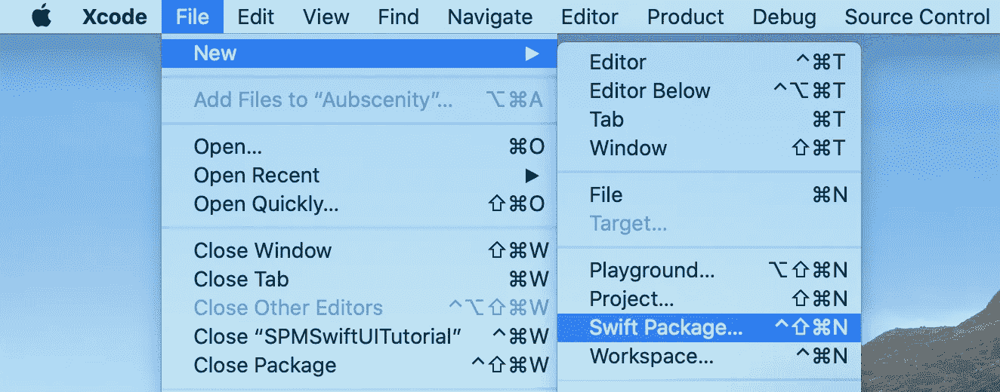

现在让我们回到 Xcode 并创建一个新的 swift 包。

导航至您的 Xcode 菜单栏，并选择新建> Swift 软件包…

## 配置我们的源代码管理遥控器

我们要做的第一件事是添加我们的源控制遥控器。

*   在 Xcode 中打开“源代码管理”标签
*   右键单击项目主，并选择“添加现有的远程…

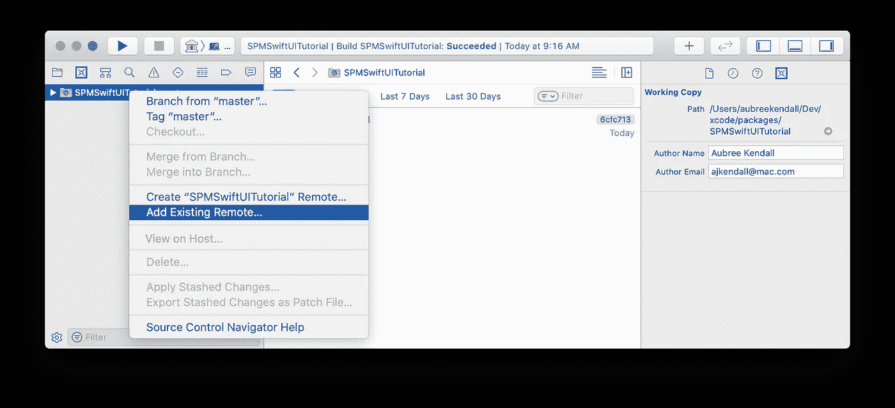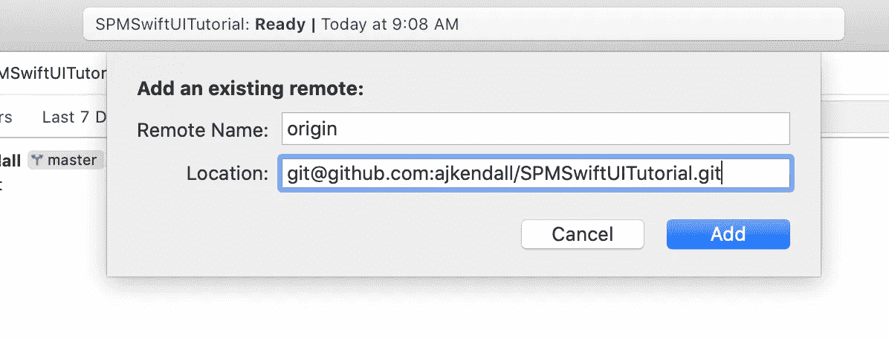

注意，对于公开回购，你应该使用 HTTPS 的网址。

```
https://github.com/username/RepoName.git
```

对于私人回购，请使用 SSH URL:

```
git@github.com:username/RepoName.git
```

# 添加到我们的新包中

现在让我们更新我们的`Sources/SPMSwiftUITutorial/SPMSwiftUITutorial.swift` 来显示一些我们可以测试的东西。

不要忘记将您希望在包外部访问的任何内容指定为 public。

现在，让我们构建并发布我们的回购协议，以确保到目前为止一切正常。

通过输入 Command+B 或从“产品”菜单中选择“构建”来构建您的项目。

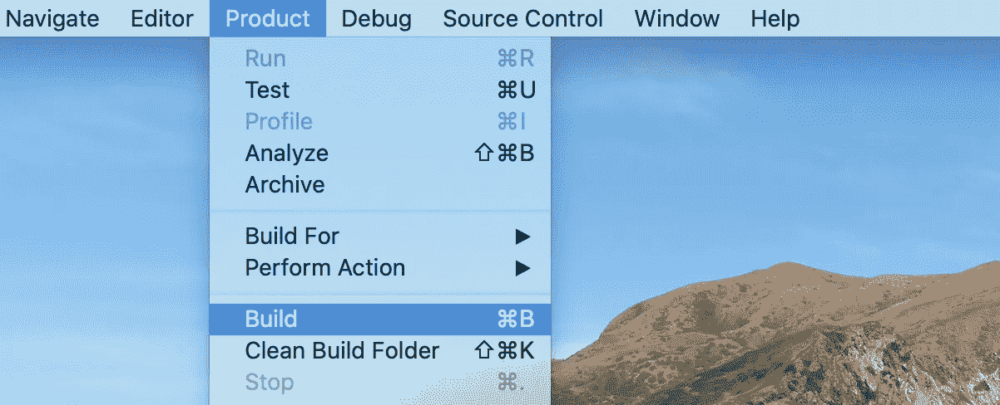

一旦成功构建，让我们提交我们的新函数。单击顶部菜单栏中的“源代码管理”>“提交…”。


为您的提交输入描述，并确保“推送至远程”未启用。我们仍然需要标记我们的提交，以使它在其他项目中可用。单击右下角的“提交…”提交您的更改。


# 标记我们的提交

为了设置一个新的包版本，我们需要标记我们的提交。因此，我们需要在每次使用 release an update 时执行以下操作。

让我们回到源代码控制面板，找到我们的提交。找到后，右键单击您的提交并选择“标记“…”。

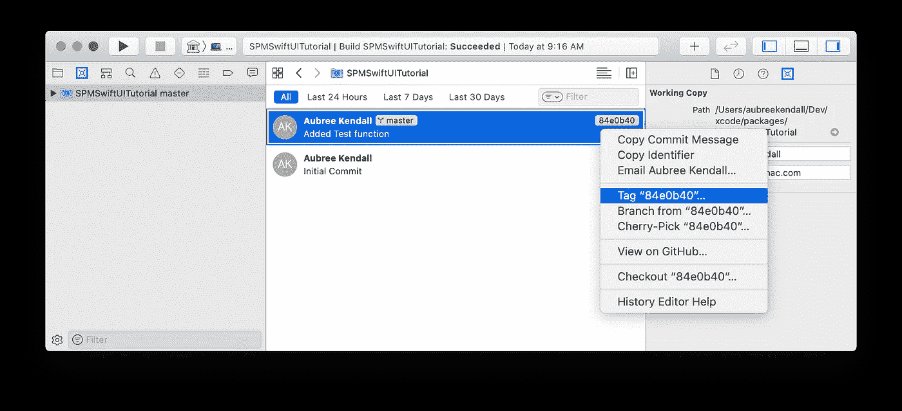

添加标签和消息，然后单击“创建”

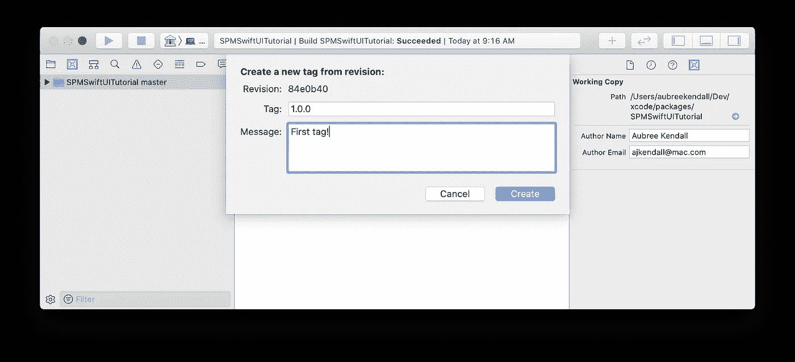

现在我们可以将我们的更改推送到 GitHub。


请确保在推送前勾选了“包含标签”。点击“推送”

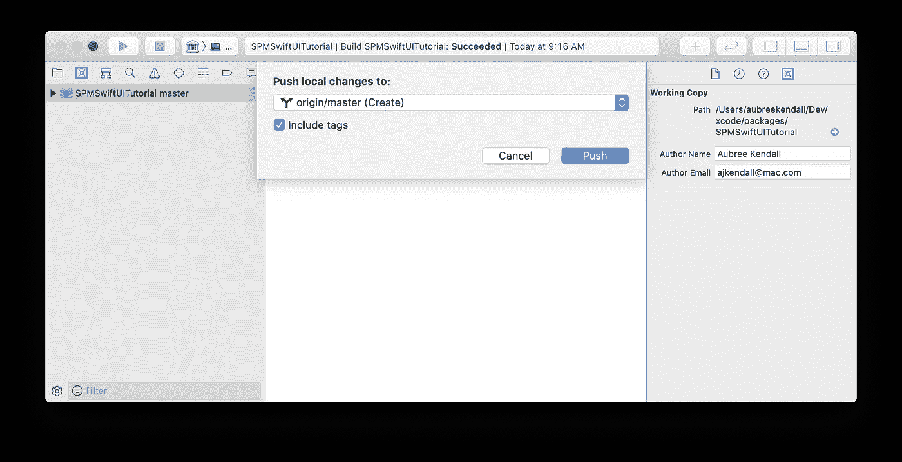

# 在应用程序中使用我们的新包

现在，让我们确保我们的包在另一个项目中是可访问的。

打开一个单独的项目，或创建一个新项目。出于本教程的目的，我将使用一个名为`SPMTestApp`的空白 iOS 项目。在项目设置中打开我们应用程序的 Swift packages 面板。点按(+)按钮以添加新包。


Swift 将配置打包到应用程序的项目设置中

系统会提示您选择一个包存储库。您拥有的任何包都应该显示为选项—如果不是，请使用顶部的文本字段搜索存储库 URL。选择您的软件包，然后单击“下一步”配置软件包选项。


选择包存储库

在包选项中，确保版本中的标签是 1.0.0。点击“下一步”


选择包选项

目前我们的包装只有一种产品。选择该产品，然后单击“完成”


稍后，我们将添加更多产品，以便您可以缩小您的产品包，只包含您需要的组件。

现在，更新你的`AppDelegate`看看我们的功能是否有效。

运行应用程序(Command+R)并检查是否“SPM 测试功能成功！”被打印到控制台。如果是这样，我们就成功地创建了我们的包。现在，让我们通过添加我们可以选择导入的多个产品来更新我们的包。

# 将我们的包装分成多种产品

让我们回到我们的 Swift 包，在我们的`Sources`目录中添加一些新的文件夹/文件。

添加一个名为`ReusableButton`的文件夹，并在其中添加一个名为`ReusableButton.swift`的文件。添加另一个名为`ReusableSlider`的文件夹，并在其中添加一个名为`ReusableSlider.swift`的文件。

你最终的树应该如下图所示。

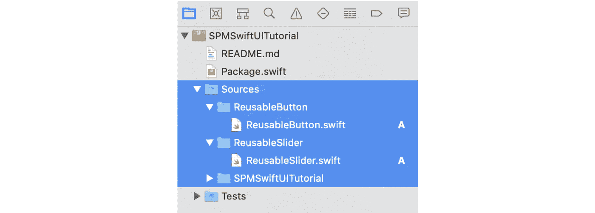

现在，让我们为每个新文件添加一个 SwiftUI 组件。

打开`ReusableButton.swift`，添加以下内容:

可重用按钮. swift

打开`ReusableSlider.swift`，添加以下内容:

ReusableSlider.swift

注意当向 Swift 包添加任何 SwiftUI 组件时，您必须添加一个初始化器并将其指定为公共的。如果不这样做，当您以后尝试使用该组件时，将会导致错误。

# 将产品/目标添加到我们的包配置中

为了将`ReusableSlider`和`ReusableButton`作为可选库来导入，我们需要更新我们的包配置。

打开`Package.swift`，添加两个目标(每个都使用我们新的文件夹名)。

Package.swift 目标

现在，在`products`下添加两个引用我们目标的库。

Package.swift 产品

您的最终`Package.swift` 应该如下图所示:

Package.swift

构建您的项目以确保一切正常运行(Command+B)。

现在，让我们通过提交、标记和推送来发布我们的包更新。

打开提交面板(Command+Option+C)。输入提交描述，并确保未选中“推送到远程”选项。单击“提交…文件”

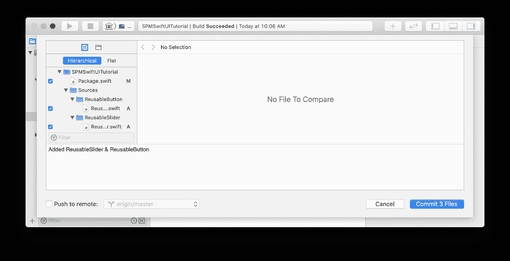

打开源代码控制面板，找到您的提交。右键单击它，然后选择“标记”

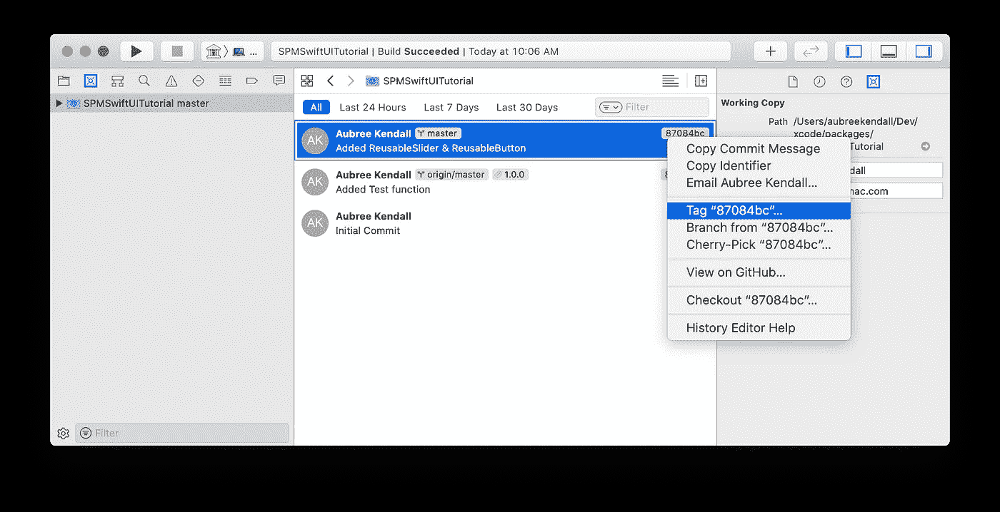

输入新标签(不同于先前创建的标签)和消息。点击“创建”

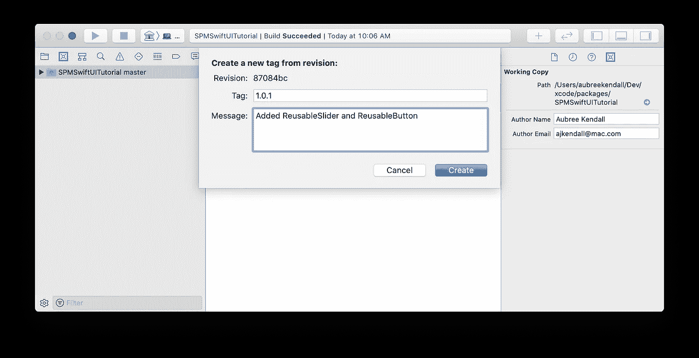

现在，通过从“源代码控制”菜单中选择“推送…”来推送您的更改。


确保“包括标签”被选中。点击“推送”


# 在我们的应用中更新我们的包

现在，让我们回到测试应用程序，测试我们的更改。导航回项目设置> Swift 软件包。要更新依赖项，通常只需通过双击依赖项来更新版本/标签。由于我们想要修改我们导入的产品，我们将删除它并重新添加。通过这样做，我们可以提示产品选择面板。

要删除我们的包依赖项，请在我们的包依赖项列表中选择它，然后单击列表底部的删除按钮(—)。

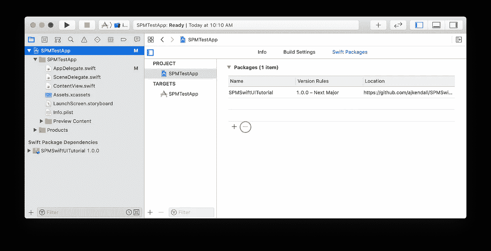

单击“删除”确认您要删除它

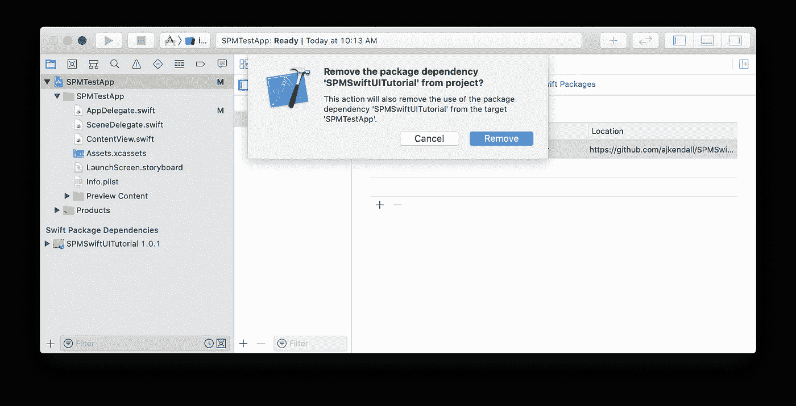

现在点击添加来阅读我们的包。


选择您的软件包，然后单击“下一步”配置软件包选项。


在包选项中，确保我们的版本标签更新为 1.0.1。点击“下一步”

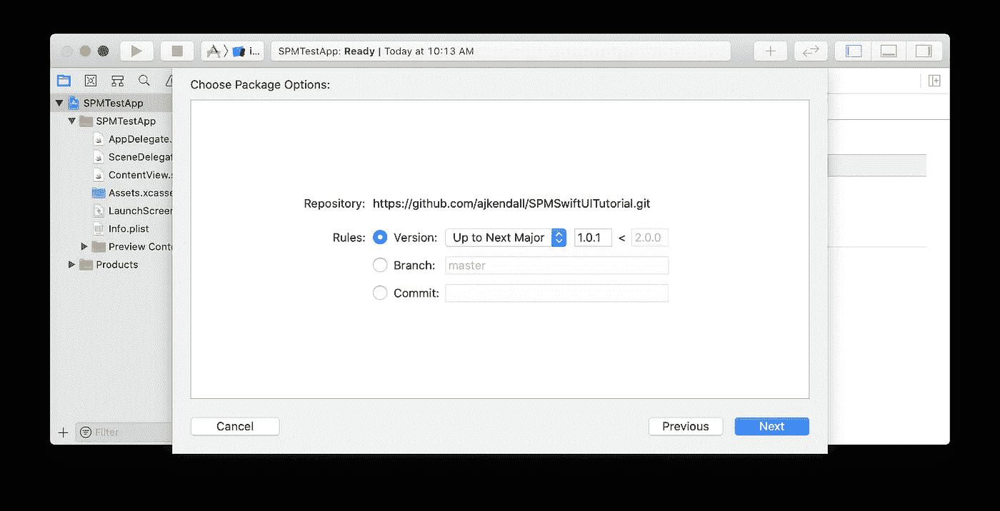

现在我们可以看到我们的新产品上市了。只检查`ReusableSlider`和`ReusableButton`。点击“下一步”

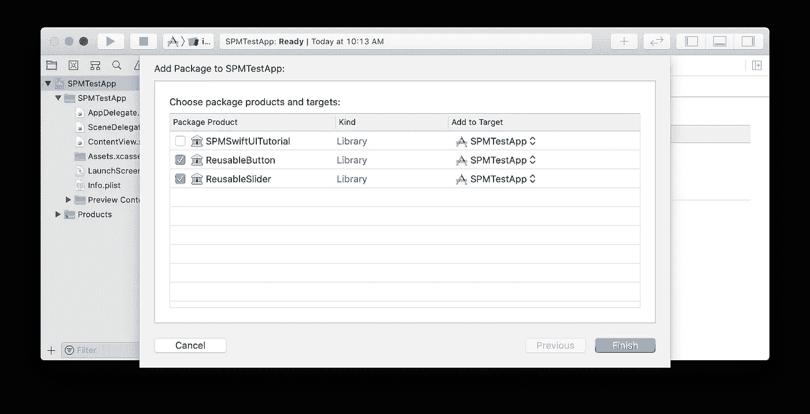

现在，既然我们已经从依赖项中删除了`SPMSwiftUITutorial`，那么从`AppDelegate`中删除导入和测试功能:

现在，让我们打开我们的`ContentView.swift`文件，看看我们的新视图是否有效。用以下内容更新我们的`ContentView.swift`文件:

让我们刷新画布以查看我们的新组件。

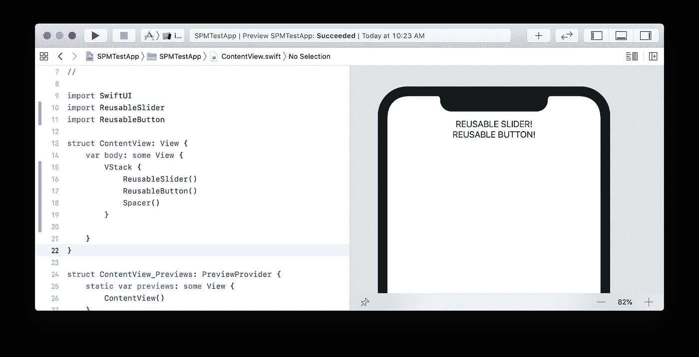

这就是关于使用 Swift Package Manager (SPM)组织可重用组件库的教程。