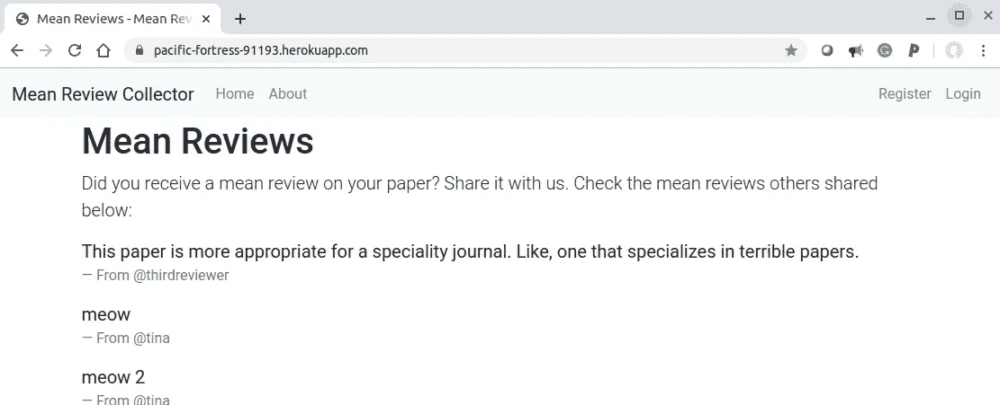

# 构建、测试和部署 Flask 应用程序(第 7 部分)

> 原文：<https://betterprogramming.pub/build-test-and-deploy-a-flask-application-part-7-60dde9080330>

## 部署


由 [SpaceX](https://unsplash.com/@spacex?utm_source=medium&utm_medium=referral) 在 [Unsplash](https://unsplash.com?utm_source=medium&utm_medium=referral) 上拍摄的照片

# 关于本教程的元信息

## 学习目标

*   部署

注:本教程是 [*科学学烧瓶*](https://medium.com/@neohao/learn-flask-in-a-scientific-way-baf4d8055f6e) *系列的一部分。*

## 源代码

*   本教程的源代码可以在 [GitHub](https://github.com/Neo-Hao/mean-review-collector) 上获取。
*   该演示可在[该网站](https://pacific-fortress-91193.herokuapp.com/)上获得。
*   仅涵盖本教程的版本可以在 GitHub 上访问[。](https://github.com/Neo-Hao/mean-review-collector)

# 计划

在本教程中，我们将部署我们一直在开发的 web 应用程序，并向全世界展示它:



我们将使用 Heroku 的免费服务。Heroku 是构建在 AWS 服务(如 EC2)之上的应用托管服务。

您可以利用 EC2 的强大功能，但不需要处理 EC2 所需的系统管理工作。有了 Heroku，你可以用一个`git push`将你的应用程序部署到他们的服务器上。

# 使用生产级 WSGI Web 服务器

Flask development server 不擅长处理真正的请求。要部署我们的应用程序，我们首先需要一个生产级的 WSGI web 服务器。为此，我们将使用 [gunicorn](https://gunicorn.org/) 。

要安装 gunicorn，请在您的终端中键入以下行(您仍然需要在虚拟环境中):

```
(env)$ pip install gunicorn==19.9.0
```

由于我们使用了应用程序工厂模式，gunicorn 很难直接找到我们的应用程序模块。因此，我们需要在根级别创建一个名为`wsgi.py`的文件:

```
#wsgi.pyfrom app import create_app
app = create_app()
```

要确保这一点，请在您的终端中键入以下行:

```
(env)$ gunicorn wsgi:app
```

您应该看到以下内容:

```
[2019-12-27 15:41:08 -0800] [31065] [INFO] Starting gunicorn 19.9.0
[2019-12-27 15:41:08 -0800] [31065] [INFO] Listening at: http://127.0.0.1:8000 (31065)
[2019-12-27 15:41:08 -0800] [31065] [INFO] Using worker: sync
[2019-12-27 15:41:08 -0800] [31068] [INFO] Booting worker with pid: 31068
```

Gunicorn 会用你的 8000 入口。您应该能够通过 web 浏览器在 http://127.0.0.1:8000 本地检查您的应用程序。

# 使用 Heroku

要准备将您的应用程序部署到 Heroku，您需要:

1.  在 Heroku.com 报名。
2.  安装 [Heroku CLI](https://devcenter.heroku.com/articles/heroku-cli) 。(请按照此网页上的说明操作。)
3.  仔细检查您的`requirements.txt`:回想一下我们在教程 [*构建、测试和部署 Flask 应用程序:第 3 部分——应用程序工厂和蓝图*](https://medium.com/better-programming/build-test-and-deploy-a-flask-application-part-3-3a2abfe4be21) 中生成的需求文件。为了确保我们没有添加任何新的依赖项(我们实际上添加了)，请在您的终端中再次运行下面一行:

```
(env)$ pip freeze > requirements.txt
```

4.创建一个名为`procfile`的新文件:

```
web gunicorn wsgi:app
```

5.将上述所有更改提交并推送到 GitHub。

现在，您已经为部署做好了准备。在终端中键入以下行:

```
(env)$ heroku create
(env)$ git push heroku master
```

您可以通过运行`heroku open`在浏览器中打开应用程序来检查您的实时应用程序。你也可以在这个网站上查看我的演示。

# 教程列表

*   [构建并测试迷你烧瓶应用](https://medium.com/@neohao/build-test-and-deploy-a-mini-flask-application-1d9ca6c45115)
*   [构建、测试和部署 Flask 应用程序:第 1 部分—模板](https://medium.com/better-programming/build-test-and-deploy-an-interactive-flask-application-part-i-templates-53a7b0cbe760)
*   [构建、测试和部署 Flask 应用程序:第 2 部分——认证](https://medium.com/better-programming/build-test-and-deploy-a-flask-application-part-2-53f2c8df3ebc)
*   [构建、测试和部署 Flask 应用程序:第 3 部分——应用程序工厂和蓝图](https://medium.com/@neohao/build-test-and-deploy-a-flask-application-part-3-3a2abfe4be21)
*   [构建、测试和部署 Flask 应用程序:第 4 部分——重构测试](https://medium.com/@neohao/build-test-and-deploy-a-flask-application-part-4-5aa4f079fadb)
*   [构建、测试和部署 Flask 应用程序:第 5 部分——认证(续)](https://medium.com/@neohao/build-test-and-deploy-a-flask-application-part-5-4a3c0bc36b8e)
*   [构建、测试和部署 Flask 应用程序:第 6 部分——评审系统](https://medium.com/@neohao/build-test-and-deploy-a-flask-application-part-6-952a1b29a02a)
*   [构建、测试和部署 Flask 应用程序:第 7 部分——部署](https://medium.com/@neohao/build-test-and-deploy-a-flask-application-part-7-60dde9080330)