# 在 SwiftUI 中构建苹果计算器

> 原文：<https://betterprogramming.pub/build-the-apple-calculator-in-swiftui-2fad61285dc8>

## 第 1 部分—视图

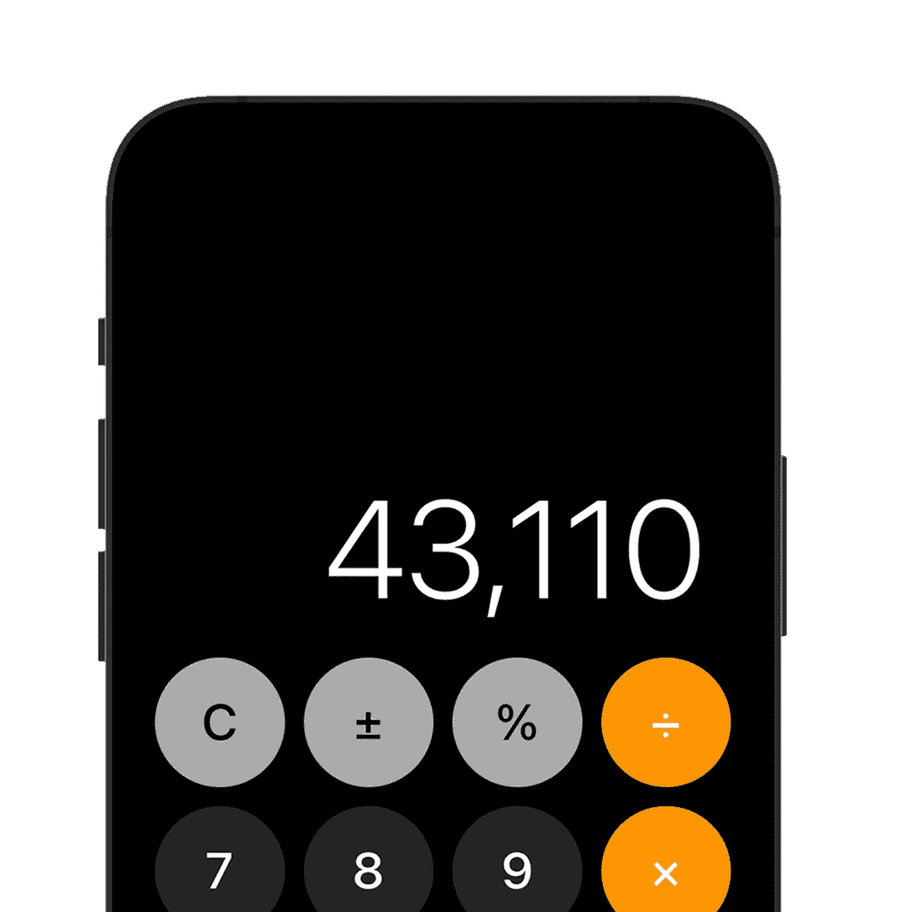

在这个系列教程中，我们将从头开始构建苹果计算器。该计算器将按照最佳实践进行开发。如果你是一个初学者，这很好，因为你将开始学习一些新的有挑战性的概念，这将使你成为一个更好的开发者。如果您是中级用户，本教程将帮助您掌握构建可扩展和可维护的 SwiftUI 应用程序的一些重要实践。

在本教程中，我们将从构建视图开始。

视图是应用程序中最重要的部分之一，因为视图是用户看到并与之交互的东西。视图也是代码中最有可能随时间变化的部分，因此构建一个结构良好的视图对于可维护性来说是必不可少的。

我们将按照一些最佳实践来组织和维护我们的视图，尽可能接近地重新创建苹果计算器。


成品

# 创建新项目

创建新的 iOS 应用程序。

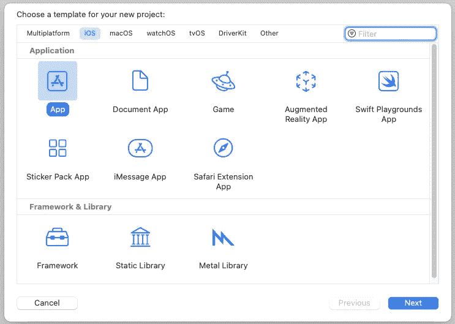

输入`Calculator`作为产品名称，并确保选择`SwiftUI`作为您的界面。取消底部的所有复选框，我们现在不需要这些功能。

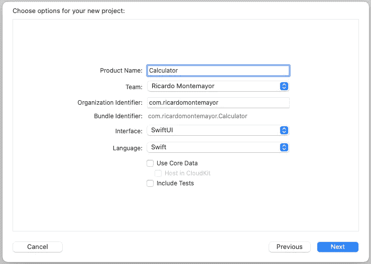

# 规划你的视野

好极了。我们有我们的项目，让我们开始编码。但是等等！如果我们不知道我们将构建什么，我们如何开始编码呢？

我怎么强调这一点都不为过。在建造任何东西之前，先做好计划。

当构建视图时，确保你有某种参考来处理你要构建的内容。这可以是任何东西，从画得很差的草图到像素完美的模型。任何你可以回头去看并给你一个结果应该是什么样子的想法的东西都是好的。

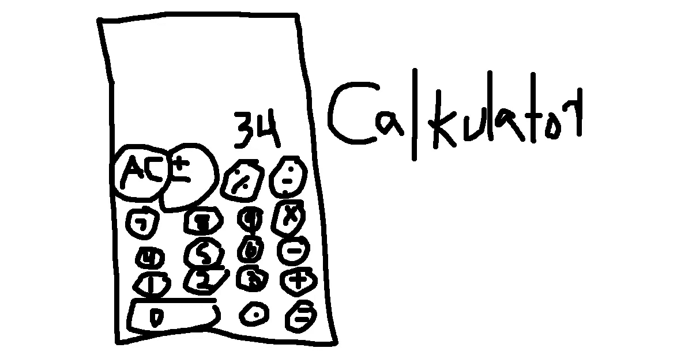

请随意使用我做的这个模型作为参考

幸运的是，我们不是从零开始设计我们的视图，因为我们正在构建一个已经存在的应用程序的再造(用于教育目的)。我们可以在 iOS 设备上打开计算器应用程序来查看参考资料。

好了，现在我们需要开始考虑在编写任何代码之前如何放置我们的视图。

## 解构一个观点

这一步对于计划和了解我们如何在代码中实现我们的视图是必不可少的。

目标是将视图分解成简单的组件。

当解构一个大的复杂视图时，总是试着把一切都想象成一个*容器*。从外部(一般分组)开始，慢慢地向内部推进，直到到达简单的组件。

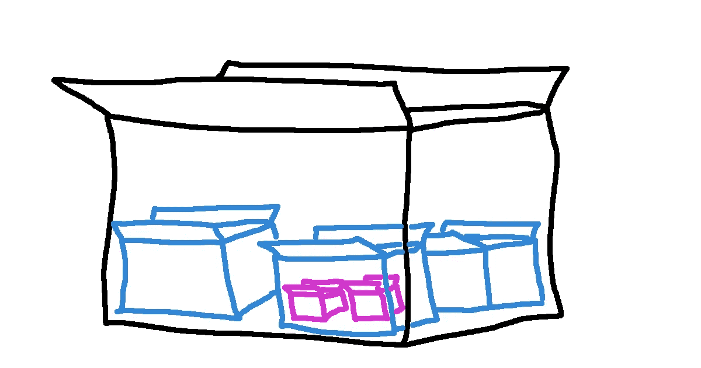

集装箱中的集装箱

记住，实现视图有一千种方法。这是我的实现，我认为这是最简单的方法。

所以，回到我之前提到的解构视图——在最外层的`CalculatorView`,我们可以想象一个包含 3 个组件的`VStack`。

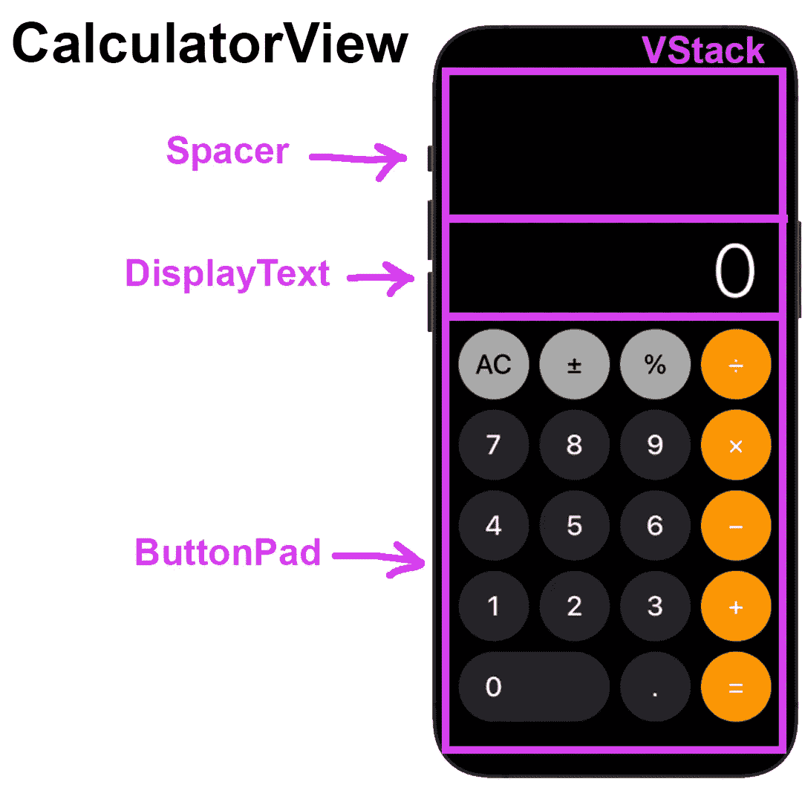

`Spacer`和`DisplayText`已经被解构为最简单的形式(一个`Spacer`和一个`Text`)，然而，按钮板有很多额外的复杂性需要我们解构。让我们看看我们能想出什么。

只关注`ButtonPad`，好像它是唯一存在的视角。这是一个非常重要的工程原理；把问题分解成更容易理解的子问题。我们将在整个系列中应用这一原则。

我们现在可以看到，另一个`VStack`(它的间距比它的父视图小)包含多个堆栈视图。每个`HStack`包含 3 或 4 个`Button`视图。`Button`是我们能做到的最简单的形式，所以我们完成了！

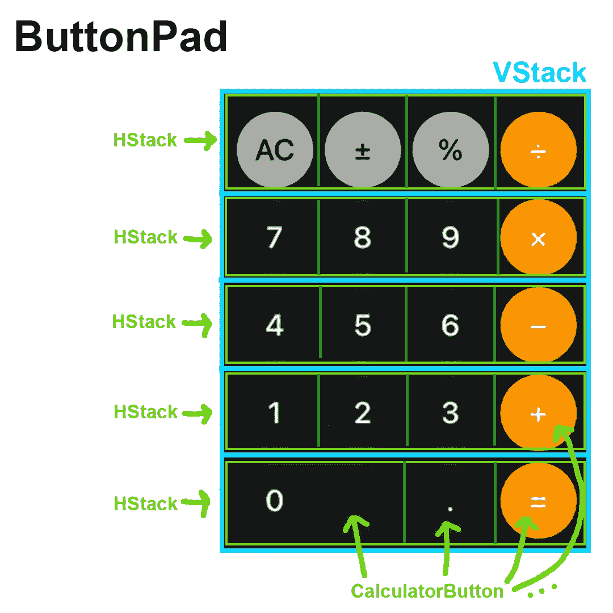

我们已经完全解构了苹果的计算器观。


# 让我们开始编码吧

太好了，我们已经成功地解构了视图，现在我们对实现的样子有了一个概念。

我们现在将开始构建视图。

## 构建视图

构建视图不再是规划阶段的一部分。—我们现在正在构建实际的应用程序。

为了构建一个复杂的视图，我们将应用同样的原则，将问题分解成更小、更容易理解的子问题。你可以从最里面的一层开始，然后一步一步来，或者你可以从最外面的一层开始，然后一步一步来。

我喜欢把两者结合起来使用，因为它让我看到了全局，同时让我专注于较小的细节。

## 创建计算器视图

创建一个新的`SwiftUI View`并保存为`CalculatorView`

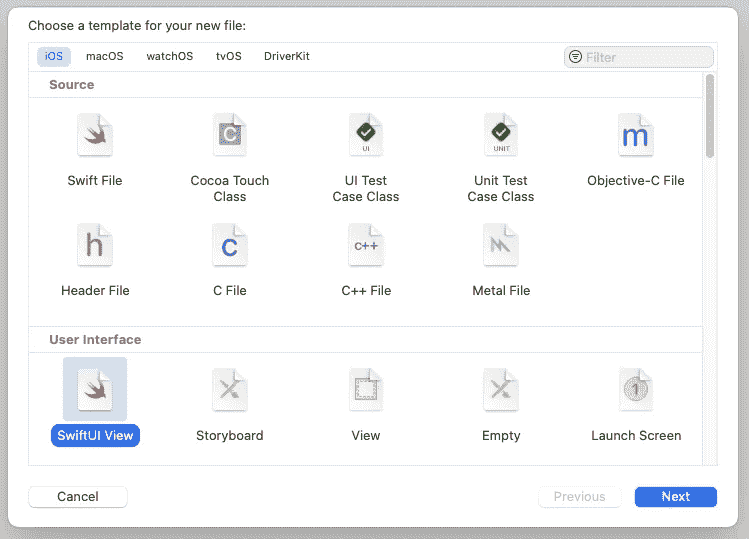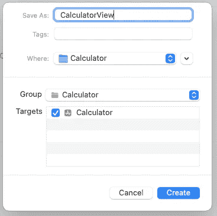

我们将使用`CalculatorView`作为我们的主视图，所以继续删除`ContentView`。

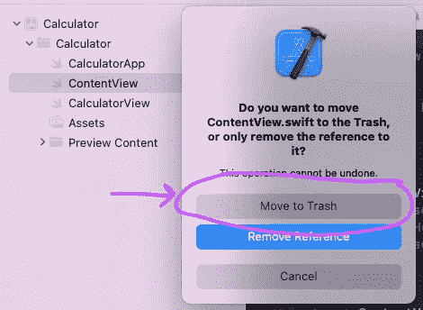

在`CalculatorApp`文件中，将行`ContentView()`改为`CalculatorView()`

我们将从创建最外面的最简单形式的`VStack`开始。

添加一个带有`Spacer`和`Text`视图的`VStack`。——我们以后再担心`ButtonPad`。


我们正试图把这个问题分解成更小的子问题。对于我们的下一个目标，我们将设计`displayText`。首先，改变背景颜色。

将`.background(Color.black)`修改器添加到`VStack`中。

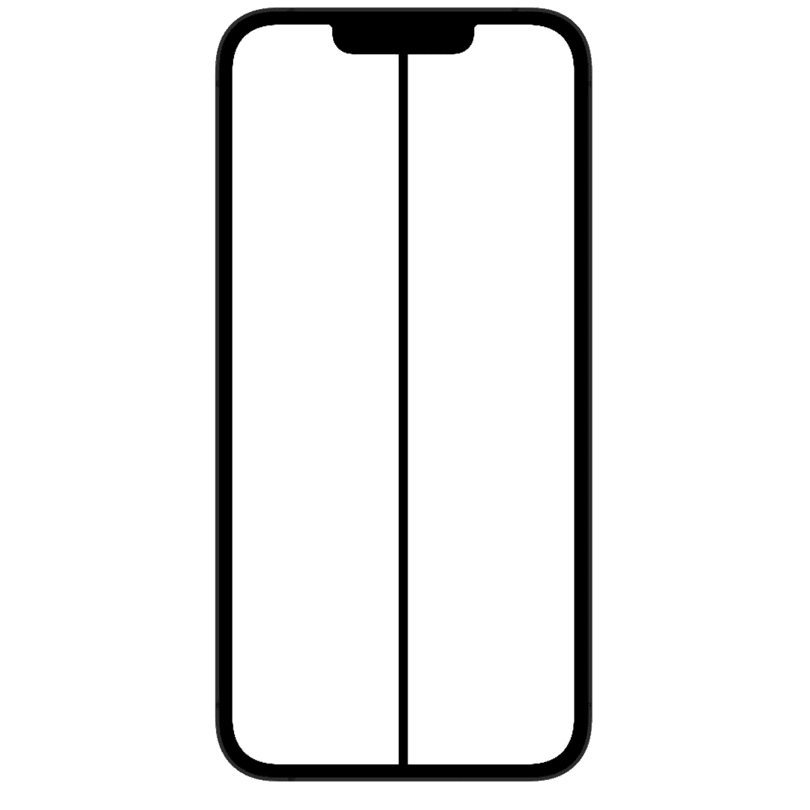

你会看到我们的视图现在包含一个奇怪的线。我们会解决这个问题，但是首先，背景颜色和我们的`displayText`一样，所以我们看不到它。

在`Text(“0”)`下添加以下修饰符:

```
.foregroundColor(.white)
```

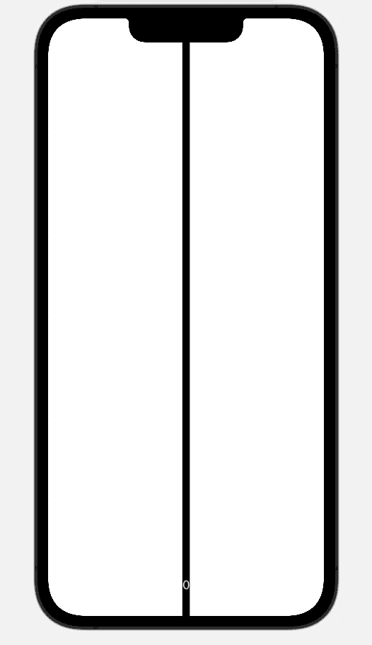

因为`Text`没有全屏宽度，所以`VStack`很薄。让我们让文本框架占据整个屏幕宽度，并确保文本优先于它的位置。trailing = right，。前导=左)。

给`Text`加上以下修饰语:

```
.frame(maxWidth: .infinity, alignment: .trailing)
```

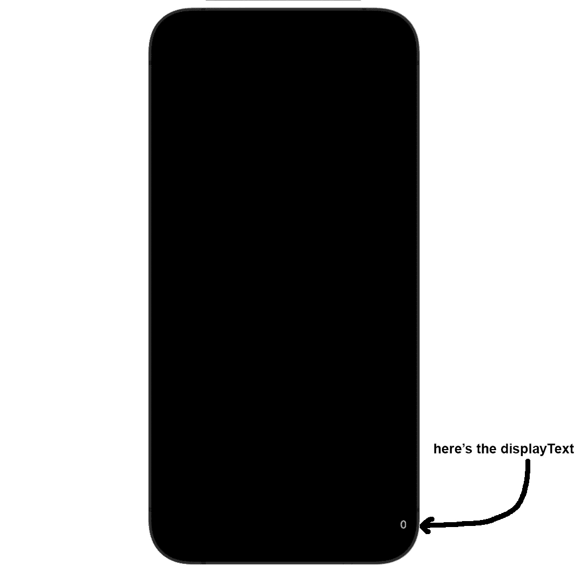

完美！我们正在接近。`displayText`的布局差不多完成了。然而，字体看起来一点也不像最终产品。让我们更新字体。

向`Text`添加以下修饰符:

`.font(.system(size: 88, weight: .light))`

现在，注意在真正的计算器应用程序中，当显示大数字时，文本是如何收缩的？那是另一个叫做`minimumScaleFactor`的修改器。如果有必要，它会缩小视图，并且您可以设置视图可以缩小多少的限制。


默认情况下，如果`Text`达到其宽度限制，它将自动占据下一行。我们希望将显示文本限制为一行，这样我们就可以缩小文本。`lineLimit`修改器让我们做到了这一点。

向`Text`添加以下修改符:

```
.lineLimit(1).minimumScaleFactor(0.2)
```

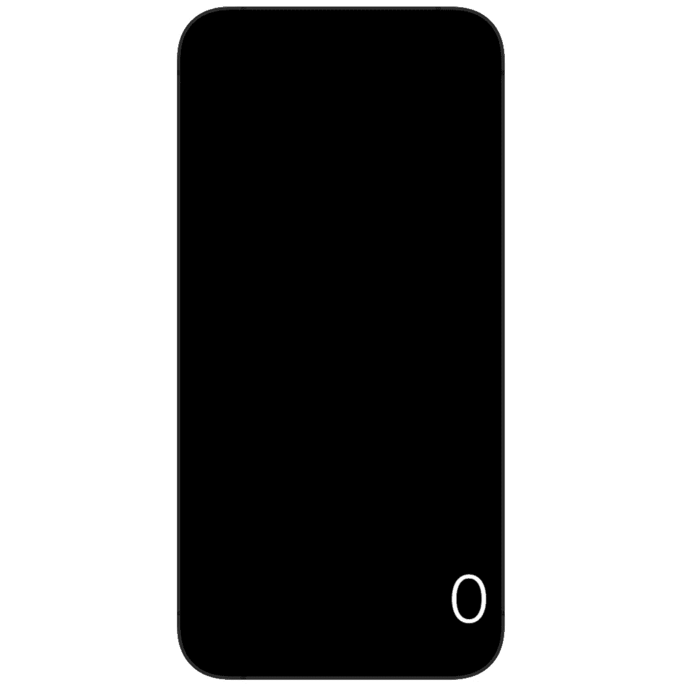

最后，添加`.padding()`作为第一个修改器，我们就完成了`displayText`的制作。

重要:记住修饰词是按顺序应用的，所以顺序很重要。

这是迄今为止完整的示例代码。

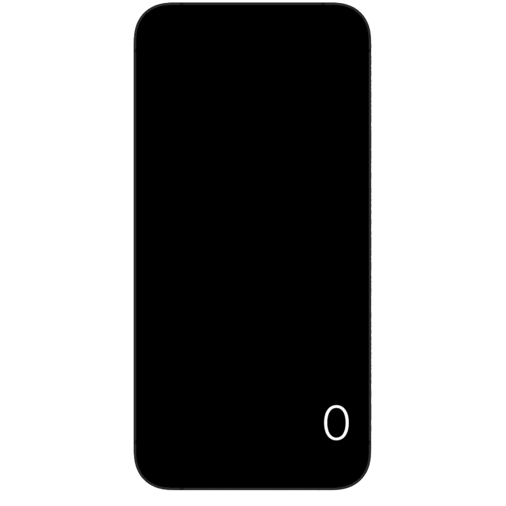

完成显示文本的计算器视图

# 创建计算器按钮

我们现在将开始创建`ButtonPad`。

回到我们的视图的解构，对于`ButtonPad`我们有一个`VStack`，它包含 5 个`HStack`视图，其中有 3 到 4 个`Button`视图。

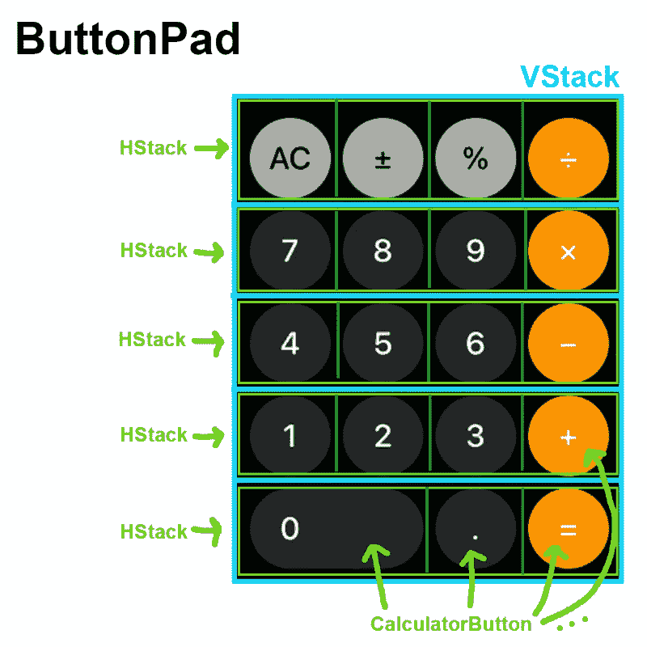

总共有 19 个按钮。我们不打算为计算器显式编码 19 个独特的按钮。我们必须为每一个设置自定义标题、前景色、背景色和宽度！真是浪费时间。

解决办法？—枚举。

# 按钮类型模型

我们将创建一个`ButtonType`枚举来做 4 件事。

1.  区分不同的按钮。(咄…)
2.  获取其对应的按钮文本
3.  获取其对应的前景色
4.  获取其对应的背景颜色

创建一个名为`ButtonType.swift`的新 Swift 文件，并添加一个名为`ButtonType`的 enum。将您在屏幕上看到的所有按钮类型添加为可能的案例。

注:案例。全部清除。清除占据相同的按钮位置并根据需要显示在屏幕上。然而，它们是不同类型的按钮。

现在是开始构建我们项目的好时机。

创建一个名为`Models`的新组，并将`ButtonType`移入。创建另一个名为`Views`的组，并将`CalculatorView`移入。


我们现在有了所有可能的情况。然而，我们可以做得更好。让我们通过分组这些情况来简化。

数字有 10 种情况(。零，。一，。二…九个)并且有 4 种情况用于算术运算(。加法，。减法，。乘法和。司)。

将这些案例归入它们自己的枚举是一个好主意，因为它们在功能(例如:数字可以组合成数字)和设计(例如:数字有灰色背景)方面有相似之处。

在`Models`组中，创建一个名为`Digit`的新 Swift 文件和另一个名为`ArithmeticOperation`的文件。


为`Digit`创建一个枚举并传递所有相应的事例。我们将创建这个类型为`Int`的枚举，因为它将允许我们通过使用它的`rawValue`属性来获取它的值。

使它符合`CaseIterable`协议，这样我们就可以很容易地使用它的属性`Digit.allCases`获得所有案例的有序数组。

使其符合`CustomStringConvertible`。该协议要求您添加`description`属性。我们将使用它作为按钮文本。

代码如下:

类似地，创建一个`ArithmeticOperation`枚举并添加以下代码。

回到我们的`ButtonType`枚举，我们现在可以封装大量的案例。

添加`digit`和`operation`案例及其相应的枚举作为关联值。

我们几乎完成了我们的模型！

使`ButtonType`符合`Hashable`协议。这个协议将让我们稍后迭代一组 ButtonTypes。

让它也符合这里的`CustomStringConvertible`协议。如前所述，我们将使用 description 属性来显示相应的按钮文本。

带有协议的 ButtonType 枚举

我们现在有一个文本描述来显示所有不同的`ButtonTypes`。然而，我们缺少一种方法来获得相应的背景和前景颜色。


在顶部添加`import SwiftUI`，因为我们需要引用`Color`

创建两个名为`backgroundColor`和`foregroundColor`的`Color`类型的计算属性，并返回其案例的相应颜色。

ButtonType 完成示例

我们终于完成了我们的`ButtonType`模型！现在我们已经有了构建按钮板的所有必要信息，该按钮板包含带有相应文本、背景色和前景色的按钮。

当我们开始构建 ButtonPad 视图时，一切都会变得更有意义。

# 构建按钮板

很好，我们有了包含所有计算器按钮类型的`ButtonType`枚举。问题？—还没有订单。

按钮的显示顺序是视图的责任，而不是模型的责任。因此，让我们回到我们的`CalculatorView`并添加一个新的`buttonTypes`二维数组，其中包含正确的按钮类型顺序。

表示按钮板的行和列的二维数组

现在我们有了一个顺序为`ButtonType`的二维数组，我们将开始构建`ButtonPad`。我们需要创建一个`VStack`及其相应的`HStack`视图，并在每个`Button`中创建。

用以下代码替换`// TODO: ButtonPad`行


CalculatorView 视图现在以正确的顺序显示按钮网格

不要担心按钮设计，我们一会儿就开始。

您的`CalculatorView`文件应该是这样的。

重构前的 CalculatorView 视图

代码变得有点脏了，我们还远没有完成，所以让我们做一点重构，让一切变得更清晰一点。

封装`displayText`和`buttonPad`并将其移动到`CalculatorView`文件底部的扩展名 a 中

重构后的 CalculatorView

现在代码更容易理解了。当组件开始变得有点太复杂时，我喜欢用这种方式封装它们。

正如我们所见，从设计角度来看，计算器按钮看起来糟透了。我们将创建一个新的`CalculatorButtonStyle`来立即解决这个问题。

## 创建计算器按钮样式

创建一个名为`Styles`的新组，并添加一个名为`CalculatorButtonStyle`的新 Swift 文件:

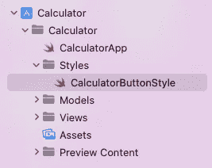

我们将为我们的计算器按钮创建一个自定义的`ButtonStyle`。如果你想了解更多关于创建自定义按钮样式的知识，我已经写了一个故事，你可以在这里找到它[。](https://medium.com/@ricardomongza/create-custom-button-styles-in-swiftui-f3778f695266)

现在，我们需要为样式设置 3 个属性。—按钮`size`、`foregroundColor,`和`backgroundColor`。

添加以下代码:

如果你想看一下`ButtonStyle`的现场预览，你可以在文件底部添加这段代码。

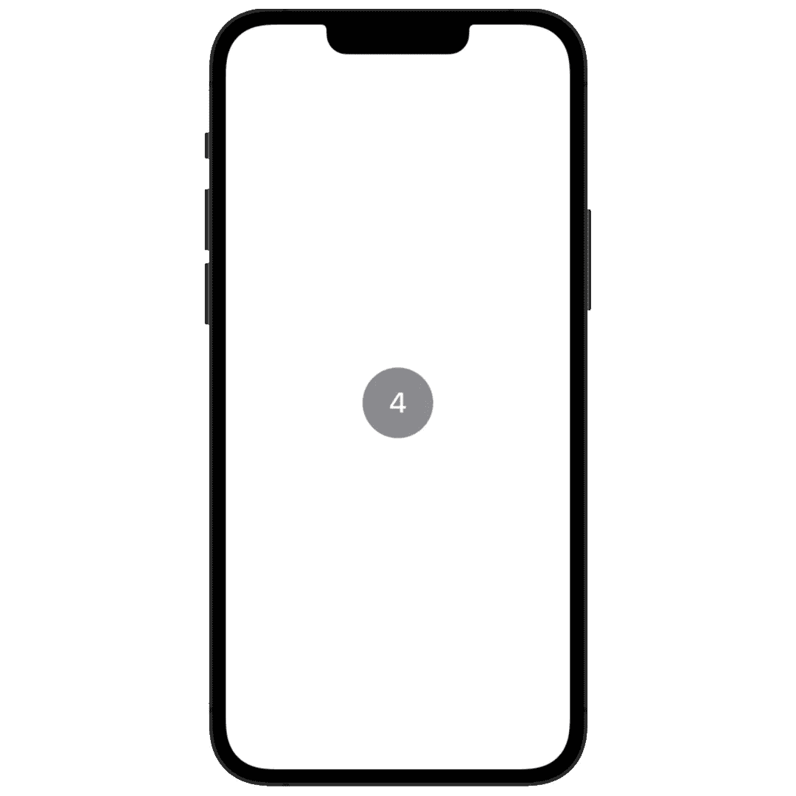

计算器按钮样式预览

现在，让我们回到我们的`CalculatorView`文件，找到我们的`buttonPad`属性，并用我们新创建的`CalculatorButtonStyle.`传递相应的参数添加`buttonStyle`修饰符。现在，使用`size: 80`，我们将在最后计算正确的按钮大小。

将 CalculatorButtonStyle 添加到现有按钮中

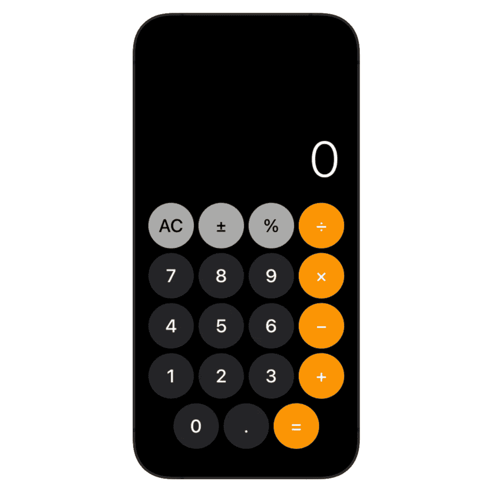

到目前为止我们的计算器视图

# 最终细节

我们几乎完成了我们的`CalculatorView`。我们只是遗漏了两个重要的细节。

1.  我们需要计算按钮大小(去掉`80`常量)。
2.  我们需要使“0”按钮变宽。

## 小重构—计算器按钮

在继续最后的细节之前，让我们对我们的`CalculatorView`做一点重构，因为我们将增加一点额外的复杂性，尽可能保持我们的代码整洁是一个好主意。

我们将把计算器按钮封装到它自己的结构中。

在视图中创建一个名为`Components`的新组。在内部，创建一个名为`CalculatorButton`的新 SwiftUI 视图。

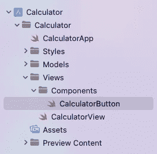

在较大规模的应用程序中，最好包含下面视图专用的所有组件，在我们的例子中，是由`CalculatorView`专用的所有组件。

这是一次重构，因此不会添加新功能。我们只是移动代码，让它更整洁。

将`CalculatorView`中的`Button`代码剪切并粘贴到`CalculatorButton`主体中。

之前编写的相同代码

注意我是如何扩展了`CalculatorView`并在里面添加了`CalculatorButton`结构的？那是很好的练习。`CalculatorButton`不会在`CalculatorView`之外使用，所以我们可以在内部声明它。

额外:如果您想对此视图使用预览，请添加以下代码:

最后，将我们的新`CalculatorButton`添加到`CalculatorView`

更新的计算器视图

这一步没有添加新的功能，但是我们的代码更加简洁。

## 计算按钮大小

现在，一点数学。为了计算按钮大小，我们需要屏幕宽度、按钮数量以及每个按钮和外部填充之间的间距总和。

*   我们可以用`UIScreen.main.bound.width`得到屏幕宽度。✅
*   按钮数很简单，每行应该有 4 个按钮。✅
*   获得间距和填充可能会有点棘手。❓

让我们设置恒定的间距和填充。

我们现在有一种叫做*的隐性*间隔。我们还没有在`buttonPad`堆栈视图中*明确*设置间距量。我们也没有在`CalculatorView`的外部设置填充，所以我们的按钮在技术上延伸到了屏幕的边缘。

让我们首先设置一个恒定的间距/填充量，我们可以在整个应用程序中访问它。

创建一个新的 Swift 文件名`Constants`。

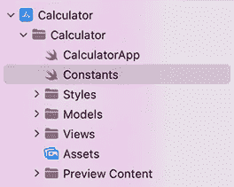

导入`CoreGraphics`(我们将引用`CGFloat`)并创建一个静态`padding`属性。

在较大的应用程序中，这个结构更有用

我们现在有一个常量，`padding`，我们可以在应用程序的任何地方使用它。

回到`CalculatorView`。

在`.background()`修改器上插入设置为我们的`Constants.padding`属性的`.padding()`修改器

向下滚动到`buttonPad`属性，设置`Constants.padding`为`VStack`和`HStack`间距

现在，我们来计算一下`buttonSize`。

转到您的`CalculatorButton`文件，在`body`下添加以下函数

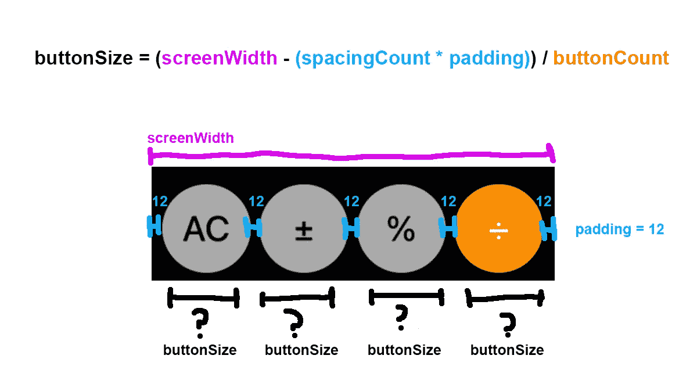

最后，将`buttonStyle`参数中的`size: 80`替换为`size: getButtonSize()`。

最终的`CalculatorButton`代码应该是这样的

计算按钮大小的计算器按钮

## 使“0”按钮变宽

最后细节。我们可以观察到“0”按钮与所有其他按钮在按钮形状上的差异。就目前而言，我们的`CalculatorButtonStyle`只能将按钮设置为圆形。—让我们更新一下，这样我们就可以给“0”按钮一个宽胶囊形状。

回到我们的`CalculatorButtonStyle`，在`foregroundColor`下，添加以下属性:

```
var isWide: Bool = false
```

*注意:如果* `*isWide*` *未设置，则默认设置为* `*false*` *。*

转到`makeBody`，在`.frame()`修改器下添加以下修改器:

```
.frame(maxWidth: isWide ? .infinity : size, alignment: .leading)
```

`CalculatorButtonStyle`的最终代码应该是这样的:


现在 CalculatorButtonStyle 允许宽按钮

最后，返回到`CalculatorButton`，在`CalculatorButtonStyle`初始化中，在`foregroundColor`的正下方，添加以下行:

`isWide: buttonType == .digit(.zero)`

您最终的`CalculatorButton`代码应该是这样的:

# 包裹

咻，时间真长...谢谢你挺过来了。

我们已经完成了计算器视图。构建视图总是非常耗时，尤其是当我们坚持最佳实践而不走捷径的时候。保持视图的简单性(代码方面)对于构建更大的应用程序是必不可少的，所以当视图变得有点太复杂时，总是要尝试封装。

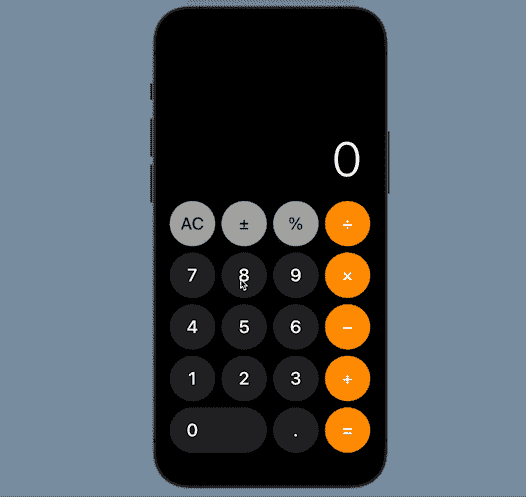

最终的计算器视图

在下一个教程中，我们最终将为计算器添加功能。我们将看到我们为`ButtonType`创建的模型如何极大地帮助我们让计算器工作。我们将添加`CalculatorViewModel`和一个`Calculator`类，它将负责计算一切。

你可以在这里继续第二部分。

# 资源

*   你可以在 Github [这里](https://github.com/ricardomongza99/Calculator/tree/part1)找到这部分的源代码。
*   “在 SwiftUI 中创建自定义按钮样式”故事[此处](https://medium.com/@ricardomongza/create-custom-button-styles-in-swiftui-f3778f695266)
*   你可以在这里找到第 2 部分“使用 MVVM 在 SwiftUI 中完成苹果计算器”。