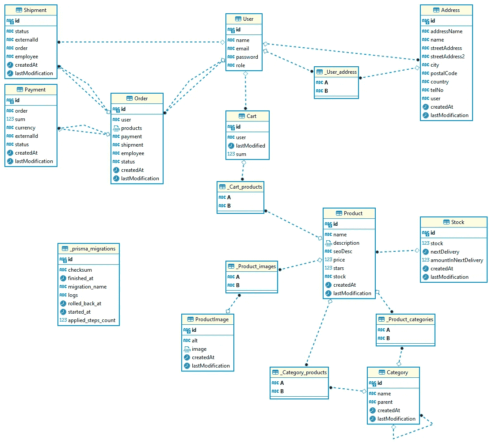

# 构建您自己的基于 Keystone.js 的电子商务系统——环境设置和基本模型

> 原文：<https://betterprogramming.pub/build-your-own-e-commerce-keystone-js-based-system-environment-setup-and-base-models-2c02a3e3a70b>

## 这一周，我们将亲自动手开始编码


照片由 [Ludovic Charlet](https://unsplash.com/@ludo_photos?utm_source=medium&utm_medium=referral) 在 [Unsplash](https://unsplash.com?utm_source=medium&utm_medium=referral) 上拍摄

# 介绍

上周的文章是关于使用 Keystone.js 构建电子商务系统的系列文章的第一篇，它主要关注于[系统需求及其基本架构](/build-your-own-e-commerce-keystone-js-based-system-requirements-and-architecture-3d639241b963)。这一周，我们将尝试一下，开始编写代码。首先，我们将讨论开发环境及其设置。然后是 Keystone 和 Next 设置，最后是基本型号设置。此外，本文的完成代码可以在我的 [GitHub](https://github.com/eabald/keystone-e-commerce/tree/Environment-setup-and-base-models) 上获得。

# 开发环境设置

让我们开始为我们的系统`keystone-e-commerce`创建一个项目文件夹，在我的例子中，并创建一些必要的文件。在控制台中运行以下命令:

```
mkdir keystone-e-commerce && cd keystone-e-commerce
touch README.md docker-compose.dev.yml .gitignore .env.example .env
```

根据前面的文章，这个系统的数据层包含两个元素:数据库和搜索引擎。在我们的开发环境中本地使用它们的最简单的方法是使用 Docker。所以，是时候更新我们的`docker-compose.dev.yaml`文件了。只需添加以下内容:

另外，我在这里添加了`pgAdmin`。这是一个非常有用的工具，尤其是在开发环境中。接下来，必要的事情是为系统设置环境变量。最简单的方法是创建一个`.env`文件，并在所有容器中使用它。好了，让我们添加所有必要的变量，如下所示:

我已经添加了云二进制集成所需的变量；我们稍后将把
还给他们。接下来更新`.gitgnore`文件。就目前而言，这就足够了。以下代码将有所帮助:

```
**/node_modules
.env
```

现在，有了这个基本设置，我们可以用这个命令启动我们的容器:

```
docker-compose -f docker-compose.dev.yml up
```

# Kesytone.js 和 Next.js 设置

完成这个设置后，我们可以专注于系统的其他部分。首先，让我们创建 Next.js 客户端应用程序。老实说，这里我们只打算创建它并将其添加到 Docker 设置中。在本系列的后续文章中将会做更多的工作。让我们运行适当的命令:

```
yarn create next-app --typescript
```

脚本会要求我们输入应用程序的名称。我把我的名字叫做`client`。安装后，我们必须为这个应用程序创建`Dockerfile.dev`来与其他容器一起使用。如你所见，这是一个相当简单的问题:

```
FROM node:16WORKDIR /usr/appCMD yarn dev -p 3000
```

此外，用以下代码更新`services`部分下的`docker-compose.dev.yml`文件:

像这样的解决方案允许一个主要的`.env`文件，这是很好的，并给出了所有系统秘密的集中控制。此外，它将整个系统封装在一个封闭的 docker 网络中。目前，这就是应用程序的这一部分。所以，我们切换到后端部分，设置 Kesytone.js。

首先，运行脚本来创建应用程序。我选择了`backend`作为它的文件夹名。

```
yarn create keystone-app
```

之后就基本可以用了，但是首先要更新数据库等配置。在`keystone.ts`中，添加凭证并更新列表的导入:

然后，使用以下代码创建额外的文件夹，以便有一个清晰易懂的结构:

```
mkdir consts enums schema
```

此外，在主配置文件中导入需要我们在`schema`文件夹中添加`index.ts`才能正常工作。剩下的最后一个设置元素是创建`Dockerfile.dev`文件并更新`docker-compose.dev.yml`。它将与前一个非常相似，如下所示:

```
FROM node:16WORKDIR /usr/appCMD yarn dev
```

这也将允许我们用一个命令启动整个系统。

# 模型设置

设置工作完成后，我们可以开始创建所有必要的 Keystone 列表(在我们的例子中是数据模型)。先说`User`型号。基本上，它将保存所有用户数据，包括系统内部的角色和权限。在模式文件夹中创建`user.schema.ts`。目前，我们只关心列表的`fields`属性。我们必须在那里添加所有必需的字段，如下所示:

字段`name`、`email`和`password`相当明显。其目的是识别`user`，是授权和认证过程所必需的。这三个都是必须的。此外，`email`必须是唯一的，在管理用户界面，它可以用来过滤所有的用户。更有意思的是`role`领域。它的类型是 select，保存系统中用户权限的信息。它将在数据库中创建`enum`列来保持它的整洁。我已经将选项值移到了`consts`文件夹中的一个单独的文件中。

代码如下:

此外，我已经将所有值移动到`enums`文件夹中的文件中:

目前来看，这两个角色已经足够了。以后，我们会需要更多的。最后一个字段保存对`Address`列表的引用。准确地说，是一对多的关系。下一个列表包含与用户相关的所有地址；每一个都可以有多个。因此，创建如下所示的`address.schema.ts`:

该列表包含用户订单运输中需要的所有必要的地址信息。为了提供足够的交货信息，大多数字段都是必需的。此外，该列表还保存了记录创建和最后一次修改的时间戳。最后一个字段是对这个地址的所有者`user`的引用，在这种情况下，它是多对一关系。

接下来，与`user`列表紧密相关的是`Cart`型号。它包含用户添加到购物车中的产品的所有信息、它们的总和以及最后一次修改的日期。每个用户有一个`Cart`，所以是一对一的关系。代码如下:

在每个`Cart`中，可以添加许多产品，并且同一产品可以添加到多个购物车中，因此它创建了多对多关系。

这样一来，我们可以专注于其他模型。接下来，与`User`相关并且与`Cart`松散耦合的是`Order`列表。它包含当前正在处理和已经处理的订单的所有信息。第一个字段是对这个订单的所有者`user`的引用，一个一对一的关系。每个用户可以有多个订单，但每个订单只有一个所有者。

下一个字段包含这个订单中序列化为 JSON 的产品的信息。通过这种方式，我们可以有序地保存所有产品的信息，不仅是当前库存的产品，还包括从报价中删除的产品。

接下来，两个字段保持与列表`Payment`和`Shipment`的关系，都是一对一的关系。最后三个字段包含有关创建日期、上次修改和订单状态的信息。最后一个是在选择类型中，我将所有选项和值移动到单独的文件中，就像之前的用户角色一样。

接下来的两个列表补充了`Order`模型，并保存了与其相关的`Payment`和`Shipment`的信息。它们都包含关于两个业务流程的时间戳和状态的基本信息(以与订单状态相同的方式创建)以及它们与`Order`的关系。

其中第一个还包含来自第三方提供者的订单总数、货币和交易 ID 的信息。这件事我还没想好具体整合，但大概会是[条纹](https://stripe.com/)因为我最熟悉了。

另一方面，`Shipment`模型保存负责处理、打包和发送货物的员工的信息。类似地，像前一个例子一样，还有来自负责处理交付的第三方系统的外部 ID 的信息。

目前，所有状态字段只包含一个选项— `Created`。在本系列的下一部分中，我们将更多地关注系统的这些部分，我们将添加其他必要的选项。

最后一组模型侧重于产品。主`Product`列表包含`name`、`description`、`SEO description`、`price`、`rating` (星星)和`timestamps`等产品基本信息。其余的字段与更具体的产品信息建立各种关系，如产品图片、类别和库存。

第一个创建一对多关系；第二个是多对多关系，最后一个是一对一关系。基本上，一个产品可以有多个图像，但是图像只属于一个产品。每个可能有类别，类别有许多产品，最后，每个只有一个库存信息(正如我在上一篇文章中提到的，我决定只支持一个仓库设置)。

下一个列表包含产品图像。这里有两个重要的字段:`alt`和`image`。第一个包含为每个图像填充 HTML alt 属性所需的信息。第二个允许直接上传图片到 Cloudinary CDN。所有这些都由时间戳字段补充。

下一个列表`Stock`，包含可订购产品数量的信息。此外，还有关于下一次预期交付和其中产品数量的信息。当用户试图订购比现有产品更多的产品时，这是必要的。

最后一个模型`Category`，保存了关于产品类别及其相互关系的信息。这里的字段包括`category name`、`related products`、`parent category`(如果有的话)和常用的`timestamps`。这种内部关系允许很容易地创建类别树，这在创建我们的系统前端时会很有用。

这里要做的最后一件事是将所有模型导入到`index.ts`中，该模型被导入到如下所示的`keystone.ts`主配置文件中:

关于时间戳的一个快速说明，每个时间戳都有一组默认值，用户不能编辑。但是在下一篇文章中会有更多关于这个主题的内容。



ER 图

好了，这就是我们要创建的所有模型。现在是时候在数据库中创建必要的迁移和相应的表了。从旋转数据库容器开始。

```
docker-compose -f docker-compose.dev.yml up database
```

之后，从我们后端的独立终端开始:

```
cd backend && yarn dev
```

脚本将询问新迁移的名称，键入`initial_models`并按回车键。它将处理表的创建并生成迁移文件。现在我们可以停止这两个进程并启动整个系统。

```
docker-compose -f docker-compose.dev.yml up database
```

# 摘要

现在我们有了一个工作的开发环境和基本的模型设置，所以它为我们的系统提供了一个坚实的基础。下一次，我们将开始构建电子商务系统中所需的附加功能。首先，我们将关注访问控制和访问系统不同部分的用户特权。

我希望你喜欢它。如果您有任何问题或意见，请随时提问。

祝您愉快！