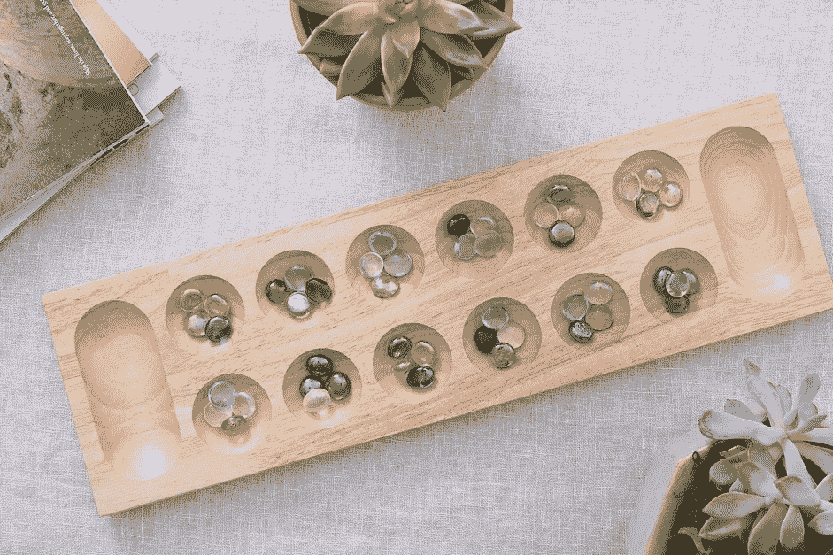
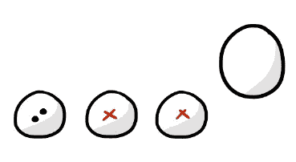
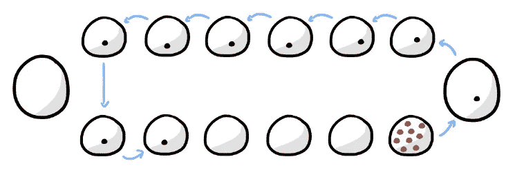
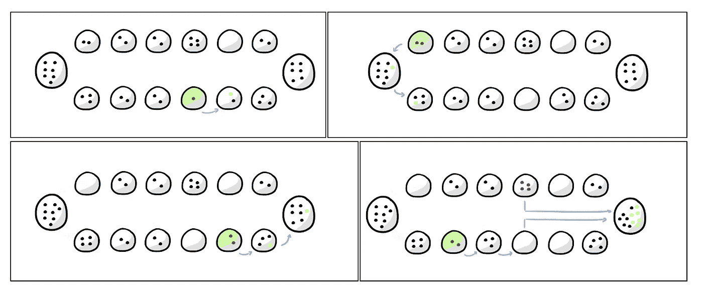

# 使用测试驱动开发在 Java 中构建 Kalah 游戏

> 原文：<https://betterprogramming.pub/building-a-kalah-game-in-java-using-test-driven-development-31e68b82e427>

## 了解游戏，它的规则，以及如何建立

云杉/玛戈卡文

二十五年来，测试驱动开发一直是*良好的*软件工程实践的基石。我相信我们在日常工作中都是这样做的(是的，我们是这样做的，不是吗！！)但是有时候用 TDD 从零开始解决一个新问题也是不错的。一个[形](https://en.wikipedia.org/wiki/Kata)如果你愿意的话。

我们需要一个在过于简单和极具挑战性之间取得平衡的问题。古老的卡拉游戏很好地达到了这个最佳点。这是一个相当简单的游戏，几乎没有规则——可以在一个下午编写代码，不像国际象棋或扑克等替代品，它们有更多的移动部分，并将成为一个长期项目。那么什么是卡拉？

# 卡拉是什么？

卡拉，也叫卡拉哈或曼卡拉，是美国[威廉·朱利叶斯·钱皮恩，Jr](https://en.wikipedia.org/wiki/William_Julius_Champion,_Jr.) ( [维基百科](https://en.wikipedia.org/wiki/Kalah))发明的[曼卡拉](https://en.wikipedia.org/wiki/Mancala)家族中的一个游戏。

## 规则

游戏提供了一个 Kalah 板(见文章顶部图片)和若干种子或计数器。木板每边有 6 个小坑，叫做房子；和一个大坑，称为端区或商店。游戏的目标是比对手获得更多的种子。

1.  游戏开始时，每个房子里放四粒种子。这是传统的方法。
2.  每个玩家控制棋盘上玩家这边的六个房子和它们的种子。玩家的分数是他们右边储存的种子数量。
3.  玩家轮流播种。在一个回合中，玩家将所有种子从其控制的一个房子中移走。逆时针移动，玩家依次在每个房子里丢一颗种子，包括玩家自己的商店，但不包括对手的商店。
4.  如果最后播种的种子落在玩家拥有的空房子里，而对面的房子里有种子，则最后的种子和对面的种子都会被捕获并放入玩家的商店。
5.  如果最后一粒种子落在玩家的商店里，该玩家获得一次额外的移动。在他们的回合中，玩家可以移动的次数没有限制。
6.  当一个玩家的房子里不再有任何种子时，游戏结束。另一名玩家将所有剩余的种子移到他们的商店，商店中种子最多的玩家获胜。
7.  这场比赛有可能以平局告终。

希望这是有意义的，但如果它仍然不清楚，或者你只是想看看它在现实世界中的样子，请查看下面的视频。

# 我们应该如何解决这个问题？

在我们开始之前，让我们考虑一下应该如何处理这个问题。我们在这里考虑的不是代码，而是从零到干净的解决方案的最佳途径。

没有棋盘你就不能玩游戏，没有组成棋盘的零零碎碎的东西你就不能建造棋盘。首先，我们将创建棋盘的各个部分，然后将它们拼凑成一个工作整体。

1.  *棋盘的各个部分(房屋、商店及其互动)*
2.  *板本身(1 号位的组成)*

接下来，你不能玩一个没有玩家的游戏，以及玩家可能的行为，所以我们将创建这些。

*3。玩家(及其互动)*

最后，现在我们有了棋盘和玩家，我们可以把它们放在一起(连同一些规则)来创建“游戏”。

*4。把所有这些放在一起，加上一些规则，创造一个“游戏”。*

事不宜迟，我们开始吧。

# 房子，商店，和坑(哦，我的！)

要做的第一件事是创建我们可以用来构建我们的董事会的部分——存储我们的种子的小坑。

有两种类型的坑— *房子*(底部/顶部的小房子)和*商店*(每个玩家储存点数的最终区域)。

## 棋盘上有 6 个小坑，叫做房子

让我们从房子开始。一个房子以固定数量的种子开始游戏，通常是四个。这可能是我们的第一个测试。让我们用四颗种子建造一座房子。

一个足够简单的对象，只有一个属性——它保存的种子数量。

## 两端各有一个被称为商店的大坑

接下来是另一种坑，商店。与房子不同，商店在游戏开始时是空的，在整个游戏过程中除了收集种子之外什么也不做。

我在这里跳过了一两步，但是因为 house 和 store 都表示一种类型的 pit *，*和 pit 是种子的容器，我们可以实现这样的行为，即 house 和 store 都是 pit *的子类。*

我通常不太喜欢继承层次结构，但是这个层次结构强烈要求存在，所以让我们允许它存在吧。

## 你应该能够从房子里取出种子

房子的一个关键属性是玩家可以从房子里拿走种子，然后播种到其他地方。商店里的种子不能被拿走，所以我们不能碰它。

同样简单，我们想要重置房子的种子计数，并将原始值返回给调用者。

## 播种

一旦玩家从房子里拿到种子，他们就会播种。房子和店铺都可以装更多的种子，但两者有一点不同(这里有一点伏笔)。房子一次只能接受一粒种子，而商店可以接受很多。

这总结了各种坑的行为。这些是我们的小块状态，构成了我们游戏的基础。现在让我们开始组合它们来构建一些更有趣的东西。

# 建立一个董事会

一个游戏板应该有所有允许我们玩游戏的“物理”项目。这包括房屋、商店*、*种子以及它们之间的联系。让我们快速看一下真正的 Kalah 板。

[云杉/玛戈卡文](https://www.thesprucecrafts.com/mancala-411837)

每个玩家有 6 个房子和一个商店。玩家彼此面对，拥有底部的房子和右边的商店。他们在每一轮都逆时针绕着棋盘移动。让我们试着把它拼起来。

## 一个坑应该指向棋盘上的下一个坑

我们的房子和商店独自漂浮在太空中，不知道其他任何东西的存在。我们需要一种方法将这些坑排列成卡拉棋盘的形状。

理想情况下，我们希望捕捉游戏运动的单向性质。每个坑后面可以有一个坑，并且只能有一个坑。

单链表类似于我们所需要的，但是我们不需要公共库中的许多公共链表操作，所以让我们只添加一个指向每个 pit 的 next 指针。每个 pit 都有下一个 pit，所以我们可以像迭代器一样遍历它们。这确保了玩家不会在棋盘上走错路，或者不小心跳过一个坑。这个想法是安排模型来减少可能的 bug。

既然我们可以连接 pit，我们应该开始考虑将它们封装在一个中央板实体中。

## 一个棋盘应该有十二个房子，由两个玩家平分

每个玩家(默认)有六个房子，总共有十二个房子。让我们在创建新板时确保这一点。

同样，我在这里跳过了一些步骤，但大部分都是单调的工作。我们只是添加了一个 *create* 方法，该方法实例化了我们需要的所有房屋，将它们一个接一个地连接起来，并将它们插入到电路板中。除此之外，我还引入了一个 enum 来表示 Player。一个玩家。第二，给每个玩家分配适当数量的房子。

## 每个玩家应该有两个商店

我们需要为每个玩家添加一个商店，并将他们放入棋盘中。

## 一个董事会应该代表两个玩家

我们一会儿会谈论很多关于玩家的事情，但是现在，我们需要把棋盘分成两半。每一半有六栋房子和一家商店。

为了对坑进行分组，我们将引入一个玩家记录(使用花哨的 Java 17 记录)。

## 房子应该有对立面

多一点伏笔，但让我们注意以下要求:

如果最后一粒种子落在玩家拥有的空房子里，而对面的房子里有种子，那么最后一粒种子和对面的种子都会被取走并放入玩家的商店。

除了链中的下一个坑，房子还需要跟踪它的对立面。

## 凹坑应该形成一个循环

我们就要拿到板子了，但是我们的陷阱链被解开了。所有的移动都以逆时针方向穿过坑，我们希望避免玩家从棋盘的一端掉下来而被遗忘。我们需要把最后一个坑和第一个坑连接起来，形成一个循环或回路。

# 一号玩家准备好了吗？

现在我们已经有了一个游戏平台，我们需要培养一些玩家来互相对抗。在我们开始编码之前，我们需要做出一些设计选择，还有一些关键的职责需要分配。

*   什么应该移动棋盘周围的种子？
*   基于捕获种子应该应用什么规则？
*   什么应该应用基于轮流的规则？
*   什么应该应用基于赢/输的规则？

有几种方法可以将这些责任分割开来，在某种程度上，这是个人喜好的问题。我个人是[富域模型](https://www.amido.com/blog/anaemic-domain-model-vs-rich-domain-model)的粉丝，我们在模型中保持适当的行为，而不是作为某种*控制器*操纵它们，所以我建议我们如下划分职责:

*   玩家负责操纵棋盘上的棋子，特别是他们的那一半。任何关于播种或从其他玩家那里获取种子的担忧都应该是*玩家的领域。*
*   游戏*本身掌握着规则手册。因此，尽管它不会改变棋盘本身的任何状态，但它确实会引导游戏的流程——例如，轮到谁了，游戏是否完成，以及谁是赢家。*

既然我们已经适当地划分了行为，让我们继续培养我们的球员。

## 轮到玩家时，他们应该播种

玩家的第一个，也可以说是最重要的行为是播种。播种是一个足够简单的动作——我们从一个坑中取出种子，然后逆时针方向访问后续的坑(两套房子和玩家的商店)，在每个坑中放置一颗种子。

测试练习一个短的坑链。需要注意的一点是，我们在选择房子时将使用基于 1 的索引——也就是说，第一所房子的索引是 1 而不是 0——因为这对非编码人员来说更直观。否则，它只是一个简单的情况，遍历坑链，从我们捕获的堆中添加一个种子到每个坑中，直到我们达到零。

## 玩家不能选择空房子

玩家必须选择一个有人居住的房子，否则游戏会停滞不前。让我们添加一个保护条款来防止这种情况。

## 不能选择超出范围的房屋

当玩家只有六个房子可供选择时，他们不能选择第七个房子。是时候讨论另一个保护条款了。

## 玩家跳过对手商店

播种的最后一条规则是，玩家不能在对手的店里播种。他们播种时应该跳过它。

为了实现这一点，并在不同类型的 pit 上保持多态性，我们将添加一个#isSowable 方法。

不管玩家是谁，房子总是“可交换的”，但是商店只有在被播种玩家拥有时才被允许。

这总结了我们的玩家行为。正如我们在本节开始时所讨论的，玩家的角色是以正确的方式在棋盘上移动种子——它们是我们改变状态的媒介。

我们最后的工作是把所有的东西都包在一个“游戏”里，让我们来看看。

# (赛场局势发生变化后表明)胜负难料

在上一节中，我们提到了游戏的核心职责是作为一个“规则手册”来规定诸如轮到谁、游戏何时结束、谁是游戏的赢家等等。“游戏”也可以被视为其他部分的指挥——它是两个玩家和棋盘之间舞蹈的门户和协调者。

由于其协调责任，游戏与我们已经构建的其他组件进行了大量的交互，正因为如此，这一部分的测试将更倾向于[“社交单元测试”](https://martinfowler.com/bliki/UnitTest.html)。值得承认的是，我们已经这样做了，但程度不同。更具体地说，我们在本节中编写的单元测试将采用以下形式:

1.  在某个初始状态下构建一个棋盘，并从该棋盘创建一个游戏。
2.  采取一些行动(通常是委托给玩家)。
3.  断言棋盘的最终状态是我们所期望的。

明白了这一点，让我们开始吧。

## 一号玩家应该开始第一轮

在游戏开始时，我们会让一号玩家领先。

虽然满足这个测试很简单，但我们将借此机会向前迈进一步，创建游戏类的基础。

仔细想想，这个游戏有点像有限状态机。根据玩家、棋盘和状态的综合状态，游戏将决定下一步的行动。初始状态的一部分是轮到第一个玩家。

## 当没有轮到玩家时，应该拒绝移动

让我们添加一个快速断言，这样如果错误的玩家试图走一个回合，移动就会失败。

这里我们将引入一个#move 方法，它接受一个玩家的号码和一个门牌号码。我们稍后会更深入地讨论这个问题，但是首先，如果错误的玩家试图移动，我们就抛出一个异常。

## (关于漂亮印刷的快速旁白)

这些例子中的状态变得有点复杂。在进一步深入之前，让我们快速绕道，简化我们需要从这里开始编写的任何测试。

与任何代码一样，使测试易于阅读和编写是一个有价值的目标，对于我们和我们的开发伙伴都是如此。我希望能够浏览一个测试，并且能够理解它的本质，而不必在我的头脑中搜寻数十个断言并拼凑它们的组合意义。

我希望能够在我们采取行动之前/之后看到 Kalah 董事会是什么样子。利用 Java 17 的多行字符串，我们可以做到这一点——让我们编写一个简单的漂亮的打印机实用程序。

## 第一轮(播种)

我们已经准备好了游戏的初始状态，所以是时候开始行动了。第一轮是一号玩家，所以让我们模拟他们选择房子一作为他们的初始策略。

使用我们漂亮的打印机，我们把预期的结果正确地带给我们的注意。玩家一的第一个房子应该变成空的，接下来的四个坑应该收到一个额外的种子。

如前所述，游戏将主要委托给系统的其他部分来完成它的工作——在本例中，是玩家对象。

除此之外，我们将改进#move 方法，让它返回一个结果。结果将告知呼叫者三条关键信息:

*   游戏的状态(是否是活动的，玩家一是赢家，等等)
*   下一轮轮到的玩家。
*   对董事会的参考。

## 玩家轮流上场

一旦第一个玩家开始行动，控制权就会转移到第二个玩家身上。让我们以上次的例子为例，用一个额外的移动来扩展它。

为了允许控制权的转移，我们只需要在回合结束时将当前玩家换成替补玩家。这是练习 Java 的另一个新特性——切换表达式的好机会。

## 如果最后一粒种子落在玩家的商店里，该玩家获得一次额外的移动

现在我们在玩家之间来回切换，让我们添加一个规则。如果一个玩家将他们回合的最后一粒种子放入他们的商店，游戏的控制权仍然属于他们。

为了实现这一点，我们只需要通过检查回合的最后一个坑是否是活跃玩家的商店来增强我们的#swap 行为。如果是这样，避免交换，并坚持与积极的球员。

## 如果最后播下的种子落在空房子里

如果最后播种的种子落在玩家拥有的空房子里，而对面的房子里有种子，则最后的种子和对面的种子都会被捕获并放入玩家的商店。

为了使场景更容易设置，我们将添加 Board#from factory 来生成我们选择的任何状态的板。现在，我们可以轻松地构建一个测试用例，玩家可以移动并捕捉对面的坑。

捕获本身的逻辑是不言自明的，但是值得注意的是，因为是播放器处理种子，所以我们将保持播放器的逻辑。

## 当一个玩家的房子里不再有任何种子时，游戏结束。

当任何一个玩家清除他们房子里的种子时，游戏结束。当这种情况发生时，两个玩家都将所有剩余的种子从他们的房子移到他们的商店，商店计数被用来宣布赢家。

## 这场比赛有可能以平局告终。

在游戏结束时，如果两个玩家的商店中有相同数量的种子，则以平局结束。

在前面的部分中，我们已经迎合了这种功能——不完全是测试驱动的，但有时它就是这样工作的。

## 样板戏

我们完了！有一个小问题——所有的例子都是我们自己编造的。如果我们犯了一个错误或者误解了其中一个需求，那该怎么办。

在如此复杂的情况下，我想尝试一个来自第三方的例子来“三角测量”并确保代码按照多个不同来源的期望运行。在这种情况下，让我们用一个来自曼彻斯特大学 CS 课程大纲的例子。

我们只需要编写几个动作，如示例中所述，并确保我们的输出与他们的匹配。

# 一锤定音

唷，我们完成了！

我们已经从零到一个功能性的 Kalah 游戏，并希望在我们的旅程中展示一些 TDD 的细微差别。有些决定可能不符合每个人的口味，但我认为我们已经提出了一个健壮和丰富的 Kalah 模型，它应该很容易在未来根据需要进行更改/扩展——这都要归功于 TDD。

最后的项目，请查看 https://github.com/notmattlucas/kalah-tdd 的。

# 资源

*   【https://github.com/notmattlucas/kalah-tdd 
*   [https://en.wikipedia.org/wiki/Kalah](https://en.wikipedia.org/wiki/Kalah)
*   [https://martinfowler.com/bliki/UnitTest.html](https://martinfowler.com/bliki/UnitTest.html)
*   [http://Sylvia . cs . Manchester . AC . uk/ugt/2020/comp 34120/kalahrules . htm](http://syllabus.cs.manchester.ac.uk/ugt/2020/COMP34120/KalahRules.htm)