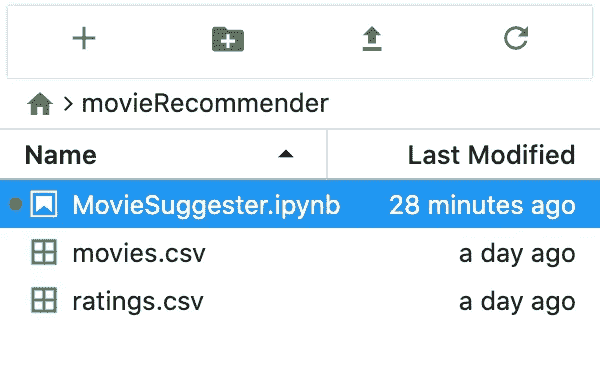
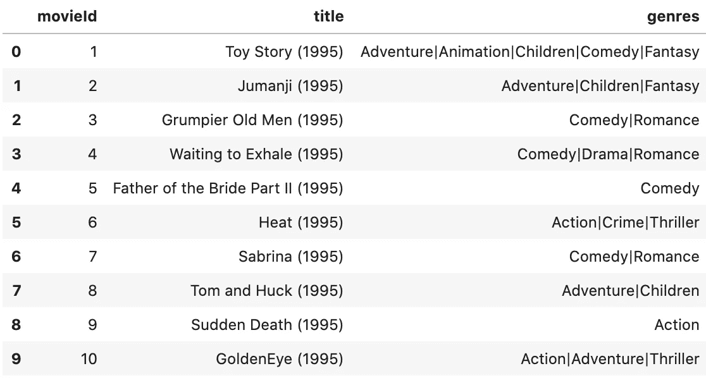
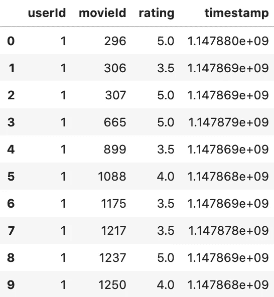
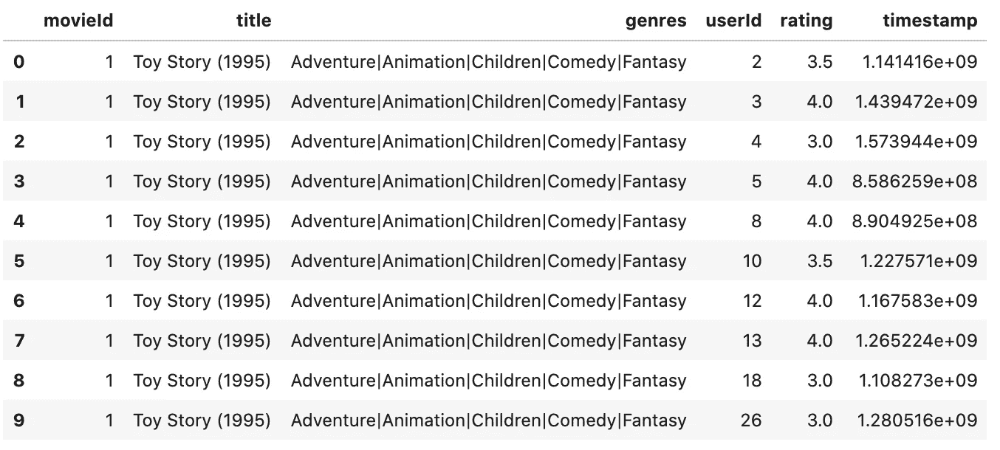
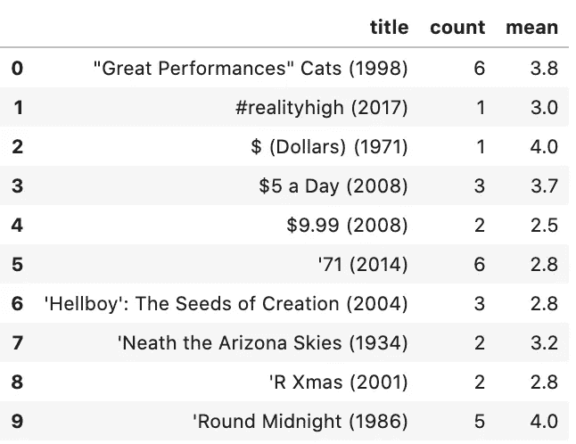
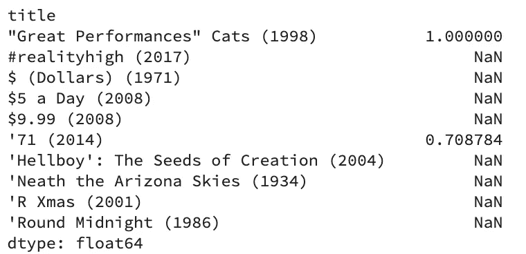
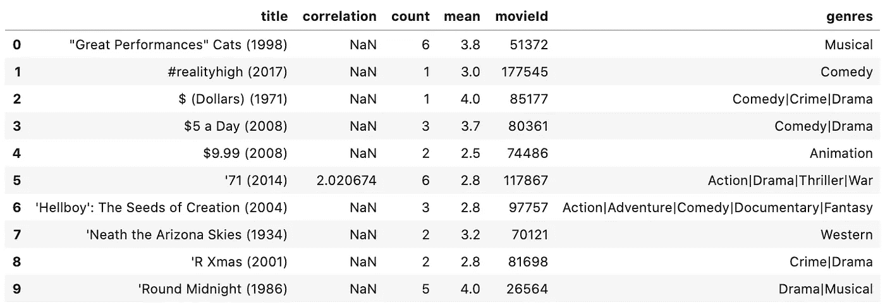
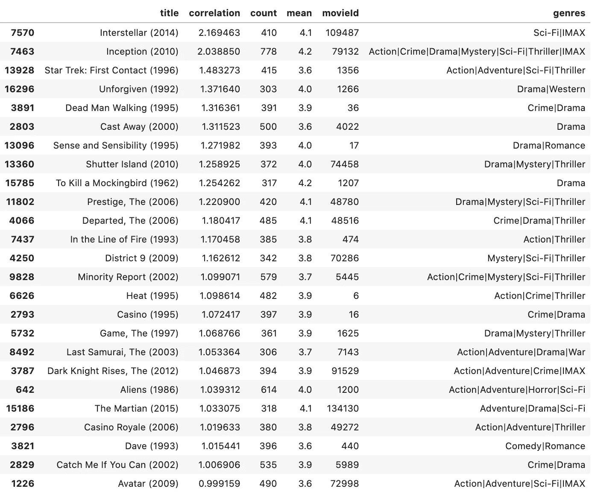

# 构建电影推荐引擎

> 原文：<https://betterprogramming.pub/building-a-movie-recommendation-engine-for-beginners-7161430e35b9>

## *如何用熊猫构建一个非常精确的电影建议系统*


照片由[赵凯伦](https://unsplash.com/@karenzhaocn?utm_source=unsplash&utm_medium=referral&utm_content=creditCopyText)在 [Unsplash](/s/photos/movie-theatre?utm_source=unsplash&utm_medium=referral&utm_content=creditCopyText) 上拍摄

你有没有想过网飞是如何推荐这么多随机的电影，这些电影都在某种程度上符合你的喜好？大部分(如果不是全部)都与数据科学有关，但更具体地说，是大数据、机器学习和人工智能。

在本文中，我们不会探索机器学习、人工智能或网飞复杂而错综复杂的推荐系统，但我们将设计一个具有易于遵循的步骤和实践经验的电影推荐系统，这将帮助您接触广阔的数据科学世界。

# 内容:

*   统计分析简介:电影推荐
*   设置您的环境
*   使用 Python 编程和可视化数据
*   计算数据列之间的相关性
*   清理最终的电影建议
*   未来改进:我们本可以做得更好的地方

# 数据分析简介:电影推荐

我们的电影推荐系统的主要组件依赖于一个叫做协同过滤的学习概念。协作过滤的建议仅仅基于用户过去的数据和偏好，主要是以评论的形式(尽管还有其他收集用户偏好的方法)。

为了理解这一点，我将举例说明一个利用最近邻算法的用户-用户协作过滤的例子。假设我喜欢看电影 A、电影 B 和电影 C，我的朋友喜欢看电影 A、电影 B 和电影 D。协同过滤算法将最有可能建议我将喜欢看电影 D，并且我的朋友将基于我们之前的积极偏好喜欢看电影 C。对我和我的朋友来说，享受我们的电影推荐是有意义的，因为我们有相似的偏好。当然，情况并非总是如此，但当我们开始分析更大的用户评论数据集时，这种可能性变得越来越有利于我们。


*free pik 制作的图标&Vectors Market from*[*欢迎来到丛林*](https://www.welcometothejungle.com/en/articles/collaborative-filtering-job-recommendations)

找出两个项目之间相似性的一个方法是皮尔逊相关系数。皮尔逊相关系数给了我们一个数(最不相似:-1；最相似:1)表示两个项目之间的相似性。还有许多其他方法可以找到相关值，但在本课中，我们将只探讨和关注皮尔逊相关系数。


皮尔逊相关系数的计算公式。

如果你被公式吓到了，网上有一些很棒的视频，通过一些基本的例子让我们更好地理解皮尔逊相关系数。这里链接[，这里](https://www.youtube.com/watch?v=27ywsOzDzJM)链接[，这里](https://www.youtube.com/watch?v=2SCg8Kuh0tE)链接[。去看看他们！](https://www.youtube.com/watch?v=jBQz2RGxCek&feature=emb_logo)

幸运的是，我们在 pandas 中有一个名为`corrwith()`的有用函数，它实际上可以计算皮尔逊相关系数——假设我们有正确格式的数据。我们将使用这个函数对我们的大型数据集执行大部分统计分析。

我们的项目将使用皮尔逊相关系数和协同过滤的最近邻算法来构建一个可靠和成功的推荐系统。

特别感谢 [Pulkit Sharma](https://www.analyticsvidhya.com/blog/author/pulkits/) 和他在[推荐引擎](https://www.analyticsvidhya.com/blog/2018/06/comprehensive-guide-recommendation-engine-python/)上的出色指导。

# 设置您的环境

我们必须通过设置我们的环境来开始我们项目的第一步。我们可以通过安装 Anaconda-Navigator(包含 JupyterLabs)和 pandas(一个用于数据分析的 Python 软件库)来实现这一点，如果您还没有这样做的话。这将允许我们对数据集进行所有的计算、可视化和操作。

如果你在这一步有困难，我写了一个深入的指南，贯穿了下载 Anaconda-Navigator 和安装 pandas 的整个过程。导轨在此处链接[。](https://medium.com/@charleshaoshi/a-newbies-guide-to-analyzing-data-part-one-33e88a41884e)

# 熟悉 JupyterLab

构建我们的电影推荐系统的第二步是在 JupyterLab 中完成的。因此，我们必须从 Anaconda-Navigator 的主屏幕启动 JupyterLab 开始。


您应该会看到这样的页面。

通过单击左上角的第二个图标(由文件夹和加号组合而成)创建一个新的空文件夹。导航到新文件夹的内容—它应该是空的，名称为“无标题文件夹”。点击“笔记本”下的 Python 2 按钮，新建一个`Untitled.ipynb`。我计划在本文中使用 Python 2，因此如果您使用 Python 3，请警惕 Python 2 与 Python 3 相比可能出现的错误。


单击“Python 2”按钮创建一个新的 Untitled.ipynb。

重命名您的无标题文件夹和您的`Untitled.ipynb`文件，使您的工作空间更有条理。我将把我的文件夹命名为“电影推荐者”，把我的`.ipynb`文件命名为“电影推荐者”*。*

在您的新文件夹中，您应该有一个到目前为止还没有写代码的`.ipynb`文件。花些时间尝试一下 JupyterLab，并适应它的环境。当你完成后，我们可以进入下一步。

# 在 JupyterLab 中可视化数据和编程

第三步是我们执行所有的统计分析和编码，这是我们项目最重要的步骤之一。

在我们开始之前，我想提一下我在这个项目中努力学习的类型。我注意到，有时“MovieLens 25M 数据集”会根据您下载和导入 JupyterLab 的时间来建议略有不同的电影。此外，我收集的数据集可能会偶尔由 MovieLens 自己更新。现在的“MovieLens 25M 数据集”可能与未来的“MovieLens 25M 数据集”大不相同。因此，您应该关注本课中教授的基本概念以及每个部分如何与其他部分构建，而不是关注您的数据帧是否与下图中我的数据帧一模一样。请记住这些信息，让我们开始构建吧！

首先从[这里](https://grouplens.org/datasets/movielens/)下载一个 MovieLens 数据集。我正在下载和使用的数据集是“MovieLens 25M 数据集”，其中包括 2500 万条评论，包含 2019 年的最新数据。这个数据集将允许我的程序做出最准确和最新的电影建议。尽管如此，你选择的数据完全取决于你，取决于你的计算机能处理什么，不能处理什么。我建议从“MovieLens 100K 数据集”开始，一旦成功，就可以转移到更大的数据集。请务必阅读并填写 Google 表单，以申请并获得使用 MovieLens 数据的许可。

当你把数据集下载到你的电脑上后，把`movies.csv`和`ratings.csv`导入 JupyterLab。



导入 movies.csv 和 ratings.csv 后，应该是这样的。

现在，我们可以将 pandas 导入到`.ipynb`文件中，让我们可以访问 pandas 中的所有函数和方法。我们通过将下面的代码行写到您的`.ipynb`文件的第一行来实现这一点。通常，程序员会将 NumPy 和 pandas 一起导入，但是，在本指南中我们不会使用 NumPy 中的任何方法，所以我选择不导入 NumPy。不管有没有 NumPy，我们的算法仍然可以顺利运行。

```
import pandas as pd
```

导入熊猫后，我们可以读取从 MovieLens 下载的数据。使用来自 pandas 的`[read_csv() function](https://pandas.pydata.org/pandas-docs/stable/reference/api/pandas.read_csv.html)`,我们能够设置特定的变量来表示我们导入的数据集。我将使用`titles`和`data`来表示我的数据集。

```
titles = pd.read_csv("movies.csv")
data = pd.read_csv("ratings.csv")
```

让我们看看我们的数据集是如何组织的。我们可以通过下面的`[head() function](https://pandas.pydata.org/pandas-docs/stable/reference/api/pandas.DataFrame.head.html)`来做到这一点:

```
titles.head(10)
data.head(10)
```

`titles`和`data` 应该分别看起来像下图。



左图:标题。右图:数据。我们可以看到，“标题”有三个唯一的列，“数据”有四个唯一的列。

太好了。我们可以看到，我们的`titles`有一些`data`没有的重要信息，我们的`data`有一些`titles`没有的重要信息。例如，`data`缺少列`title`和`genres`，而`titles`缺少列`rating`、`userId`和`timestamp`。因此，对我们来说，将`titles`和`data`组合在一起以形成一个包含所有必要信息的数据集是有意义的。我们可以用下面的代码做到这一点，将`data`设置为包含我们需要的所有信息的数据集。

```
data = pd.merge(titles, data, on = "movieId")
```

下面是我的`data`长什么样的例子。(我们可以再次使用函数`data.head(10)`来看看我们的`data`前十行是什么样子的。)



请注意我们如何拥有 **movieId** 、**标题**、**流派**、**用户 Id** 、**评级**、**、**和**时间戳**。我们可以看到“数据”现在有 6 个不同的列。

让我们可视化用户评级，看看我们是否可以计算每部电影的平均评级以及有多少人对每部电影进行了评级。评级的数量和平均评级对于帮助我们在未来找出异常值并使我们的建议更加准确至关重要。

下面一行代码为我们完成了所有的计数、加法和平均。我们可以把所有这些有价值的信息放在一个数据框架中以备将来使用。最后，我将把我的平均评级四舍五入到小数点后一位，以代表现实世界的电影评级系统:

```
reviews = data.groupby('title')['rating'].agg(['count','mean']).reset_index().round(1)
```

我的前十行评分数据框架:



“计数”是我们对每部电影的总评论数，而“平均值”是每部电影的“平均”评分。

太好了——我们现在有了几个包含有价值信息的数据框架。让我们继续这个项目的计算部分。

## 计算电影之间的相关性

第四步中的所有部分都围绕着熊猫的`[corrwith() function](https://pandas.pydata.org/pandas-docs/stable/reference/api/pandas.DataFrame.corrwith.html)`。`corrwith()`函数对我们非常有用，因为假设数据帧的格式正确，它可以计算两个数据帧的列之间的相关性。

首先，我们必须首先制作一个数据帧，它由作为列的`titles`和作为行的`userId`组成，数据帧的值是每个观众的评价。

我们这样做的原因主要是由于`corrwith()`函数的性质。如上所述，使用皮尔逊相关系数，`corrwith()`函数可以计算两个数据帧列之间的相似性。因此，我们希望电影标题作为列，这样我们就可以选取一列(代表一部电影)并将其与其他列进行比较。我们还需要将用户评分作为数据帧的值，因为我们的最终目标是比较每个用户对不同电影的评分之间的相似性，然后使用最高的相似性来建议电影推荐。

下面的代码将创建这样的数据帧。计算机执行这一行代码可能需要一段时间，因为我们正在将所有 2500 万条电影评论以及我们数据集中的所有电影标题合并在一起，以创建一个全新的数据框架(当然，这取决于您使用的计算机和数据集)。对我来说，第一次制作这个数据框最多花了大约两分钟。

```
movies = pd.crosstab(data['userId'], data['title'], values = data['rating'], aggfunc = 'sum')
```

如果你在运行这段代码时仍然有问题，我注意到的一个技巧是，一旦你将你的 MovieLens 数据导入到 JupyterLab，立即运行你当前拥有的所有代码(包括上面的那一行)。大约一分钟后，您应该已经生成了您的`movies`数据帧。

现在，我们可以输入三部我们最喜欢的电影，开始在电影之间产生一些关联。从技术上来说，你可以为你最喜欢的电影选择任何数量的电影。然而，我建议最多只选择五部具有相似风格的电影，这样算法就可以最佳地执行。

我使用了一个字符串数组来保持我的代码最少，而不是将我最喜欢的三部电影设置为三个单独的字符串。

```
userInput = ["Inception (2010)", "Interstellar (2014)", "Arrival (2016)"]
```

《盗梦空间》(2010)、《星际穿越》(2014)和《降临》(2016)是我有史以来最喜欢的三部电影。请注意，我们需要将电影的上映日期放在最后。本质上，我们在模仿我们的`movies`数据帧中的电影名称(或栏目名称)的格式，以便计算机可以根据我们输入的名称准确地找到正确的电影栏目。


照片由 [Krists Luhaers](https://unsplash.com/@kristsll?utm_source=unsplash&utm_medium=referral&utm_content=creditCopyText) 在 [Unsplash](/s/photos/film?utm_source=unsplash&utm_medium=referral&utm_content=creditCopyText) 上拍摄

让我们开始使用`corrwith()`函数计算一些相关性。我们的算法从找到我们第一个输入的电影和`movies`数据帧中的第一个电影列之间的相关性开始。然后，它对`movies`数据帧中的所有电影标题重复这个过程——换句话说，我们将对 MovieLens 数据集中的每部电影重复这个过程。您可能会在代码中得到一个运行时警告，但是现在，我们可以忽略它，一切仍然会运行得非常好。

不要忘记指定您想要的相关方法的类型。正如我所说的，我们将在这个项目中使用皮尔逊相关系数，但也有其他方法来计算相关性，如肯德尔 Tau 和 Spearman Rank 的相关系数。如果你对皮尔逊相关系数感兴趣或仍然困惑，有一篇非常详细的[文章](https://www.statisticssolutions.com/correlation-pearson-kendall-spearman/)描述了这些统计相关方法。

请注意，Pearson 相关系数是 pandas 的 corrwith()函数的默认相关方法，因此从技术上讲，我不必将`method = 'pearson'`放在代码的末尾(在下面的代码行)。但是，我计划将它保留在这里，以便尽可能清晰和具体，但是如果您要使用其他相关方法，如 Spearman Rank 或 Kendall Tau 的相关系数，`method = 'the type of correlation'`将是实现这一目的的合适方法。

```
movies.corrwith(movies[userInput[0]], method = 'pearson')
```

最终，我们将得到一个包含所有电影名称的表格，旁边有一个相关值。下表列出了每部电影与我们最喜欢的第一部电影——就我而言，是《盗梦空间》(2010)——的相似之处。尽管下表从技术上包含了我们数据集中的所有电影，但为了简单起见，我将只显示前十部电影的相关值。



NaN 的意思是没有任何东西可供计算机关联/比较。

我们重复这个过程两次以上——对我们输入的每一部喜爱的电影重复一次。此外，我们可以对每个输入电影的总相关值求和，以找到每个电影与我们最喜欢的电影的总相关。这部分代码执行起来可能会慢一些，因为计算机需要进行大量的计算(我的 MacBook Air 最多三分钟)。

```
similarity = movies.corrwith(movies[userInput[0]], method = 'pearson') + movies.corrwith(movies[userInput[1]], method = 'pearson') + movies.corrwith(movies[userInput[2]], method = 'pearson')
```

有了这种相似性，我们可以创建一个包含所有电影标题、相关值、收视率总数、平均收视率、`movieId`和`genres`的数据帧。这个`[merge() function](https://pandas.pydata.org/pandas-docs/stable/reference/api/pandas.DataFrame.merge.html)`将有助于这个任务。

```
correlatedMovies = pd.DataFrame(similarity, columns = ['correlation'])
correlatedMovies = pd.merge(correlatedMovies, reviews, on = 'title')
correlatedMovies = pd.merge(correlatedMovies, titles, on = 'title')
```



我的“相关电影”数据框架，包含所有具有重要值的列。

干得好！你已经完成了这一课所有难的部分。最后一步是利用我们提取的数据。


图片来自[hypebost](https://hypebeast.com/2019/12/best-movies-box-office-joker-avengers-endgame-the-irishman)

# 清理建议列表

如上所述，这个项目的最后一步是确保我们的电影推荐系统实际上推荐准确的电影建议。为此，我选择剔除 3.5 星以下的电影和评论少于 300 的电影。这部分完全由你决定——你可以随意更改数字。

因为我们希望首先推荐最相似的电影，所以我们可以通过在代码中添加`ascending = False`将相关性从最高到最低排序。

```
output = correlatedMovies[(correlatedMovies['mean'] > 3.5) & (correlatedMovies['count'] >= 300)].sort_values('correlation', ascending = False)
```

现在，让我们看看前 25 行输出是什么样子的:



记得使用 head()函数来查看数据。

有意思。似乎我放入这个算法的电影中的两部作为我有史以来最喜欢的三部电影成为了电影推荐系统的第一和第二建议。虽然这对计算机有意义，但我们不希望算法推荐我们已经看过并喜欢的电影。要解决这个问题，我们可以编写并执行以下代码行:

```
output = output[((output.title != userInput[0]) & (output.title != userInput[1]) & (output.title != userInput[2]))]
```

你可能想知道为什么有些电影的相关值超过 1。我不是说过皮尔逊相关系数只能是-1 到 1 之间的值吗？嗯，这是真的，但我们必须记住，我是在添加三部不同电影的总相关性。因此，我们的相关值实际上是从-3 到 3。

此外，我将重命名输出的列标题，去掉`correlation`和`movieId`列，使输出表看起来更整洁:

```
del output['movieId']
del output['correlation']
output.rename(columns={"title": ("Movies Suggestions based on " + userInput[0] + ', ' + userInput[1] + ', ' + userInput[2]) , "count": "Number of Ratings", "genres": "Genres", "mean": "Ratings", "correlation": "Correlation"}).head(25)
```

我的最终输出大致如下:


厉害！我可以说这个电影推荐系统做得非常好，因为我已经看过并喜欢上了这个算法推荐给我的一些电影(《禁闭岛》、《威望》、《第九区》、《黑暗骑士崛起》、《异形》、《火星人》和《阿凡达》)。

请记住，我几乎可以肯定，即使你选择输入和我一样喜欢的电影，你的最终电影推荐数据帧也会和我的不同。不要担心这一点，因为有许多因素可能在这种情况下发挥作用。相反，我们应该关注我们为什么要这么做。专注于教授和使用的概念。这就是*真学* 发展进步的地方。

# 未来的即兴创作和最终观察

祝贺您创建了您的推荐引擎！

像生活中的许多事情一样，我们可以做出无数的改进。例如，尽管我只输入科幻和动作冒险电影，但我注意到这个电影推荐系统为我推荐了几部喜剧和爱情电影。科幻和动作冒险似乎是喜剧和浪漫的反义词，所以我也许可以添加一个功能，让我查看每部电影的类型，并推荐与科幻和动作冒险密切相关的电影(或任何你输入的电影类型)。这可以通过拆分每部电影所属的类型，并将这些类型放入一个数组中来实现(例如，“戏剧”、“神秘”、“战争”)。然后你可以遍历每部电影的类型数组，保留科幻类型、动作冒险类型以及与科幻或动作冒险相关的类型。

此外，我们可以使用其他方法来计算相关性，例如[余弦相似度](https://www.machinelearningplus.com/nlp/cosine-similarity/#:~:text=Cosine%20similarity%20is%20a%20metric,in%20a%20multi%2Ddimensional%20space.)。如果你有兴趣了解更多关于余弦相似性及其在推荐引擎中的作用，有一篇非常详细的[文章](https://medium.com/@bkexcel2014/building-movie-recommender-systems-using-cosine-similarity-in-python-eff2d4e60d24)讲述了使用余弦相似性方法创建电影推荐系统的过程。

最后但同样重要的是，我们必须回顾和讨论我们的算法在大型数据集上的运行时间、效率和有效性。为我们数据库中的每部电影计算皮尔逊相关系数需要大量的时间、空间和计算机工作(记住我们的数据集有数万部电影)，这是创建这个推荐系统的巨大代价。在我们的整个指南中，有很多次我们不得不等待相当长的时间，让我们的计算机在我们的大型数据集上执行任务(特别是形成新的数据帧和计算相关性)。

因此，我们在本课中构建的电影推荐引擎在现实世界中不会很好地工作，坦率地说，不实用。然而，我们的电影推荐系统确实让我们一窥数据科学是怎么一回事！

谢谢你能走到这一步！如果您有任何其他问题或顾虑，请随时在下面留下评论或查看下面链接的我的 GitHub。

[](https://github.com/CharlesShi12/RecommendationSystems) [## Charles Shi 12/推荐系统

### 这个项目探索的概念和算法用于创建准确的推荐系统基于用户…

github.com](https://github.com/CharlesShi12/RecommendationSystems) 

# 参考

[](https://www.machinelearningplus.com/nlp/cosine-similarity/#:~:text=Cosine%20similarity%20is%20a%20metric,in%20a%20multi-dimensional%20space.) [## 余弦相似性-理解数学及其工作原理？(使用 python)

### 余弦相似性是一种度量标准，用于衡量文档的相似程度，而不考虑文档的大小。数学上…

www.machinelearningplus.com](https://www.machinelearningplus.com/nlp/cosine-similarity/#:~:text=Cosine%20similarity%20is%20a%20metric,in%20a%20multi-dimensional%20space.) [](https://www.codecademy.com/articles/how-netflix-recommendation-works-data-science) [## 网飞推荐引擎| Codecademy

### 您可能听说过“大数据”这个术语，但您了解它是什么吗？大数据是指海量…

www.codecademy.com](https://www.codecademy.com/articles/how-netflix-recommendation-works-data-science) [](https://www.udemy.com/course/the-data-science-course-complete-data-science-bootcamp/) [## 数据科学培训课程:数据科学家训练营

### 数据科学家是本世纪最适合蓬勃发展的职业之一。它是数字化的，面向编程的，并且…

www.udemy.com](https://www.udemy.com/course/the-data-science-course-complete-data-science-bootcamp/) [](https://www.udemy.com/course/complete-python-bootcamp/) [## Python 训练营:学习 Python 编程和代码培训

### 这是 Udemy 上最全面、最直接的 Python 编程语言课程！你是否…

www.udemy.com](https://www.udemy.com/course/complete-python-bootcamp/) [](https://www.analyticsvidhya.com/blog/2018/06/comprehensive-guide-recommendation-engine-python/) [## 从头开始构建推荐引擎的综合指南(Python 语言)

### 引言在当今世界，每个客户都面临着多种选择。例如，如果我在找一本书来…

www.analyticsvidhya.com](https://www.analyticsvidhya.com/blog/2018/06/comprehensive-guide-recommendation-engine-python/) [](https://towardsdatascience.com/intro-to-recommender-system-collaborative-filtering-64a238194a26) [## 推荐系统简介:协同过滤

### "我们正在离开信息时代，进入推荐时代."

towardsdatascience.com](https://towardsdatascience.com/intro-to-recommender-system-collaborative-filtering-64a238194a26) [](https://pandas.pydata.org/) [## 熊猫

### pandas 是一个快速、强大、灵活且易于使用的开源数据分析和操作工具，构建于…

pandas.pydata.org](https://pandas.pydata.org/) [](https://stackoverflow.com/) [## 堆栈溢出-开发者学习、分享和建立职业生涯的地方

### 我们开发产品，为开发人员提供支持，并为他们提供解决方案，帮助他们提高生产力、促进发展和…

stackoverflow.com](https://stackoverflow.com/) [](https://www.statisticssolutions.com/correlation-pearson-kendall-spearman/) [## 相关性(皮尔森、肯德尔、斯皮尔曼)-统计解决方案

### 皮尔逊相关:皮尔逊相关是最广泛使用的相关统计量来衡量的程度…

www.statisticssolutions.com](https://www.statisticssolutions.com/correlation-pearson-kendall-spearman/) [](https://medium.com/@bkexcel2014/building-movie-recommender-systems-using-cosine-similarity-in-python-eff2d4e60d24) [## 利用 Python 中的余弦相似性构建电影推荐系统。

### 读者你好！在这篇文章中，我将介绍我是如何使用 Python 来构建电影推荐系统的。在第一次…

medium.com](https://medium.com/@bkexcel2014/building-movie-recommender-systems-using-cosine-similarity-in-python-eff2d4e60d24) [](https://grouplens.org/datasets/movielens/) [## 莫维伦斯

### 2500 万电影收视率。稳定的基准数据集。2500 万个评级和 100 万个标签应用程序适用于…

grouplens.org](https://grouplens.org/datasets/movielens/)