# 构建一个 Slack 应用程序，了解你的队友在 Spotify 上听什么

> 原文：<https://betterprogramming.pub/building-a-slack-app-for-spotify-with-go-64ff71959bd1>

## 使用 Go 的 Slack-Spotify 集成

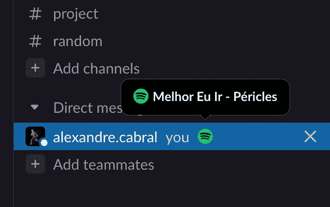

Spotify for Slack

我喜欢 Discord 的 Spotify 功能，你可以看到其他人在听什么。在之前的公司用的比较多，现在用 Slack。

可惜 Slack 没有那样的原生功能。所以我决定为它开发我自己的 slack 应用程序([https://github.com/o-mago/spotify-status](https://github.com/o-mago/spotify-status))。

这是不和谐的特点，我启发建立自己的懈怠。

Discord 的 Spotify 功能

在这篇文章中，我将展示如何使用这些技术从基础上构建应用程序，并使用**零成本**进行部署:

*   [出发](https://go.dev/)
*   [Heroku](https://www.heroku.com/platform)
*   [新遗迹](https://newrelic.com/)
*   [码头工人](https://www.docker.com/)
*   [Spotify Web API](https://developer.spotify.com/documentation/web-api/)
*   [松弛 API](https://api.slack.com/)
*   [PostgreSQL](https://www.postgresql.org/)

# 索引

*   [构建 App](#8989)
    - [理念](#996c)
    - [架构](#3a55)-
    -[服务器](#51b6)-
    -[处理程序](#6b08)-
    -[服务](#654a)-
    -[仓库](#8940)-
    -[实体](#d69a)
    - [部署](#5919)
*   [结论](#fc03)
*   [设置服务](#9abe)
    -[Heroku](#c7e3)
    -[新遗迹](#3269)
    - [面向开发者的 Spotify](#94be)

# 构建应用程序

## 想法

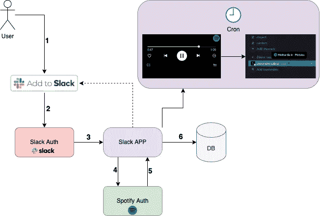

流量

该应用程序的想法是将用户正在听的歌曲与他/她的空闲状态同步。为此，该应用程序将每 X 秒运行一次 cronjob。它将验证用户是否正在 Spotify 上听一些东西，并将状态更改为类似这样的内容:*:Spotify-e moji:song _ name-singer*。

但我们必须注意几点:

*   应用程序必须只改变用户的状态，如果当前状态是空白的。我们不想覆盖用户设置的另一个状态。我经常将我的状态更改为“正在吃午饭”，但我仍然喜欢听 Spotify，我不希望我的状态更改为我的歌曲。
*   该应用程序必须在停止 Spotify 播放器后清除状态，但前提是当前状态是由我们的 Slack 应用程序设置的。我们不想清除用户或另一个 Slack 应用程序设置的状态。
*   松弛状态文本最多包含 100 个字符:[https://API . slack . com/docs/presence-and-status # user-presence-and-status _ _ custom-status _ _ reading-status](https://api.slack.com/docs/presence-and-status#user-presence-and-status__custom-status__reading-statuses)
*   我们必须将 cronjob 时间定义为一个不太大的间隔，以便与 Spotify 保持同步，但它不需要太小，因为一首歌平均播放 3 分钟。10 秒是一个很好的间隔

我们还需要一个应用程序的登录页面，用户将应用程序添加到他/她的工作区，并允许应用程序连接到 Spotify 帐户。

在用户允许我们的应用程序访问他/她的数据后，我们需要将用户的信息(来自 slack 和 spotify)存储在数据库中，以让 cronjob 工作。

让我们开始聚会吧。我们将使用 Go 构建我们的应用程序。完整的 app 可以在 [**这里**](https://github.com/o-mago/spotify-status) 找到。

我们将使用默认的 Go **net/http** 来服务我们的应用程序和一些外部库:

*   [奥姆](https://github.com/go-gorm/gorm):奥姆
*   [zm B3/Spotify](https://github.com/zmb3/spotify):Spotify API 库
*   [oauth2](https://github.com/golang/oauth2) :处理 Spotify 访问令牌
*   [robfig/cron](https://github.com/robfig/cron) :创建我们的用户状态更新例程
*   [新遗迹/围棋代理](https://github.com/newrelic/go-agent):围棋新遗迹代理
*   [松弛/松弛](https://github.com/slack-go/slack):松弛 API
*   g [oogle/uuid](https://github.com/google/uuid) :为我们的用户表生成 id

## 体系结构

我试图在这里达到某种层次的干净架构，在不同层之间分割代码(允许关注点分离，SoC)。我们的核心应用是一个三层架构，包含`handlers`、`services`和`repositories`:

*   **处理程序**:它们是接收请求、解析参数并在需要时调用服务的前线。
*   **服务**:它们包含我们的“业务”逻辑(在我们的例子中，设置用户的空闲状态)并在必要时调用存储库。
*   **存储库**:它们将完成我们的逻辑(服务)和数据源(在本例中是我们的 PostgreSQL DB)之间的接口

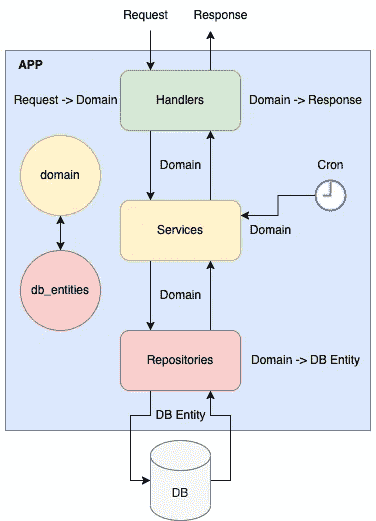

应用程序结构

我们将为我们的实体创建两个包:`domain`和`db_entities`。

*   **域**:它是与我们的“业务”逻辑相关的实体，只包含带有必要字段的结构。*服务*层将只接收和发送域实体。它有更全面的语言，与 ou 的“业务”规则相关联
*   **db _ entities**:这是我们的 DB 表的模型，它的所有列和函数都用来转换 *db_entities - >域*或*域- > db_entities。*

OBS:在我们的例子中，域和 db_entities 将具有相同的结构。但这并不是总会发生的事情。这取决于领域建模。

好吧…我知道这对于一个简单的 Slack 应用程序来说太复杂了，确实如此。

我的第一个方法是只使用一个文件，但这是一个烂摊子。所以我决定重构它，为了研究的目的，试着给混乱创造一些秩序。此外，我将在本文的结尾考虑一些改进，如果我们需要添加更多的功能，拥有一个更坚实的架构将会有所帮助。

## 计算机网络服务器

首先我们将创建一个`src`文件夹和一个名为`server.go`的文件。它将是我们的`main`包，一个将被编译成可执行程序的包。在里面我们会做一些事情:

*   获取我们的环境变量:

New Relic、Slack、Spotify 和数据库凭据将在本文接下来的部分中完成设置后找到。由于 Heroku 为我们的应用程序分配了一个随机端口，因此需要使用这个名称的**端口**环境变量。

设置新遗迹:

设置数据库并运行迁移。我们将使用 [gorm](https://gorm.io/index.html) 作为我们的 orm:

创建 spotify 验证器，以获取用户的 Spotify 播放器信息:

创建**处理程序**、**服务**和**存储库**:

创建 cron 以更新用户状态:

创建服务器多路复用器(我们不需要默认处理程序)，添加处理程序并开始监听。我们需要 4 条路线:

*   `/slackAuth`:用户允许我们的 app 后，Slack 调用的回调路径
*   `/callback`:用户允许我们的应用后，Spotify 调用的回拨路径
*   `/users`:新遗迹使用的路线，以 ping 我们的应用程序，并阻止它睡眠
*   **/** :为我们的静态文件提供服务的路径(登录页面)

如你所见，我们将在服务器上提供静态文件。它是网站根路径上的登陆页面。我决定用我们的 API 来服务它，而不是为我们的前端创建另一个项目。这不是一个好的做法，但页面太简单了，我不想在这一点上增加更多的复杂性。

静态网站基本就是一个 HTML 文件和 CSS。这只是我们添加到松弛时间按钮的一个页面。

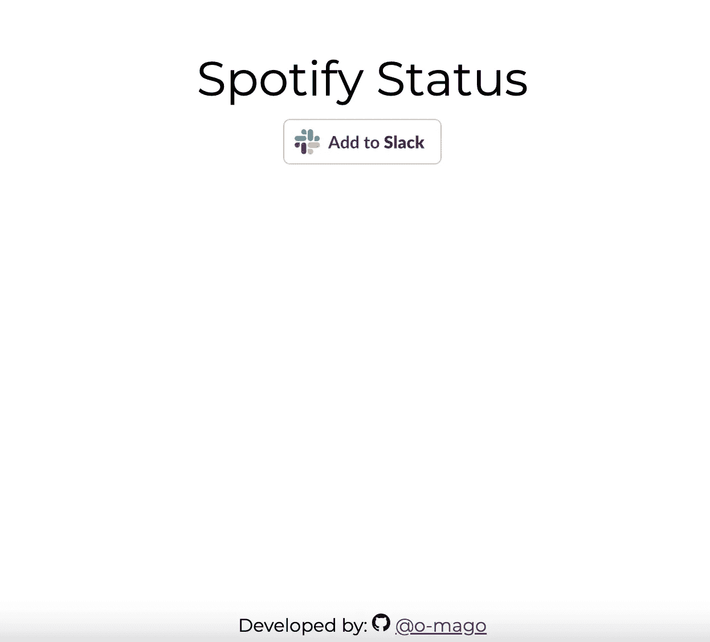

Slack 应用程序登录页面

## 经理人

正如我们之前看到的，我们有 4 个路由器，一个仅用于静态文件，其他的需要处理程序。

*   **新遗迹健康处理器**:

这只是一个 ping 处理程序

*   **松弛回调处理器**:

它将使用我们的 slack 应用凭证和用户单击 Add to Slack 按钮后生成的代码来检索用户数据(使用 POST 请求 Slack API): slack 用户 id 和访问令牌。

之后，处理程序将重定向到 Spotify Auth URL，将该用户信息(id 和访问令牌)设置为 Cookies。这样，我们可以在 Spotify 回调处理程序中检索这些信息。

*   **Spotify 回调处理程序**:

它将检索用 Cookies 设置的 Slack 用户数据。此外，我们将把 Spotify 认证页面(用户被重定向)代码换成访问令牌。Spotify 库中的这个方法`Token(state string, r *http.Request) (*oauth2.Token, error)` 还会检查我们在`server.go` 文件上生成的状态。通过这种方式，我们可以防止诸如跨站点请求伪造之类的攻击。

有了 Slack 和 Spotify 的用户数据，我们最终可以将用户添加到我们的数据库中。但是如果你记得我们的架构，我们需要先调用服务层。

## 服务

app 有两种服务方式:`AddUser`和`ChangeUserStatus`

*   `AddUser`:

这里我们为`users`表主键生成一个 UUID(通用唯一标识符)。在我们调用存储库在我们的数据库上创建用户之后。

*   `ChangeUserStatus` **:**

这是我们 app 的核心功能。它将检索我们数据库中的所有用户，迭代，然后为每个用户创建一个 goroutine。

我知道，我知道…你在想“随着用户数量的增长，我们可能会遇到一些问题”，你是对的(我将在本文的最后一节讨论这个问题)。但我决定不处理它，因为我的想法是只在公司内部使用这个应用程序，用户不超过 100 人。

在`goroutine`中，我们将检查用户是否在玩游戏，并且检查当前的空闲状态。我们只能在两种情况下更改状态:

*   更新 Spotify 歌曲的状态:如果用户正在播放歌曲，并且状态表情符号为空或为`:spotify:`
*   清除状态:如果用户没有在播放歌曲，并且状态表情符号是`:spotify:`

## 仓库

有两种存储库方法:`CreateUser`和`SearchUsers`

*   `CreateUser`:

如果用户存在，我们尝试获取用户，否则创建用户。

*   `SearchUsers`:

该存储库从数据库中检索所有用户

## 实体

将有两个实体:`domain.User`和`db_entities.User`

*   `domain.User`:

用于内部服务

*   `db_entities.User`T19:

我们数据库中用户表的模型。并且还包含与`domain.User`之间的转换

## **运行 app**

为了运行我们的应用程序，我创建了一个`Dockerfile`和`docker-compose`:

给 Mac M1 用户的一个免费提示:在 docker 文件的顶部添加`--platform=linux/amd64`,否则 Heroku 会抛出一个错误

因此，要在本地运行，导出所有环境变量并运行`docker compose up`。

## 部署

我们将使用 Heroku 容器将我们的应用程序作为容器部署在 Heroku 上。因此，需要创建 3 个文件:

*   `Procfile` **:**

这个文件通知 Heroku 启动 dyno 时要运行的命令

*   `heroku.yml`:

它定义了我们在 Heroku 上的应用程序的构建选项

*   `deployHeroku.sh`:

简化部署的 shell 脚本(在运行之前导出环境变量)

# 结论

最终，我们有了一个工作正常、简单、免费的 slack 应用程序，它可以将你的 Slack 状态与 Spotify 同步。

但是…我们可以改变这里的一些事情。考虑到可扩展性，添加功能并使其更加安全可靠。如果我们的应用程序变得流行起来会怎么样…

## 新功能

*   使用命令与他人共享您正在听的内容
*   开始倾听工作区的其他人在听什么
*   使用命令控制 Spotify

## 可靠性和安全性改进

*   允许用户在删除应用程序时从我们的数据库中排除他的数据
*   对用户进行分页以更新状态，而不是检索所有状态
*   为登录页面创建另一个项目，为静态网站创建不同的部署。该网页将包含更多关于应用程序的信息
*   例如，使用 AES 加密对数据库中的用户数据进行加密(我们需要解密我们的数据，以便从 Spotify 和 Slack 中检索用户信息)

现在，但同样重要的是，在下一节中，我将描述如何设置我们需要的服务来使其工作(Heroku，New Relic，Spotify For Developers 和 Slack App)。

# 设置服务

## 赫罗库

我们将创建一个新的免费 Heroku 应用程序。它会给我们这样的地址: <app-name>.herokuapp.com(例如`spotify-status-slack.herokuapp.com`)</app-name>

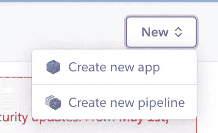

Heroku 面板

和以及两个资源:

*   它用有限的资源创建了一个 aws postgres 免费数据库，但它将满足我们的目的
*   `New Relic APM`:它将被用于 ping 我们的应用程序并保持其活动，因为 Heroku，在免费计划中，如果它在 30 分钟内没有收到任何请求，就会将应用程序置于睡眠状态

Heroku 资源

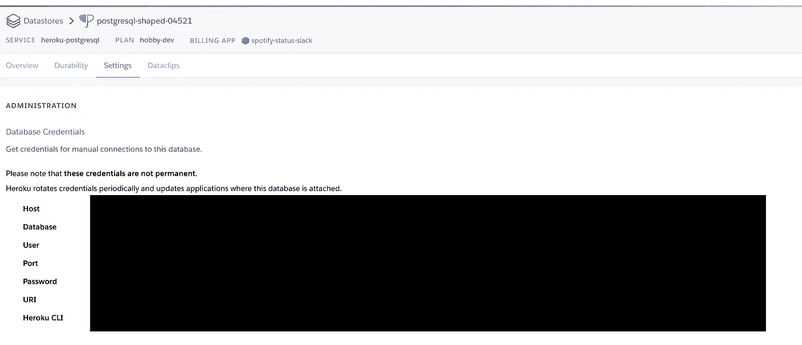

数据库凭据

## 新遗迹

我们将在新遗迹中创建一个新的合成监视器，型号为`Availability`。该监视器将每隔 1 分钟(可以是少于 30 分钟的任何时间)仅 ping 我们将为其构建的端点

新遗迹面板

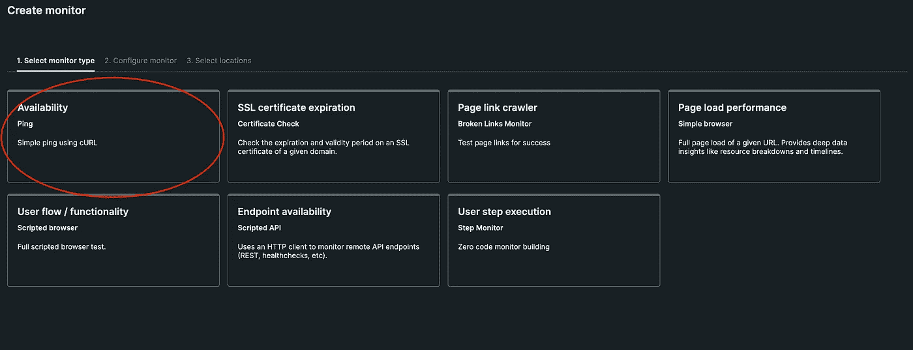

可用性监视器

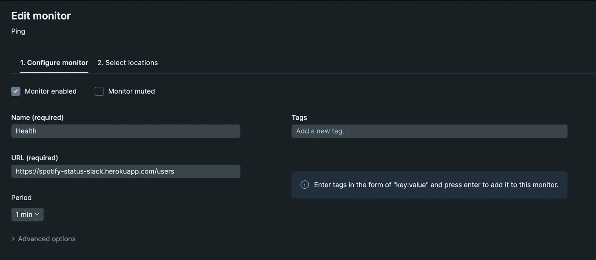

监视器设置

## 面向开发者的 Spotify

首先，我们必须创建我们的 Spotify 开发者帐户，并在平台内创建我们的应用程序，以便获得我们的`Client ID`和`Client Secret`。

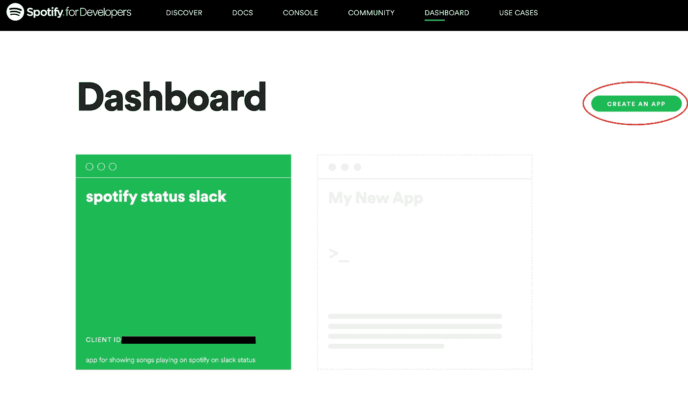

Spotify 开发者面板

面向开发者的 Spotify 应用程序屏幕

我们还必须提供一个重定向网址后，用户允许我们的应用程序访问他/她的 Spotify 帐户信息

设置模式

## Slack 应用

我们将开始为开发创建一个新的工作空间。

然后，让我们从头开始创建我们的应用程序，命名它并选择我们之前创建的工作区

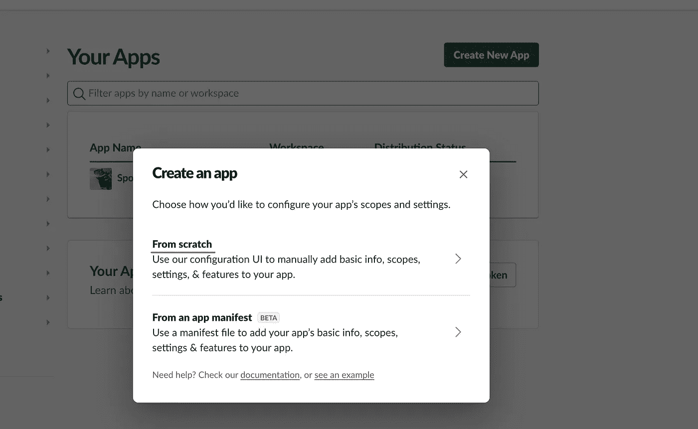

我们需要为应用程序配置权限:

我们需要提供一个 URL 来重定向 slack permission 网站，允许用户在工作区尝试安装应用程序(这将是我们创建服务器并将其部署在 heroku 上后的最终 URL):

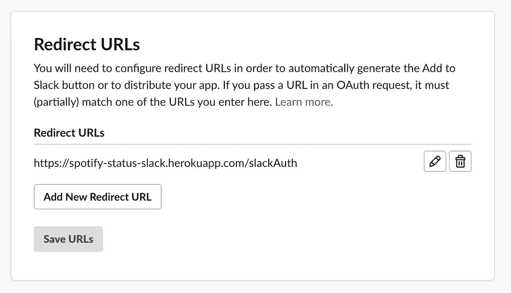

范围是指我们需要用户在安装应用程序时允许我们的权限。

*   `user.profile.read`:允许我们获取用户状态
*   `user.profile.write`:它允许我们为用户在 Spotify 上正在听的歌曲设置用户状态

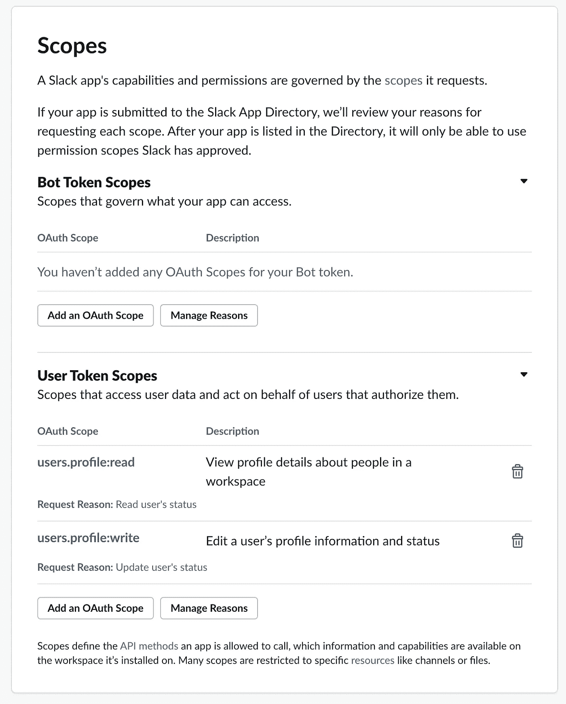

为了分发该应用程序，我们将把这个预制的`Add to Slack`按钮片段添加到我们的网站上。

我们还需要为应用程序提供我们的网址(heroku 为我们生成的最终网址)

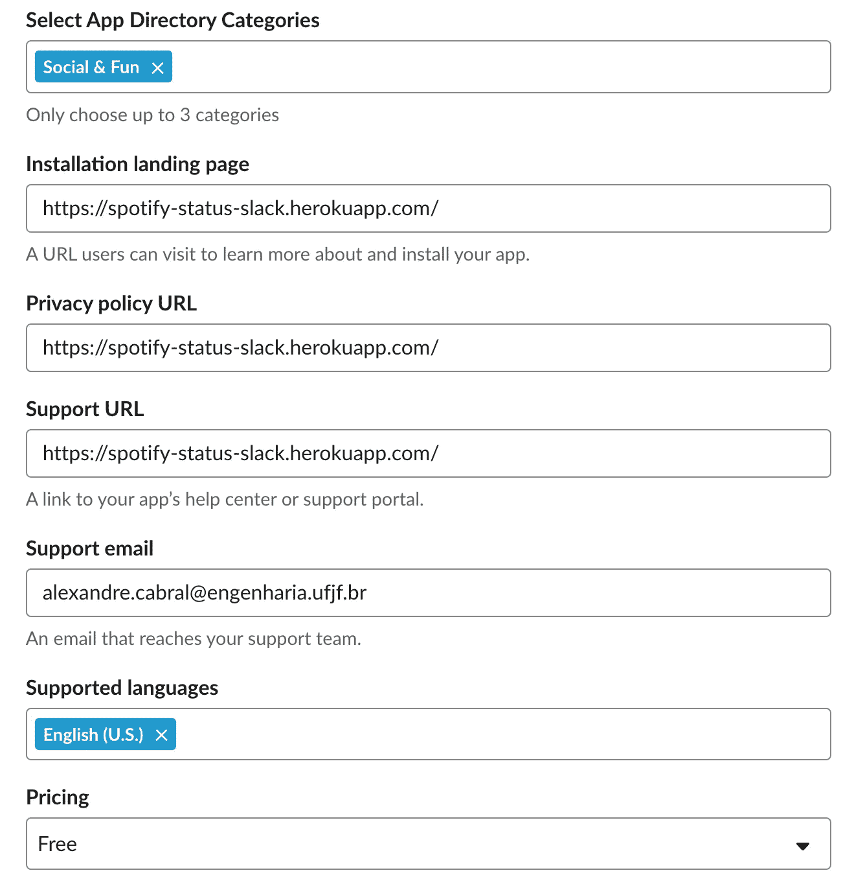

因为我们将有一个登录页面，所以我们将选择`Install from your landing page`。

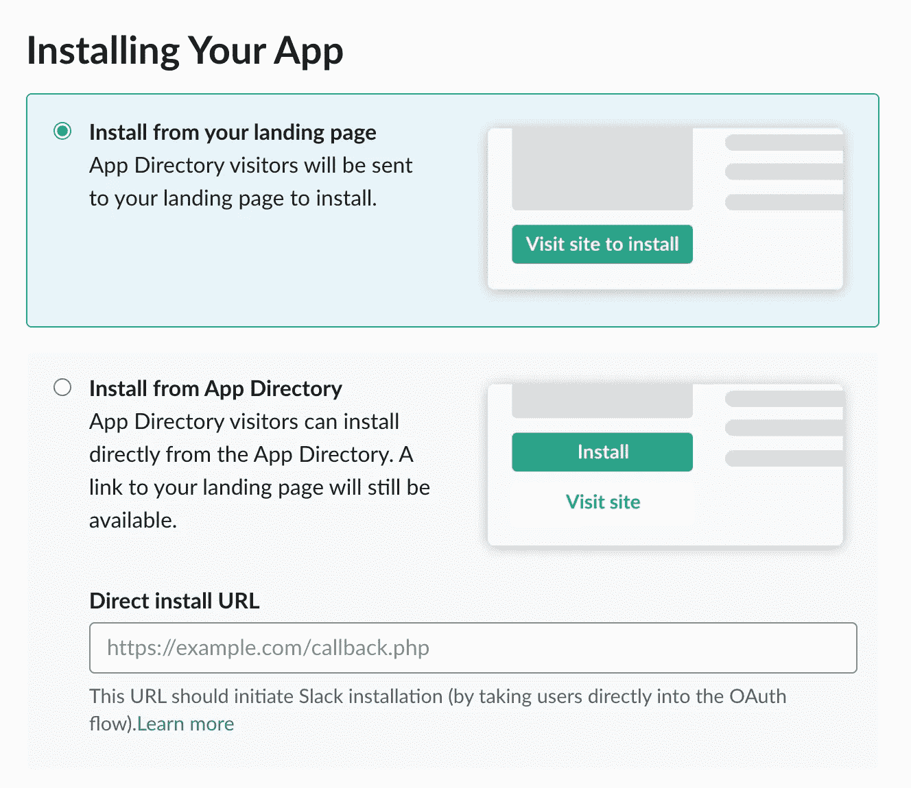

一切就绪！