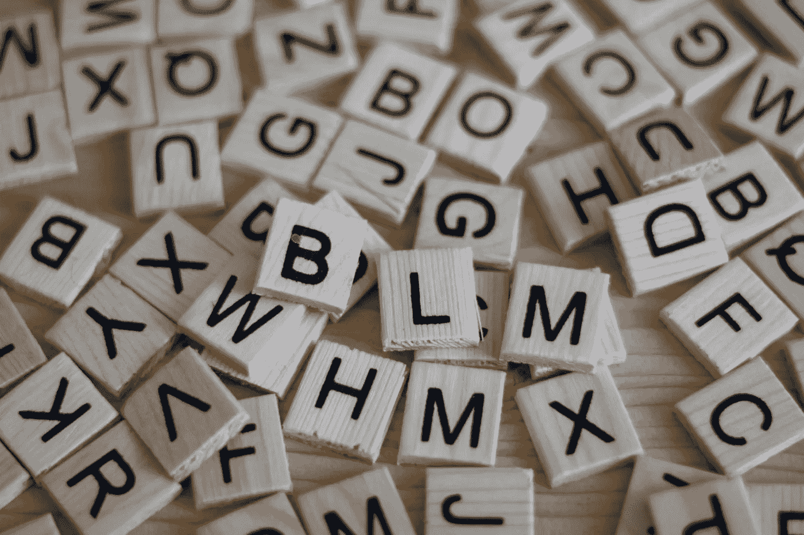

# 用不到 100 行 Python 代码构建一个 Wordle Bot

> 原文：<https://betterprogramming.pub/building-a-wordle-bot-in-under-100-lines-of-python-9b980539defb>

## 解谜很有趣



不均匀图像

如果你不知道 Wordle 是什么，那就从你的石头下面出来看看吧。这是一个简单的表面游戏，但最终需要一些策略来掌握它。玩了几轮之后，我的好奇心被激起了，我觉得有必要造一个机器人来玩这个游戏，并对它有更多的了解。我们走吧！

# 目标

构建一个播放 Wordle 的 Python 程序。它应该对单词进行猜测，并在尽可能少的猜测中找出最终答案单词。

# 基础知识

这个游戏的基础非常简单。我们需要能够保存有效单词的列表，进行猜测，收集响应，并根据这些响应中的数据更新我们的单词列表。这个高级 Python 代码可以作为我们求解应用程序的基线。

对于这个简单的结构，我们实际上只有 3 种方法来构建。首先是`make_guess`。这个方法应该获取一个有效单词的列表，并从该列表中猜出一个单词。首先，让我们随机选择。稍后我们会让它变得更聪明。现在，我们只想让基本的游戏就位。

`collect_result`方法只需要从用户那里收集一些关于猜测的输入。我们的程序的用户将输入猜测到 Wordle 网站，这将告诉我们什么是正确的和错误的。用户需要将这些值输入到我们的程序中。我们将使用 3 个不同的字符来表示每个字母的 3 种可能结果:

*   `_`= Miss——这个字母没有出现在单词中
*   `?` =错误的位置-这个字母在单词中，但不在这个位置
*   `!` =正确——这个字母出现在单词的这个地方

一些简单的 Python 用户输入集合以及一些用于数据验证的正则表达式匹配让我们走上了这条路。

现在我们需要根据我们的猜测和结果更新我们的有效单词，这就是`update_valid_words`方法的用途。我们将从一个简单的实现开始，它的性能不是很好，但是应该可以完成工作。我们将遍历所有剩余的有效单词，看看它们是否会产生与我们猜测的相同的结果。为了做到这一点，我们需要一个名为`get_result`的新方法，如果我们知道答案，它将返回猜测的结果。

这有几个问题，特别是关于有重复字母的单词(例如，机器人、速度等)。但是我们以后会解决的。在这一点上，我们有足够的时间来玩这个游戏！我们可以把所有这些方法放在一起玩。让我们看看我们的游戏是如何用一个目标词 SNAKE 来玩的。

```
$ python solve_wordle.py
Guess: WHISK
What's the result? (_/?/!) ___??
Guess: DUSKY
What's the result? (_/?/!) __?!_
Guess: SPOKE
What's the result? (_/?/!) !__!!
Guess: STAKE
What's the result? (_/?/!) !_!!!
Guess: SNAKE
What's the result? (_/?/!) !!!!!
I won!
```

成功了！甚至在 5 次猜测中，考虑到许多这些方法的简单方法，这还不算太糟糕。由于我们在这里依赖于随机选择，这也可能每次都不同，5 似乎是给定该算法的 SNAKE 的中值求解量。让我们看看我们是否能做得更好。

# 更聪明的猜测

一个好的单词玩家是能猜出一个好单词的人。机敏的分析，我说得对吗？一开始，我们只是从剩下的单词中随机选择一个单词，但这并不明智。但是，什么是好的猜测呢？

我最初的理论是，一个好的猜测应该是包含最常见字母的猜测。这是一个相当安全的假设，尤其是在猜测的早期。由于还剩下很多单词，我们想尽可能多地了解它们，所以猜测常见字母是一种自然本能。毫无疑问，第一次猜“RATED”比猜“JAZZY”更能让我们了解这个词。让我们增强我们的`make_guess`方法来运用这个策略。

要做到这一点，第一步是找出哪些字母是最常用的。我们应该只考虑这些字符计数有效的单词，没有意义计数我们知道不正确的单词。Python 的内置`Counter`对象可以在这方面有所帮助。

在我们获得剩余单词中每个字符的计数后，我们希望找到拥有最多这些字符的单词。我们也不想在这里计算重复项。记住，我们的目标是找出尽可能多的字母。因此，虽然 E 可能是单词中最常见的字母，但猜测它是怪诞的是没有意义的。我们不想浪费其他的字母槽。

这不是一个非常复杂的方法。我们也许可以做一些改进，比如忽略我们已经知道的单词中的字母，但是现在这样应该可以了。让我们再和蛇这个词玩一次，看看我们是否做得更好。

```
$ python solve_wordle.py
Guess: LATER
What's the result? (_/?/!) _?_?_
Guess: SHADE
What's the result? (_/?/!) !_!_!
Guess: SUAVE
What's the result? (_/?/!) !_!_!
Guess: SPACE
What's the result? (_/?/!) !_!_!
Guess: SNAKE
What's the result? (_/?/!) !!!!!
I won!
```

我们仍然得到了这个词，但我们仍然花了 5 次尝试。此外，由于我们的猜测算法现在是确定性的，这将是我们每次玩的结果，至少对于 SNAKE 的目标词是这样。

这里一个有趣的观察是，这个算法认为最好的可能起始词是 LATER(或者它的任何变位词，即 ALTER、ALERT)。如果你正在寻找一个好的开头词，这些可能是值得一试的。

这个算法只需要几次尝试就可以得到一些单词，但 5 次尝试对我来说并不重要。我可以自己做，我希望我的电脑比我聪明。让我们做得更好。

# 让这台机器运转起来

线性时间频率计数并不是一个值得大书特书的算法。作为人类，我们甚至可以粗略地观察一下。如果我们想一想什么是好的猜测，它会根据回答告诉我们最多的信息。换句话说，它将平均产生最小的下一个有效单词列表。

我们面前有一台电脑，我们可以模拟这个！对于剩余的每个有效单词，如果我们猜对了会发生什么？我们可以将每一个有效的单词作为猜测，与每一个其他有效的单词作为答案进行比较，看看最终的单词列表会是什么样。这就产生了一个 O(N^2 算法，来解决只有几千字的相对较小的问题空间。我们走吧！

这看起来并不太糟糕，基本上我们只是看到在每一个可能的猜测和每一个可能的答案之后还剩下多少单词。它肯定会慢一些，但我认为它也会更智能。然而，这里有一个小问题。我们认为我们的算法可以在 O(N)时间内运行，这还不算太坏。但是我们相当简单的`update_valid_words`实现反过来咬了我们一口。该方法实际上有自己的 O(N)运行时，所以这个 guess 方法现在可以在 O(N^3).运行了它仍然是一个小数据集，但 cubic runtime 很快就会变大。

与其试图优化这两种方法，不如让这个策略在我们的有效单词列表中的单词少于 500 个时运行。我们可以为更长的单词列表保留频率计数算法，但是一旦我们接近末尾，我们将进行深度搜索。

是时候再次尝试对抗蛇这个词了！

```
$ python solve_wordle.py
Guess: LATER
What's the result? (_/?/!) _?_?_
Guess: SHADE
What's the result? (_/?/!) !_!_!
Guess: SNAKE
What's the result? (_/?/!) !!!!!
I won!
```

不错！只有 3 次猜测！不过，我们可能会有点幸运。如果我们知道 S、A 和 E 在正确的位置，那么 SNAKE、SUAVE 和 SPACE 应该都大致相等。但是这种算法在一般情况下应该仍然更有效。我们能检验这个理论吗？

# 最难的单词

在这一点上，我有点好奇，这个机器人如何对付其他单词？我抽查了最近的几个游戏，这个机器人一直在敲打我的人脑，这正是我想要的！任何单词都是这样吗？采用这种策略的机器人猜测一个单词的最大理论次数是多少？

我决定运行一个模拟器，就像我们运行穷举猜测算法一样。对于单词列表中的每个单词，运行机器人，看看要猜多少次才能猜出来。这个的代码不是很有挑战性，但是有点跑题了，所以我就不在这里分享了。

不出所料，大部分单词在 2、3 次猜测中就解决了。偶尔 4 也会溜进去。但是有一个单词要猜 8 次，是的，8 次。事不宜迟，我向你展示最难的单词:

# **接住**

接住？真的吗？这有什么难的？很简单的单词和很普通的字母。这是怎么回事？让我们玩我们的机器人，看看会发生什么。

```
$ python solve_wordle.py
Guess: LATER
What's the result? (_/?/!) _!!__
Guess: FATTY
What's the result? (_/?/!) _!!?_
Guess: HATCH
What's the result? (_/?/!) _!!!!
Guess: BATCH
What's the result? (_/?/!) _!!!!
Guess: MATCH
What's the result? (_/?/!) _!!!!
Guess: WATCH
What's the result? (_/?/!) _!!!!
Guess: PATCH
What's the result? (_/?/!) _!!!!
Guess: CATCH
What's the result? (_/?/!) !!!!!
I won!
```

有意思！这个机器人很快就找到了 _ATCH 后缀，但随后却陷入了转动轮子试图猜出第一个字母的困境。因为它没有那么多信息，所以它真的只能一次猜一个字母，并希望它是对的。如果我们能以某种方式了解更多的字母，我们可能会更快地解决它。

我看了一会儿后，有了一个真正了不起的认识:

**为了更好地猜测下一个单词，猜测一个你*知道*错了的单词有时是有利的。**

规则只是规定猜测必须是一个真实的单词，而不是给定当前已知信息集的有效单词。换句话说，如果我们的列表中还有 6 个以 ATCH 结尾的单词，不要一个接一个地猜。相反，猜测另一个单词**不在剩余的有效单词列表中**,尝试获得尽可能多的信息。

这在代码中是什么样子的？出乎意料的简单。我们将遍历所有的**单词，而不是遍历有效单词来寻找可能的猜测。这将对性能产生明显的影响，所以我们将只在单词量减少到 50 个或更少时运行它。**

下面是我们的`make_guess_exhaustive`方法的相关部分

如果我们碰到了 CATCH 会发生什么？

```
$ python solve_wordle.py
Guess: LATER
What's the result? (_/?/!) _!!__
Guess: CRIMP
What's the result? (_/?/!) !____
Guess: CATCH
What's the result? (_/?/!) !!!!!
I won!
```

看那个！在发现 A 和 T 是正确的之后，机器人猜测 CRIMP 没有获胜的意图，而是收集信息。因此，它知道哪个字母是第一个字母，并能够在第三次尝试时猜对 CATCH。比之前的第八次猜测好多了。我称之为胜利！

# 总结和其他增强功能

这是一个有趣的小实验和周末项目。我认为这也展示了一个想法是如何从一些非常简单的伪代码开始，最终变成一个相当复杂和有影响力的算法。代码仍然简洁，但最终完成了工作。

在构建这个过程中，我发现了一些问题，为了保持文章的重点，我没有在这里过多讨论。下面分享的最终代码包括了这些增强和实现。

*   多个字母——Wordle 有点怪(聪明？)关于它如何处理一个单词中的多个字母。如果答案是圆的，你的猜测是机器人，第一个 O 将是绿色的(右边的点)，但第二个 O 将是空白的，而不是黄色的。这是一个小陷阱，需要在代码中加以说明
*   “knowns”的概念——`update_valid_words`方法的算法和性能并不令我满意。我最终实现了一个关于答案词的“已知”概念。这些基本上是我们知道的关于这个单词的事情，字母可以在哪里，不可以在哪里，什么字母不见了，等等。在最后的代码中，你会看到这些已知的引用到处乱飞。
*   单词列表——如果你玩过 Wordle，你会发现大多数单词都很常见。这里的大多数例子只引用了一个常用单词列表(2314 个 5 字母单词)。在我的`/usr/share/dict/words`文件中，5 个字母的单词有 9330 个，这是一个更大的列表。

要查看该项目的完成代码，请前往[mattdodge/wordle _ bot GitHub repo](https://github.com/mattdodge/wordle_bot)。请随意在此分叉、报告问题和/或提交 PRs。

最终的文件有 100 多行代码，但这主要是因为它包含了我在这里提到的增强功能和其他特性。

我希望你喜欢这篇文章和为有趣的小游戏制作有趣的小机器人的旅程。当然，不要用这个 bot 作弊，那不酷。但是学习和使用 Python 来完成像这样的真实项目总是很有趣的——祝您愉快！

*本帖交叉自* [*马特道奇的个人博客*](https://mattdodge.codes/) *。在这里阅读* [*原帖*](https://mattdodge.codes/wordle-bot) *。*