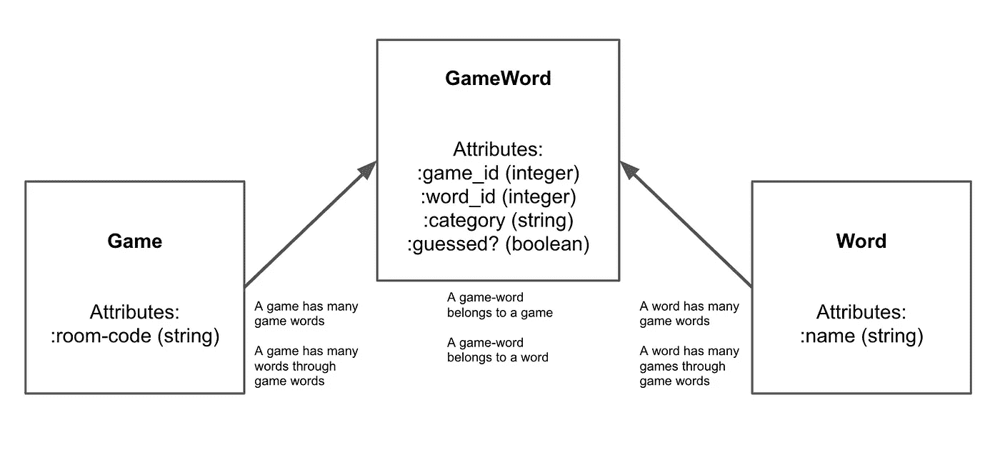
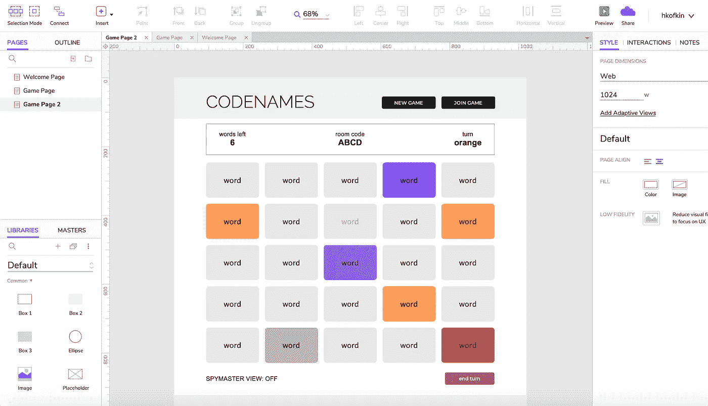

# 构建应用程序:准备工作

> 原文：<https://betterprogramming.pub/building-an-application-pre-work-eafb660fa55e>

## 从第一天开始改善组织和工作流程的 5 个步骤

由 [Unsplash](https://unsplash.com?utm_source=medium&utm_medium=referral) 上的[procylink 访客管理系统](https://unsplash.com/@proxyclick?utm_source=medium&utm_medium=referral)拍摄

构建一个应用程序可能极其复杂和耗时。你在开始你的项目时建立的工作流程将会是所有后续工作如何展开的基线。如果你开始时没有条理，不清楚，你的应用程序将会受到影响。花时间制定一个有组织的计划，并从一开始就设定里程碑，这将确保您的最终产品能够实现其全部潜力。

让我们浏览一些标准的前期工作检查点，您可以使用它们来开发构建应用程序的标准流程。下面是在你进入代码模式之前要采取的五个步骤。

# 1.轮廓特征

所需功能集的列表(使用 Trello 创建)。

当你确定了你的应用程序的概念，并准备开始打基础时，一个非常重要的第一步是决定你实际上想要你的应用程序做什么，以及你想要它如何运行。写下一个特性列表是整理和浓缩你的想法的好方法。有无穷无尽的可能性，所以从一开始就缩小你的关注点将会消除未来浪费的时间。

一旦你有了一个功能列表，仔细考虑你的 MVP(或[最小可行产品](https://en.wikipedia.org/wiki/Minimum_viable_product))是至关重要的。MVP 基本上是一种状态，在这种状态下，你的应用程序功能齐全，能够在市场上接受用户反馈的测试，但它忽略了一些“扩展”功能，一旦你知道你的应用程序已经步入正轨，就可以添加这些功能。达到 MVP 和在市场上测试是有用的，以确保您的资源不会浪费在一些不是必要的或不能正常工作的东西上。我用来开始概述特性和决定 MVP 的一个很好的工具是 Trello。

如果跳过这一步，你就有尝试执行太多想法或者尝试构建与你的用户故事无关的特性的风险。这不仅浪费了每个人的时间，而且增加了过程中的不明确性，只会导致沮丧。

## 要问自己的问题

*   我希望我的应用程序做什么？
*   与其他类似应用相比，我的应用有何独特之处？
*   我可以发布的最低可行产品是什么，以后还可以添加什么？

# 2.开发领域模型

领域模型(使用谷歌幻灯片创建)。

一旦概述了特性并确定了 MVP，明智的下一步是弄清楚如何组织数据库。使用您的要素作为指导绘制一个域模型将有助于可视化应用程序将如何保存和使用数据。

类似于如何创建一个大纲作为一篇文章的结构，在进入代码之前组织你的思考、研究和结构是有意义的。到时候搭建数据库和前端交互的时候，领域模型会作为你的参考。

如果跳过这一步，大量时间将用于编写和重写代码。在你写一行代码之前，所有高层次的细节都应该弄清楚。这种预先的组织允许你专注于如何执行想法和构建功能。

## 要问自己的问题

*   为了存储正确完整的特征数据，我需要哪些模型？
*   我将如何使用和访问这些数据？
*   各个数据表之间有什么关系？

# 3.三维线框模型

线框(使用 Axure 创建)。

利用步骤 1 和 2 中概述的信息，[应开发一个线框](https://en.wikipedia.org/wiki/Website_wireframe)来布置用户界面。构建这个框架为每个功能如何在页面上实现提供了一个蓝图——它放在哪里，数据如何显示给用户，以及交互将是什么。通常，会为应用程序中的每个页面视图构建一个线框。例如，Instagram 有一个主 feed、一个个人资料页面和一个通知页面。每一个视图都是经过精心设计的，重点是用户交互。

可视化你的应用程序将如何实现是非常重要的。如果你在没有计划的情况下建造了某样东西，却发现它不起作用，你就必须废弃它，重新开始。蓝图阶段允许您在任何问题出现之前解决它们，并准确地找出您想要显示的内容。我用过的一些很棒的线框工具有 [Figma](https://www.figma.com/) 、 [AWW App](https://awwapp.com/) 和 [Axure](https://www.axure.com/) 。

如果跳过这一步，就没有对您正在构建的内容的引用。如果你边走边设计 UI，那么你会花费大量的精力来调整页面上的元素，每次你发现有什么不对劲的地方，你都会花费大量的时间来重新构建代码。这也不是最佳实践。如果你开始时没有一个坚实的计划，这将在你的最终产品中表现出来。

## 要问自己的问题

*   我希望我的功能在应用程序中显示在哪里？
*   我希望用户如何与这些功能交互？
*   我正在访问哪些数据以显示在应用程序的每个部分中？

# 4.考虑边缘情况

在开始构建你的应用程序之前，考虑一下可能会出错的地方是个好主意。编程中的一个问题是，用户可能会滥用你的应用程序，或者误解某个功能的真正意图，所以最好考虑一下结果，并计划如何防止你的应用程序崩溃。

比如，你有登录页面吗？在那个登录页面上，您要求用户提供什么信息？您可以向模型添加哪些验证来确保他们输入的信息是正确和完整的？你对“正确完整”的定义是什么？

如果跳过这一步，您的应用程序可能会以一种容易被破解的方式构建。在你进行的过程中，边缘情况也会出现，所以你不一定要为每一个可能的问题做好计划，但是预测什么会出错会让你准备更快地找出解决方案。

## 要问自己的问题

*   如何通过 app 清晰地引导用户进入某种模式，保持互动有意义有目的？
*   用户如何“破坏”应用程序？换句话说，不正确地使用应用程序意味着什么？
*   如何防止用户破坏应用程序？

# 5.创建里程碑

准备工作阶段的最后一步是创建时间表。有一个详细的时间表有助于设定期望值，并估计每个特性的构建需要多长时间。几乎不可能知道确切的时间，但是朝着一个目标努力会设定一个意图，并有助于让事情走上正轨。

建立时间线的另一个好处是将一个大的、复杂的应用程序结构分解成更小的、可管理的部分。这个过程迫使您考虑构建元素的顺序，这将使您在构建功能时更加有意识。例如，在构建前端之前构建数据库是最有意义的。再次提到 Instagram，在建立关注者互动之前，访问用户数据非常重要。如果您没有首先建立一个适当的数据库，您将无法正确地建立该特征。

如果跳过这一步，会给项目增加大量的压力、挫折和时间。当看到完整的可交付成果时，感觉令人生畏。将它分解成易于管理的小块，不仅有助于保持压力水平，还能让你将每一块分成积木，这些积木将整合成最终产品。

## 要问自己的问题

*   我如何将所有的待办事项分解成小的、可执行的部分？
*   按照什么样的顺序构建每个特性是有意义的？一个特性依赖于另一个特性才能工作吗？
*   我的目标发布日期是什么时候？在这段时间内，什么是切实可行的？

# 结论

在开始构建之前，遵循上面详述的五个步骤对于建立一个有组织的、高效的工作流是至关重要的。编码是冗长而复杂的。花时间提前计划将在过程中节省时间和资源，并消除分散或无准备的额外压力。

为成功做好准备，并采取这些必要的步骤，尽可能最好地执行您的应用程序。