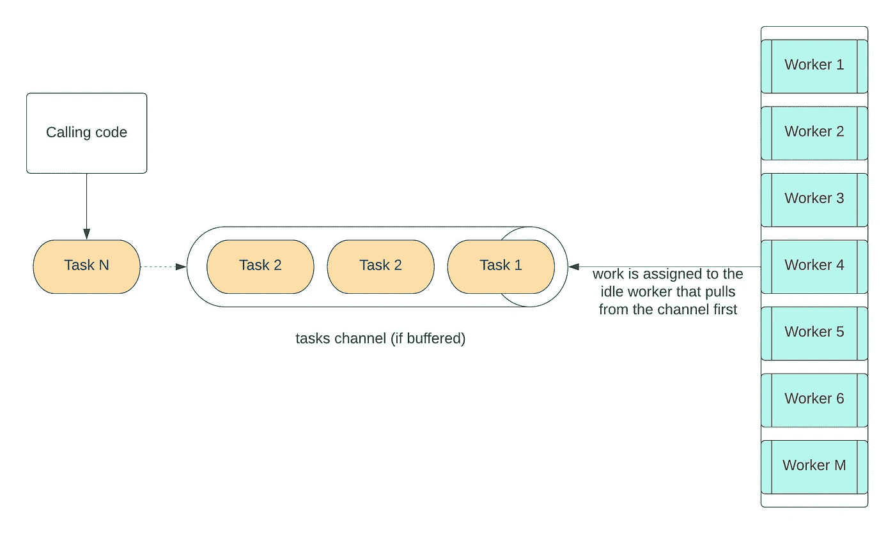

# 在 Go 中构建和测试工人池

> 原文：<https://betterprogramming.pub/building-and-testing-a-worker-pool-in-go-bce4c6da4431>

## 使用 Go 实现并发模式来处理任务

# 员工库基础

工作者池(也称为[线程池](https://en.wikipedia.org/wiki/Thread_pool))是一种软件设计模式，其中创建了一组工作者(“池”)来同时处理一个任务队列。

在一些语言中，每个工作者是一个线程(因此得名“线程池”)，但是在 Go 中，我们有[Go routines](https://go.dev/tour/concurrency/1)——由 Go 运行时管理的轻量级线程，支持并发编程。

有一个向工作人员交付任务的排队系统，以及工作人员获取任务的逻辑。通常，排队系统将是一个[通道](https://go.dev/tour/concurrency/2)，无所事事的工人将按照先到先得的原则接受任务。

## 优势

工人池模式有许多优点。首先是简单性和开发者体验。通过将并发工具放在 API 后面的包中，开发人员不需要考虑正确关闭通道、避免工作人员饥饿、发信号、同步等问题。他们只知道“我需要处理这些任务，这里有几个函数调用可以帮助我！”。

工作池对性能也很有用。通过使用一组定义好的工作人员(而不是为每项任务划分一个 goroutine)，我们可以限制我们要扇出的东西的数量。许多系统都有不同级别的瓶颈(无论是网络请求的数量、运行中的存储请求、系统其他部分的处理速度等)，工作池允许我们在应用可控背压的同时并发处理作业，以避免过度消耗资源。

此外，对于长时间运行的处理作业(比如，处理传入的 API 请求)，工人池避免了为每个作业创建新工人和拆除工人的开销。在 Go 中，由于 goroutines 很轻，所以这个过程的开销要小一些，但是一般来说，在使用资源时注意开销是有好处的。

## 调谐

工作池的大小应该根据特定的应用程序进行调整。需要考虑的事项有:

*   有多少任务进来了？
*   任务能多快进来？它们是突发性的，还是更稳定的？
*   我下面是什么？it 处理这些任务结果的速度有多快(如果适用)？
*   我愿意投入多少系统资源来处理这些任务？处理应该扩展到系统能够处理的最大限度，还是应该限制到系统的某个部分？
*   工人数量应该是动态的吗？(我们今天不会构建它)

通常，工程师对他们需要多少工作人员有一个合理的估计(在一个数量级内)，并且系统可以根据它在典型的集成测试、负载测试或真实世界中的表现进一步调整。通过合并度量或跟踪，工程师可以真正地关注工人池是否被过度分配或分配不足。也许我们可以在以后的文章中更深入地探讨这个问题。

# 设计我们的系统

今天我们将实现一个非常简单(并且可重用！)工人池。任务将被定义为一个接口(工作者池不需要关心它在处理什么，只需要知道如何处理)，空闲的工作者将在一个通道上等待额外的工作。我们还需要一种方法来创建、启动、停止工作，以及向工作池添加工作。我们也将为此创建一个接口。

下面您可以看到如何将工作发送到池中以及从池中提取工作的基本算法。

简单的工人池图。调用代码生成任务，这些任务被放在一个队列中(通道在 Go 中)。空闲的工作线程从这个队列中读取数据，并被分配给可用的工作。

我们将首先为我们的工人池定义接口，以及它可以处理的任务:

工作池实际上只需要提供一种启动和停止处理的方法，以及一种向队列添加工作的方法。

作业需要一种运行方式`Execute()`，以及一种处理作业导致的任何错误的方式`OnFailure()`。有了这个接口，我们给调用代码留下了很大的灵活性来定义发生了什么，而没有太多的规定性。

好了，现在我们需要实现一些满足`Pool`接口的东西。我们将通过下面的`SimplePool`来实现:

这里重要的是，工人池可以访问一个消耗工作的通道(`tasks`)，并在必要时提供一个停止工人的通道(`quit`)。一些深奥的细节包括跟踪池中有多少工人，以及使用一次[来确保池只能启动或停止一次。](https://pkg.go.dev/sync#Once)

我们将添加一个构造函数来通知调用代码，我们想知道池中有多少工作线程，以及缓冲通道的大小。它还将设置实施的一些内部细节:

请注意，我们已经定义了几个定制错误— `ErrNoWorkers`和`ErrNegativeChannelSize` —这是一种使测试更容易的技术(您可以在[项目的 repo](https://github.com/swayne275/go-work) 中的`workerpool/workerpool_test.go`中查看)。

启动和停止池通知工人从`tasks`通道开始或停止加工工作；

`AddWork()`提供了一个将`Task`添加到工人池的方法。对于这个实现，我们将在通道满时阻塞它。因此，当工人池停止时，我们使用一个`select`来释放任何被阻塞的`AddWork()` goroutines:

请注意，我们可以稍微调整一下，将其选择为非阻塞的，这是经销商的一种选择(甚至可以是接口的一个要求，以包括这两者！):

现在我们将实现`startWorkers`，它将创建并启动`numWorkers`工作器来读取`tasks`通道并处理任务:

通过使用一个`select`语句，一个空闲的工作者可以等待`tasks`通道上的新工作，或者来自`quit`通道的工作者池完成的信号。

如果它在`tasks`通道上得到一些东西，它将执行任何被定义为任务的`Execute()`函数的东西，一旦出错，它将调用任务的`OnFailure`函数来处理任何出错的东西。

一旦一个工作者完成了一个任务的处理，它将回到等待，直到有一个新的任务，或者直到工作者池被停止。

# 测试包

开发代码时，自动化测试是必不可少的，尤其是对于那些可能成为其他项目的依赖项的包。它们对开发过程也很有帮助！

它们允许有时间暂停和考虑接口和实现(作为测试过程的结果，我已经在这里做了一些改变)，并且它们可以帮助您在实现错误或接口低效成为问题之前很好地找到它们。

为此，我已经添加了`workerpool/workerpool_test.go`来运行一些应该使用的用例。

我们将从确保我们的构造函数工作开始:

在这里，我们主要测试构造函数是否捕捉到了错误输入的常见情况(例如，负的通道大小、0 个工作线程等)，并且当输入有效时，我们实际上获得了一个`Pool`。

接下来，我们将测试我们的`Start()`和`Stop()`实现在被多次调用时是否做了正确的事情:

接下来，我们希望确保工作线程池能够实际处理工作。为此，我们将创建一个满足我们的`Task`接口的测试实现，并通过`workerpool`运行其中的一些。

我们的`testTask`实现了`Execute()`和`OnFailure()`来满足`Task`接口，但是也增加了工具来测试返回错误的`Execute()`，确定我们是否命中失败案例，并且还通过 [WaitGroup](https://gobyexample.com/waitgroups) 通知调用代码任务已经被处理。

正如我们在这里看到的，有时当我们试图练习代码时，构建特定的测试基础设施是有意义的。因为工人池是在接口(而不是具体类型)上操作的，所以我们可以构建一个实现该接口的新东西，而不是试图用其他的产品代码来进行真正的攻击！

在这里，我们基本上确保我们可以创建一个工人池，向其中添加工作，并且工作将按照预期进行处理。`workerpool_test.go`包含一个类似的函数来验证错误处理逻辑，但是为了简洁起见，我们在这里将跳过它。

最后，让我们确保如果工作池被停止的话，在`AddWork`上等待的任何东西都将被释放(适当的资源管理很重要！):

这个测试创建了一个 worker 池和一组 goroutines 来向其中添加工作。任务多于通道容量，因此一些 goroutines 将被阻塞以等待任务完成。

当 goroutines 添加任务被解除阻塞时，它们通过调用第 18 行上的`Done()`发出信号。这意味着我们可以通过在等待组`wg`上等待来知道所有 goroutines 何时被解除阻塞。

然而，等待这个`waitgroup`将会阻塞，所以我们需要一个超时的方法。我们将启动一个 goroutine 来等待，直到所有添加任务的 go routine 都完成，然后在一个新的通道上发出信号，`done`。通过在这个通道上发信号，我们可以使用一个`select`来等待那个`done`信号。因为在失败的情况下，`done`永远不会发生，我们可能会永远等待(或者至少直到我们的测试超时)。

为了解决这个问题，我们可以使用一个`time.After`,它在指定的持续时间过后在一个通道上发送。这样，我们可以说*一直等到一秒钟过去，或者所有的 goroutines 都完成了*。在超时的情况下，我们会失败(因为在我们的工作线程池停止后，我们仍然有 goroutines 等待`AddWork`)。如果我们在`done`上收到一个信号，我们将知道阻塞的 goroutines 已经完成，并且工人池按预期工作。

# 提高

工作池的范围可以从简单(比这简单得多！)到难以置信的复杂。一些常见的增强功能包括:

*   添加指标来了解工作需要多长时间，工作人员有多少空闲时间，等等。
*   添加一个具有公平共享逻辑的作业管理器，以确保不同的*类型的*任务得到公平的处理，对于“公平”的一些定义。
*   添加更多日志记录。
*   特定于您的应用程序的任何附加逻辑。

*这其中的一些可以在我设计实现的一个 fairsharing worker pool 中看到* [*这里*](https://github.com/hashicorp/vault/tree/main/helper/fairshare) *解决最频繁的 Hashicorp Vault sev1！*

# 包扎

工作者池是您的并发工具带中的一个重要工具，现在我们对它们的工作原理有了一点了解。今天，我们设计并构建了一个相当简单(但可重复使用！)实现，并想出了如何测试它。我们已经考虑了调用代码可能如何使用它(例如，`AddWork()`不应该在池停止后阻塞)，并且我们已经留下了增强它的机会。

一如既往，我欢迎任何反馈，并希望这是有帮助的！