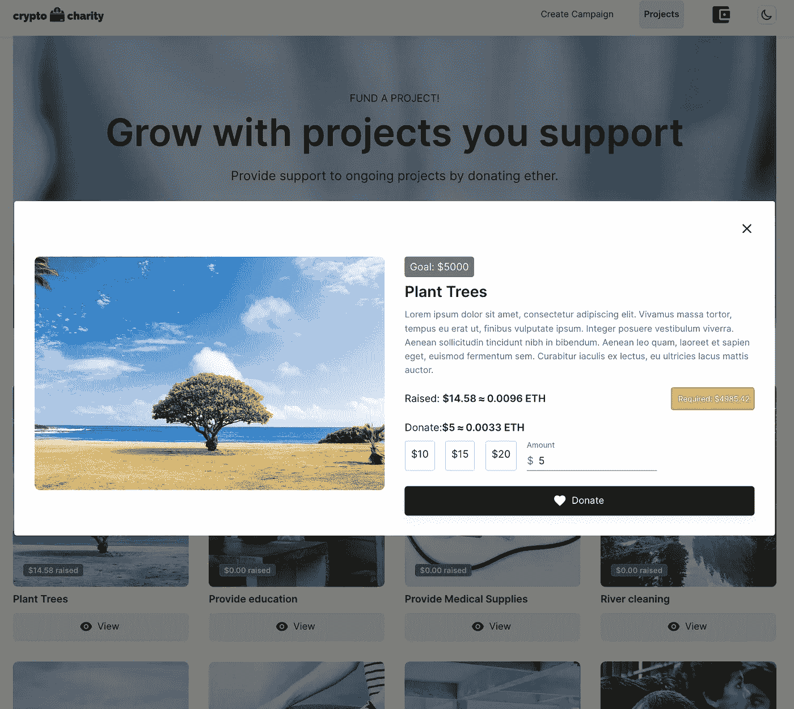

# 使用 Next.js、Solidity、IPFS 和 Truffle 为众筹建立加密慈善 dApp

> 原文：<https://betterprogramming.pub/building-crypto-charity-dapp-for-crowdfunding-using-next-js-solidity-ipfs-and-truffle-6a7d75d81ead>

## 建立一个筹款活动，在 MATIC 中捐款，生成收据，并提取金额


图片由 Freepik 上的[rawpixel.com](https://www.freepik.com/free-photo/crowdfunding-money-business-bulb-graphic-concept_18134060.htm#query=fundraising&position=17&from_view=search&track=sph)拍摄

让我们构建一个用于筹款的全栈 web3 应用程序。我们将使用 Next.js、material-UI、cryptocompare(用于 ETH-USD 转换)、truffle、web3modal 和 OpenZeppelin 契约来创建我们的 Web3 应用程序。

## 功能:

*   发起筹款活动
*   用户可以在 MATIC 中捐款
*   转换 ETH-USD 以避免捐赠错误
*   受益人可以提取捐赠的金额
*   捐赠者可以查看最后的捐赠并生成收据

我们需要做的第一件事是克隆模板:

```
git clone [https://github.com/ac12644/Crypto-Charity.git](https://github.com/ac12644/Crypto-Charity.git)
cd fundraiser
yarn
```

接下来，您需要为我们的合同创建新文件。首先，为我们的合同创建所有的空文件:

```
touch contracts/FundraiserFactory.sol
touch contracts/Fundraiser.sol
```

我们还需要安装`OpenZeppelin`,因为我们正在使用 Ownable 契约:

```
yarn add @openzeppelin/contracts
```

现在在`Fundraiser.sol` 文件中，从 OpenZeppelin 导入`Ownable`和`SafeMath`:

继续我们的`Fundraiser.sol`智能契约，让我们为捐赠定义一个结构:

Solidity 中的结构允许我们创建新的数据类型。这些数据类型将具有不同类型的属性。例如，我们可以使用下面的代码来生成一个`Donation`结构:

```
struct Donation {
  uint256 value;
  uint256 date;
}
```

映射允许您将键与值相关联。要声明映射，您需要指定键和值的类型，如下所示:

```
mapping(address => Donation[]) public _donations;
```

这种映射将地址与捐赠的动态数组相关联。如果我们想要访问个人捐赠者的捐赠，我们使用`[ ]`符号:

```
address donor = msg.sender;
_donations[donor];
```

我们现在将构造函数和状态变量添加到契约中。我们将保留收款人地址，以支付转账金额。地址将代表受益人和保管人。保管人的地址是与募捐者的经理相关联的地址。该地址不会收到任何资金，但将是允许进行更改和请求向受益人转移资金的地址。

如果被所有者之外的任何人调用，函数`setBeneficiary`将会失败。如果发件人是所有人，它将使用作为参数传入的地址更新受益人地址:

```
function setBeneficiary(address payable _beneficiary) 
  public onlyOwner { beneficiary = _beneficiary; }
```

我们现在将创建一个接受以太的`donate`函数。为此，我们需要在函数声明中添加 payable 修饰符。当我们将以太发送给一个合同或 EOA 时，它们的余额会自动增加——我们不需要添加任何代码来产生这种行为。

创建`myDonationsCount`函数，该函数将返回发出请求的捐赠者的捐赠计数。

```
function myDonationsCount() public view returns (uint256) { 
  return _donations[msg.sender].length;
}
```

应该创建`myDonations`函数，将捐赠者的捐赠返回给募捐者。不幸的是，由于当前 ABI 的限制，不可能从外部或公共函数返回结构数组。因此，我们将不得不利用多个返回值和数组。

接下来，定义撤销函数并使用`onlyOwner`修饰符来限制访问并发出`withdraw`事件。

```
event Withdraw(uint256 amount);function withdraw() public onlyOwner {
  uint256 balance = address(this).balance;
  beneficiary.transfer(balance);
  emit Withdraw(balance);
}
```

为了避免测试失败，我们必须包括一个可支付的回退功能。现在我们来补充一个:

```
fallback() external payable {
  totalDonations = totalDonations.add(msg.value);
  donationsCount++;
}
```

现在我们的筹款合同准备好了。完成后，它将看起来像这样:

# 筹款工厂

以前的`Fundraiser`合同充满了功能，但它不能用来创造任何东西。在这个契约中，我们将使用一个通用的设计模式来添加缺失的部分:工厂模式。

继续我们的`FundraiserFactory`契约，让我们在契约上设置一个新的状态变量来存储已经创建的筹资者。然后我们需要创建一个函数来检索集合的长度。

现在，我们从表单中获取所有参数，然后使用`createFundraiser`函数初始化一个新的募捐者，并发出一个事件，该事件将包括募捐者和所有者的地址:

我们需要一种向用户展示可用筹款人的方式。一种选择是检索在对我们的契约的单个调用中创建的所有筹资者，类似于我们对我们的`Fundraiser`契约中的`myDonations`函数所做的。当我们预计集合大小相对较小时，这种方法很好，但是如果我们的应用程序变得流行，我们将希望以更小的块加载这些数据。

尽管查看来自区块链的数据不需要任何成本(天然气)，但它仍然会使用 EVM 的资源。如果用户来到我们的应用程序，并立即看到他们想要的资金筹集者，我们会浪费很多资源。与等待单个请求返回所有项目相比，更小的块还可以使页面呈现得更快。

返回的集合大小将小于`fundraisersCount`或请求的限制:

现在我们的合同准备好了。完成后，它将看起来像这样:

通过运行以下命令在 Polygon Mumbai 上部署协定，在部署之前添加环境字段:

```
truffle deploy --network mumbai
```

## JavaScript 函数

在这一部分中，我们将在前端调用这些函数，以便您能够理解如何与部署的智能合约进行交互。

我们首先添加创建新的资金筹集者所需的函数。移至`src/views/Create/components/Form/Form.js`。

第一步是通过元掩码初始化 web3 身份验证。为此，我们使用 web3modal，然后我们连接我们部署的智能合同`FundraiserFactory`。

当我们上传图像时，我们需要创建一个 IPFS 客户端来上传文件，为此，我们使用 Infura 网关。你必须从 Infura 获得项目 id、密钥和专用子域网关。

表单中的最后一步是创建 submit 函数，该函数将在多边形网络上创建一个募捐者。

当你把它们放在一起时，看起来是这样的:


形式

既然我们可以生成一个新的筹款人，我们应该添加一个前端，以便筹款人出现在页面上，与其他任何筹款人一起创建。一旦我们有了显示募捐者的 UI，我们就可以使用一个模态，这样用户就可以点击特定的募捐者并进行捐赠。然而，我们应该从展示募捐者的名单开始。

移动到`src/views/Projects/Projects.js`。

现在我们已经从合同中收到了数据，我们将在前端向用户显示每张`Fundraiser`卡。我们需要做的第一件事是创建一个新组件来显示我们的`Card`组件:

移动到`src/blocks/FundraiserCard/FundraiserCard.js`。

现在，切换到`[Projects.js](https://github.com/ac12644/fundraiser_dapp/blob/master/client/src/Home.js)` [](https://github.com/ac12644/fundraiser_dapp/blob/master/client/src/Home.js)文件，我们将遍历筹款人列表并显示每个筹款人的`Card`组件:

# 收尾工作

## 添加每个募捐者的详细信息

复制以下代码，并将其添加到`Projects.js`:



筹款模式

关于 GitHub 回购，请访问[https://github.com/ac12644/Crypto-Charity.git](https://github.com/ac12644/Crypto-Charity.git)。

感谢阅读！

# 想要更多吗？

[](/supply-chain-smart-contract-design-e0ae5071bcbe) [## 设计供应链智能合约

### 简化农业供应链网络的运作

better 编程. pub](/supply-chain-smart-contract-design-e0ae5071bcbe)