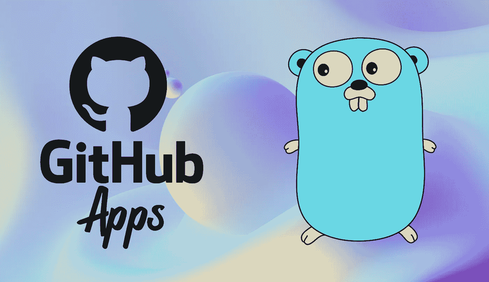

# 用 Golang 构建 GitHub 应用

> 原文：<https://betterprogramming.pub/building-github-apps-with-golang-43b27f3e9621>

## 在几分钟内启动并运行您的第一个 GitHub 应用程序，并使用它来自动化您在 GitHub 上做的所有事情



背景照片由[法库里安设计](https://unsplash.com/@fakurian?utm_source=unsplash&utm_medium=referral&utm_content=creditCopyText)在 [Unsplash](https://unsplash.com/?utm_source=unsplash&utm_medium=referral&utm_content=creditCopyText) 上拍摄。作者编辑

如果你选择使用 GitHub 作为你的版本控制系统，那么 GitHub 应用程序对很多任务都非常有用，包括构建 CI/CD、管理存储库、查询统计数据等等。

在本文中，我们将详细介绍在 Go 中构建这样一个应用的过程，包括设置 GitHub 集成、使用 GitHub 进行认证、监听 webhooks、查询 GitHub API 等等*。*

TL；DR:本文中使用的所有代码都可以在我的 [GitHub 资源库](https://github.com/MartinHeinz/go-github-app)中找到。

# 选择集成类型

在我们开始构建应用程序之前，我们首先需要决定我们想要使用哪种类型的集成。GitHub 提供了 3 个选项— *个人访问令牌*、 *GitHub 应用、*和 *OAuth 应用*。这三种方法各有利弊，所以下面是一些需要考虑的基本问题:

*   *个人访问令牌*是最简单的认证形式，适用于您只需要以*身份向 GitHub 认证*的情况。如果您需要代表其他用户，那么这还不够好。
*   *GitHub 应用*是开发 GitHub 集成的首选方式。它们可以由个人用户安装，也可以由整个组织安装。他们可以通过 webhooks 监听来自 GitHub 的事件，并在需要时访问 API。它们非常强大，但是即使您请求了所有可用的权限，您也无法使用它们来执行用户可以执行的所有操作。
*   OAuth Apps 使用 OAuth2 代表用户向 GitHub 认证。这意味着他们可以执行用户可以执行的任何操作。这似乎是最好的选择，但是权限不能提供与 GitHub 应用程序相同的粒度，而且由于 OAuth 的原因，设置起来也更加困难。

如果你不确定该选择什么，那么你也可以看看文档中的[图，这可能会帮助你做出决定。在本文中，我们将使用 GitHub App，因为它是一个非常通用的集成，是大多数用例的最佳选择。](https://docs.github.com/en/developers/apps/getting-started-with-apps/about-apps#determining-which-integration-to-build)

# 安装

在我们开始编写任何代码之前，我们需要创建和配置 GitHub 应用程序集成:

*   作为一个先决条件，我们需要一个隧道，我们将使用它来把 GitHub webhooks 从互联网传送到我们本地运行的应用程序。您需要安装带有`npm install -g localtunnel`的`localtunnel`工具，并开始使用`lt --port 8080`转发到您的本地主机。
*   接下来，我们需要去[https://github.com/settings/apps/new](https://github.com/settings/apps/new)配置集成。按如下方式填写字段:

*首页网址*:您的`localtunnel`网址

*网页挂钩网址* : `https://<LOCALTUNNEL_URL>/api/v1/github/payload`

Webhook 秘密:你想要的任何秘密(并保存它)

*存储库权限*:内容、元数据(只读)

*订阅事件*:推送、发布

*   创建应用程序后，您将看到集成的设置页面。记下*应用 ID* ，生成私钥并下载。
*   接下来，你还需要安装该应用程序，以便与你的 GitHub 帐户配合使用。转到*安装应用程序*选项卡，并将其安装到您的帐户中。
*   我们还需要`installation` *ID* ，我们可以通过转到*高级*选项卡并单击列表中的最新交付来找到它，记下请求有效负载中的安装 ID，它应该位于`{"installation": {"id": <...>}}`中。

如果你在某个地方迷路了，请参考指南 [GitHub 文档](https://docs.github.com/en/developers/apps/getting-started-with-apps/setting-up-your-development-environment-to-create-a-github-app)，它显示了你可以在哪里找到每个值。

完成后，我们就配置好了集成，并保存了所有重要的值。在我们开始接收事件和发出 API 请求之前，我们需要启动并运行 Go 服务器，所以让我们开始编码吧！

# 构建应用程序

为了构建 Go 应用程序，我们将使用我在[https://github.com/MartinHeinz/go-github-app](https://github.com/MartinHeinz/go-github-app)中准备的模板。这个应用程序已经可以作为 GitHub 应用程序使用了，它所缺少的，是我们在上一节的设置过程中保存的几个变量。该存储库包含一个方便的脚本，您可以使用它来填充所有值:

下面几节将带你浏览代码，但如果你是住院病人，那么这个应用程序是不错的。您可以使用`make build`构建应用程序的二进制文件，或者使用`make container`创建应用程序的容器化版本。

我们需要处理的代码的第一部分是认证。使用`ghinstallation`包完成，如下所示:

该函数在 *Gin* 服务器启动期间从`main.go`调用，获取应用 ID、安装 ID 和私钥来创建 GitHub 客户端，然后存储在`config.Config.GitHubClient`的全局配置中。稍后我们将使用这个客户端与 GitHub API 对话。

除了 GitHub 客户端，我们还需要设置服务器路由，以便能够接收有效负载:

首先是我们在 GitHub 集成设置中使用的`http://.../api/v1/github/payload`处的有效负载路径。该路径与`webhooks.ConsumeEvent`函数相关联，该函数将从 GitHub 接收所有事件。

出于安全原因，`webhooks.ConsumeEvent`函数做的第一件事是验证请求签名，以确保 GitHub 确实是生成事件的服务:

它通过使用 webhook secret 作为密钥计算有效负载的 HMAC 摘要来执行验证，然后将其与请求的`X-Hub-Signature-256`报头中的值进行比较。如果签名匹配，那么我们可以继续消费单个事件:

在上面的代码片段中，我们从`X-GitHub-Event`头中提取事件类型，并遍历我们的应用程序支持的事件列表。

在这种情况下，它们是:

如果事件名匹配其中一个选项，我们继续将 JSON 有效负载加载到一个`EventPayload`结构中，这个结构在`[cmd/app/webhook/models.go](https://github.com/MartinHeinz/go-github-app/blob/master/cmd/app/webhooks/models.go)`中定义。这只是一个使用[https://mholt.github.io/json-to-go/](https://mholt.github.io/json-to-go/)生成的结构，去掉了不必要的字段。

然后，该有效负载被发送到处理相应事件类型的函数，该函数为以下类型之一:

例如，对于*推送*事件，可以这样做:

在这种情况下——检查接收存储库和分支，并枚举这个单个推送中包含的提交。例如，您可以在这里将数据插入到数据库中，或者发送一些关于事件的通知。

现在我们已经准备好了代码，但是我们如何测试它呢？为此，我们将使用您已经运行的隧道，假设您遵循了前面几节中的步骤。

此外，我们还需要启动服务器，您可以通过运行`make container`来构建容器化的应用程序，然后运行`make run`来启动监听端口`8080`的容器。

现在，您可以简单地推送至您的一个存储库，您应该会在服务器日志中看到类似的输出:

为了避免总是将虚拟变更推送到存储库，您可以从 GitHub 应用程序配置中的高级选项卡重新交付有效负载。在该选项卡上，您会发现以前的请求列表，只需选择一个并点击*重新交付*按钮。

# 进行 API 调用

GitHub 应用以 webhooks 为中心，你可以订阅和收听，但你也可以使用任何 GitHub REST/GraphQL API 端点，假设你请求了必要的权限。

使用 API 而不是 push 事件非常有用，例如，在创建文件、分析批量数据或查询无法从 webhooks 接收的数据时。

为了演示如何做到这一点，我们将检索指定存储库的拉请求:

这个函数有两个参数——`owner`和`repo`——传递给 GitHub 客户端实例的`PullRequests.List(...)`函数。除此之外，我们还提供了`PullRequestListOptions` struct 来指定我们只对状态设置为`open`的 pull 请求感兴趣。然后，我们迭代返回的 PRs，并累积我们在响应中返回的所有标题。

上述函数驻留在`main.go`中指定的`.../api/v1/github/pullrequests/:owner/:repo`路径上，因此我们可以像这样查询它:

在我们希望返回大量数据的情况下，如上所示查询 API 可能并不理想。在这些情况下，我们可以利用*分页*来避免达到速率限制。

在`[cmd/app/apis/github.go](https://github.com/MartinHeinz/go-github-app/blob/master/cmd/app/apis/github.go)`中可以找到一个名为`GetPullRequestsPaginated`的函数，它执行与`GetPullRequests`相同的任务，并增加了用于指定页面大小的`page`参数。

# 写作测试

到目前为止，我们一直在用`localtunnel`测试该应用，这对于针对实时 API 的快速特别测试来说很好，但它不能取代适当的单元测试。要为这个应用程序编写单元测试，我们需要模拟 API 以避免依赖外部服务。为此，我们可以使用`[go-github-mock](https://github.com/migueleliasweb/go-github-mock)`:

这个测试从定义一个模拟客户端开始，它将被用来代替一个普通的 GitHub 客户端。我们给它一个拉请求列表，当调用`PullRequests.List`时将返回这些请求。然后，我们创建测试上下文，其中包含我们想要传递给被测函数的参数，然后我们调用该函数。最后，我们读取响应体并断言只返回了具有`open`状态的 PRs。

有关更多测试，请参见完整的[源代码](https://github.com/MartinHeinz/go-github-app/blob/master/cmd/app/apis/github_test.go)，其中包括分页测试以及来自 GitHub API 的错误处理的示例。

当测试我们的 webhook 方法时，我们不需要使用模拟客户端，因为我们正在处理基本的 API 请求。此类测试的例子包括通用 API 测试设置可以在`[cmd/app/webhooks/github_test.go](https://github.com/MartinHeinz/go-github-app/blob/master/cmd/app/webhooks/webhook_test.go)`中找到。

# 结论

在本文中，我试图让您快速浏览一下这两个 GitHub 应用程序，以及包含示例 Go GitHub 项目的 [GitHub 库](https://github.com/MartinHeinz/go-github-app/)。

在这两种情况下，我没有涵盖所有内容，Go client 包提供了更多功能，要查看您可以使用它执行的所有操作，我建议浏览一下[文档索引](https://pkg.go.dev/github.com/google/go-github/v41/github#pkg-index)以及查看源代码本身，其中列出了 GitHub API 链接和每个函数。比如像前面展示的`PullRequests.List` [这里的](https://github.com/google/go-github/blob/master/github/pulls.go#L147)。

至于存储库，您可能还想看看更多的东西，包括 Makefile 目标、 [CI/CD](https://github.com/MartinHeinz/go-github-app/tree/master/.github/workflows) 或额外的测试。如果您有任何反馈或建议，请随意创建一个问题，或者只要对您有帮助就开始讨论。

[](https://towardsdatascience.com/all-the-things-you-can-do-with-github-api-and-python-f01790fca131) [## 你可以用 GitHub API 和 Python 做的所有事情

### GitHub REST API 允许您管理问题、分支、回购、提交等等，所以让我们看看您如何使用…

towardsdatascience.com](https://towardsdatascience.com/all-the-things-you-can-do-with-github-api-and-python-f01790fca131) 

```
**Want to Connect?**This article was originally posted at [martinheinz.dev](https://martinheinz.dev/blog/65?utm_source=medium&utm_medium=referral&utm_campaign=blog_post_65).
```