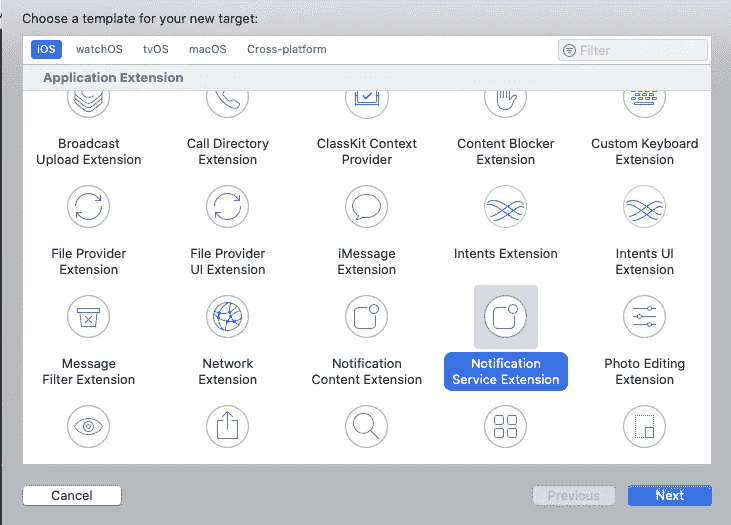
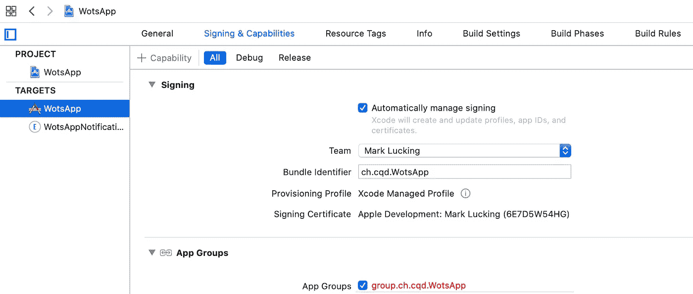

# 构建自己的 WotsApp——第 2 部分

> 原文：<https://betterprogramming.pub/building-your-own-wotsapp-part-2-5bdfc91cb624>

## 使用 SwiftUI、Combine、通知、CloudKit 和加密技术


Photo by [贝莉儿 DANIST](https://unsplash.com/@danist07?utm_source=medium&utm_medium=referral) on [Unsplash](https://unsplash.com?utm_source=medium&utm_medium=referral).

我应该以免责声明开始这篇文章:它是基于 iOS 13、Swift 5 和 Xcode 11.x 的。如果你正在阅读这篇文章，而这些数字看起来已经过时，请预先警告。

我还应该提醒你，通知——主要是远程通知——涉及苹果的基础设施，这意味着你需要一个苹果开发者账户才能使用它们。当然，你也需要一个来使用 CloudKit。

这是正在进行的系列的第 2 部分。显然，你需要[阅读第一部分](https://medium.com/better-programming/build-your-own-wotsapp-part-1-1275abba645f)，否则你会很快迷路。

在第一部分中，我创建了一个名为 WotsApp 的消息应用程序。我描述了如何设置和发送本地和远程通知。在这一部分，我们将浏览一个全面的加密代码列表，最重要的是一些在现实应用中实现它们的技巧和诀窍。

奇怪的是，像生活中的许多事情一样，密码学主要有两种类型:对称和非对称。第一种类型有时也称为共享密钥。第二种类型，我相信您会很熟悉，是公钥/私钥加密。我将在我们的应用程序中使用这两种方法，但现在，让我们从最难的——不对称开始。

# 第三章

在您的项目中创建一个新文件，并将其命名为`Crypto`。在其中，添加此方法:

这段代码为您生成两个密钥:一个私钥和一个公钥。这个想法是用你的私钥来加密你的消息，并询问你的同伴你要把它发送给谁，然后用你的公钥来解密它。听起来很简单。我们需要两种方法来使用我们的新密钥。将此内容也添加到课程中:

这里您可能注意到的唯一小缺点是加密方法都返回数据。这在内部是很棒的，但是它不是你可以很容易地在一条消息中发送的东西。消息需要是文本。下面是做同样事情的更多代码，只是它读取和写入字符串:

好了，我们准备测试了。让我们编辑 SwiftUI 接口，这样我们就可以尝试新代码了。更改这两个按钮，使它们调用我们的`encrypt`和`decrypt`函数，并在中间添加一个文本字段，用于输入加密例程的一些文本:

你准备好逃跑了。编译一下，试一试。是的，如果你试图加密一个空字符串，它会崩溃，但是…好吧，那将是愚蠢的。

在确信它可以工作之后，我们需要在不同的设备之间交换我们的密钥。你回忆一下，你得到 Jude 的公钥，用它加密你的消息，发送过去，然后她会用她的私钥解密。这就是我们的云代码发挥作用的地方，尽管还没有。让我们一步一步来。首先，导出密钥的更多代码:

这会将公钥和/或私钥作为数据导出。哦兄弟，又是数据。当然，在出口它们之后，你需要进口它们的方法。这里有一些例程可以做到这一点:

做完这些之后，我们需要做一些可以出口的东西。所以这里有更多的加密代码来将我们的数据转换成字符串，或者反过来:

我希望你能跟上。终于，又到了考验的时候了。编辑`ContentView.swift`并尝试将公钥和私钥作为字符串导出然后重新导入(显然是在您创建它们之后)。应该能行。你需要编辑`ContentView.swift`。它应该是这样的:

到目前为止，一切都很顺利。

# 第四章

让我们休息一下。光看这个密码术代码就让我头疼。

回到通知。在第一章中，我们提到了三种类型:提醒、徽章和声音。但这并不是 iOS 13 的全貌。你还有第二个家族叫做背景通知。您可以在后台发送提醒、包含自定义信息的提醒以及不显示为提醒的提醒。我们在这里有相同的波长吗？让我们做一些代码。

编辑`RemoteNotification`类并将`JSON`对象重新编码到一个数组中，这样我们就可以有多种风格——在前台发送警报的通知，在后台运行的通知，以及根本不出现的通知。您需要将代码中对`JSON`对象的引用也改为代码块本身中的`jsonObjects[jsonID]`。在`appDelegate`中创建一个全局令牌，并在你使用它的时候引用它。以后会派上用场的。

转到你的`contentView.swift`并改变它以反映新的结构。把加密/解密的按钮留在那里，只需要多加几个——一个在顶部发布前台通知，一个在底部发布后台通知。确保您更改了`apns-push-type`，以便它从参数中获得提示:

好了，你可以开始尝试了。编译并运行。试试你的两个新纽扣。第一个应该给你一个警告，第二个……第二个什么都不会做——或者至少看起来是这样。抱歉，是真的。我们需要更多的代码。回到你的`appDelegate`，添加这个小宝石:

现在，您已经准备好尝试它了。发布到后台时，请注意观察控制台。您应该会看到一些输出。我们可以用它在后台交换公钥。工作流看起来像这样:

*   我在后台给你发消息，问我们是否可以谈谈。我包括我的公钥。
*   您回复确认我们可以，发回您的公钥(显然也在后台)。
*   然后，我使用您的公钥加密我的消息并发送出去。你可以用我的密钥加密你的回复。

让我们回到我们的代码。让我们从我们的`RemoteNotification`类开始，向它添加这个方法:

完成后，我们需要将新方法添加到前台 post 按钮下的`ContentView.swift`中:

试试看。给自己发个信息。请尝试加密并再次发送。

你发现问题了吗？

你不会错过的。如果你加密了你的信息，然后把它发送出去，你得到的是加密的信息，没有机会解密。不是很有用，真的。幸运的是，我们可以通过在通知框架中使用服务扩展来解决这个问题。使用它的第一步是转到文件，新建目标，并添加通知服务扩展。



添加后，激活它。


添加之后，您需要对您要发送的 JSON 警报代码做一点小小的修改。JSON 有时不容易做对，所以我将在这里包含一个例子。您需要注意的一个重要障碍是:字典项`mutable-content:1`必须在那里，服务扩展才能启动。

完成更改后，尝试再次运行它。给自己发个信息。您将再次看到您的邮件，只是这次它修改了标题，添加了单词“excrypted”。

现在已经向您的项目添加了一个服务扩展，您应该会看到一个新的组，其名称与您在浏览器中提供的名称相同。

但是等等，外面有一场混乱等着抓我们。感谢扩展在它们自己的环境中运行，这意味着默认情况下它们就像小兄弟一样:它们拒绝共享任何东西。我们需要实现更多的代码来实现这一点。我们需要实现应用程序组。

单击主二进制文件的目标，并添加“应用程序组”作为一项功能。对刚刚添加的扩展的目标执行相同的操作。显然，您需要使用相同的组名。快速记下您使用的确切语法，因为您会需要它。



然后将这段代码添加到主应用程序的 Crypto `generateKeyPair`方法中，将私钥保存到一个公共的默认区域，以便以后访问。请注意，上图中红色的应用程序组名称与我在代码中使用的名称完全相同。

```
let localK = getPrivateKey64() as Any
let defaults = UserDefaults.init(suiteName: "group.ch.cqd.WotsApp")
defaults?.set(localK, forKey: "privateK")
```

将这段代码添加到`NotificationService.swift`文件中。您还需要添加我们正在添加的代码块中调用的函数。您可以将它们从`Crypto.swift`文件中复制出来，并粘贴到下面的`Notifications`类中:

好了，你可以再次跑步了。试一试。你应该能够写一个消息，加密它，发布它，并得到一个未加密的回复。

# 结论

但是等等，我们是不是一路上都丢了剧情？那个对话和背景帖子怎么了？恐怕我们这一章的篇幅已经用完了。请继续阅读。