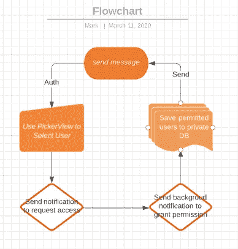
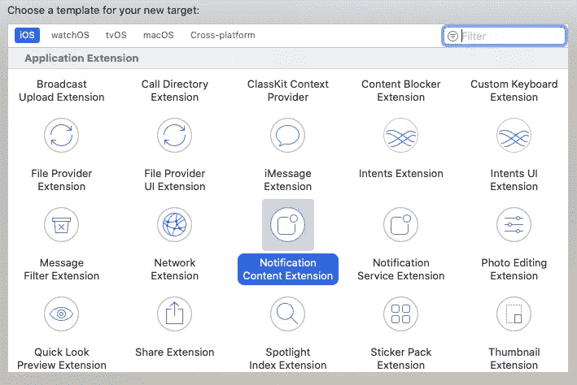

# 构建您自己的 WotsApp —第 4 部分

> 原文：<https://betterprogramming.pub/building-your-own-wotsapp-part-4-59dd7351eb2c>

## 使用 SwiftUI、Combine、通知、CloudKit 和加密技术


由 [Ricardo Gomez Angel](https://unsplash.com/@ripato?utm_source=medium&utm_medium=referral) 在 [Unsplash](https://unsplash.com?utm_source=medium&utm_medium=referral) 上拍摄的照片。

我应该以免责声明开始这篇文章:它是基于 iOS 13、Swift 5 和 Xcode 11.x 的。如果你正在阅读这篇文章，而那些数字看起来过时了，请预先警告。

我还应该提醒你，通知——主要是远程通知——涉及苹果的基础设施，这意味着你需要一个苹果开发者账户才能使用它们。当然，你也需要一个来使用 CloudKit。

最后，这是一个系列。你不会在 20 分钟内建立自己的 WotsApp。至少要十章。

# **第七章**

我们就快到了…只是我们没有。我们通过参与的概念验证开发了大部分代码。我们现在只需要把它拼凑起来。也就是说，我能想到的还有一个新的主要部分要做，所以不要固步自封。我们将在第 8 章讨论新的内容。

让我们从编辑我们的加密文件开始。在其中，我们将公钥/私钥对保存到服务扩展和应用程序之间的共享内存区域。我们可能需要刷新保存，所以让我们将这些行单独放在一个方法中。不要忘记从生成的密钥对中调用您的新方法。

```
func savePrivateKey() {
let localK = getPrivateKey64() as Any
let defaults = UserDefaults.init(suiteName: "group.ch.cqd.WotsApp")
defaults?.set(localK, forKey: "privateK")
}
```

此时所有其他的变化都在`ContentView.swift`中。我们需要一些新的`State`变量:

```
@State var sendTo = ""
@State var address = ""
@State var publicK:Data!
@State var privateK:Data!
```

现在，当我们启动应用程序时，假设有人已经声称拥有所有权并在云中注册了一个帐户，我们需要在 crypto 包中注册我们下载的公钥/私钥。严格地说，我们应该在这一点上下载私有目录，但是我们还没有到那一步，所以让我们也下载公共目录。以下是要采取的措施的摘录:

我在这里也对新的用户路径做了一些小的改动。我将公钥/私钥路径的提取变得更加明确:

然后，我回顾了我们在前面一章中编写的关于消息传递字段的代码，并在其中添加了一条警告消息，以及所需的密钥和加密代码:

最后，我向拾音器轮添加了一些额外的代码，您可以用它来选择向谁发送消息。它设置了将消息传递给接收者所需的变量。

现在你知道了:我们准备好了另一个测试。它还不是最有价值球员，但是我们正在接近它。用两台设备对此进行测试。和他们两个声明各自的主人，试着给对方发个信息。它应该在你这边加密，在他们那边解密。

一切都好。

好了，现在这里有一个很大的假设，即每个设备都有一个所有者。这在很大程度上是对的，但是你很容易找到例外——尤其是在家庭或学校里。我们如何解决这个问题？

回过头来看，当我们在前面的代码中搜索私有记录时，我们走了一条捷径。在其中，我们只返回找到的第一个结果。让我们在 ContentView 中为找到多个用户的情况创建一个不同的路径。然而，在我们这样做之前，我们需要对我们的`Storage`类做一些修改。我们需要另一个私人`PassThoughSubject`。这一个将通过所有找到的所有者的数组:

```
let searchPri2Publisher = PassthroughSubject<[rex]?, Never>()
```

我们还需要修改`searchPrivate`方法背后的代码。首先，让我们把`CKRecord`的编码放到一个单独的方法中:

然后，我们将重组私人搜索如何处理为一个设备找到多个所有者的情况。我将包含整个函数来帮助您理解:

注意，我们在代码的后半部分使用了新的`passThroughSubject`。继续我们的`ContentView.swift`，我们还需要两个`State`变量:

```
@State var display3 = false
@State var selected2 = 0
```

我们在新案例的代码中构建了一个新的分支(多个所有者):

现在登录 CloudKit 仪表板，剪切并粘贴两个用户之一的令牌值，并将其粘贴到另一个用户中。这有效地创建了共享单个设备的两个用户。

运行不再注册的设备并添加第三个用户。现在在两台设备上运行应用程序。双用户的 WotsApp 应该会返回一个菜单，询问你哪个用户正在使用这个设备。选择一个并尝试向另一个设备上的第三个用户发送消息。应该能行。使用双重用户重新运行应用程序，选择另一个用户，并尝试以他们的身份发送消息。那应该也可以。

现在做了所有这些，还有一个小问题要解决。显然，用户不能自己编辑 CloudKit 数据库。我们需要为他们设计一种方法。

# 第八章

但是等等，让我们暂时把双设备的问题放在一边。我们有一个更重要的障碍要解决。现在，每个安装这款应用的人都在看一个中央公共目录，每个人都可以向任何人发送消息。这并不理想。我们需要使整个事情更有选择性。是时候实施这些后台通知了。下面是一张草图，展示了我们希望实施的内容:



我们需要做的是设置一个协议，通过通知向新用户发送消息来请求许可。如果你通过输入他们的密码来确认你认识这个人，那么你就被授权了。让我们实现一些稍微容易上手的东西。我们将跳过关于秘密的问题，只做一些提醒。

以下是需要进行的对话:

*   我选择一个用户，然后发送一个带有按钮的通知，询问他们是否可以说话。
*   他们从三个选项中选择一个(“接受”、“稍后”或“拒绝”)，然后给我发一个后台通知，最终触发这个问题。

我们先把它当成一个警告。如果他们说“稍后”或“拒绝”，我们将禁用消息字段。

要做到这一点，我们需要做一些更大的改变。嗯，激烈到足以保证一个警告，你应该在开始之前备份你的工作副本。没有什么比在试图增强应用程序的同时破坏它更让人心烦的了。

首先，我们需要安装另一个通知扩展。转到文件并添加一个新目标。您想要添加内容扩展:



将其命名为 WotsAppContentExtension，并像以前一样激活它。


但是等等，我们还没准备好编码。我们需要为我们的项目添加另一项功能。

单击代表您的项目的蓝色图标，并移动到 Capabilities 选项卡。查看背景模式。您应该已经有远程通知了。点击后台提取的方框。


现在转到浏览器，编辑`NotificationViewController.swift`文件。只需更改代码，让标签询问问题:

```
func didReceive(_ notification: UNNotification) {self.label?.text = "Can we talk"
}
```

仍然在同一个组中，点击其中的`info.plist`，并修改其中的`NSExtensions`的代码，使其看起来像这样。我们添加了一个新的键，并指出该扩展应该针对哪些类别:

现在做一些其他的改变来使一切就位。切换到`RemoteNotifications.swift`文件，添加一些新类型的消息:

我们在代码中有三个选项:第一个是授予访问权限(我们需要再次讨论)，第二个是推迟访问，第三个是拒绝访问。

请原谅，这里发生了很多事情。现在转到`storage.swift`文件，添加这两个新方法:

第一个在私人数据库中查找个人，并检查他们是否为您所知。如果是，那么一切都很好，它会启动一个快捷协议，直接发送消息。如果他们从未授权，那么它会发送一个通知警报，请求授权。这将触发您刚刚安装的内容扩展，带有标记在警报上的三个选项。

最后，我们需要在`appDelegate.swift`中添加一些代码，以便在两个地方捕捉我们的新协议:

上面的代码在接收到初始请求的设备上执行。因此，您收到请求连接的消息，必须选择“接受”、“稍后”或“拒绝”

这段代码在发出初始请求的设备上执行。所以它会在没有通知的情况下安静地运行。在其中，我们将在应用程序本身中直接在请求设备上发布警报。

这让我回到 SwiftUI，我会在这里包括它，但我们又一次没有时间了。您需要阅读下一期文章，以获取 SwiftUI 更改的代码。