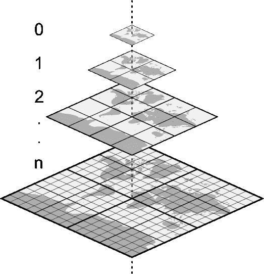
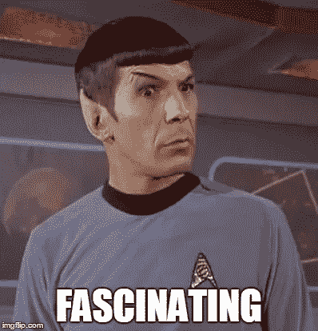

# 我们能不能不要乱丢 GIS 协议了？

> 原文：<https://betterprogramming.pub/can-we-please-stop-littering-gis-protocols-31f8110807da>

## *使用 XYZ 进行光栅渲染*

由[多鲁克·耶梅尼斯](https://unsplash.com/@dorukyemenici?utm_source=medium&utm_medium=referral)在 [Unsplash](https://unsplash.com?utm_source=medium&utm_medium=referral) 上拍摄的照片

您是否尝试过在客户端软件或正在开发的应用程序中使用一些 GIS 数据？

我几乎会说:“我希望不会……”

因为如果您曾经这样做过，您可能会很快陷入一个定义松散的协议的 GIS 动物园中，由于某种原因，这些协议似乎无法在您当前使用的特定工具中工作。

可悲的是，这往往导致人们避免一起使用空间数据(也许你就是其中之一)，甚至更糟…添加他们自己的“改进”协议来解决他们的问题，这导致在已经拥挤的 GIS 动物园中出现更多奇异的标本。(当你读到这里的时候，你最好不要再开发另一个协议了…说真的，打住)。

在我看来，GIS 社区正在搬起石头砸自己的脚，因为它已经引入了种类繁多，甚至越来越多的协议。在努力使空间数据为更广泛的受众所访问的过程中，GIS 专业人员似乎真的是他们自己最大的敌人。

# 我这么说是因为我在乎

本文的目的是说明，就栅格数据而言，传统的 XYZ(TMS)协议简单而有效，我们没有理由一开始就抛弃其他协议。

所以，我要做一个声明，这个声明可能会让一些人不高兴，但是我必须说:

> XYZ 协议是光栅渲染的最佳协议。没有充分的理由使用 WMS、WCS、ArcGIS image server、云优化地理信息系统或其他更奇特的选项。

事实上，这些替代协议设计得很差，而且有害，因为它们在一个已经被许多人认为“太复杂”的领域创造了不必要的多样性(他们也没有错)。所以也许，我应该这样说:

> WMS、WCS、ArcGIS image server 和云优化 GeoTiff 损害了 GIS 领域。

大胆的声明。我知道。我欠你，这篇文章的尊敬的读者，一个更详细的论点，我将提供进一步的。

我认为，解决这些有害协议的办法是，不要试图改进它们或添加新的协议(这很可能会使事情变得更糟)。相反，让我们回到最基本的协议，它从一开始就没有真正的问题。

> 最好的方法是回到简单的 XYZ 协议，而不是添加“更好”的新协议或“改进”现有的协议。这只会让情况变得更糟。

这里有个好消息！几乎所有的客户都支持 XYZ；世界上最受欢迎的图层(开放街道地图)位于 XYZ(仅 XYZ)。所以我们不需要添加任何新的东西。我们必须去掉多余的重量。

在解释为什么其他光栅渲染协议与 XYZ 相比提供很少或没有价值之前，让我们先来谈谈 XYZ 到底是什么。

照例一图胜千言。《XYZ 议定书》将世界划分为一个瓦片金字塔。

解释 XYZ 协议的金字塔

这些切片中的每一个都是 256 x 256 像素的光栅。金字塔中的某一层被称为缩放级别。缩放级别较低的单幅图块是其下方四个单幅图块的向下采样。

如果客户端希望检索一些栅格数据，他们会计算需要哪些切片，并向服务器请求这些切片。然后，客户将瓷砖缝合在一起，以交付视图。

《XYZ 议定书》有几个自由度:

1.最高缩放级别可以不同。根据数据集的分辨率，这可以更高或更低。

2.投影可以不同。大多数地图都是相对于 web 墨卡托投影平铺显示的，但在极少数情况下，其他投影可能更有意义。

3.返回格式可以不同。您可以返回 PNG、JPEG、TIF 或任何其他格式。

依我拙见，XYZ 的优势在于以下几点:

1.很简单。协议中只有一个事务:“获取图块。”它只需要传递三个整数。

2.它允许缓存。图块是预定义的，因此可以预先计算。流行的图块可以被复制和缓存。

3.它可以伸缩。查找正确的切片是 log(N)高效的，因此无论数据集的大小如何，该协议都能保证执行。

正如我将在下一节中解释的那样，其他竞争者都不具备标准协议应该具备的这三个关键优势。

# XYZ 很容易创造

最常听到的反对 XYZ 的理由是它很难被创造出来。但这不是真的。[在这里](https://medium.com/@daniel_819/a-web-map-in-10-lines-of-code-with-streamlit-ellipsis-and-folium-6e41f7407d68)我解释了如何使用[省略号驱动](https://ellipsis-drive.com)在不需要服务器的情况下，在一分钟内免费创建任何光栅文件的 XYZ。还有对 XYZ 精心设计的开源支持；就拿[地理服务器](https://geoserver.org/)来说吧。

# WMS 的问题(各位，请安静)

WMS 可能是 XYZ 最著名的替代者。它是一种协议，由获取 WMS 元数据的请求和特定坐标边界框的图像组成。

WMS 最重要的问题是它不能被缓存。如果你问我，这实际上已经使它失去了作为一个好的通用地图渲染协议的资格。

此协议不能被缓存的原因是因为您通过请求某个边界框来检索图像文件。听起来很好也很容易，但是不可能有好的缓存，因为你可以选择任何边界。如果你将屏幕向右移动 1 厘米(或 1 英寸)，你需要提出一个完全不同的请求。而使用 XYZ 协议，您只需检索一两个额外的图块。

这意味着 1)在视窗中的每个小的变化之后，客户机需要再次检索整个区域，以及 2)服务器不能缓存对请求的响应。两个都很糟糕。

WMS 的另一个问题是它在元数据上混乱了。好的 web 协议应该尽可能简单，理想情况下将元数据协商保持在最低限度。

WMS 相当臃肿。例如，它是层的集合，而不仅仅是一个层。更糟糕的是，您实际上可以将这些层嵌套成组。听起来这是一个不错的特性，但实际上并不是。渲染协议应该尽可能简单。使其成为(可能嵌套的)层的集合增加了不必要的复杂性，并且是任意的。为什么是收藏？为什么不是成熟的文件夹结构？或者更复杂的数据结构？沙子里的线在哪里？

因为 WMS 积极促进膨胀，可预见的事情发生了(关于墨菲定律)。有许多可选或半可选的值。我们现在的情况是，在某个客户中工作的 WMS，绝不保证在另一个客户中也能工作。这些定义变得过于宽泛。我们将该协议称为“WMS”，但实际上有多种风格。我自己也见过相当多的 web 服务，它们都标榜为 WMS，但结构却完全不同。

更糟糕的是，WMS 没有完全定义 XYZ 留下的三个自由度。在许多投影中，轴的顺序或到 WGS84 的精确变换尚未完全定义。这意味着我们增加了复杂性，并没有真正解决我们刚有 XYZ 时开始的问题。

# WCS 的问题(阅读时一定要补充水分)

现在，如果我们不想将可视数据呈现为 PNG，而是想将原始数据呈现为 t if，该怎么办呢？

我们可以用 XYZ 和 WMS 来翻译 TIF，而不是巴布亚新几内亚。是的，的确，我们可以！

但是…我们为什么要这样做？当我们还可以添加另一个全新的，异国情调的，不必要的协议！(*沉重的叹息*)

WCS 是用来渲染原始数据而不是图像数据的。它类似于 WMS，客户端使用边界框请求数据——再次扼杀了从一开始就进行缓存的希望——但是它使元数据的情况变得更糟。它包含一个额外的元数据请求。您可以请求整个 WCS 的元数据，然后继续请求其中每个图层的元数据。

为什么它必须是三级火箭对我来说是个谜。也许 WMS 的两级火箭不够容易出错。我想生活应该是一种挑战。

尽管向客户端发送了大量元数据，但我注意到许多客户端(如 QGIS)实际上最终使用了服务器发送的 TIF 中包含的元数据。使情况变得更加荒谬。

# ArcGIS Imager 服务器(这将很快完成)

对所有问的人说:

> "我们能不能把 WMS 和 WCS 的所有问题都拿出来，但这次是专有问题？"

ESRI 说:

> “绝对的！''

我:

# 云优化的 GeoTiff(如果你还在的话)

这是一个相对较新的孩子。在良好的 GIS 传统中，它设法比它的前辈更黑客。

[云优化 Geotiff](https://ellipsis-drive.com/blog/what-is-a-geotiff-and-what-are-geotiff-files/) 集文件和协议于一身。云优化的 GeoTiff 具有缩放级别和一些结构，允许您轻松地(就像 GIS 中的“轻松”一样)读取文件的只读部分。这允许您创建到远程文件的连接，并流式传输它，而不是整体下载它。

如果你喜欢目前正在阅读的内容，我问你:你听说过云优化的文本文档吗？

你没有。因为这个概念，总的来说，是一个非常糟糕的想法。

首先，云优化的 GeoTiff 集协议和文件于一身的事实是不合适的。我们也不允许应用程序直接读取我们的数据库。这两者之间应该有一个 API…一个没有 API 的解决方案只是缺乏真正协议所需的灵活性和可伸缩性。

除此之外，协议和实际文件存储的不正常的 lovechild 会导致奇怪的问题。如果我有 JPEG2000 文件，而不是云优化的 GeoTIFFs，会怎么样？我应该把他们都改变吗？或者我应该升另一个协议称为云优化 JPEG2000？协议应该告诉我如何向客户端呈现数据，而不是规定我的存储方法。即使我想，如果我的数据很大怎么办？假设我拥有一个覆盖全球的数据层；我不能把它放在一个大文件里。

由于这些原因，云优化的 GeoTiff 完全不适合作为将栅格数据渲染到 web 的通用方式。因此，它向已经存在的、不必要的和复杂的协议海洋中添加了另一个协议。

图像数据提供商通过提供云优化的地理标签而不是常规的 XYZ 节省了几周的工作，不值得为客户增加复杂性。

记住:我们是来帮助我们的用户的。不让他们处理我们的失败。

我们真的必须在 QGIS，Tableau，Leaflet，Mapbox，R Shiny 等等中添加云优化的 GeoTiff 支持吗？除此之外，多年来我们已经散布了 20 多种其他协议和风味？我真的需要学习如何在所有这些工具中添加和调试另一种光栅渲染方式吗？

当谈到云优化的地理问题时，我真的觉得减轻数据生产者的负担比减轻最终用户的负担更为普遍。我相信这种对最终用户的普遍忽视是 GIS 协议的主要问题之一。请说出云优化 GeoTIFF 对广大公众的一个优势。

没有。

作为一个不经意的观察者，你看不出渲染时的区别。它被称为存在的唯一原因是因为它对于数据生产者来说更容易设置。对于用户来说，这只是另一个需要管理的协议。

# 那么，我们为什么乱扔垃圾？

正如我们所看到的，XYZ 的竞争者中没有一个能够满足您对渲染协议的简单性、缓存和缩放要求。最重要的是，与 XYZ 相比，它们只提供很少的优势，甚至没有优势。

那么，我们为什么要这样对待自己、我们的终端用户和这个行业呢？

我认为人们想增加附加议定书的两个主要原因包括:

## **1。他们发现很难设置 XYZ**

云优化的 GeoTIFF 显然是从这一思路中诞生的协议。但是我坚信我们应该通过使 XYZ 更容易建立来解决这个问题。正如我和我的团队对[省略号驱动](https://ellipsis-drive.com)所做的那样(我喜欢在解决方案中思考。发泄批评而不提供替代方案太容易了)。

## **2。他们想要交流更复杂的(元)数据结构和元数据**

这是合乎逻辑的，但是我们不应该为了达到这个目的而膨胀渲染协议。正如我在上面试图解释的那样，这种努力带来的问题比它解决的问题还多。传递 XYZ 层的元数据的更好的方法是用另一个单独的协议来处理这个问题。

同样的方式， [STAC](https://stacspec.org/en) 搜索空间数据，但不做任何其他事情。如果我们想做的不仅仅是渲染，让我们创建一个协议来处理这个问题，但是不要让渲染协议本身过载。这种关注点的分离可能听起来很纯粹，但是它确实在灵活性和可靠性方面产生了影响。

简单的事实是，GIS 数据具有复杂的元数据。只要我们试图将元数据协商加载到呈现协议中，我们就会一直追赶我们的尾巴。

# **结论**

> 出于对这个行业的热爱，让我们使用 XYZ 进行光栅渲染吧。

您可以在几分钟内将文件转换成漂亮的 XYZ 图层。要么用自己设置的[地理服务器](https://geoserver.org/)实例，要么用公有云中的[省略号驱动](https://ellipsis-drive.com/)。没有充分的理由使用任何其他协议。

就是这样！这就是需要说的话。

既然我已经说出了这些，接下来我可能会发布一个不错的 Python 教程:)。