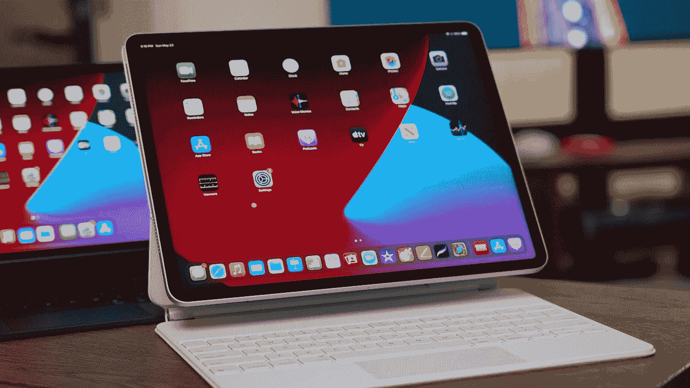
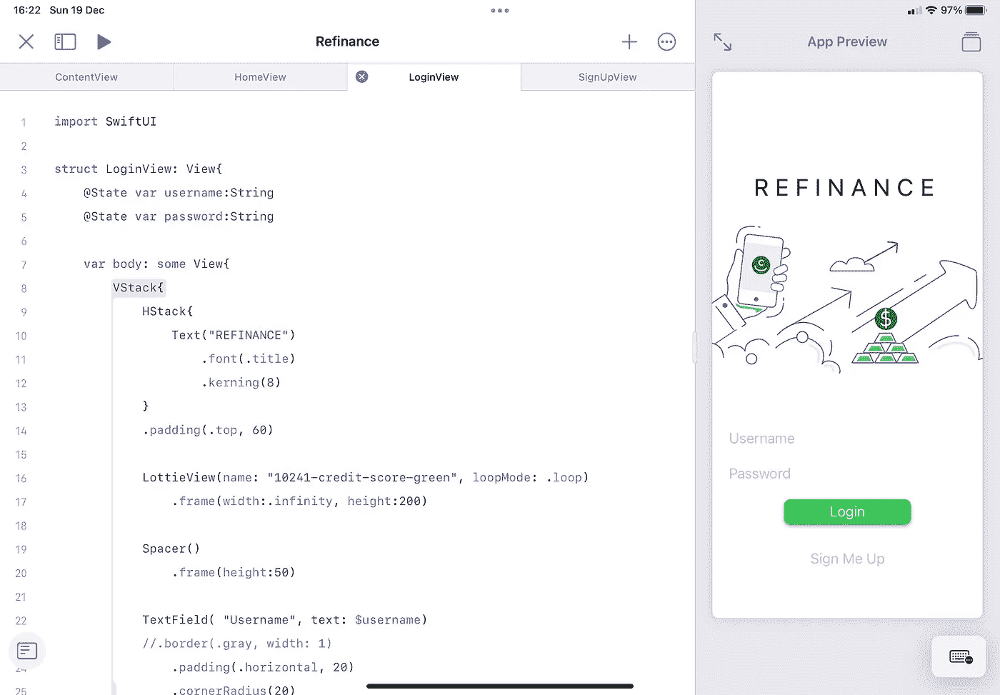

# 真的可以只用 iPad 和 Swift Playgrounds 4 来搭建一个 App 吗？

> 原文：<https://betterprogramming.pub/can-you-really-build-an-app-using-only-ipad-swift-playgrounds-4-f3e9c484b3ee>

## 这个工具真正的局限性是什么？

照片由丹尼尔·罗梅罗-https://unsplash.com/@rmrdnl 提供

新的 Swift Playgrounds 4 for iPad 的推出向一系列用户开放了编程，这些用户以前可能负担不起最便宜的 MacBook 和开发者订阅的费用，只是为了进入苹果生态系统的世界进行开发。

我已经用了几天了，我想试着理解这个工具的局限性，并真正理解开发一个全功能的应用程序能走多远。

playgrounds 最强的功能必须包括 Swift Package Manager。添加库和框架以加速开发、共享有用的代码或添加 API 以与外部世界集成的简单方法。这很容易使用，字面上包括添加在线托管的包的 URL，并按下按钮将其添加到项目中。

我尝试添加的第一个包是 Firebase-iOS。遗憾的是，当我输入 URL 时，这里什么也没有发生。它显示标签“检查版本”,然后什么也没有发生，最终这个操作超时。至少可以说，这令人沮丧。从来没有人接受第一个答案，我又试了几次，才得出结论，一定有什么东西坏了。

我继续我的下一个目标:洛蒂。这是第一次成功。我很兴奋能在我的 iPad 上测试这个作品。我做的第一件事是添加一个助手文件，你可以跟随冯(事实上，跟随整个[教程在这里](https://medium.com/swlh/how-to-use-lottie-animations-in-swiftui-caaf19944d96)，因为它是一个伟大的作品，真的加快了工作流程):

下一步是添加我的动画文件。我可以去洛蒂网站，下载动画文件。在 Swift playgrounds 中，我可以将这些动画添加为资产，并可以通过一行代码访问它们，在预览中立即看到它们。

现在，这是成功的！任何以前使用过 Lottie 的人都知道，他们不必成为一名设计师来开发一个看起来非常智能的应用程序，这是在几个小时的开发时间内获得一个完美应用程序的一种方法。

我回去尝试 Firebase，仍然没有运气。失败后，我转向 AWS Amplify，并试图将它作为一个包添加到我的应用程序中。同样，这不会加载。在四处搜索之后，我相信我找到了答案，对于要加载的包，所有文件都必须用 swift 编写。它们不能包含任何 C++实现，我相信这就是为什么这些包失败的原因。

这里的担心是，公司不会重写他们的 API 来快速实现，因为这不是为了满足 Xcode 的要求，而只是作为苹果的玩具。如果我想为我的应用程序使用任何后端服务，这让我陷入了困境。

# CloudKit 助您一臂之力…

没有深入探索过苹果的 CloudKit，似乎没有比现在更好的时机去尝试了。

首先，确保您已经在 Playgrounds 的应用程序设置中设置了您的团队和捆绑 ID。之后，登录你的苹果开发者账户，选择“证书、标识符和配置文件”，然后在“标识符”下，选择你的应用的标识符。

在“功能”下，添加 iCloud，然后登录 Apple。如果您随后登录到 CloudKit Dashboard，您应该能够创建一个新的容器(我不得不 Google how to create a container from the web interface，并找到了一个完成此操作的链接)。

然后，我可以返回到我的开发人员帐户，将 CloudKit 容器标识添加到我的 iCloud 功能中，最后，我可以从 CloudKit 仪表板编辑我的模式。

到目前为止，所有积极的东西…

耐人寻味的是，斯威夫特操场上似乎有洞没有被堵上。用户可以“导入 CloudKit ”,并开始编辑他们的代码。当我们想要测试应用程序时。应用程序不知道它的请求去哪里，因为应用程序中没有定义容器。通常用户会从 Xcode 本身设置 CloudKit 容器。

我意识到，也许我的问题是我的应用程序缺少一些功能，比如“登录苹果”。这在游戏中是不存在的，而且这似乎是非常限制性的。我可以在 Swift Playgrounds 中手动创建这个按钮，但我需要记住这个代码，而不是带有提示性的选项。

虽然我在 SwiftUI 中支持这一点，但该功能似乎并不存在，我仍然在控制台中看到代码，表明这实际上并没有连接到任何东西。

这使得目前的状态在整体上有点令人沮丧。我们可以设计和构建独立的应用程序，但目前还不支持后端功能。或者至少，这将在晚些时候到来。这表明 swift playgrounds 的力量的确令人印象深刻，但这是仅使用 iPadOS 真正构建应用程序的一大障碍。

我发现了最后一个包裹，它可能会在这个黑暗的时代带来希望，那就是 [Soto](https://soto.codes/index.html) 。这似乎至少可以加载到 Swift Playgrounds 4 中(尽管有几个目标错误，这将停止任何编译)。但由于这是在考虑 swift 的情况下编写的，并且似乎是最新的，因此这可能是利用后端服务编写 iOS 应用程序的答案。