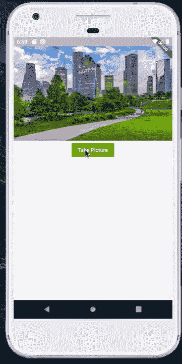

# 在 Flutter 中使用相机拍摄照片

> 原文：<https://betterprogramming.pub/capturing-photos-using-camera-in-flutter-585656cd3a69>

## 将您的相机带入您的应用程序

由 [Unsplash](https://unsplash.com/s/photos/camera?utm_source=unsplash&utm_medium=referral&utm_content=creditCopyText) 上 [ShareGrid](https://unsplash.com/@sharegrid?utm_source=unsplash&utm_medium=referral&utm_content=creditCopyText) 拍摄的照片

在[的上一篇文章](https://medium.com/better-programming/displaying-photos-from-your-photo-library-in-flutter-applications-34b8799a3849)中，我讨论了如何使用 Flutter 中的图像拾取器包从照片库中选择图像。它工作得很好，我们能够在我们的应用程序中显示图像。

在这最后一部分，我将演示如何使用手机的摄像头捕捉照片并显示在屏幕上。强烈建议您阅读第一部分，因为在之前的帖子中已经讨论了很多配置和权限请求。

# 入门指南

第一步是安装[相机](https://pub.dev/packages/camera)插件。相机插件将允许我们使用设备上的物理相机并拍摄照片。首先向 pubspec.yaml 文件添加相机依赖项，如下面的实现所示:

接下来，我们需要更新 _showOptions 方法，以考虑用户何时选择从相机拍照选项。实现如下所示:

showCamera 方法负责访问可用的相机，然后将用户带到一个单独的视图来预览照片。第一个摄像头将是背面摄像头。

目前，TakePicturePage 不存在。TakePicturePage 将负责允许用户使用他们的相机捕捉照片。在下一节中，您将学习如何向用户显示相机预览，然后将捕获的照片发送回主页，以便它可以显示在屏幕上。

# 从相机中捕捉照片

当用户选择相机选项时，他们被带到拍照页面。拍照页面将允许他们预览图片，然后点击按钮进行拍摄。

拍照页面使用 CameraController 来拍照。CameraController 还用于设置和配置预览。TakePicturePage 小部件的初始化如下所示:

为了创建 TakePicturePage 小部件，camera 是必需的参数。TakePicturePage 也是一个有状态的小部件，由 initState 方法组成，它负责初始化相机控制器。

下一步是预览相机。要做到这一点，你可以在物理设备或 Android 模拟器上运行应用程序。请注意，预览和拍照在 iOS 模拟器上不起作用。

预览相机视图的实现如下所示:

我们使用 FutureBuilder 来评估 _ initializecameracontrollerfuture，然后使用 CameraView 来显示相机的预览。如果未来仍在解析，那么我们显示一个循环的 CircularProgressIndicator()而不是 CameraPreview 小部件。

结果如下所示:

安卓模拟器假房间测试摄像头捕捉

Android 使用虚拟房间模拟，因此用户可以使用模拟器测试拍照，而不必在真实的物理设备上安装应用程序。

始终、始终、始终确保在将应用部署到生产环境之前，在物理设备上运行应用

最后一步是拍照。我们在堆栈中添加了一个 FloatingButton 作为第二个子元素。按钮将负责捕捉照片。点击按钮时，触发 _takePicture 方法。_takePicture 方法的实现如下所示:

首先，我们等待 _ initializeCameraControllerFuture 解析。一旦解决了未来问题，我们就获得了保存图像的临时目录的路径。最后，我们调用 _cameraController 实例上的 takePicture 函数，该函数拍摄照片并将其保存到特定路径。拍照后，我们从堆栈中弹出页面，并通过将路径作为第二个参数传递给 Navigator.pop 方法来发回路径。这意味着呼叫者现在可以访问该路径，并使用它来显示最近捕获的照片。

回到主页小部件，我们从导航器中获取路径并设置状态，如下所示:

因为我们在 setState 闭包内设置了 _path 的值，这将导致构建函数被触发，从而显示捕获的图像。构建函数的实现如下所示:

结果如下所示:

使用相机套装拍照

在这篇文章中，您了解了如何从物理设备上捕获图像并在页面上显示。我鼓励你下载代码，在设备上运行应用程序，并尝试一下。

[GitHub](https://github.com/azamsharp/AzamSharp-Weekly/blob/master/photo_app_camera.zip)

 [## 在 Flutter 应用程序中显示照片库中的照片

### 向您的 Flutter 应用程序介绍美丽的图像

medium.com](https://medium.com/better-programming/displaying-photos-from-your-photo-library-in-flutter-applications-34b8799a3849) 

编码快乐！