# iOS 应用程序的漏洞链——逆向工程变得简单

> 原文：<https://betterprogramming.pub/chaining-vulnerabilities-for-fun-and-knowledge-ios-edition-915598f4de83>

## 了解应用程序如何在幕后工作


由 [Unsplash](https://unsplash.com?utm_source=medium&utm_medium=referral) 上的[窗口](https://unsplash.com/@windows?utm_source=medium&utm_medium=referral)拍摄

我们将了解 iOS 应用程序漏洞是如何联系在一起的，以深入了解应用程序是如何工作的，并收集知识来帮助我们创建一个有效的调整/利用来修改应用程序的运行时行为。

我们开始吧！首先，让我们安装我们将在开发过程中使用的必要工具。

注意:我用的是 MacOS 和一个物理 iOS 设备。

iDevice (iPhone/iPad):如果你已经有一个越狱设备，那就完美了。如果没有，你可以使用这里的指南[来查看你的设备和 iOS 版本的各种选项。](https://www.idownloadblog.com/jailbreak/)

越狱后，将以下工具安装到您的设备上，以便于管理和调试:

*   OpenSSH —对于通过 Wi-Fi 进行 SSH 访问非常有用。
*   Filza FileManager —用于查看文件系统。
*   **Frida** —用于在应用运行时注入代码。此处的说明[为](https://frida.re/docs/ios/)。
*   **Cephei Tweak 支持—** 一个为越狱的 iOS 设备提供的框架，包括为开发者提供的各种便利特性。
*   **RocketBootstrap** —解决 iOS 7 及以上版本 IPC 服务被拒绝查找错误的库。
*   **PreferenceLoader** —用于调整的设置视图。
*   **Theos**——用于建筑调整。此处 有 [**的安装说明。**](https://theos.dev/docs/installation-ios)
*   **异议:**一个构建在 Frida 之上的运行时探索工具包。你可以在这里 找到安装说明 [**。**](https://github.com/sensepost/objection/wiki/Installation)
*   **附带:**cy dia Impactor[](http://www.cydiaimpactor.com/)*在设备上安装应用程序(IPA 文件)的良好替代方案。可用于安装越狱/目标应用。*
*   ***Frida-iOS-Dump:** App Store 应用默认加密，即 IPA 包内 Mach-O 二进制文件的可执行部分加密。由于它是在运行时解密的，我们可以使用这里的工具[](https://github.com/AloneMonkey/frida-ios-dump)****从一个越狱设备中取出解密的部分。*****
*   *****`class-dump-swift` **:** 为了能够窥见抽象的代码实现并支持我们稍后将要构建的调整，我们需要从应用程序二进制文件中转储类和头文件。为了做到这一点，我们将使用[***class-dump-swift***](https://github.com/ivRodriguezCA/class-dump-binaries/blob/master/binaries/class-dump-swift)**，因为大多数现代 iOS 应用程序都是使用 swift 编写的。*******
*   *********DVIAv2:** 这将是我们用于演示的目标应用程序，并且是一个故意易受攻击的 iOS 应用程序[此处](https://damnvulnerableiosapp.com/#downloads)。*******

*****注意:我们将使用 swift 版本进行此练习，因为大多数现代应用程序都是使用 swift 构建的。*****

*****一旦我们有了上面列出的所有要求，我们就可以开始这个过程了。让我们从在我们的设备上安装应用程序开始。*****

*****从侧面打开**并点击左侧的 IPA 图像选择之前下载的 DVIAv2 IPA 文件。如果有多个设备连接到您的机器，请确保选择正确的设备，并在准备就绪后点击“**启动**”。*******

******

***一旦完成，工具底部的状态从*空闲*变为*完成*。
**注:**应用程序要求你先用你的 Apple ID 登录，以防你以前没用过***

***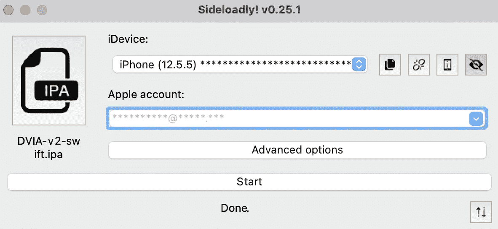***

***如下图所示，应用程序安装成功。***

***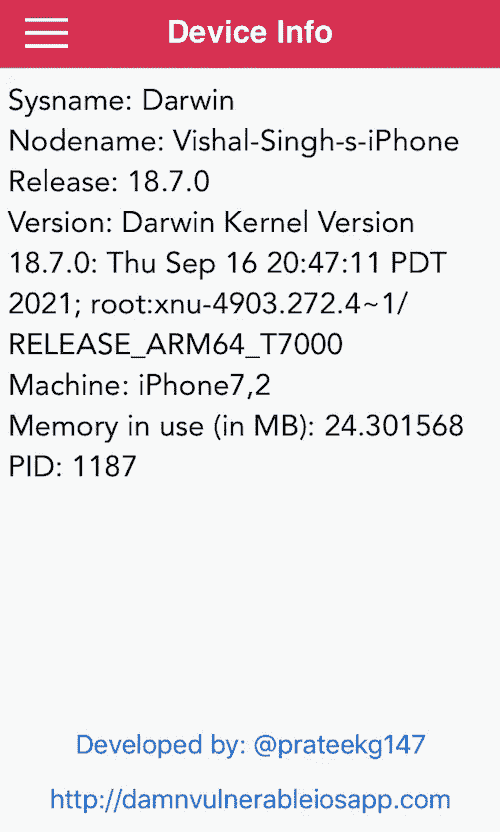***

***如果您在打开应用程序时遇到问题，只需确认并接受用于安装应用程序的证书(**通用- >配置文件&设备管理- >开发者应用**)***

***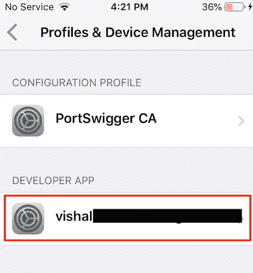***

***让我们列出设备上安装的所有应用程序。我们将使用弗里达来完成这项任务。确保您的 iPhone 使用 USB 连接到您的电脑，因为-U 参数指示 Frida 使用通过 USB 连接的设备。***

******

***一旦我们有了目标应用程序 **(** `com.highaltitude.DVIAswiftv2` **)** (在我们的例子中是 *DVIA-v2* )的包标识符，我们就可以使用 Frida-iOS-Dump 将解密的应用程序内容转储到我们的系统上。***

***该工具接受一些标准选项作为输入，例如主机 Ip 地址(-H)、端口(-p)、用户名(-u)、密码(-P)、包标识符和输出文件名(-o)。对我来说，最后的命令如下所示:***

```
***python3 ../frida-ios-dump/dump.py -H 192.168.1.17 -p 22 -u root -P alpine -o DVIAv2 com.highaltitudehacks.DVIAswiftv2***
```

******

***一旦程序完成执行，您应该会在屏幕上看到如下内容。***

******

***我们可以通过列出当前目录来验证解密的 IPA 是否已经保存到磁盘上。***

******

***一旦我们有了 IPA 文件，我们就可以使用 unzip 命令提取文件的内容，因为 IPA 包类似于 zip 文件。***

******

***这将在您当前的工作目录中给您一个名为 Payload 的新文件夹。***

******

***新文件夹有效负载包含应用程序在设备上运行所需的所有必要的静态文件和资源，以及由指针标记的可执行文件，如下所示。***

******

***下一步是从应用程序的可执行文件中提取头文件和类信息。头文件和类文件有助于识别应用程序不同部分(即视图)中可用的函数和方法。Theos 还需要头文件来创建一个调整，我们将在后面看到。***

***要从可执行文件中转储头文件，请运行以下命令:***

```
***class-dump-swift -H -o Headers/ Payload/DVIA-v2.app/DVIA-v2***
```

******

***虽然屏幕上可能会出现一些警告，但是一旦执行完成，您应该将可执行文件中的头文件保存到 Headers/文件夹中。***

******

***有趣的是，如果你在 Finder 下打开当前目录下的 Headers 文件夹，你会注意到头文件包含一些常见的名字，如`*HomeViewController*`*`*DonateViewController*`*`*PhishingViewController*`*等。******

*****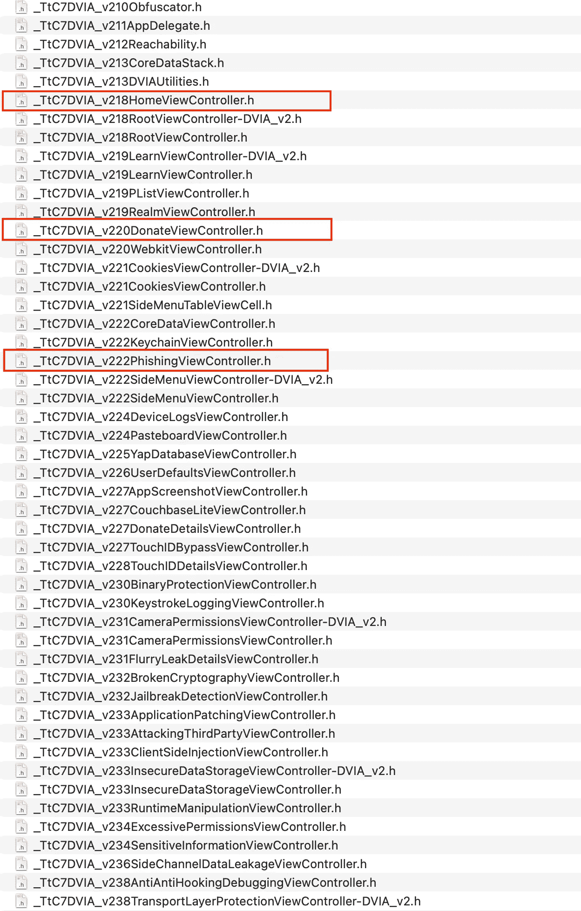*****

*****对于应用程序中的代码必须负责什么，名称本身有时是不言自明的。例如，我们可以在下面的截图中看到应用程序中的捐赠部分，它很可能是通过`DonateViewController`类控制的。*****

**********

*****让我们以`*DonateViewController*`为例。*****

****查看文件`DonateViewController.h`中的代码，我们发现有几个方法，如`menuTapped`、`viewWillAppear`和`viewDidLoad`，在执行时不返回任何内容，用- > (void)表示。这个类的名字是`_TtC7DVIA_v220DonateViewController`，并且继承自类`UIViewController`****

****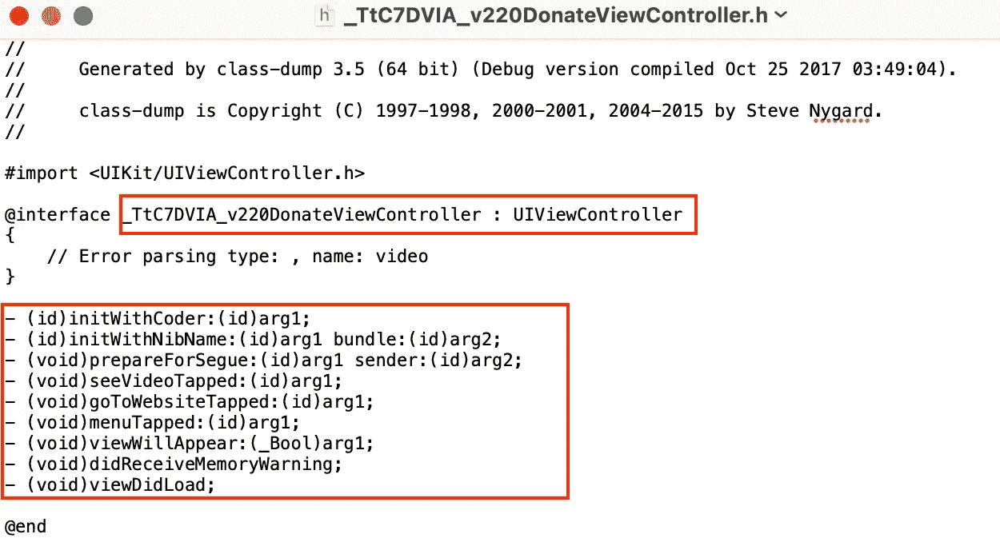****

****现在，我们需要找出何时以及如何加载我们想要的 ViewController 并调用函数。我们将使用异议来为我们找出这个答案。
我们首先需要将异议附加到设备上运行的应用程序中。我们可以这样做，首先使用以下命令识别正在运行的应用程序的进程 ID:****

```
**frida-ps -Ua**
```

****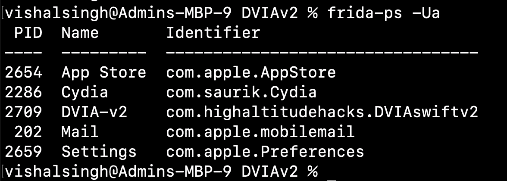****

****然后使用下面的命令指示 objection 附加到我们正在运行的进程，并提供进程标识符。****

```
**objection -g 2709 explore**
```

****如果成功挂钩，您应该能够在屏幕上看到如下内容。****

********

****我们现在将使用以下命令指示 objection 跟踪对 DonateViewController 类的所有调用:****

```
**ios hooking watch class _TtC7DVIA_v220DonateViewController**
```

****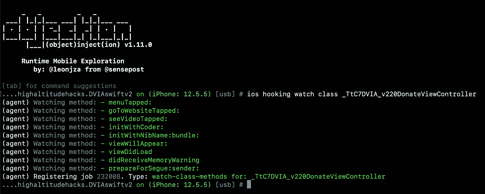****

****从上面的截图可以看出，DonateViewController 内的所有方法现在都被 objection 监控。现在，只要我们单击“**捐赠 Juniper 基金**”菜单项，就会在异议 CLI 中触发事件。****

********

****捐赠列表项目****

********

****上面的屏幕截图确认了方法 viewDidLoad 和`viewWillAppear`在页面加载时被触发。****

****上面的技巧可以用来识别在代码中哪个函数被触发来响应一个事件，比如选择一个特定的标签，点击一个特定的区域或者在应用程序的屏幕上输入一些信息。****

****我们现在可以使用这些信息，使用 **Theos** 为我们的目标应用程序 DVIA-v2 构建一个工作调整。****

****我们先来看看目前为止 app 遇到的 iOS 特有漏洞列表:****

****1.无越狱检测
2。无运行时操纵保护
3。源代码没有混淆****

****总体而言，上述所有发现在大多数安全评估中都被评为低水平，但我们将结合上述发现的弱点来控制应用程序在运行时的行为。****

****我们现在需要将所有头文件复制到 iPhone 上的`/var/theos/include`文件夹中。我们可以使用下面的命令递归地这样做:****

```
**scp -r Headers/ root@192.168.1.15:/var/root/theos/include/DVIA-v2/**
```

********

****我们现在需要 ssh 到我们的 iPhone，并使用 Theos 库提供的新实例创建器实例化一个新项目。我们通过提供绝对路径来调用`nic.pl`脚本，并从列表中选择选项 17，因为我们想要为 iPhone 创建一个调整。****

****实例创建者还请求一些额外的信息，比如项目名称、维护者和我们想要为其创建调整的应用程序的包标识符，在我们的例子中是`com.highaltitudehacks.DVIAswiftv2`。****

****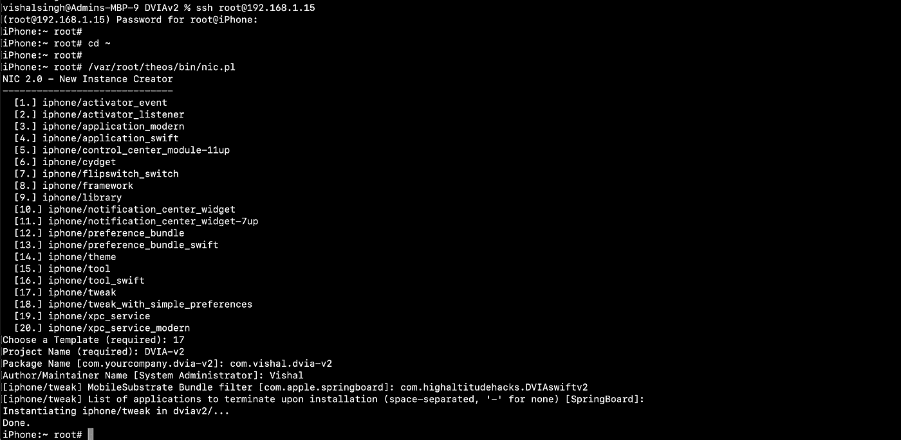****

****提供基本信息后，我们可以看到在当前工作目录中创建了一个包含几个文件的新文件夹。****

****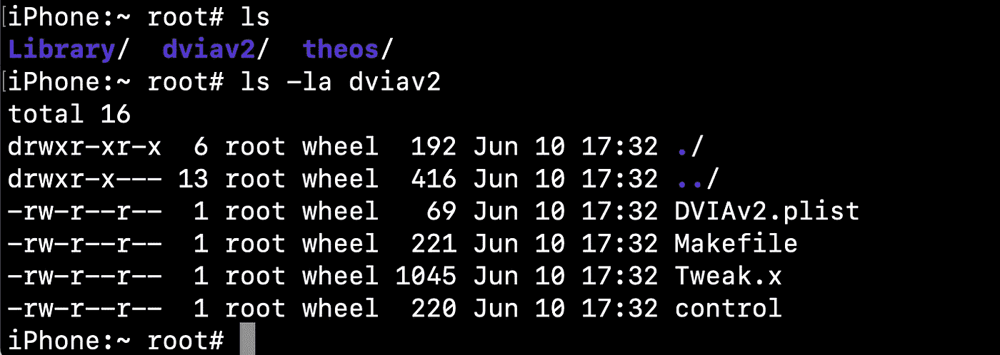****

****Tweak.x 文件是这个项目的核心，包含将要执行的实际代码。`DVIAv2.plist`包含目标应用程序的包标识符，tweak 将附加到该包。****

********

****Makefile 包含构建操作的配置信息，如下所示。****

****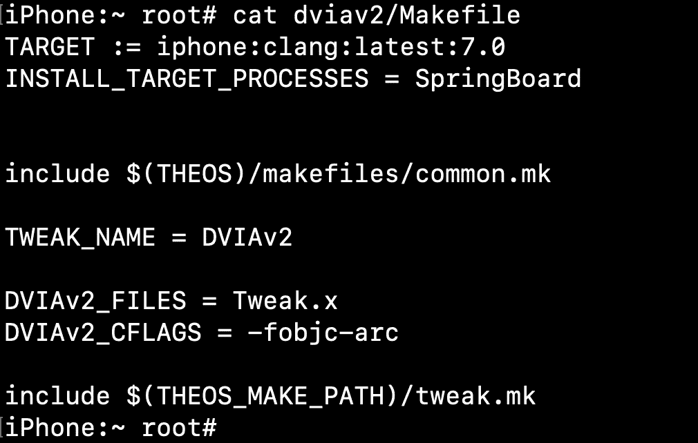****

****我们需要更新 Makefile，使其指向我们的 THEOS 安装，并使用 ARCH 指令为我们的设备添加架构，如下所示:****

****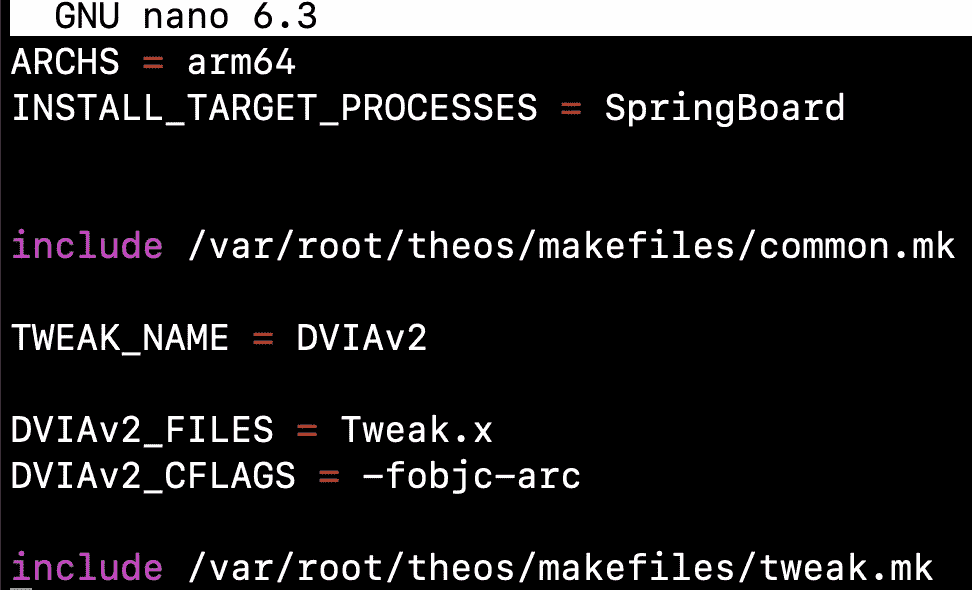****

****Tweak.x 文件是我们所有附加代码所在的位置，最初包含一些示例代码，如下所示****

****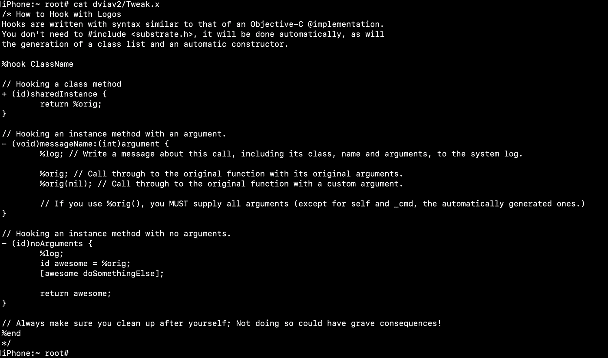****

****我们将从文件中删除上述所有数据，并将文件内容更新为以下内容****

****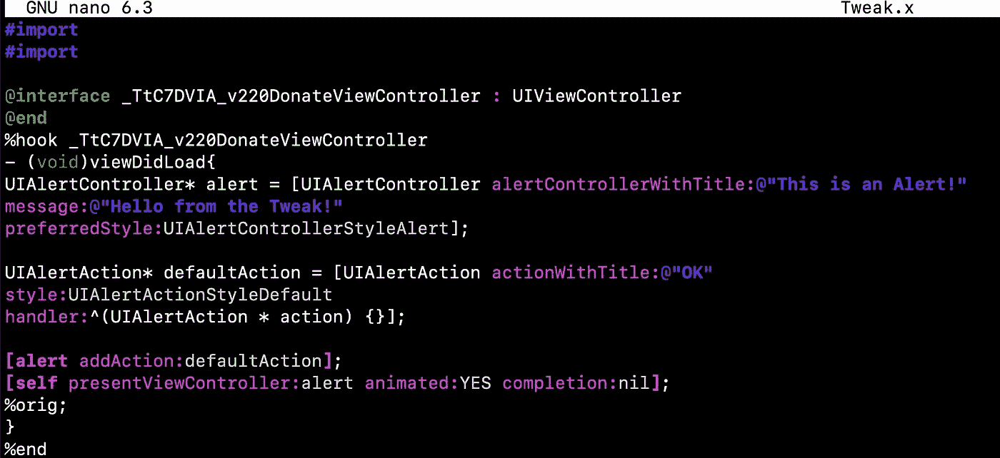****

****代码的前两行包括一些必要的基础类，这些类包含我们的调整在屏幕上显示消息所需的方法。****

```
***#import <Foundation/Foundation.h>
#import <UIKit/UIKit.h>***
```

****然后我们使用`@interface`属性声明我们想要调整附加的类。****

****我们所有的附加代码都驻留在`%hook … %end`块下。这里，我们再次指示 tweak 挂钩到`DonateViewController`类的 viewDidLoad 函数并显示一个警告。警报由`UIAlertController` *** 类实例化，并由代码开头的导入语句提供。****

****代码中的`%orig;`语句确保`viewDidLoad`函数的原始内容与指定的附加语句一起执行。如果你想覆盖函数的行为，你可以去掉`%orig`*；来自代码的指令，但是因为我仍然希望函数运行它的预期代码，所以我将保留它。*****

****保存文件后，我们需要从文件夹中发出 make 命令，这将创建一个. deb 包并可以安装到设备上。****

> ****制作包****

****如果一切顺利，您应该能够看到由 make 命令创建的. deb 包。****

****************

****我们现在可以通过 debian package manager (dpkg)将软件包安装到本地设备上，或者通过基于 Cydia 的存储库托管它。我们现在采用简单的方法，使用以下命令将 debian 包安装到我们的设备上:****

```
**dpkg -i packages/com.vishal.dvia-v2_0.0.1–1+debug_iphoneos-arm.deb**
```

********

****从上面的截图我们可以看到这个包已经成功安装了。****

****为了确保包加载成功，建议运行工具 uicache，它会清除所有应用程序数据，包括 PreferenceLoader 和 Cydia 信息。我们可以使用以下命令确保完全清理缓存:****

```
**uicache -afr**
```

********

****我们也应该能够在我们的包管理器 Cydia/Sileo 的 installed 部分看到我们的调整。****

****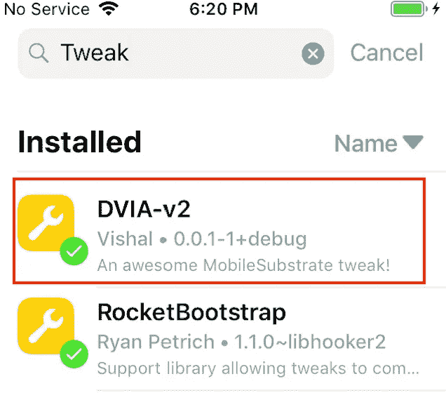****

****现在，当我们打开应用程序并通过侧边菜单浏览到应用程序的捐赠部分时，我们应该能够看到标题为*的提醒:“这是一个提醒！”*包含消息*“这是来自 Tweak！”*。****

****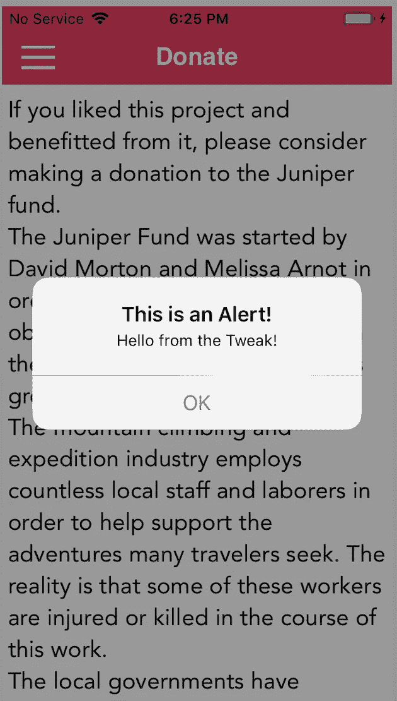****

****上面的调整是一个很好的例子，说明了调整有多么强大！
人们可以修改文件`Tweak.x`中的代码来执行一些不利的功能，如收集数据并将其发送到`ViewController`的文本字段中，提示用户输入认证信息，然后将这些信息发送到攻击者控制的服务器。****

****可能性是无限的！****

****虽然这可以通过 Cydia 库分发，但应用程序也可以重新打包和签名，方式类似于使用异议的`patchipa`功能来包含`dylib`(动态库)。这将允许 tweak 修改应用程序的运行时行为，即使是在非越狱设备上。****

****注意:在安装来自第三方来源和应用商店的应用程序/调整时要小心。****

****希望你喜欢它！****

```
****Want to Connect?**Please feel free to message me on [LinkedIn](https://www.linkedin.com/in/vishal-singh-8230a7b7/) for any feedback/general security discussions :)**
```