# 改变数据捕获以加速实时分析

> 原文：<https://betterprogramming.pub/change-data-capture-to-accelerate-real-time-analytics-ad5e970b48d>

## 并简化您的管道


在 [Unsplash](https://unsplash.com?utm_source=medium&utm_medium=referral) 上[给](https://unsplash.com/@laurentmedia?utm_source=medium&utm_medium=referral)拍照

说创业公司利用大数据和人工智能来开发更具创新性的商业模式并不新鲜。因此，大数据和人工智能问题在高管和技术论坛上无处不在。但它们经常在如此高的层面上被讨论，以至于人们最终忽略了这些公司的组成部分的细节。

在本文中，我将介绍现代公司最有价值的组成部分之一:实时处理数据的能力，这使得零售、媒体和娱乐以及金融等行业能够进行数据驱动的决策。例如:

*   行为和购买分析能够即时提供更有针对性的产品和建议，为客户提供更加个性化的体验。
*   线索跟踪促使销售团队关注最有效的营销渠道，而不是花时间在表现不佳的渠道上。
*   支出模式分析使金融机构能够在欺诈发生之前检测到欺诈，从而有效地防止损失。

但是如果你工作的公司不在实时数据时代呢？首先，你不是一个人。许多公司仍然在批处理作业中处理数据，这可能意味着 1、7… 30 天的分析数据延迟。各种规模的公司都会出现这种情况，但这并不意味着如果公司打算更进一步，就没有唾手可得的果实。

人们可能会认为公司需要大量的工程工作来组装实时分析管道，包括实现交易系统的现代化和建立事件流平台，但情况并非总是如此。例如，变更数据捕获(又名 CDC)带来了一种轻松的方法来移动数据，特别是从事务数据库到数据湖。一会儿我将演示它是如何工作的。

# 什么是变更数据捕获？

根据定义，变更数据捕获是一种数据集成方法，它基于对企业数据源所做变更的识别、捕获和交付(来源:[维基百科](https://en.wikipedia.org/wiki/Change_data_capture))。它解决了与在企业内安全、可靠、快速和一致地移动数据相关的问题。大多数变更数据捕获产品的一个共同特征是对源数据库的影响很小，尤其是那些依赖于[日志扫描机制](https://en.wikipedia.org/wiki/Change_data_capture#Log_scanners)的数据库。

变更数据捕获有多种用途:

*   事务性数据库更改触发的最小工作量数据流。
*   实时数据库复制，以支持数据仓库或云迁移。
*   随着数据以真正低的延迟从事务环境传输到分析环境，支持实时分析。
*   实现零停机的数据库迁移。
*   用于调试和审计目的的时间旅行日志记录。

有许多变更数据捕获解决方案。Debezium 可能是最流行的开源解决方案，经常与 Apache Kafka 一起使用来实现事件流。 [HVR](https://www.hvr-software.com/) 问世已经超过十年，目前仍在积极开发中。它可以部署在领先的云提供商，但我不会说这是一个云原生解决方案，因为它需要彻底的设置。另一方面， [Arcion](https://www.arcion.io/) 和 [Striim](https://www.striim.com/) 是拥有云和自托管部署模型的较新技术。

在这一点上，我想你可能想知道变更数据捕获是如何工作的，所以让我们来看一些实际操作的东西。

# 使用 Arcion 更改数据捕获的实践指南

为了便于说明，假设一家零售公司在其交易环境中拥有大量发票数据，但没有利用这些数据做出明智的决策。他们的目标是投资数据分析，但他们的内部数据中心无法支持这种额外的工作负载，因此他们决定从雪花开始评估更合适的云解决方案。

鉴于他们仍在评估云产品，他们希望以尽可能少的开发工作来释放分析能力。实时数据库复制非常适合这个用例。

我需要一些零售发票来证明它是如何工作的，Kaggle 上有几个免费的零售数据集样本。我将使用[在线零售 II UCI](https://www.kaggle.com/datasets/mashlyn/online-retail-ii-uci) ，因为它将很好地满足我们的目的，并允许我们轻松地使用原始数据将数据一对一地复制到我们在雪花中创建的数据湖中。这将有效地为我们的数据湖创建一个青铜层方法。

MySQL 将被用作源。它是一个广泛使用的、易于设置的关系数据库，所以大多数人将会遵循我所做的，并且可能能够用其他数据库复制这些步骤。

由于雪花在市场中的巨大存在，它将被用作目标数据仓库。《财富》500 强中几乎有一半在使用它(来源:[雪花 2022 年快速事实报道](https://www.snowflake.com/wp-content/uploads/2021/05/SnowflakeFastFactsSheet.pdf))，同样，读者也许可以用其他数据仓库复制这些步骤。

我还将使用 Arcion，因为它提供了云本机部署选项以及 OLTP 和数据仓库连接器支持，从而简化了设置过程。

# MySQL 设置

1.创建源数据库

```
CREATE DATABASE arcion_cdc_demo;
USE arcion_cdc_demo;
```

2.创建源表

```
CREATE TABLE IF NOT EXISTS transactions (
  transaction_id BIGINT NOT NULL AUTO_INCREMENT,
  invoice VARCHAR(55) NOT NULL,
  stock_code VARCHAR(55) NOT NULL,
  description VARCHAR(255),
  quantity DECIMAL(9,3) NOT NULL,
  invoice_date DATETIME NOT NULL,
  price DECIMAL(10,2) NOT NULL,
  customer_id DECIMAL(9,1),
  country VARCHAR(255),
  PRIMARY KEY (transaction_id)
);
```

3.为复制事务创建一个用户

```
CREATE USER `cdc-replication-agent`@`%`
  IDENTIFIED WITH mysql_native_password BY `<password>`;
```

4.仅授予用户所需的最低权限

```
GRANT REPLICATION SLAVE, REPLICATION CLIENT
  ON *.*
  TO `cdc-replication-agent`@`%`;GRANT SELECT
  ON arcion_cdc_demo.transactions
  TO `cdc-replication-agent`@`%`;
```

5.允许外部网络访问 MySQL(默认为`port 3306`)

这一步依赖于托管 MySQL 服务器的基础设施，详细说明这一点超出了本文的范围。如果因为任何原因不允许外部网络访问，请考虑[在 MySQL 网络中设置 Arcion 的复制代理](https://docs.arcion.io/docs/quickstart/)，而不是使用 Arcion Cloud。

6.将数据加载到源表中

```
LOAD DATA LOCAL INFILE '/tmp/online_retail_II.csv'
  INTO TABLE transactions
  FIELDS TERMINATED BY ','
  OPTIONALLY ENCLOSED BY '"'
  IGNORE 1 ROWS
  (invoice, stock_code, description, quantity, invoice_date, price, @customer_id, country)
  SET customer_id = NULLIF(@customer_id, '');
```

7.将二进制日志格式设置为行

您还需要确保 MySQL 实例二进制日志记录格式(binlog_format)设置为 ROW，以便支持 Arcion 的 CDC。这可以通过多种方式实现，具体取决于实例的部署方式和位置。这里有一个在 Amazon RDS 上运行 MySQL 时如何做的例子。

# 雪花设置

1.创建目标数据库

```
CREATE DATABASE demo;
USE demo;
```

2.创建目标模式

```
CREATE SCHEMA arcion_cdc;
USE demo.arcion_cdc;
```

3.创建目标表

```
CREATE TABLE IF NOT EXISTS transactions (
  transaction_id NUMBER,
  invoice VARCHAR(55),
  stock_code VARCHAR(55),
  description VARCHAR(255),
  quantity NUMBER(9,3),
  invoice_date TIMESTAMP_NTZ(9),
  price NUMBER(10,2),
  customer_id NUMBER(9,1),
  country VARCHAR(255)
);
```

4.为复制事务创建角色和用户

```
CREATE ROLE dataeditor;CREATE USER cdcreplicationagent
  PASSWORD = '<password>';GRANT ROLE dataeditor
  TO USER cdcreplicationagent;ALTER USER IF EXISTS cdcreplicationagent SET DEFAULT_WAREHOUSE = COMPUTE_WH;ALTER USER IF EXISTS cdcreplicationagent SET DEFAULT_ROLE = dataeditor;
```

5.授予角色所需的权限

```
GRANT DELETE, INSERT, SELECT, UPDATE 
  ON TABLE demo.arcion_cdc.transactions
  TO ROLE dataeditor;
GRANT ALL PRIVILEGES ON WAREHOUSE COMPUTER_WH TO ROLE dataeditor;GRANT CREATE DATABASE ON ACCOUNT TO ROLE dataeditor;
```

# Arcion Cloud CDC 设置

创建了数据源和目标后，我们现在将登录 Arcion Cloud，设置复制管道以启用 CDC。您可以在此注册并登录 Arcion [。](https://dev.tosign%20up%20link/)

登录 Arcion Cloud 后，我们将进入复制屏幕。在这里，我们将单击屏幕中间的“New Replication”按钮。

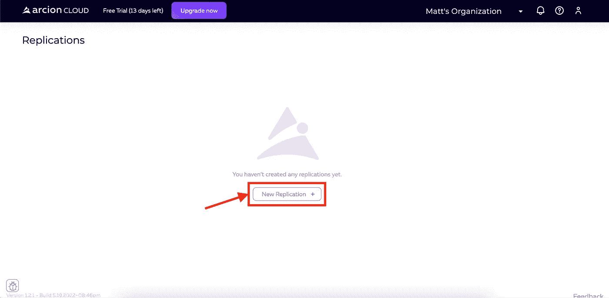

接下来，我们将选择复制模式和写入模式。有几个选项可以满足您的需求。对于复制模式，Arcion 支持:

*   快照(初始负载)
*   完整(快照+ CDC)

对于写入模式，Arcion 支持:

*   取代
*   缩短

出于此处的目的，我们将选择复制模式为完整，写模式为截断。您还会看到，我已经将复制命名为“MySQL to Snowflake”

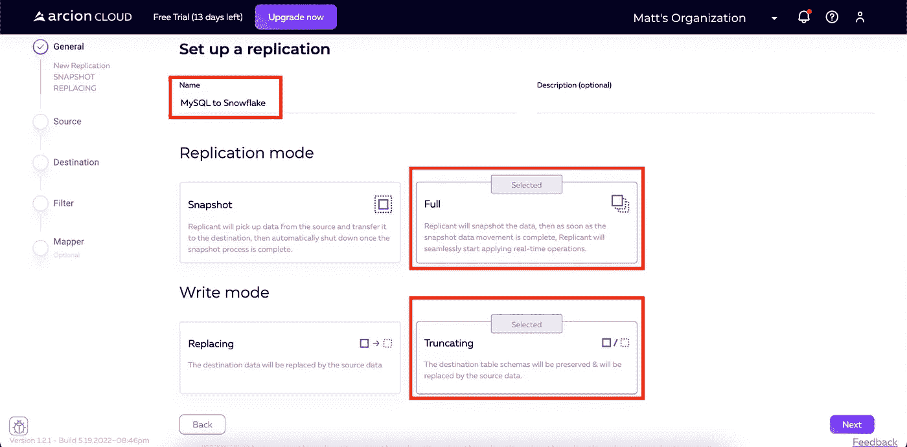

填充名称并选择复制和写入模式后，单击屏幕底部的下一步。

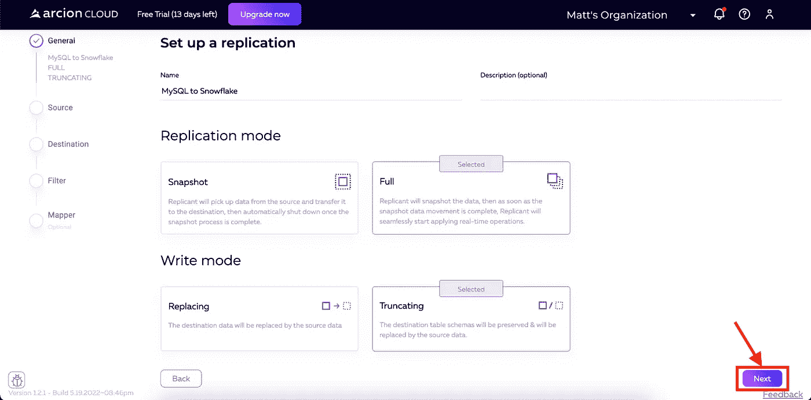

然后我们被带到源屏幕。在这里，我们将单击“Create New”按钮。

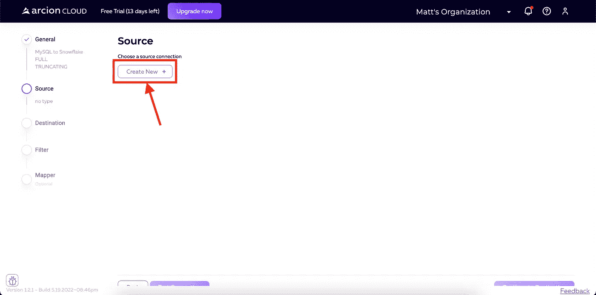

然后，我们将选择 MySQL 作为我们的源。

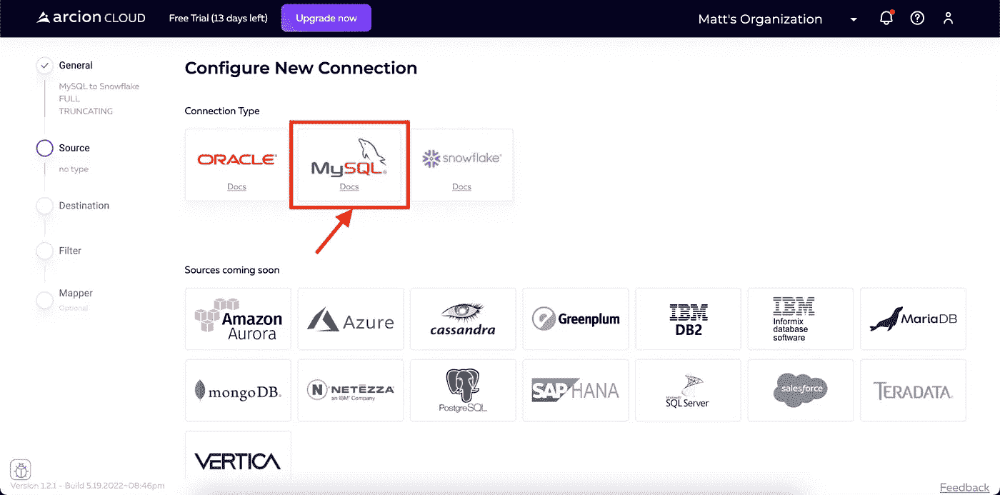

然后滚动到页面底部并单击继续。

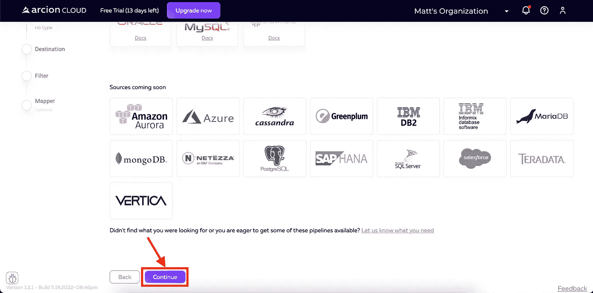

现在，我们可以添加 MySQL 实例的详细信息。这些细节包括:

*   连接名称
*   主持
*   港口
*   用户名
*   密码

所有其他字段将默认。对于用户名和密码，我们将使用前面针对 MySQL 实例运行的脚本中创建的用户。

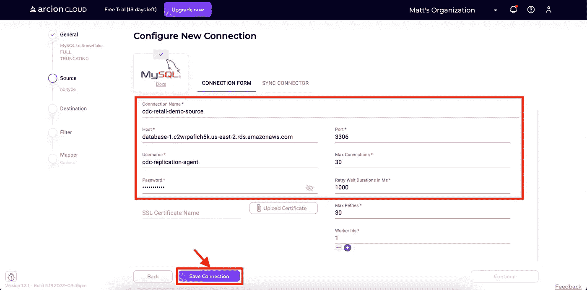

一旦保存了连接，我们将需要从数据库中提取模式。在下一页，我们将被提示单击同步连接器按钮。单击按钮，Arcion Cloud 将连接到我们的 MySQL 实例并下拉模式。


完成后，Arcion Cloud 中的用户界面将显示检索到的模式。然后，我们将单击屏幕右下角的“继续”进入下一步。


我们现在已经正确配置了数据源。这将显示在下一个屏幕上以及测试连接按钮上。为了确保一切工作正常，我们将单击 Test Connection 按钮。

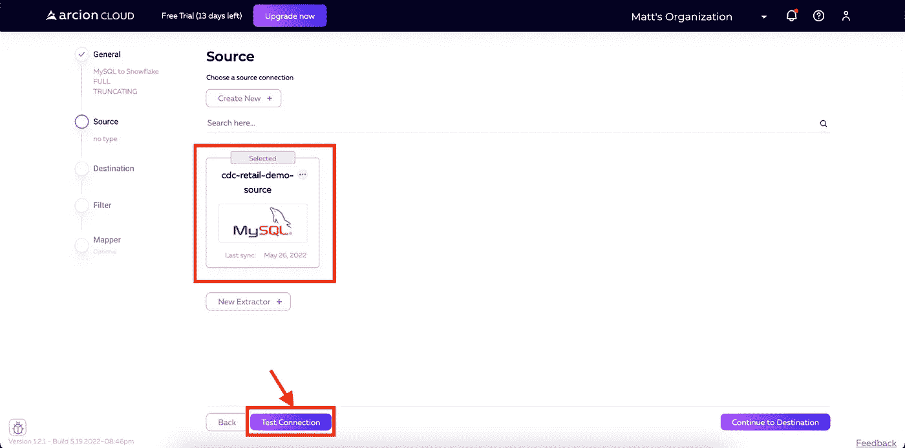

一旦测试运行完毕，结果应该是这样的。您可以单击“完成”按钮退出。

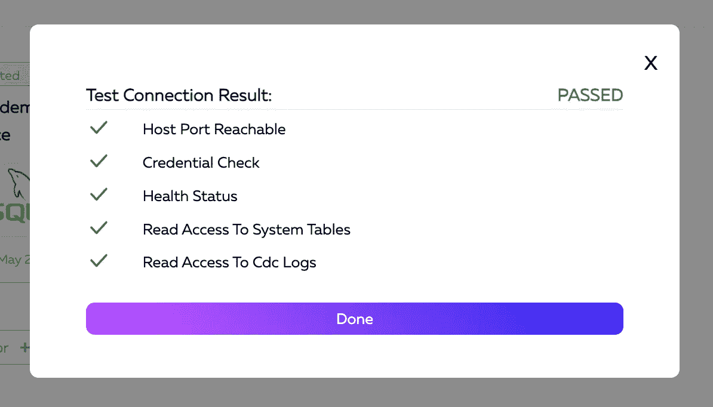

测试成功后，我们现在可以单击屏幕右下角的 Continue to Destination，转到设置目的地的步骤。

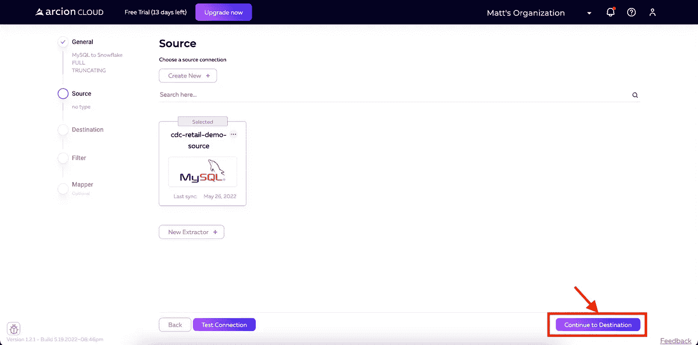

在 Destination 屏幕上，我们将单击 New Connection 开始设置我们的雪花连接器。

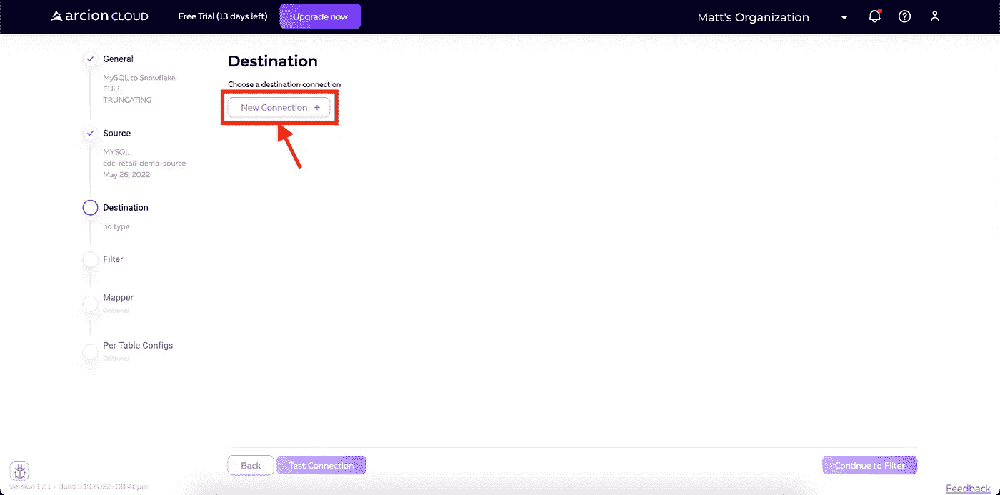

然后，选择雪花作为您的连接类型，并单击继续。


在下一个屏幕上，输入您的连接详细信息。这些细节包括:

*   连接名称
*   主持
*   港口
*   用户名
*   密码

所有其他字段将被默认。对于用户名和密码，我们将使用前面针对雪花实例运行的脚本中创建的用户。

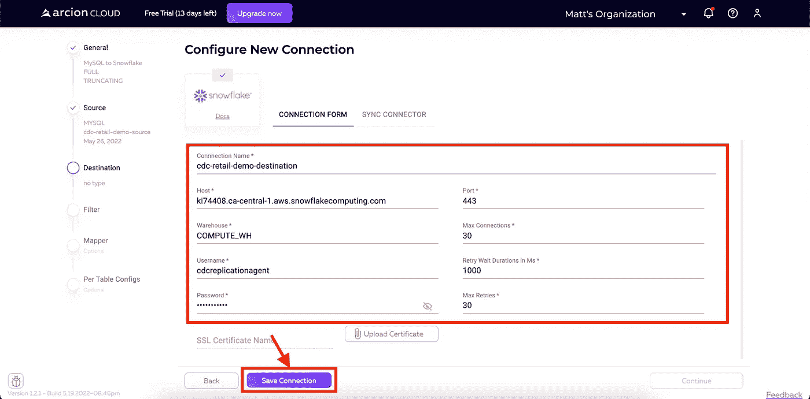

在下一个屏幕上，我们将同步连接器。单击同步连接器，并等待该过程完成。

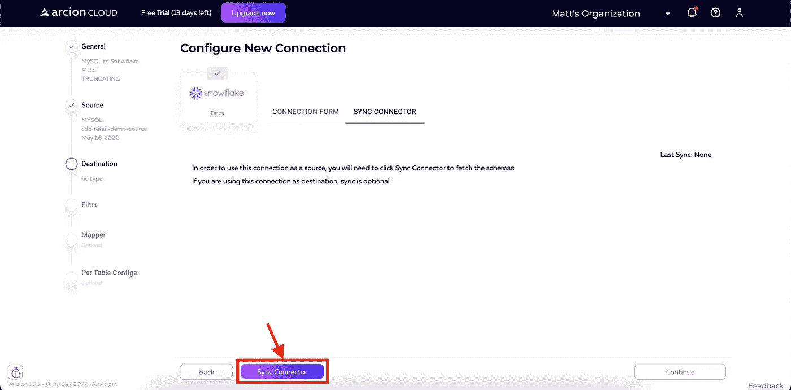

一旦完成，您将看到模式被加载到屏幕上。然后，我们可以单击屏幕右下角的继续。

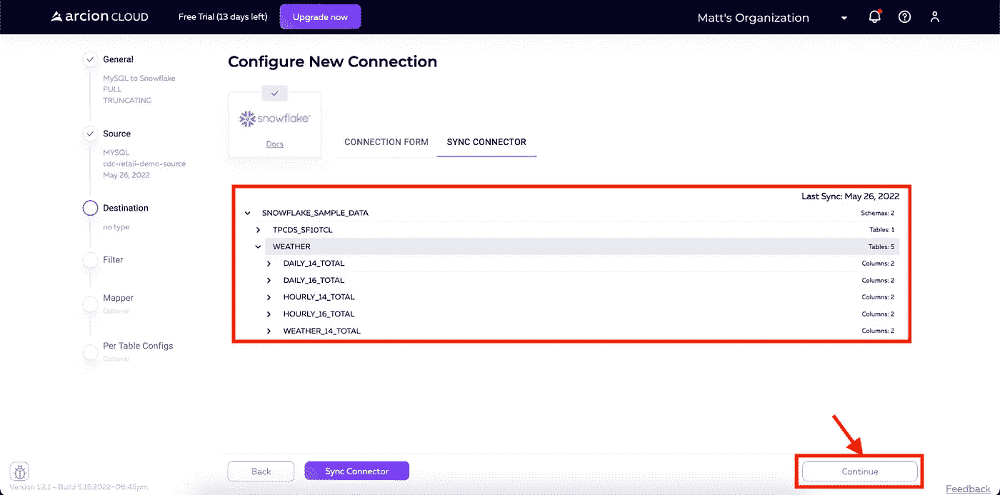

我们用雪花配置连接的最后一步是测试连接。我们将单击“测试连接”按钮，并等待结果返回到 Arcion Cloud。


您应该看到所有测试都已通过，以确保 Arcion 可以访问创建连接所需的所有内容。

> *注意:如果主机端口 Reachable 没有通过，请确保您没有在雪花连接的 URL 中包含“https://”。这可能会导致检查出错。*

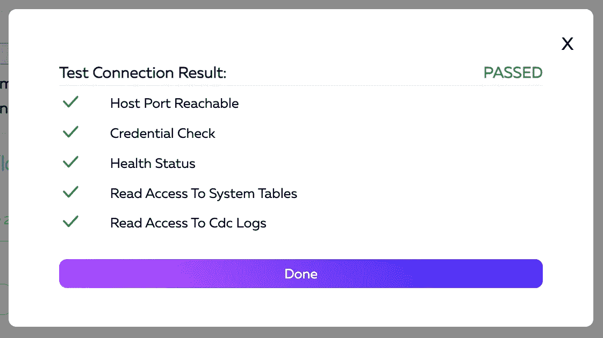

现在，我们可以单击 Continue to Filter 来开始管道的过滤器配置。

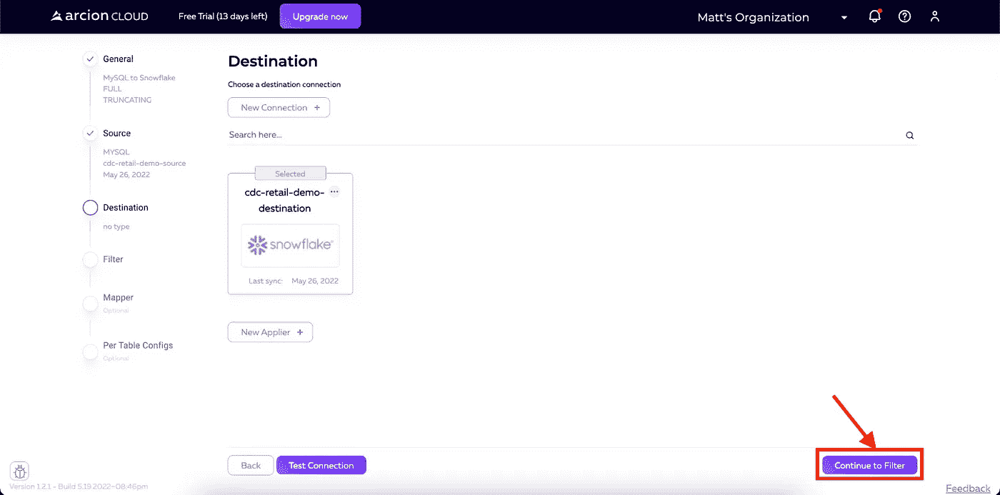

在 Filters 屏幕上，我们将选中 Select All 复选框，以便将所有表和列从源复制到目标。


或者，您也可以点击[映射表](https://docs.arcion.io/docs/references/mapper-reference/)和每表配置([应用程序配置文件](https://docs.arcion.io/docs/references/applier-reference/)、[提取程序配置文件](https://docs.arcion.io/docs/references/extractor-reference/))按钮来添加进一步的配置。出于我们的目的，我们将把它们保留为默认值。此后，您将单击“开始复制”。

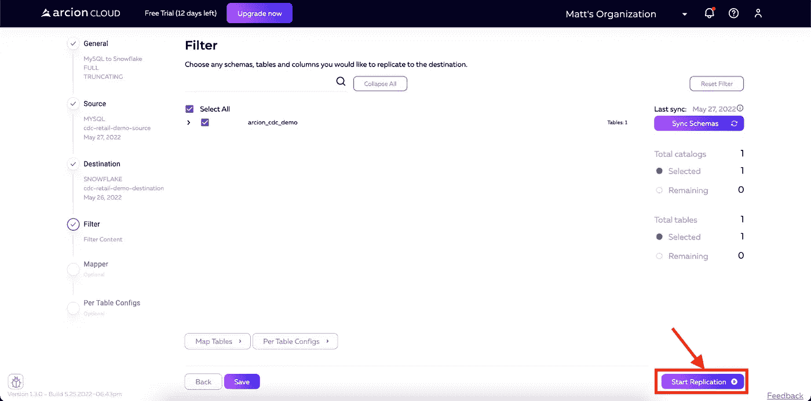

然后复制将开始。


加载初始数据后，管道将继续运行，监视更改，并将这些更改应用到目标。空闲管道仍将在屏幕的右上角显示正在运行，但将显示行复制率为 0，直到新数据写入源。您还会注意到，管道的阶段描述现在将显示变更数据捕获，而不是加载快照数据。


如果我们开始向 MySQL 实例添加数据(例如，通过再次运行我们的加载脚本)，我们将看到 Arcion 检测到这一点，然后将数据实时同步到 Snowflake。

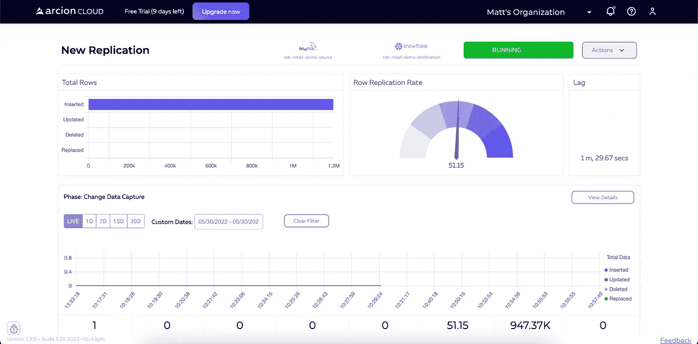

# 下一步是什么？

这样，我们就成功地通过 Arcion 建立了支持 CDC 的数据管道。我们来自 MySQL 的初始数据已经同步到雪花，未来的数据将实时转移到雪花。

这种实时数据移动到雪花中的特性可以支持许多需要即时访问与一个或多个数据源或主数据库同步的数据的用例。对于零售企业来说，几乎即时的库存和供应链管理、更好的客户体验和产品推荐现在可以通过这一管道和即时同步到雪花的数据来实现。这一新功能只需点击几下即可解锁。

Arcion Cloud 允许我们在几分钟内建立这些管道，只需最少的配置，以及管道运行后最少的支持和维护。首先，[注册一个 Arcion Cloud 帐户](https://hubs.ly/Q01cw66N0)( 14 天免费试用),了解如何创建和使用支持 CDC 的数据管道。