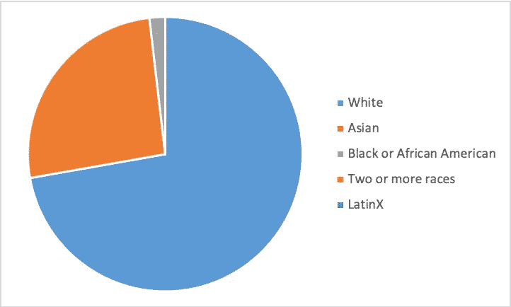
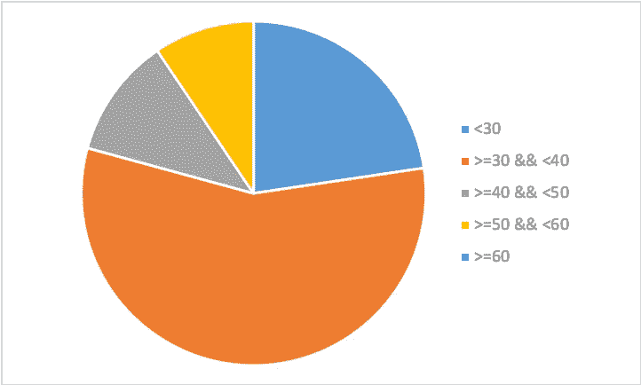
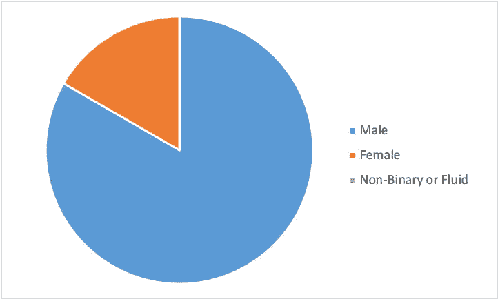
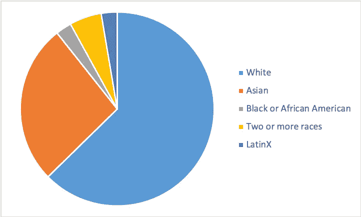
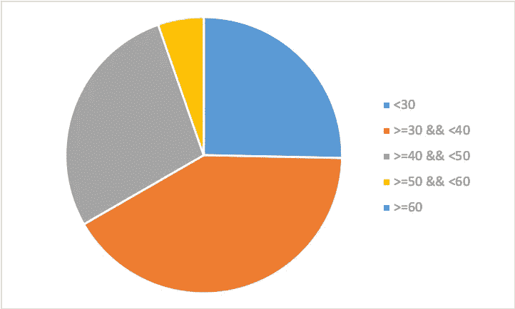
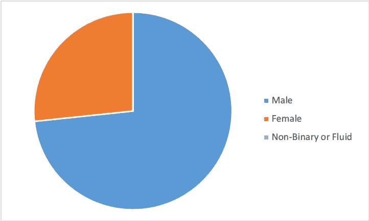

# 改变招聘方式，打造更加多元化的技术组织

> 原文：<https://betterprogramming.pub/changing-hiring-practices-to-build-a-more-diverse-technology-organization-a-case-study-from-avvo-4ae5e29e11d6>

## Avvo 的案例研究

# 介绍

2016 年至 2018 年，我在 Avvo 担任首席技术官，当时该公司被收购。我在那里任职期间最自豪的成就之一是建立了一个更加多样化和包容的技术团队。

虽然我以前谈过一些我们的努力，但我还没有写下来。尽管我们做得很好，但我还没有实现我加入公司时设定的宏伟目标。我一直希望在目前的公司做得更好，然后利用多次构建更加多样化的组织所获得的智慧来提供更高价值的洞察力。

鉴于当前的事件，我经常从科技公司的朋友那里听到，他们正在重新评估自己缺乏多样性的状况——他们希望改善。虽然公司多年来尝试了各种策略，但作为一个行业，我们并没有取得多大进展。如果你第一次尝试解决多样性问题，这是一项艰巨的任务。尝试一些事情，毫无进展，然后放弃，这很容易。

这篇文章并不是改善任何科技公司多样性的处方。这是一个关于我们如何在 Avvo 发展多元化的案例研究。我们采用的不同策略可能对你的努力有用，或者它们可能只是激励你去尝试适合你的公司和文化的新事物。

# 出发点

Avvo 是一个连接美国消费者和律师的在线法律市场。从性别和种族的角度来看，这家公司总体上相当多样化。2016 年我加入的时候，技术团队是另一番景象。

在我任职之初，技术团队不是非常多样化，如下图所示。此外，没有一个来自任职人数不足的群体的人有管理头衔。

这不是公开歧视的结果，但它表明缺乏对多样性、包容性和减少无意识偏见的优先考虑。

我对该公司的愿景是使其成为该地区多元化和包容性的典范。我不仅想让 Avvo 的技术团队多样化，以证明这是可能的。我还想展示一个多元化的团队更有能力。我知道我们可以利用我们的多样性作为我们雇主品牌的一部分，帮助我们在拥挤的人才市场中脱颖而出。

# 使提高多样性成为技术的优先事项

我定下了基调，打算把它作为我面试这个角色的一部分。我不希望其他高层领导和我之间有任何潜在的争议。

一旦我接受了这份工作，我的前公司会给我几个月的通知期。我利用这段时间与工程总监和招聘主管交谈，以优先考虑招聘中的多样性，设定预期，并开始建立更好的渠道。

# 建立联盟并设定期望

如果你正致力于建立一个更加多样化的团队，你必须招募合伙人。虽然这看起来很自然，但事实并非如此。招聘人员(尤其是外部招聘人员)被鼓励尽快结束角色。我接触过的大多数招聘人员都很乐意帮助寻找不同的候选人，但让他们知道你明白整个过程需要更长时间是很重要的。他们的经理理解这一点也很重要。

如果你有招聘经理向你汇报，你需要让他们也参与进来，并对这种努力感到兴奋。衡量一个经理的一个标准是他们招聘人才的能力。认真对待多样性可能意味着他们需要更长的时间来填补团队的角色。

你可能需要向他们保证，如果他们错过了他们的 KPI，你会考虑到这一点。您不能为您的经理设定或持有冲突的目标。如果你不能优先考虑建立多样化的团队而不是达到 KPI，你很可能两者都失败。

处理招聘时间增加的一个方法是比计划时间早得多开始寻找职位。在职位空缺之前，只关注那些代表性不足的候选人。与你的经理达成协议，如果你能尽早找到合适的候选人，你就可以雇用他们。如果你到了计划的职位空缺日期，但还没有找到合适的人选，你可以马上通过正常渠道打开人才库。

您的经理还需要了解多元化招聘对您 KPI 的潜在影响。

在经理的支持下，创建一个合理的 KPI 或 OKR 作为目标来跟踪你的努力。OKR 不仅会给你一个目标，还会给你一些掩护，如果你因为招聘速度较慢而需要做出一些权衡的话。与你的团队分享你的目标。定期向他们汇报你的进展。透明度是必不可少的，但也有助于让团队中的其他人尽自己的一份力量来帮助实现目标。

在 Avvo，我的多元化目标是我 OKRs 的一部分。我通过每月向组织更新来分享我们的进展。这种反复的交流展示了我对这个目标的重视程度，并实时显示了我们的进步。

好消息是，当你朝着目标前进时，你的雇佣时间会减少，同时保持或增加你的多样性。它确实变得容易了。随着你不断进步，你很快就会停止权衡取舍。

# 操纵面试过程

当我加入 Avvo 时，招聘流程包括多次预面试、一次在家编码挑战、一次审查会议、一次面对面的面试循环和一次后续会议。从招聘人员的第一封电子邮件到发出聘用通知，这个过程可能需要一个候选人一个多月的时间。即使不考虑多样性，对于一个想要成长的公司来说，这也不是一个有效的过程。

Avvo 流程通过设计将不合适的候选人拒之门外。然而，它没有找到合适的候选人。用机器学习的说法，错误拒绝率太高，无法避免提高错误接受率。如果你是想筛选掉，那你就错过了很多优秀的人。通常，偏见是过滤器的一部分。这些偏见加剧了多样性的缺乏。

当前流程的状态给了我一个许可证，让我可以做出一些剧烈的改变。我得到了招聘团队和许多经理的支持。他们都有因为流程过长而失去优秀候选人的经历。

有些员工和经理为当前的招聘程序辩护，认为这是保持开发团队质量的必要条件。幸运的是，他们是少数。在听到他们的立场并与他们讨论后，我决定继续前进，因为我知道我得到了大多数人的支持。

# 消除编码挑战

许多公司认为，在家编程挑战是在候选人身上投入太多时间之前确定其诚信的一种重要方式。许多资料从多样性的角度讨论了编码挑战的问题。以下反对这种做法的观点引起了我的共鸣:

*   候选人完成这些测试所需的时间往往比公司预期的要长得多。Avvo 的指导是，候选人在挑战上花费的时间不应超过两个小时。一位候选人估计他在这上面花了 12 个小时。他想确保自己表现出色。
*   编码挑战是对结果没有价值的无偿劳动。这一要求传达了一个信息，即公司不重视候选人的时间。我确实知道一些公司会向完成挑战的候选人支付象征性的费用。我鼓励这样做，但是消除挑战也解决了这个问题。
*   不是所有的候选人都有足够的时间来应对编码挑战。如果一个候选人在找工作，他们可能会受到多家公司的挑战，每家公司都希望工作几个小时。候选人可能已经从事了一份压力很大的工作或者多份工作。他们可能是孩子或其他亲属的看护人，或者有很长的通勤路程，以便他们可以住在负担得起的房子里。候选人可能有其他问题需要他们的时间。这种挑战对那些人来说可能是不合理的负担。
*   编码挑战要求候选人具备完成项目所需的设备和连通性。对于软件开发人员来说，这个需求看起来并不是一个不合理的期望，但是并不是每个开发人员都有经济或个人安全来实现这一点。

以上所有这些综合起来，造成了对那些在时间和经济上没有明显限制的人的偏见。这些偏见强化并延续了行业多样性的缺乏。

作为招聘过程的一部分，了解候选人的技术成熟度仍然至关重要。在本文稍后描述的访谈循环中，我们将编码挑战替换为多个面对面的挑战。为了避免让我们的面试官不知所措，我们注重确保招聘人员和招聘经理的筛选建立了一个高文化和技术标准。对筛选的这种期望要求对招聘经理进行培训，让他们知道向不同级别的候选人提问的问题。随着我们对这一流程的熟悉，新的筛选流程在确定候选人方面取得了同等程度的成功，同时增加了候选人群体的多样性，并显著缩短了招聘时间。

# 面试循环

有很多文章是关于在面试环节减少偏差的。我们将我们认为最能与我们的文化产生共鸣的想法，以及我从以前的公司那里体验到的一些最好的想法结合起来。

# 面试官培训

我们要求参与面试环节的任何人都要参加两个培训课程:

*   我和我团队的招聘负责人展示了一份全面的面试官培训。这种培训包括许多传统面试培训的标准内容。
*   由 Ada 开发人员学院(一个西雅图开发人员培训项目，主要针对女性和不同性别的人)领导的隐性偏见培训。我们从 Ada 雇佣了实习生，他们的导师被要求参加这个课程。这是如此的有价值，以至于我们和 Ada 达成协议，在 Avvo 时不时地展示这堂课，以帮助我们的面试官培训。

我们还要求所有参加面试的人都必须在面试问题上合格。

不同学科的一组开发人员聚集在一起，创建两到三个技术问题来解决他们每天所做的工作类型。每个问题在一个 3×3 的网格中有一组代表性的答案。一个轴代表候选人的经验水平。另一条轴线是不可接受的、可接受的和极好的解决方案。

我们问任何候选人同样的问题，不管他们的职位级别或经验水平如何。随着时间的推移，当我们听到候选人的新答案时，我们增加了代表性答案的集合。

为了就这个问题进行训练，理想情况下，面试官会尝试自己回答这个问题。然后他们会观察一个训练有素的面试官和一个候选人一起工作两次。然后一个训练有素的面试官会看着他们和一个候选人一起解决这个问题。

只有所有这些步骤都完成了，这个人才能面试候选人。任何训练有素的面试都可以面试任何一个团队招聘的那个学科的角色。对面试官没有要求。

# 面试官小组

我们确保在任何面试小组中至少有一个人来自代表性不足的群体。这个要求一开始很有挑战性。一些面试官最后有很多面试要做。

我们认为这很重要，原因有二。如果我们采访的人来自代表性不足的群体，他们会看到和自己一样的人，并能够就他们的经历提出问题(如果他们愿意的话)。如果我们面试的人不是来自代表性不足的群体，我们可能会捕捉到任何危险信号，表明他们可能在多元化的环境中面临挑战。

这种做法被证明是非常有价值的。

# 面试

由于面试培训需要跟班，几乎每次面试都会有两个人参加面试小组。一个人与候选人一起工作，一个人观察讨论。这种配对意味着招聘经理对会议中发生的事情以及候选人如何回答不同的问题有两种解释。多重视角有利于减少采访者偏见的影响。

我们提议让候选人携带他们选择的工具，这样他们会感到舒服，而不是给候选人提出一个抽象的问题，让他们在白板或公司的笔记本电脑上解决它。面试官和应聘者合作解决了技术难题。这种方法反映了 Avvo 的许多团队以结对编程方式工作的方式。目标是尽可能地重现我们团队的实际工作环境。

# 作为包容性技术雇主赢得信誉

如果 Avvo 在市场上看不到它是一家认真对待多样性和包容性的公司，那么仅仅改进我们的面试流程不会产生重大影响。

这个团队已经有很多人在 Ada 开发者学院做志愿者，但是从来没有雇佣过实习生。我们在他们的下一批中雇佣了来自 Ada 的前两名实习生。

随后，我们加入了新的华盛顿技术助理 Apprenti 计划(一个注册的技术学徒计划，重点关注代表性不足的群体和退伍军人)。我们还从该项目的第一批学生中雇佣了两名学徒。

我们总是成双成对地雇佣实习生和学徒，因为我们想确保他们除了 Avvo 的导师之外，还有其他人有类似的经历，可以相互支持。

与这些项目合作让我们与深深融入社区的人们成为伙伴。我们想学习和倾听。与他们一起工作也让我们认识了他们的志愿者，这些志愿者通常是来自其他公司的经验丰富的开发人员，他们强烈感受到在技术领域增加代表性的重要性。

除了我们与培训项目的合作伙伴关系，我们还确保参加了代表人数不足的群体的当地聚会。我们的招聘人员、工程经理、开发人员或我都会参加这些会议，倾听并了解这些群体在行业中面临的挑战。我们也建立了关系网，但起初只是试探性的。我们希望建立信誉，而不是只参加一次会议就消失。

为成为社区的一部分所做的持续努力教会了我们很多，也让我们意识到我们在 Avvo 想要做什么。候选人会申请并提及他们在公司已经见过的不同的人。Avvo 已经在主持不同技术的会议了。随着来自代表性不足的群体的候选人参观我们的办公室，这些会议最终开始变得更加多样化。

# 发展文化

对增加多样性的关注没有得到普遍支持。当我加入的时候，技术团队文化不是很包容，有些人抗拒做出任何改变。

我继续教育和讨论，但我也继续坚定地向前推进。

我们的敏捷教练和我教授新的、更具包容性的会议和讨论促进技术。一位高级经理为组织中的每个人启动了一项指导计划，旨在为每个人提供支持，尤其是那些可能有冒名顶替综合症的人。

最终，那些对新文化不感兴趣的人决定寻找其他机会。最终，这只是团队中相对较小的一部分。大多数人对成为新文化的一部分感兴趣。

# 结果呢

在不到两年的时间里，我们将女性在技术团队中的比例从 17%提高到了 27%。我们将黑人、拉丁裔和多种族人口的比例从 2%提高到了 11%。我们的年龄多样性也显著改善。我们这样做的同时，团队的规模增加了近 50%。在此期间，我们还显著提高了员工的净推广分数。

如果有一件事对我来说很突出，那就是我们的一位开发商在我们收购后的一次市政厅会议上提出的问题。市政厅由收购公司的执行团队主持，回答新员工的问题。Avvo 开发人员说:“我们为 Avvo 技术团队的多样性感到非常自豪。你做了哪些努力来确保你的团队是多元化的？”

# 感谢

这篇文章中有几个人是按标题提到的。我想在这里感谢他们，因为这是一个团队的努力，没有他们的参与和领导就不会成功。具体来说:拉奎塔·赫斯特(LaQuita Hester)，一位致力于改善科技行业多样性的出色招聘人员；亨特·戴维斯，工程总监，我们导师项目的创建者和指导者；工程总监贾斯汀·维斯；工程经理莱斯利·扎维斯卡。

许多许多其他人在大大小小的方面都发挥了作用。每个开发人员、测试人员、数据科学家和管理人员都提供了帮助。

我还想感谢我的高管团队同事，他们建立了一家优秀的公司，并在我带领我的团队达到更接近他们所创造的多元化水平时给予了我支持。与我同行的高管有马克·布里顿、埃里克·达尔伯格、莫妮卡·威廉姆斯、巴瓦尼·穆鲁格亚、萨钦·巴蒂亚、凯利·麦吉尔和杰森·莫斯。