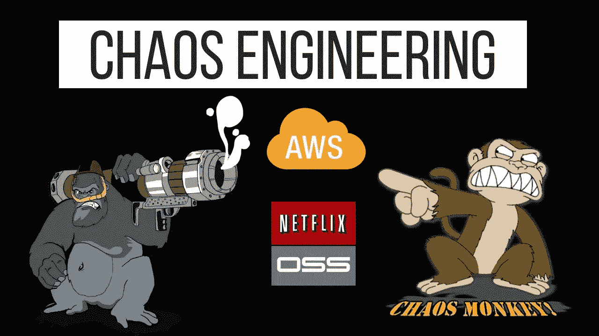
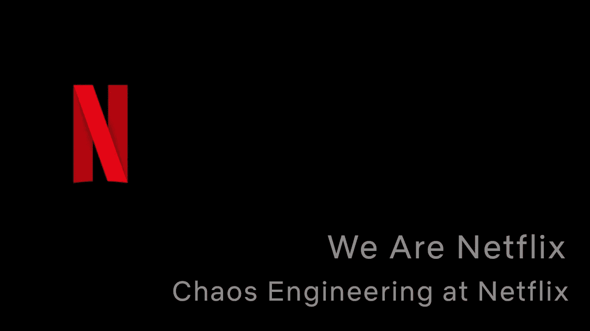

# 混沌工程

> 原文：<https://betterprogramming.pub/chaos-engineering-and-open-sourcing-of-netflix-chaos-generator-chaos-monkey-a68873f46269>

## 开源网飞的混沌生成器，混沌猴

网飞正在证明，考虑迁移到云基础设施的公司需要构建他们的系统才能不失败。

短语*注定失败*不会激发信心，暗示一个产品即将崩溃。

在我们为术语*混沌工程*的解释设置任何背景之前，我们相信你必须拥有一些关于软件开发周期中测试重要性的知识。这就是智能测试案例和概念出现的地方。

在这个增量发布和敏捷开发的时代，为了给用户提供无缝的、完美的、一致的体验，对软件的持续检查是必不可少的。

目前，技术组织正在实施现代化和自动化的方法来全面彻底地测试软件。

考虑到现代技术基础设施和分布式系统，从各个角度来看，测试似乎更棘手，更难检查。因此，组织正在开发更智能的方法来测试他们的系统，从单元到功能，再到基础设施测试。

其中一个由网飞提出的概念是混沌工程。

# 混沌工程:网飞方式的基础设施测试

混沌工程是由网飞推出的，该公司是全球最大的媒体订阅服务公司之一，拥有约 1.5 亿付费订阅用户。

在我们理解这个概念之前，这里有一个我们将在这个博客中使用的术语的简要解释。

在现代应用程序生命周期中，全球的科技公司使用四种环境来开发软件。

*   开发环境:开发/编码程序的地方。
*   测试环境:产品被复制并被仔细测试以使其按预期运行。
*   验收测试环境:客户测试系统并验证它是否符合预期。
*   生产环境:产品通过验收测试后所处的实际环境。

# 什么是混沌工程？

大规模分布式软件系统的进步正在改变软件工程的游戏规则。作为一个行业，我们很快采用了增加开发灵活性和部署速度的实践。

一个紧迫的问题紧随这些好处而来:“我们对投入生产的复杂系统能有多少信心？”

用最简单的术语来定义，混沌工程是一种在生产环境中识别系统漏洞的训练有素的方法。实施它是为了检查系统的可靠性、稳定性以及在不稳定和意外条件下的生存能力。

当我们考虑大规模分布式系统时，有许多失败的机会，包括应用程序失败、网络失败、基础设施失败、依赖性失败等等。

此外，该系统是在微组件中开发的，并部署在支持云的架构上，这使得它更容易出现故障和中断。

# 混沌工程的必要性

以下几点证明了混沌工程的合理性:

*   它提高了系统的弹性。
*   你会了解这个系统的弱点。
*   它本质上是主动的，而不是传统测试的被动性质。
*   它暴露隐藏的威胁并最小化风险。

# 混沌工程与测试的区别

测试的第一个概念是它有几组输入和预测输出来获得期望的系统行为。它的范围有限，因为它不会产生任何关于系统在出错时将如何表现的全新知识。

混沌工程进行广泛、仔细和不可预测的实验，产生关于系统行为、性质和性能的新知识。它有一个更广泛的范围和计划外的组合，以观察系统非常密切的各种研究形式。

混沌实验是无限的，创造了更多的机会从各个角度测试系统。你可以故意制造混乱来检验一个系统是否能够承受。

# 网飞进入混沌工程领域

2011 年，网飞决定从物理基础设施转向云，为用户提供更好的视频流体验。

网飞工程工具团队提出了一个创新的想法，在不影响客户服务的情况下测试系统的容错能力。

他们创造了[混沌猴子](https://github.com/Netflix/chaosmonkey)工具，其灵感来自一只猴子进入农场并随机破坏物体的想法。

来自网飞科技博客:

> “混沌猴是一种工具，它随机禁用我们的生产实例，以确保我们能够在这种常见类型的故障中生存下来，而不会对客户造成任何影响。”

与物理环境不同，网飞的云移动被认为有更多的故障，因为它在本质上是抽象和分布的。在网飞系统中运行混沌猴子工具的原因很简单:

> 云是关于冗余和容错的。由于没有一个单独的组件可以保证 100%的正常运行时间(即使是最昂贵的硬件最终也会出现故障)，因此我们必须设计一种云架构，在这种架构中，单个组件出现故障也不会影响整个系统的可用性。实际上，我们必须比最薄弱的环节更强。— [网飞科技博客](https://medium.com/netflix-techblog/the-netflix-simian-army-16e57fbab116)

在混沌猴子工具取得成功后，网飞团队创建了一套支持混沌工程原则的工具，并将其命名为[猿猴军](https://github.com/Netflix/SimianArmy)，以检查 AWS 基础设施的可靠性和弹性。

现在，该项目已进入退休状态，新项目只是混沌猴。

# 网飞开发的工具列表

*   混沌猴
*   潜伏猴
*   猴子医生
*   从众猴
*   看门猴子
*   安全猴子
*   混乱大猩猩
*   10-18 只猴子

这些都是混沌工具，它们不断地针对各种故障测试系统，为系统的生存能力建立更高层次的信心。

# 如何在云基础设施中使用混沌工程？

你可能会说:“我们不是网飞，我们没有像网飞那样的大规模系统或庞大的客户群。”

确实如此。但是，随着时间的推移，它已经演变，并不局限于一个组织或像网飞这样的数字公司。

有许多拥有庞大客户群的公司致力于为他们的用户提供无缝体验。此外，为了确保一致的性能和持续的可用性，医疗保健、教育和金融机构正在实施混沌实验。

# 实施混沌工程的四个基本步骤

分布式系统中的混沌需要两个组来控制和监控活动——一个实验组进行实验，另一个控制组处理实验的效果。

*   定义代表系统正常行为的稳态。
*   混沌工程师假设出问题时的预期结果。
*   设计带有变量的实验，以反映真实世界的事件，如依赖性故障、服务器故障、网络或内存故障等。
*   测量测试的影响并观察两组中稳态的差异。

如果一个工程团队能找到系统的弱点，那么这就是一个成功的混沌实验，否则，他们就扩大自己的假设边界。

当发现弱点时，团队在问题变成系统范围的麻烦之前解决并修正这些问题。

注意:由于混沌实验是在生产环境中进行的，或者更接近生产环境，因此客户体验可能会受到影响。所以，计划最小的实验并准备好小心处理影响总是明智的。

# 混沌工程的最终目标:发现“假设”场景

由于其复杂性和大规模性，分布式系统通常会有更多的故障点。混沌工程试图发现这些故障点，并确定在资源或对象不可用的情况下会发生什么。

在像 DevOps 和微服务架构这样的现代软件开发方法中，这是一个非常合适的实践。

今天，不仅仅是网飞，许多大型组织都在使用它来确保系统能够承受任何故障，然后，他们在混沌实验中修复系统中的问题。

# 使用混沌工具的公司

*   脸谱网
*   谷歌
*   微软
*   亚马孙
*   特维利奥
*   商务化人际关系网

# 混沌工程和 DevOps:在频繁的发布中更好地理解你的系统

对于 DevOps 驱动的软件开发，混沌原理是测试系统抗失败能力的最佳方法。

系统架构师和测试人员急于发布软件，当您在分布式、不断变化和复杂的开发方法中执行混沌工程时，您可能会发现未知的情况。

在过去的几年里，我们已经看到了软件开发框架和方法的巨大变化。Monolithic 已经被云和微服务架构所取代，以高速构建软件。

这里，混沌也工作得最好，因为它有可能识别在系统的微服务结构中常见的依赖故障或联合故障点。

# 混沌工程:不仅仅是一种预防机制

当理解混沌原理背后的思想时，这句话更有意义。您需要从失败中吸取教训，以改进您的系统，使其更具弹性，并增加对系统能力的信心。

有许多工具可用于混沌，许多组织正在试验不同的技术和工具，以使其成为更成熟和有用的方法。

通过有意在系统中制造混乱，组织可以实现长期的软件弹性。当我们谈论具有更快发布周期的分布式系统时，弹性和质量被认为是重要的因素。