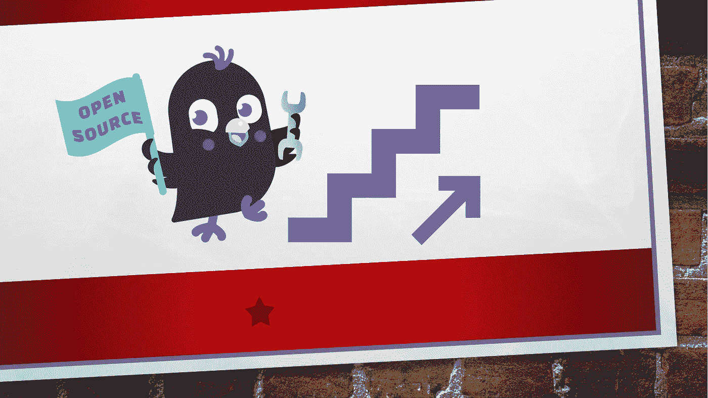

# 聊天机器人和 Rasa 2.0 的新功能

> 原文：<https://betterprogramming.pub/chatbots-and-whats-new-in-rasa-2-0-a51c61ca3c33>

## 探索一种新的方式来构建您自己的上下文聊天机器人



图片作者。Rasa 开源图标取自 [Rasa Github](https://github.com/rasahq/rasa) 。

[Rasa 开源](https://rasa.com/)是一个机器学习框架，用于构建基于文本和语音的聊天机器人。最近，其背后的团队成功达到了一个显著的里程碑，并于 2020 年 10 月发布了他们的第一个正式版本 2.0。新版本旨在统一训练数据格式、配置文件和处理模型的方式。因此，与以前的版本相比，有相当多的重大突破性变化。

在本教程中，我们将深入探讨 Rasa 1.10 和最新发布的候选版本之间的一些主要差异。在为旧的 Rasa 服务器执行迁移之前，您应该检查它并确定是否值得这样做。

# 文件夹和文件层次结构

文件夹和文件的结构或多或少类似于以前的版本，但有以下例外:

*   `actions.py`不再在根目录下。
*   在`actions.py`所在的地方有一个名为`actions`的新文件夹。
*   在`data`文件夹中还有一个名为`rules.yml`的附加文件。

# 配置

## config.yml

2.0 版现在提供了管道和策略的默认配置。这对新用户来说方便多了。说了这么多，还是可以自定义的，格式和之前的版本一模一样。

## 管道

 [## 组件| Rasa 开源文档

### 如果您想在您的…中使用预训练的单词向量，以下组件将加载所需的预训练模型

rasa.com](https://rasa.com/docs/rasa/components) 

大多数内置`tokenizers`现在已经标准化为具有以下属性:

*   `intent_tokenization_flag` —检查是否拆分意图的标志
*   `intent_split_symbol` —意图应分割的符号
*   `token_pattern` —检测令牌的正则表达式

这些键用于[多意图分类](https://rasa.com/docs/rasa/tuning-your-model#doing-multi-intent-classification)。目前只对`DIETClassifier`有效。

请看下面的`WhiteSpaceTokenizer`代码片段:

```
pipeline:
- name: "WhitespaceTokenizer"
  "intent_tokenization_flag": False
  "intent_split_symbol": "_"
  "token_pattern": None
```

此外，酒店`case_sensitive`已经从`tokenizers`移到了`featurizers`。除非使用以下组件，否则可以安全地忽略该属性:

*   `KeywordIntentClassifier`
*   `SpacyNLP`
*   `RegexFeaturizer`

## 政策

 [## 政策| Rasa 开源文档

### 您的项目的 config.yml 文件带有一个 policies 键，您可以使用它来自定义您的助手使用的策略…

rasa.com](https://rasa.com/docs/rasa/policies) 

增加了一个名为`RulePolicy`的新策略。这对于总是有固定行为的对话很有用。它与故事略有不同，应该与故事一起使用以获得更好的性能。你需要在你的`config.yml`中有`RulePolicy`才能使用`Rules`和`Forms`。在实现以下功能时，它非常有用:

*   一轮互动，如常见问题
*   后退行为
*   处理表单中不需要的行为

此外，以下政策已被弃用，转而支持`RulePolicy`。您仍然可以使用`RulePolicy`及其各自的`classifiers`实现相同的功能。

*   映射策略
*   后备策略
*   两阶段回退策略
*   表单策略

## 进口商

 [## 培训数据导入器| Rasa 开源文档

### 默认情况下，您可以使用命令行参数来指定 Rasa 应该在磁盘上的什么位置查找训练数据。拉莎…

rasa.com](https://rasa.com/docs/rasa/training-data-importers) 

默认情况下，Rasa 使用`RasaFileImporter`。现在，您可以创建自己的数据解析器来加载其他格式的训练数据。如果您的训练数据来自不同的资源，这将非常有用。

此外，还有一个名为`MultiProjectImporter`的实验特性，它允许您将多个 Rasa 项目的数据集合并成一个。例如，您可以将项目模块化为以下子项目:

*   餐馆机器人
*   房间预订机器人
*   聊天机器人

然后将它们组合起来，创建一个成熟的聊天机器人。

# 领域

## domain.yml

`domain.yml`的数据结构保持不变，除了你需要在它的顶部指定版本。您需要为您的所有培训数据文件指定此选项。如果省略，默认情况下，Rasa 会将其读取为 2.0 版。

```
version: "2.0"intents:
  - greet
  - goodbye
  - affirm
  - deny
  - mood_great
  - mood_unhappy
  - bot_challenge
```

# 训练数据格式

2.0 版本中一个重大的突破性变化是训练数据格式。

## NLU

对于 NLU 培训数据，版本 2.0 的新结构如下:

```
version: "2.0"nlu:
- intent: greet
  examples: |
    - Hey
    - Hi
    - hello- intent: goodbye
  examples: |
    - Goodbye
    - bye bye
```

## NLU 元数据

事实上，您现在可以声明额外的包含任意键值对的`metadata`。`metadata`可由您的定制组件访问。例如，您可以将其声明如下:

```
nlu:
- intent: greet
  metadata:
    sentiment: neutral
  examples:
  - text: |
      hi
  - text: |
      hello
```

在上面给出的例子中，`metadata`是在意图级别声明的。因此，所有的例子都包含了`metadata`。您可以为每个示例单独声明`metadata`。

```
nlu:
- intent: greet
  examples:
  - text: |
      hi
    metadata:
      sentiment: neutral
  - text: |
      hello
```

## 检索意图

在旧版本中，检索意图是一个实验性的特性，其中一个意图可以被分类为更小的子意图。这对于闲聊很有帮助，因为它减少了你的故事的开销。你需要使用 `/`符号来区分主要意图和次要意图。请看下面这个带有两个子意图的`chitchat`意图的例子:

*   `ask_name`
*   `ask_weather`

```
nlu:
- intent: chitchat/ask_name
  examples: |
    - What is your name?
    - May I know your name?- intent: chitchat/ask_weather
  examples: |
    - What is the weather?
    - May I know the current weather outside?
```

与正常意图不同，答案必须放在`responses.yml`而不是`domain.yml`中。该文件应该位于`data`文件夹下，格式与`domain.yml`完全相同。这意味着您可以有多种变化，并指定不同的有效载荷。

```
responses:
  utter_chitchat/ask_name:
    - text: "I don't have a name!" utter_chitchat/ask_weather:
    - text: "It is sunny"
    - text: "It is raining heavily outside"
```

## 实体

实体的格式仍然与以前的版本相同，包括实验角色和组标签。如果您没有意识到，角色和组标签可以用来区分同一实体中的某些概念。考虑下面的例子:

```
Book me a flight from [Malaysia]{"entity": "country"} to [Singapore]{"entity": "country"}.
```

从人的角度来看，尽管两个实体都指国家，但我们知道第一个`country`指的是出发地，而第二个`entity`指的是目的地。我们可以使用这个实验特征来标记它，如下所示:

```
Book me a flight from [Malaysia]{"entity": "country", "role": "departure"} to [Singapore]{"entity": "country", "role": "destination"}.
```

你需要提供足够的数据来推广它。在这种情况下，您应该具备以下条件:

```
... from Malaysia to Singapore ...
... from Singapore to Malaysia ...
```

## 同义词

同义词的声明方式与 NLU 数据相同，只是将单词 *intent* 替换为 *synonym* 。看看下面的例子:

```
nlu:
# greet & goodbye intent- synonym: credit
  examples: |
    - credit card account
    - credit account
```

## 正则表达式

同样，您可以使用相同的风格通过 regex 捕获实体。下面的例子演示了一个正则表达式，用于捕获邮政编码的五位数字。

```
nlu:
# greet & goodbye intent- regex: zipcode
  examples: |
    - \b\d{5}\b
```

## 查找表

至于查找表，应该按如下方式编写:

```
nlu:
- lookup: fruits
  examples: |
    - apple
    - banana
    - papaya
    - watermelon
```

确保查找表中的数据是干净的，以防止不必要的行为。

## 故事

你可以把这些故事和 NLU 合并成一个文件，但是强烈建议把它们分开。与旧版本相比，新格式更加冗长，但它确实有助于区分意图和行动。因此，在构建你的故事时，你不太可能犯不必要的错误。

```
version: "2.0"stories: - story: happy path
   steps:
   - intent: greet
   - action: utter_greet
   - intent: goodbye
   - action: utter_bye
```

类似于 NLU，你可以定义`metadata`内幕来存储与故事相关的相关信息。`metadata`不用于培训，不会影响您的故事的表现。

```
stories: - story: happy path
   metadata:
     author: wfng
     key: value
   steps:
   - intent: greet
   - action: utter_greet
   - intent: goodbye
   - action: utter_bye
```

对于检索响应，它应该以`utter_` 开始，而不是旧的`respond_`前缀。

```
stories:
 - story: story with a retrieval action
   steps:
   - intent: chitchat
   - action: utter_chitchat
```

## 形式

表单现在是培训数据的一部分，而不是 Rasa SDK。表单需要`RulePolicy`，默认情况下它已经在配置中了。首先，您应该将其定义如下:

```
forms:
  your_form:
    age:
    - type: from_entity
      entity: age
```

然后您可以指定`action`和`active_loop`字段，Rasa 将在其中循环并调用`utter_ask_{form_name}_{slot_name}`或`utter_ask_{slot_name}`，直到实体`age`被填充。你需要在你的回答中定义它们。

```
stories:
 - story: form asking for age
   steps:
   - intent: intent_ask_age
   - action: your_form
   - active_loop: your_form
```

## 检查点和 OR 语句

你仍然可以在你的故事中使用[检查点](https://rasa.com/docs/rasa/training-data-format#or-statement)和[或者陈述](https://rasa.com/docs/rasa/training-data-format#or-statement)。但是，强烈建议不要接触这些功能，因为过度使用它们会对训练时间产生很大影响。

## 规则

规则描述了对话的一小部分，它总是有一个固定的路径。你可以把它想成是一轮互动，其中将返回相同的答案。与故事不同，规则不概括，主要用于回答常见问题。这类似于 Rasa 1.0 中`domain.yml`中`trigger`通过`MappingPolicy`的用法。假设每当用户问候机器人时，机器人应该总是用`utter_greet`来响应。您可以使用如下规则轻松定义它:

```
rules: - rule: Say `hello` whenever users greet the bot
   steps:
   - intent: greet
   - action: utter_greet
```

此外，您可以在规则中指定以下键:

*   `conversation_started`
*   `condition`

通过将`conversation_started`键设置为`true`，该规则将仅在会话开始时触发一次。在这种情况下，机器人将不会在稍后的对话中使用`utter_greet`进行响应。

```
rules: - rule: Say `hello` when users greet the bot at the beginning
   conversation_start: true
   steps:
   - intent: greet
   - action: utter_greet
```

您可以使用`condition`根据一个槽是否被填充或者是否有一个`active_loop`事件来约束规则。

```
rules: - rule: Say `hello` whenever users greet the bot and slot was set
   condition:
   - slot_was_set:
     - user_provided_name: true
   steps:
   - intent: greet
   - action: utter_greet
```

一旦规则到达最后一步，默认行为是等待用户输入。您可以通过将`wait_for_user_input`键设置为`false`来修改该功能。

```
rules: - rule: Rule which will not wait for user input
   steps:
   - intent: greet
   - action: utter_greet
   wait_for_user_input: false
```

## 试验

供您参考，您可以编写测试对话来测试您的聊天机器人的性能。该功能在旧版本的 Rasa 下已经可用。版本 2.0 的测试用例应该编写如下:

```
stories:
- story: happy path 1
  steps:
  - user: |
      hello there
    intent: greet
  - action: utter_greet
  - user: |
      see you later
    intent: goodbye
  - action: utter_bye
```

# 结论

让我们回顾一下今天所学的内容。

我们从介绍 Rasa 开源 2.0 开始。

在新版本中，文件夹结构和配置文件或多或少是相同的，只有一些小的变化。一些政策被否决，转而支持`RulesPolicy`。

然后，我们继续讨论 Rasa 1.10 和 2.0 之间的重大突破性变化。，这是训练数据格式。我们深入探讨了 NLU 的新数据格式、故事、规则等等。

到目前为止，您应该对即将发布的 Rasa 2.0 稳定版有一个大致的了解。

感谢你阅读这篇文章。希望在下一篇文章中再见到你！

# 参考

1.  [Rasa 开源 2.0 的未来](https://blog.rasa.com/whats-ahead-in-rasa-open-source-2-0/)
2.  [Rasa 文档](https://rasa.com/docs/rasa)