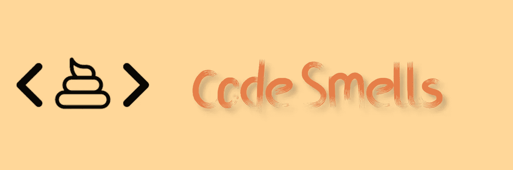

# 常见的代码气味

> 原文：<https://betterprogramming.pub/common-occurring-code-smells-59c180b29e95>

## 改进代码库的 5 种方法

# 什么是代码气味？

你可能会想:“什么？代码怎么会有味道？”

读完这篇文章后，你会同意代码真的很臭！代码气味是软件中糟糕的设计和实现的征兆。

因此，正如这个词已经表明的，代码味道在你的软件中不是一件好事。代码味道或反模式通常是由糟糕的设计和编写软件代码时的不当行为造成的。

在本文中，我将讨论五种常见的代码味道。所以，让我们深入研究一下。

# 1.评论

你可能会想:“什么？注释对于我们的代码文档非常重要。”

是的，从技术上讲，你是对的，但是太多的评论是糟糕设计的标志。那么，怎么知道自己的评论是不是代码味呢？

如果你的评论解释了设计以及你是如何实现的，那么这可能是糟糕设计的一个征兆，因为好的设计应该是不言自明的。

看看下面这个方法的注释，注意注释是如何被用来定义它是如何工作的。

那么，解决办法是什么？最好的注释是一个方法或类的好名字。

评论只是不好的代码味道的除臭剂。

# 2.大班

大班是有太多责任和太多功能要处理的班级。由于结构复杂，大班很难理解和维护。

这些类也被称为“神类”、“斑点类”、“黑洞类”等。这种代码味道在开始时是闻不到的，因为它是不断变化和特性添加的结果，使该类变得肥胖或庞大。

为了解决这个问题，你需要明确这个类的责任，并且始终坚持高内聚。

# 3.猎枪手术

暴力，我知道。我没有给这些气味命名，我只是把它们呈现给你。

这是最常见的代码气味之一。这指的是这样一个过程，在这个过程中，一个地方的更改需要您修复代码中的许多其他区域，作为该更改的结果，您最终会更改多个文件。

这有时会导致整个软件的连锁反应，有时会导致整个系统的失败。

你通常可以通过改变方法来解决猎枪手术的味道。如果您发现一个更改需要您对许多不同类中的许多方法进行更改，那么这可能是一个指标，表明这些方法可以更好地合并到一个或两个类中。

但这并不是说，你应该将方法转移到一个类中，这样你就只需要在一个类中进行修改。又是那个“大班”的代码味。如果对你有意义，你应该移动它们，并且要小心。

# **4。特色羡慕**

又是一个奇怪的名字，对吧？

当一个类对其他模块的细节比对它所在的模块更感兴趣时，就会产生特性嫉妒。

这听起来像是浪漫电影中的一对恋人对其他人的承诺，并且仍然对彼此感兴趣。你这么想让他们见面。

好吧，这就是你需要做的，以解决代码的味道。你应该把它放在那个模块里。类似的事情也适用于方法，一个与另一个类的方法交互多于自己的方法的方法应该只被移到那个类中。

# 5.思辨的普遍性

“我们可能有一天会需要它。”这听起来熟悉吗？那么你很可能是投机普遍性的受害者。

当你创建了一个超类、接口或代码，而这些在当时并不需要，但你认为有一天你可能会用到它时，就产生了推测性的通用性。

也许您希望最终能够创建子类或提供不同的实现，但实际上您现在并不需要它。如果你这样做，你就引入了对代码没有实际帮助的一般性。

为什么思辨的概括性不好？它不好是因为:

*   你是在浪费时间过度设计，而不是满足当前的需求。
*   这对敏捷开发来说并不好，因为敏捷希望与“即时设计”合作。

# **结论**

所以，现在你知道了软件开发中最常见的五种代码味道。

还有许多其他的代码味道，我不能在这篇文章中涵盖，因为它会使它变得非常大。(而且我们知道*那个*也是个码味)。

如果你有兴趣了解更多关于代码气味和重构的知识，可以看看马丁·福勒的书 [*重构，改进现有代码的设计*](https://www.amazon.com/Refactoring-Improving-Design-Existing-Code/dp/0201485672) 。

重构是软件开发的一个非常重要的部分，你应该不断地批评你的代码的糟糕设计，并嗅出任何一种代码的味道。