# 将 Elixir 与 Ruby 和 JavaScript 的语法进行比较

> 原文：<https://betterprogramming.pub/compare-elixir-with-ruby-and-javascript-syntax-61cf599f262d>

## 好奇仙丹？看看它与 Ruby 和 JavaScript 相比如何

我全职写 Elixir 已经有一年了，但是我是从 Ruby 开始写的。您可能知道，Elixir 是由前 Ruby 开发人员 José Valim 创建的，他的想法是在 Elixir 中保留 Ruby 的漂亮语法。

在我目前工作的公司，我们创建了一个药剂学校来帮助其他同事开始开发药剂。他们主要是 Ruby 开发人员，但也有一些前端开发人员想学习它。

在其中一课中，我制作了幻灯片，对 Elixir、Ruby 和 JavaScript 进行了语法比较。在这篇文章中，我想与你分享。

# 线

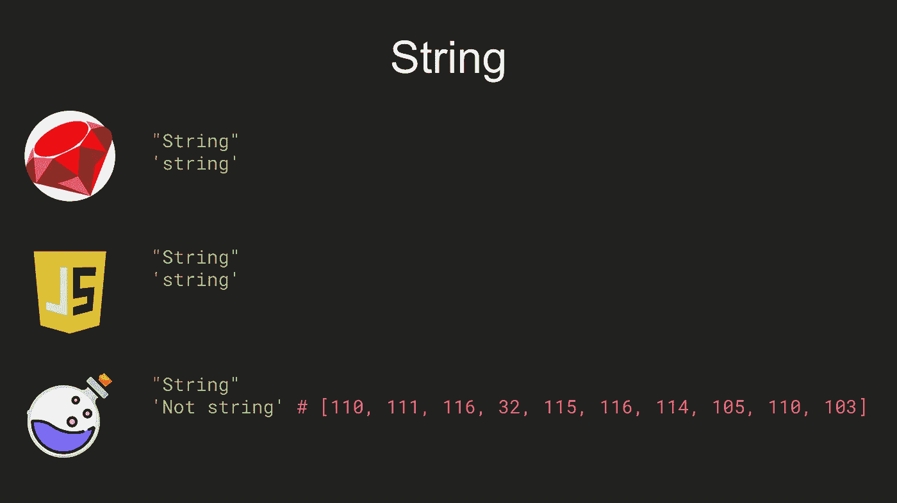

# 原子

# 布尔代数学体系的

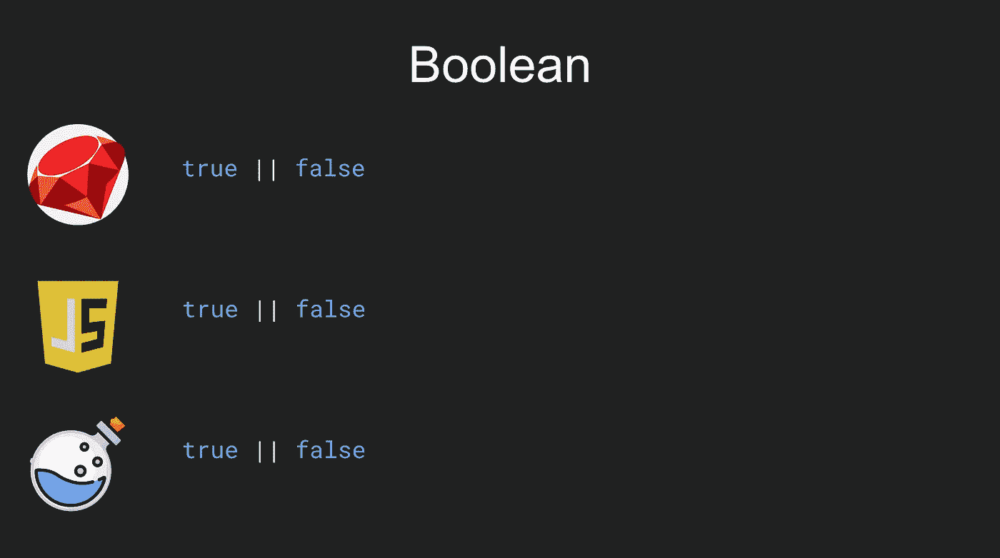

# 目录

* list 它不是真正的数组-更多[https://elixir-lang . org/getting-started/basic-types . html # linked-lists](https://elixir-lang.org/getting-started/basic-types.html#linked-lists)

# 元组

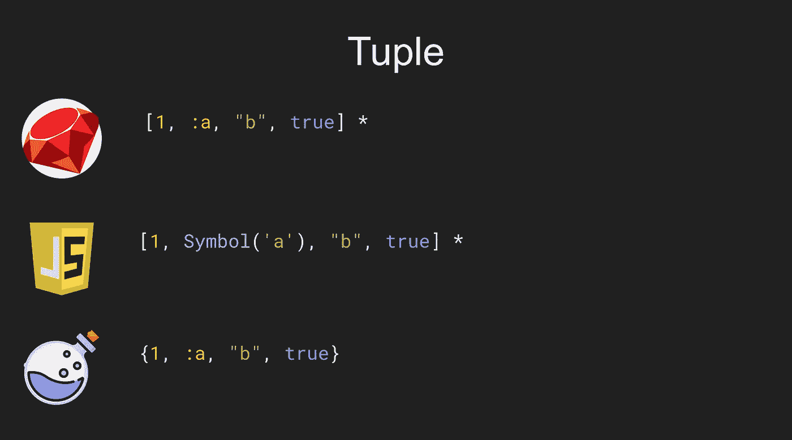

*它不是真正的数组—更多[https://elixir-lang . org/getting-started/basic-types . html # tuples](https://elixir-lang.org/getting-started/basic-types.html#tuples)

# 列表与元组

> 列表以链表的形式存储在内存中，这意味着列表中的每个元素都保存其值，并指向下一个元素，直到到达列表的末尾。这意味着访问一个列表的长度是一个线性操作:我们需要遍历整个列表来计算它的大小。

关于这一点，你会在 [AppSignal 文章](https://blog.appsignal.com/2018/08/21/elixir-alchemy-list-vs-tuples.html)中找到很好的解释，我强烈推荐你阅读它，因为理解它很重要。

# 地图

# 无

# 插入文字

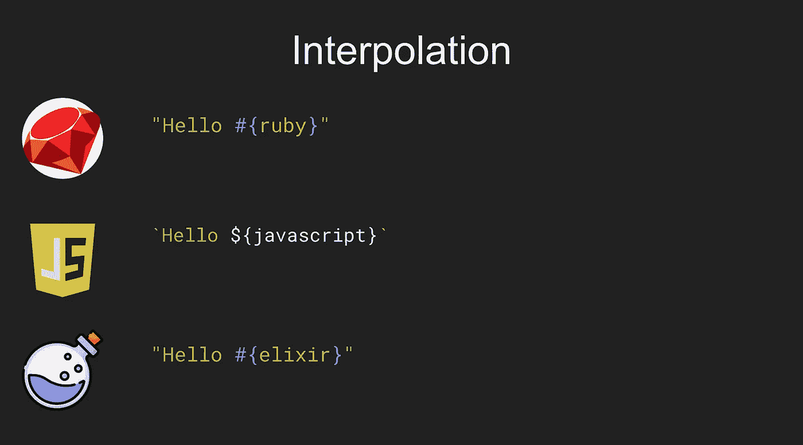

# 串联字符串

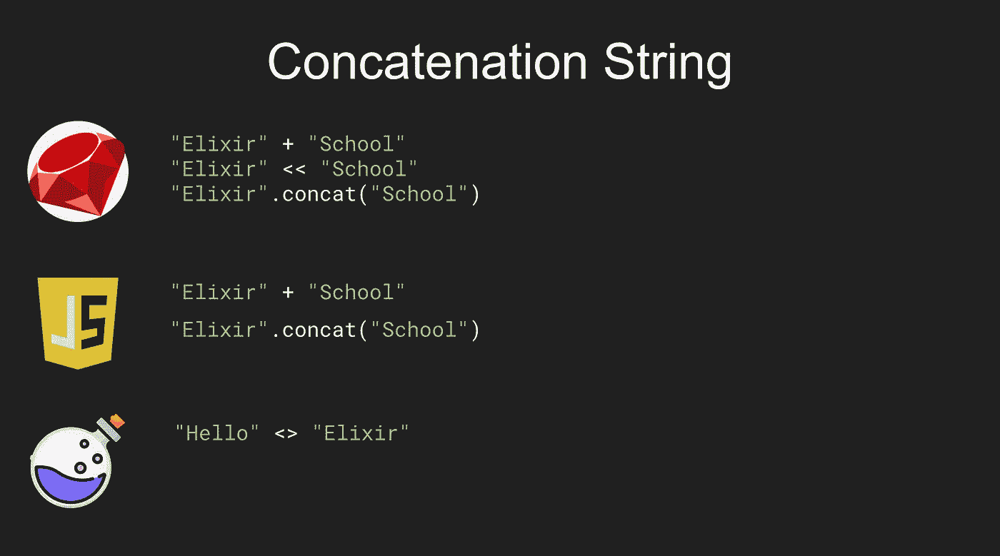

# 串联列表

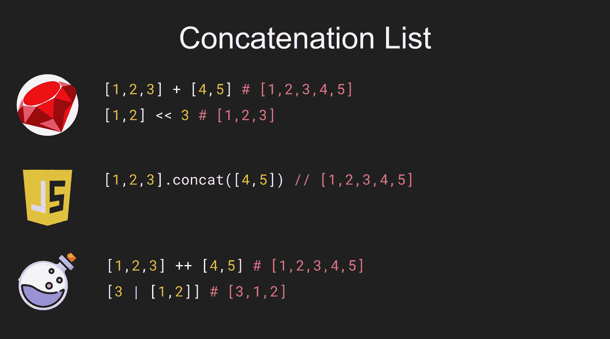

# 范围

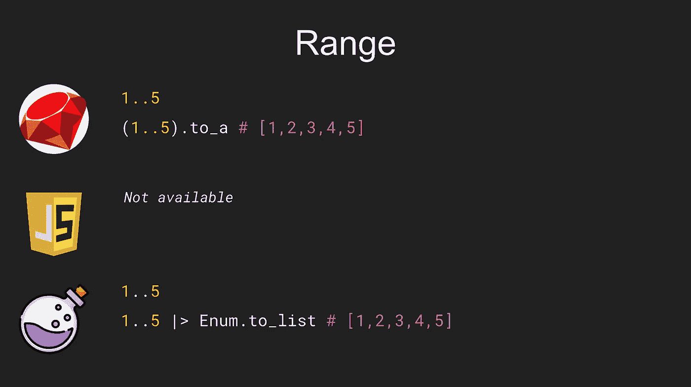

# If 语句和三元运算符

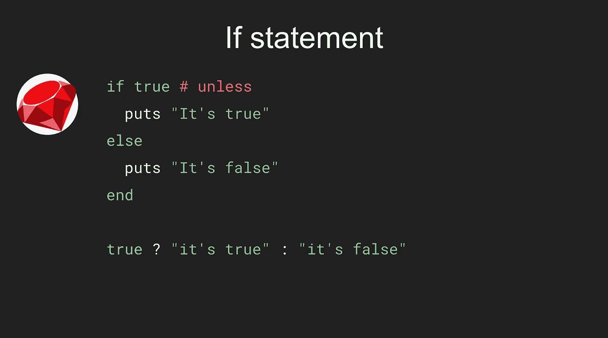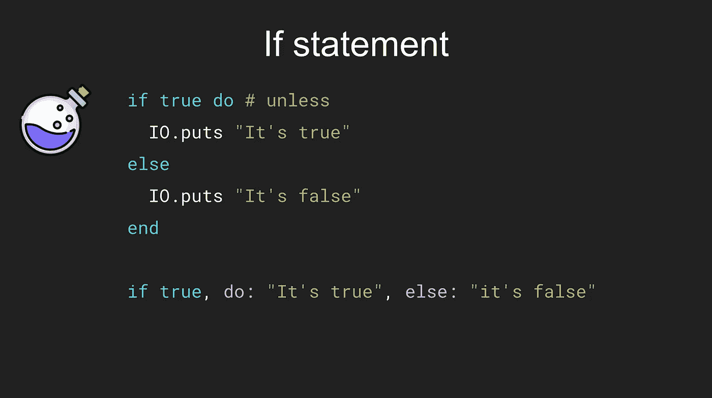

# 选择语句

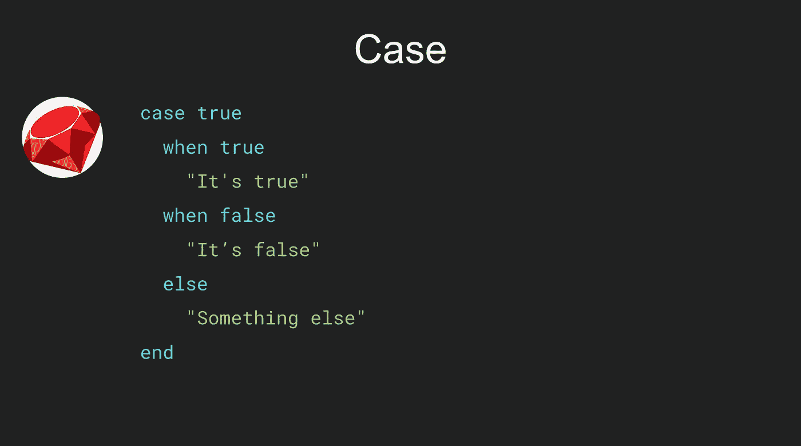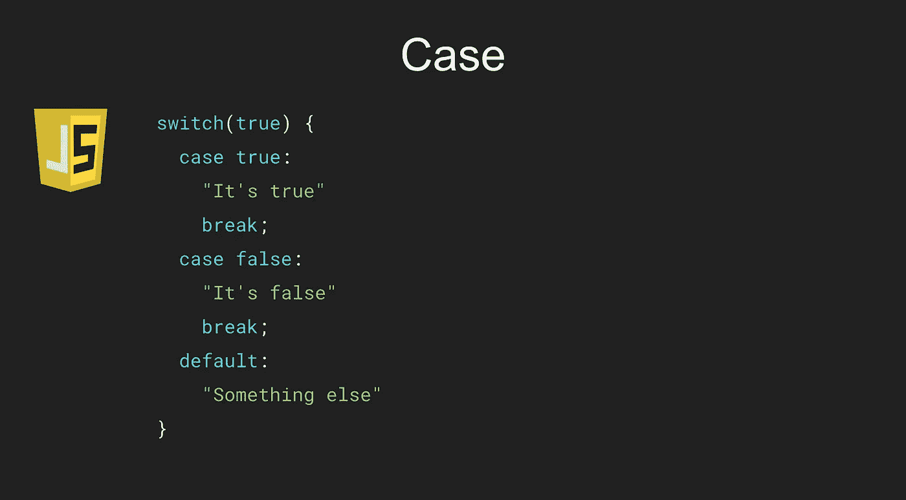

# 管道操作员

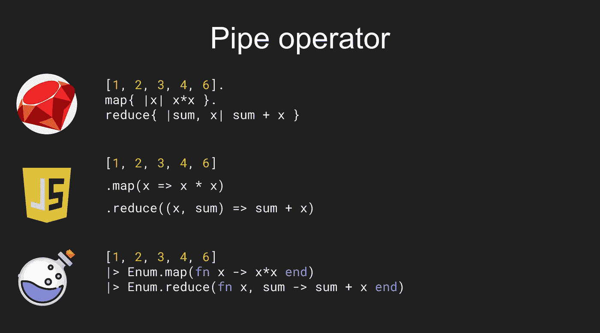

# 理解

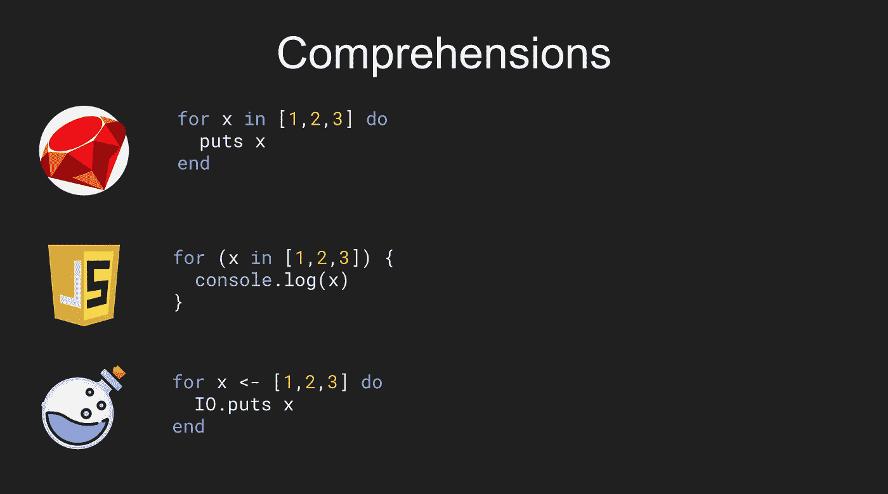

# 匿名函数

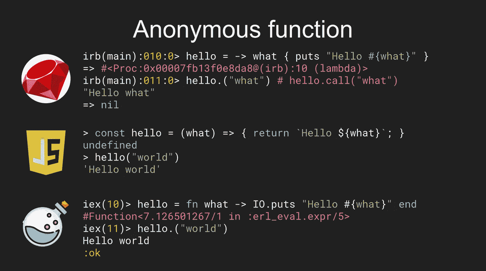

# 定义模块和功能

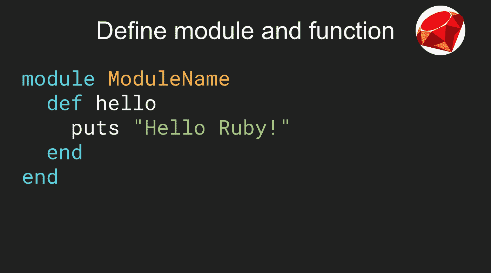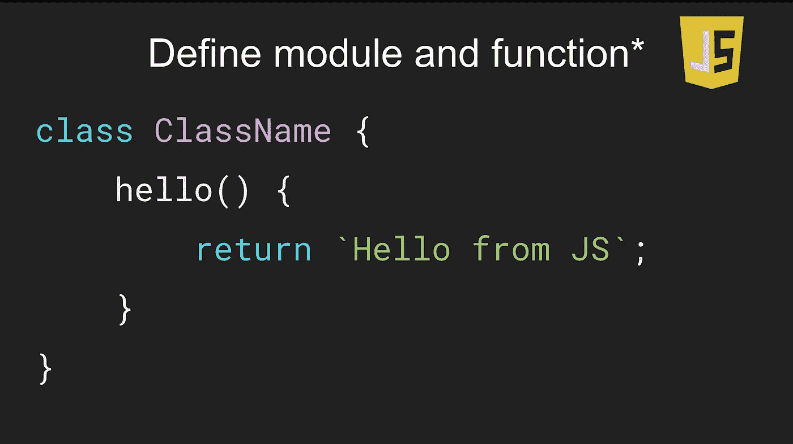

*模块在 JS 中是不可用的，所以这个例子展示了一个类来进行类比。

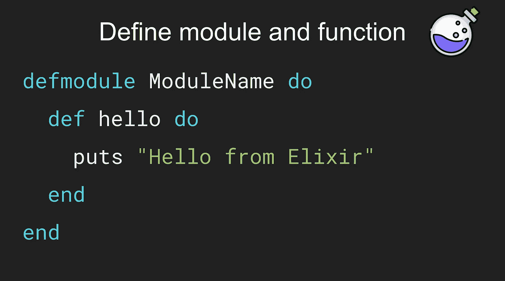

你可以在我的[演讲台上](https://speakerdeck.com/vermaxik/elixir-vs-ruby-vs-javascript-syntax)找到所有的幻灯片。

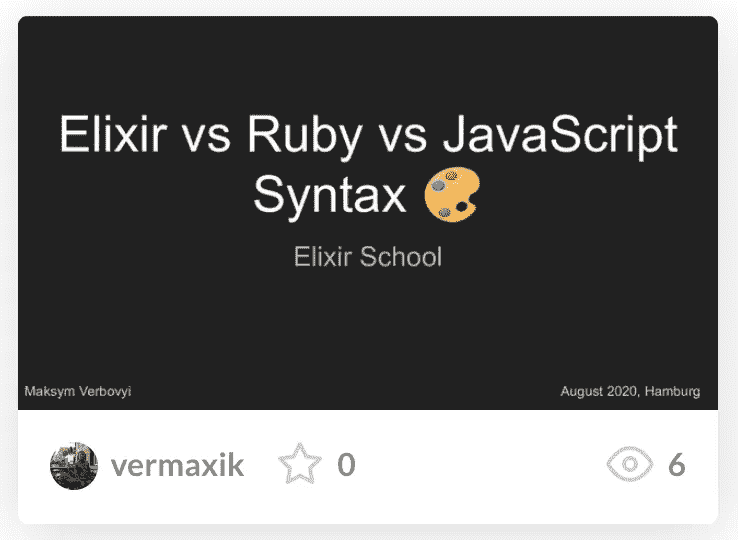

帮助创建本文的链接:

*   [https://elixir-lang.org/getting-started/basic-types.html](https://elixir-lang.org/getting-started/basic-types.html)
*   [https://blog . app signal . com/2018/08/21/elixir-alchemy-list-vs-tuples . html](https://blog.appsignal.com/2018/08/21/elixir-alchemy-list-vs-tuples.html)
*   [https://speakerdeck.com/saschawolf/a-sip-of-elixir](https://speakerdeck.com/saschawolf/a-sip-of-elixir)