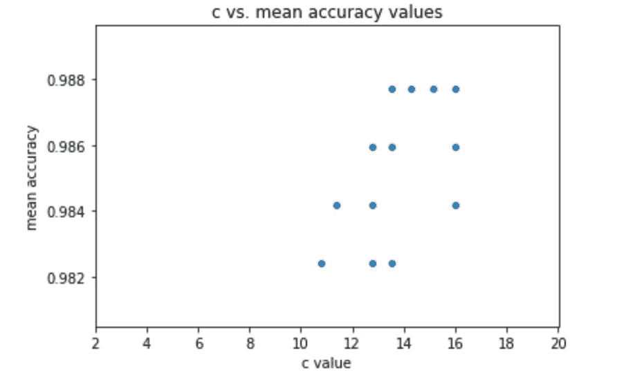
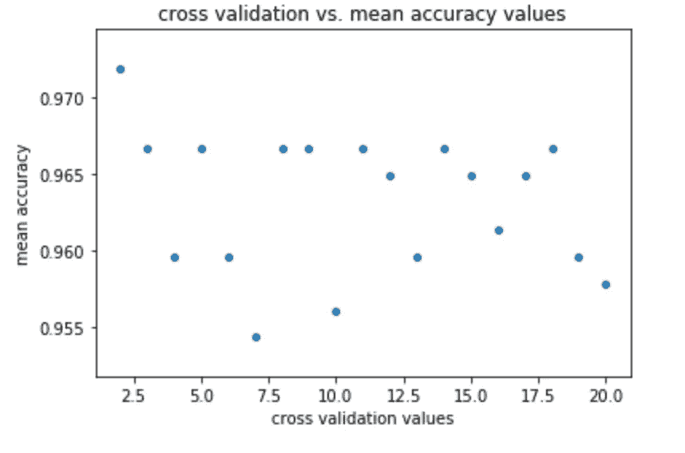
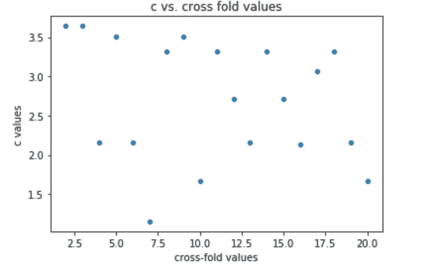
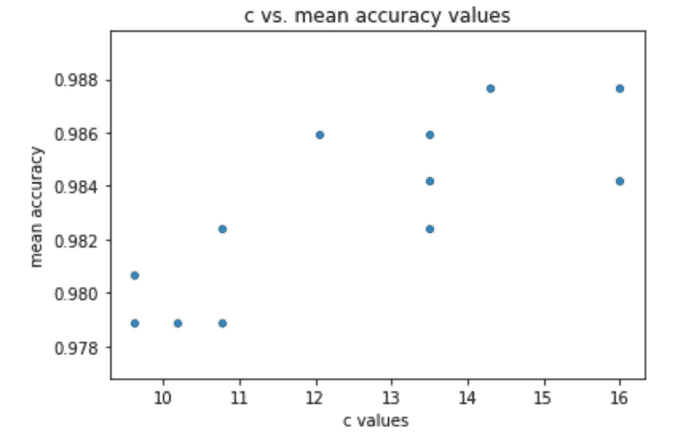

# Python 中网格和随机搜索方法的比较

> 原文：<https://betterprogramming.pub/comparing-grid-and-randomized-search-methods-in-python-cd9fe9c3572d>

## 使用 scikit-learn 执行超参数调整

由[乌萨·谢](https://unsplash.com/@cheaousa?utm_source=unsplash&utm_medium=referral&utm_content=creditCopyText)在 [Unsplash](https://unsplash.com/search/photos/hospital?utm_source=unsplash&utm_medium=referral&utm_content=creditCopyText) 上拍摄的照片

# 目标

读完这篇文章，你应该明白:

*   超参数和参数的区别
*   为什么要调整超参数
*   网格搜索和随机搜索的区别

*关键词*:超参数，参数，超参数调整，网格搜索，随机搜索

# 入门指南

在进入不同的超参数调整方法之前，让我们确保理解什么是超参数，以及推而广之，为什么在创建机器学习模型时超参数调整的过程是重要的。

*超参数*是不在算法或模型中设置的参数，它们是外部的。相反，*参数*是由数据估计的值。这些是模型和数据内部的，不是由模型的程序员设置的。要更深入地了解参数和超参数之间的区别，请查看本文[。](https://machinelearningmastery.com/difference-between-a-parameter-and-a-hyperparameter/)

为了提高机器学习模型的整体性能，在开始学习过程之前调整这些参数是一个很好的做法。调整这些参数以找到每个参数的最佳水平的过程是*超参数调整*(有时称为超参数优化)。在本文中，我将重点介绍网格搜索和随机搜索，这是两种广泛使用的超参数调优方法。在解释了每种方法的基础之后，我们将看一些使用`*sklearn*` *实现这些方法的基本例子。*

# 数据

为了在 Python 中显示这些调整方法，我使用了一个乳腺癌诊断数据集。如果你有兴趣查看数据集，可以在 [Kaggle](https://www.kaggle.com/uciml/breast-cancer-wisconsin-data) 上找到，也可以通过 UCI 机器学习知识库获得。数据集包含从给定样本的细胞核计算的各种测量值，以及患者 ID 号，如果肿瘤是恶性的，则包含“M”的列，如果肿瘤是良性的，则包含“B”的列。

为了准备用于超参数调整的数据，我将特征(测量值和患者 ID 号)与目标(恶性或良性的诊断)分开。此外，为了使我的模型预测更简单，我用 0 替换了诊断列中的所有“M”值，用 1 替换了所有“B”值。最后，在我从 Kaggle 下载的文件中，有一列“未命名”的数据，只包含 NaN 值。我放弃了这个专栏。

# 网格搜索

*网格搜索*是一种超参数调整方法，通过检查基于给定模型的所有参数组合，找到最佳超参数值。换句话说，网格搜索本质上是强行通过所有可能的超参数组合，并保存具有最佳性能的组合的度量。正如您可能想象的那样，您优化的超参数数量越大，该方法运行的时间就越长。也就是说，它是有用的，因为它是详尽的，没有留下任何漏洞。这也可以用于任何型号。在这些例子中，我将使用逻辑回归模型和随机森林分类器。

您可以使用`sklearn.model_selection.GridSearchCV()`在 python 中执行网格搜索。

点击查看文档[。](https://scikit-learn.org/stable/modules/generated/sklearn.model_selection.GridSearchCV.html)

在运行网格搜索之前，为要使用的模型创建一个对象。这里，我们从逻辑回归开始。创建要使用的惩罚列表(L1 和 L2)以及一组考虑了 C 值和惩罚的 C 值和超参数。在这种情况下，C 值意味着控制正则化的强度；较小的值导致较强的正则化，而较大的值削弱正则化。

现在我们准备执行网格搜索。除了接受模型和超参数之外，`GridSearchCV`还允许用户使用`cv=`指定交叉验证中的折叠次数，以及详细度测量，它越高，生成的细节越多。出于本文的目的，verbose 将始终等于 1。如果你想得到网格搜索的平均精度，使用`.score(features, target)`。

为了进一步研究这个问题，我使用不同的 cv 值运行了多次，从而增加或减少了交叉验证的数量。使用 for 循环，我创建了每次迭代使用的 cv 值和平均精度的列表，并将结果绘制成散点图，以查看精度和 cv 值之间是否有任何关系。

正如你从这个图像中看到的，这两件事之间没有特别强的关系。

接下来，我检查了控制正则化的 c 值是否与交叉验证值有任何关系。与上图类似，这里没有太多的关系，所以我转到了最后一个组合:正则化值与平均精度。

虽然这不是一个超线性关系，但该图似乎确实反映了较弱的正则化导致稍微更准确的分数。

概括网格搜索:

*   *优点:*穷举搜索，将找到基于训练集的超参数调整的绝对最佳方式
*   *缺点:*耗时，有过拟合的危险

# 随机搜索

*随机搜索*提供了穷举网格搜索方法的替代方案。顾名思义，它随机选择超参数的组合，并对它们进行测试，以从随机选择的组中找出最佳的超参数值。这种方法通常比网格搜索更快，因为它没有测试所有的可能性。此外，由于随机搜索并不详尽，因此它降低了模型过度适应训练数据的可能性。在某些情况下，从长远来看，用随机搜索调整的模型比用网格搜索调整的模型更准确，尤其是当模型具有较少数量的重要超参数时。这种方法的一个潜在缺点是，由于它是随机的，所以运行之间的差异可能性很高。

在 Python 中，随机搜索与网格搜索存在于同一个库中:`sklearn.model_selection.RandomizedSearchCV()`。

你可以在这里查看这个[的文档。](https://scikit-learn.org/stable/modules/generated/sklearn.model_selection.RandomizedSearchCV.html)

为了开始随机搜索，您需要创建想要运行它的模型。这里，我们将再次从逻辑回归模型开始。就像网格搜索一样，需要选择超参数。

除了我们在网格搜索中看到的参数之外，RandomizedSearchCV 还接受了一些参数。`n_iter`是将要运行的超参数的迭代或样本数。在这种情况下，我将使用 100 次迭代。你也可以选择设置一个`random_state`。现在，运行随机搜索:

同样，使用`.score(features, target)`调用将返回模型的平均精度。

与网格搜索类似，我想看看交叉验证值、c 值和平均准确度值之间是否有很大的关系。下面是可视化这些特征之间的关系(或缺乏关系)的图表。

从上面可以看出，平均精度和交叉折叠值并没有明显的关系，c 值和交叉折叠值也是如此。

正如您在下面看到的，在随机搜索中，正则化值和平均精度值之间确实存在松散的关系。

概括一下随机搜索:

*   *优点:*减少过拟合的机会，比网格搜索快得多
*   *缺点:*因为是随机的，所以有很大的变化潜力

# 结论

简单回顾一下我们已经学过的内容:

*   *超参数*是学习过程外部的参数，在学习开始前设置。
*   *超参数调整*(有时称为超参数优化)是选择不同超参数最佳值的过程。这有助于改进学习模式。
*   超参数调整的两种流行方法是*网格搜索*和*随机搜索*。
*   *网格搜索*是彻底的，并且将基于训练数据产生最优结果——然而，它确实有一些缺陷:(1)它是耗时的，取决于你的数据集的大小和超参数的数量。(2)它可能导致训练集的过度拟合，从长远来看导致不太可行的模型。
*   *随机搜索*选择超参数组合的随机抽样，减少过度拟合的危险，并可能提供更准确的长期结果——尤其是当显著超参数数量较少时。

希望这篇文章阐明了为什么超参数调优很重要，并且深入探讨了两种有用的方法。