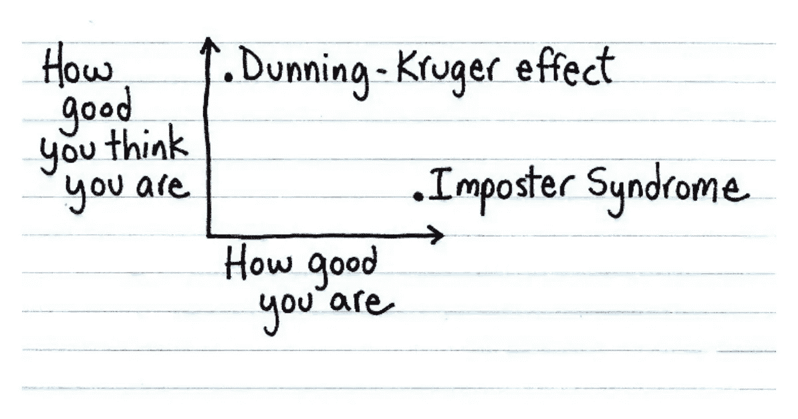

# 自信谦逊:成功领导的悖论

> 原文：<https://betterprogramming.pub/confident-humility-paradox-of-successful-leadership-80e2acefce82>

## 难得有自信的谦逊。知道展示它需要什么

我如何在自信谦逊的跷跷板上保持平衡？如果我的自信被认为是傲慢，或者我的谦逊被认为是我缺乏自信的表现，那该怎么办？我怎样给人正确的印象？

这些想法不是我的。许多女性，包括那些非常成功的女性，可能也包括大多数男性，都在这种微妙的平衡中挣扎。我们想成为童话《金发姑娘和三只熊》中的金发姑娘既没有太多的自信也没有太多的谦逊。也不要太少。恰到好处的量。

然而，自信和谦逊经常被误解。当你想到自信时，你会想到什么词——权力、权威、勇气、价值、自信？谦逊怎么样——顺从、不自信、被动、没有安全感？

谦逊并不意味着无能或缺乏自信。这意味着要脚踏实地，承认自己并非无所不知，接受自己还有很多要学的。

> “不是看不起自己，是看不起自己。”刘易斯

正确的自信不是恐惧和傲慢的中心点。自信的甜蜜点被谦逊所调和。这需要培养对自己能力的信心，同时表现出对自己知识和方法的怀疑。自信，或者说你有多相信自己，是很重要的。但是，谦逊地知道自己的不足并寻求帮助也同样重要。谦逊可以避免不可动摇的自信滋生的傲慢。

这正是每个领导者所需要的——自信的谦逊。 [Adam Grant](https://medium.com/u/357fe5c6b525?source=post_page-----80e2acefce82--------------------------------) 将其描述为“对我们的能力有信心，同时意识到我们可能没有正确的解决方案，甚至没有解决正确的问题。这让我们有足够的怀疑来重新审视我们的旧知识，并有足够的信心来追求新的见解。”

自信谦逊是对领导者做出正确决定的能力的信心，同时承认他们需要其他人来做正确的决定。知道他们不知道什么，相信他们所做的。这是对他们的优势有信心，同时也意识到他们的弱点。接受他们没有所需的知识，但对他们获取知识的能力有足够的信心。

自信谦逊的领导者并非没有盲点。相反，他们采取措施来应对这些盲点。

# 表现出自信谦逊的领导者会脱颖而出

惠特尼·沃尔夫·赫德是世界上最年轻的白手起家的女亿万富翁，也是自信谦逊的完美典范。作为 Tinder 的联合创始人和营销副总裁，她已经是一个伟大的商业成功故事的一部分。但对她来说结局并不太好。

2014 年从 Tinder 辞职后，她创办了约会应用 Bumble。正是她的自信引导她与 Tinder 竞争，她的谦逊让她质疑约会空间的需求。她使用火绒的经验很有用。但是，在她的成功故事中真正发挥作用的是她质疑知识的能力。她无视以前的约会规范，决定让女性在应用程序中采取主动。尽管 90%的约会创业公司都失败了，但她通过专注于一个细分市场的需求开辟了一个有利可图的空间:女性。她说了以下的话:

> “让我们改变几千年的行为。全球范围内。”

迪士尼前首席执行官罗伯特·艾格是另一个自信谦逊的理想例子。在《一生的旅程:从担任华特·迪士尼公司首席执行官的 15 年中吸取的教训》一书中，他写道，当他第一次接受 ABC 娱乐公司总裁一职时，他是如何感受的。这是该公司历史上第一次运营 ABC 娱乐公司的人不是来自娱乐界。

> “没有降落伞并不完全是跳跃，但一开始感觉很像自由落体。我告诉自己:你有工作。他们希望你能扭转这一局面。你经验不足不能成为失败的借口。”

他描述了像他这样当时对商业知之甚少的人是多么自信谦逊。

> “那么在这种情况下你会怎么做？第一条规则是不要伪造任何东西。你必须谦虚，你不能假装自己不是某人或者知道一些你不知道的事情。不过，你也处于领导地位，所以你不能让谦逊妨碍你的领导能力。”

他补充道，

> “这是一条很好的线，也是我今天要宣扬的东西。你必须问你需要问的问题，毫无歉意地承认你不懂的东西，并尽可能快地做好学习你需要学习的东西的工作。没有什么比一个人伪造自己并不拥有的知识更缺乏自信的了。真正的权威和真正的领导力来自于知道自己是谁，而不是假装成别的什么。”

凯瑟琳·格雷厄姆拯救了《华盛顿邮报》并将其转变为美国的主要报纸之一，这是另一个自信谦逊的例子。*《华盛顿邮报》作家史蒂夫·图米这样评价她:*

> “很多人说她很勇敢，但她从不宣扬这一事实。她的财富和影响力是巨大的，但运用自如。她改变了这个国家、她的城市和新闻业的进程，并在这样做的过程中为女性推倒了围墙。很少有生命如此天衣无缝地融合了如此多的特质。

Lou Gerstner 是另一个自信谦逊的典范，他在 20 世纪 90 年代中期通过重振公司并使其免于破产而扭转了 IBM 的命运。

他们和成百上千的其他领导者证明了一个自信的领导者能做的最大的事情就是表现出谦逊——退后一步，为其他人的想法和主意腾出空间。

# 为什么自信谦逊很少见

作者声明:Jessica Hagy

大多数领导者要么过于自信而没有能力，要么非常有能力而没有将想法付诸行动所需的信心。

第一类——自信胜于能力——始于过度自信循环，领导者对自己的无知变得一无所知。一种虚假的掌控感促使他们对自己的想法和知识深信不疑。他们没有注意到他们所知的差距，并拒绝识别他们不知道的。他们如此渴望发言，以至于没有停下来观察和倾听。他们被自己的优势蒙蔽了双眼，以至于看不到自己的弱点。他们太专注于追求正确，以至于没能做正确的事情。在看起来更有能力的欲望驱使下，他们对自己的无能视而不见——只有足够的信息，却没有足够的专业知识。从不停止，从不倾听，从不询问。没有地方让谦卑介入。

确定性是最大的怪物。对自己知识的信心允许他们做出判断，拒绝与他们的信念不符的信息，因为他们对自己的决定有绝对的把握。当他们确信自己所知道的东西时，为什么他们会质疑自己的观点或寻找与他们的观点相矛盾的信息？除非他们相信他们的知识可能有缺陷，否则他们怎么能发现他们知识中的缺口呢？

对自己知识的优越感和自豪感让他们对学习和更新信念越来越不感兴趣。T2 的邓宁-克鲁格效应进一步模糊了他们对自己能力的认识。他们能力越差，就越高估自己的能力。他们越缺乏能力，就越有可能过度自信。有点像第二十二条军规。没有发现自己错误的技能，他们看不到自己错在哪里；因此，他们认为自己做得很好。

蒂姆·厄本是*博客*的作者，他将傲慢描述为

> “无知加信念。”

这正是这些领导人所展示的。他接着说:

> “一个特别致命的组合，因为它阻止他们改进。这不仅让他们没有真正的知识，也剥夺了他们获得真正知识或成长为更好的思想家所需的谦逊。当他们认为自己已经做得很好的时候，他们会觉得没有改进的余地了。谦逊是一种可渗透的过滤器，可以吸收生活经验，并将其转化为知识和智慧，而傲慢则是生活经验轻易反弹的橡胶盾牌。”

第二类——没有自信的能力——始于严重的怀疑感，领导者与不安全感作斗争，不断质疑自己的能力。他们觉得自己像冒名顶替者:*我不知道自己在做什么！我不配得到这个职位！我没有资格做这个决定！别人会发现我没有这个素质！*

感觉自己是冒名顶替者让他们谦逊地怀疑自己的方法，质疑自己的知识，更加努力地提高技能，验证自己的假设，并从他人那里寻求见解。对他们来说，成功会带来自信。一旦他们实现了具有挑战性的目标，他们就会开始感到自信。他们可能仍然会自我怀疑。但是，这些疑虑不会让他们变得软弱，粉碎他们的动力，或者阻止他们前进。相反，曾经标志着他们缺乏成功能力的东西，现在成了以更大的信念向前推进的暗示。

以一种健康的方式参与冒名顶替的感觉，将他们的自我怀疑转化为成长的媒介。他们没有对这些想法沉思和感到无助，而是将它们与乐观的[冒险融合在一起。他们不是等待信心来实现他们的目标，而是通过把自己放在那里来建立信心。直面他们的恐惧。做工作。从错误中学习，再试一次。停下来。听着。行动。重复一遍。](https://www.techtello.com/learned-helplessness-vs-learned-optimism/)

你认为什么样的领导者会茁壮成长？一个人保持谦逊，怀疑自己的知识，同时对自己提高的能力充满信心——或者一个人对自己的能力如此自信，以至于没有提高的空间。

# 作为一名领导者，表现出自信的谦逊是什么样的

> “在一个更简单的世界里，也许由一个聪明能干的领导人掌握的单边权力可以统治一天。在一个复杂的世界中，需要集体分享权力、创造力和观点，才能变得足够敏捷和细致入微，以引领不确定的未来。”——詹妮弗·陈嘉炜·伯杰

换句话说，当今世界需要一位展现自信谦逊的领导人。自信谦逊的领导者:

1.  接受他们不知道的东西
2.  不会伪造他们不拥有的知识
3.  努力填补他们的知识空白
4.  怀疑他们的策略，并向他人征求意见
5.  将他们的观点从“我”重新定义为“我们”
6.  带着好奇心倾听，同时也有信心说出自己的想法
7.  一旦有了信息，就不会回避做出困难的决定
8.  以富足的心态领导。这意味着分享应得的荣誉
9.  接受错误并承担全部责任
10.  在意见不一致时，表现出虚心向相反的观点学习
11.  寻求反馈以改进
12.  以增长的心态运营
13.  快速改变他们的想法，因为他们不会让他们的信仰成为他们身份的一部分
14.  拥抱脆弱，同时小心不要让它变成鲁莽
15.  在陈述自己的想法之前，为他人提供表达想法的空间
16.  让人们负起责任，不回避困难的对话
17.  通过正确看待事物和关注可以控制的事情来管理[冲突](https://www.techtello.com/managing-conflict/)
18.  对自己防止不良后果的能力充满信心
19.  是一个高效的决策者，不容忍他人优柔寡断
20.  相信他们可以成功，因此在别人看到威胁的地方看到机会
21.  通过采取行动建立对他人的信心，尤其是当行动涉及风险和失败时

# **总结**

1.  自信和谦逊听起来自相矛盾。谦逊不是缺乏自信；这是承认你不是无所不知。
2.  自信谦逊的领导者对自己的能力充满信心，同时承认他们没有所有的答案。他们为他人创造空间，让他们畅所欲言并提供解决方案。
3.  他们有一种罕见的超能力，让他们脱颖而出。
4.  就像世界上的任何事情一样，建立自信的谦逊需要健康的自我意识。

> “伟大的思想家不会心怀疑虑，因为他们是骗子。他们保持怀疑，因为他们知道我们都是半盲，他们致力于改善他们的视力。他们不会吹嘘自己知道多少；他们惊讶于自己理解的如此之少。他们意识到每个答案都会引发新的问题，对知识的追求永无止境。终生学习者的一个标志是认识到他们可以从遇到的每个人身上学到一些东西。傲慢让我们看不到自己的弱点。谦逊是一面反射镜:它帮助我们看清他们。自信的谦逊是一面矫正镜:它能让我们克服那些弱点。”— [亚当·格兰特](https://medium.com/u/357fe5c6b525?source=post_page-----80e2acefce82--------------------------------)

*原载于 2021 年 4 月 8 日 https://www.techtello.com**[*。*](https://www.techtello.com/confident-humility-in-leadership/)*