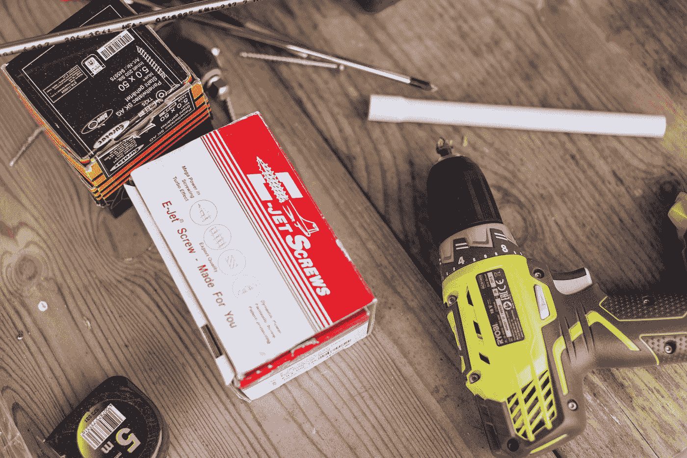

# 耦合和内聚

> 原文：<https://betterprogramming.pub/coupling-and-cohesion-75aa16bc9adf>

## 他们形影不离

由 [Unsplash](https://unsplash.com?utm_source=medium&utm_medium=referral) 上的 [Alphacolor](https://unsplash.com/@duck58cth?utm_source=medium&utm_medium=referral) 拍摄的照片

# 介绍

在我的文章、书籍和演讲中，我经常谈到耦合。我对此有点狂热。我强调紧耦合是不好的，应该避免。

这是一个很好的观点，但我不经常谈论你应该做什么。这就是凝聚力概念的由来。我将在本文中讨论这两个问题。

# 关于耦合的思考

耦合是衡量代码模块相互依赖程度的标准。强耦合不好，低耦合好。

高耦合意味着你的模块不能分离。这意味着一个模块的内部知道另一个模块的内部，并与另一个模块的内部混合在一起。

当你的系统真的耦合很差时，它被称为“意大利面条”代码，因为所有的东西都混在一起，就像一碗意大利面条。

高耦合意味着一个地方的变化可能对其他未知的地方产生未知的影响。这意味着您的代码更难理解，因为复杂、交织的关系很难理解。

高度耦合的代码很难重用，因为它很难从系统中移除以用于其他地方。人们应该努力将代码中的耦合降低到尽可能高的程度。

当然，你的代码不可能完全解耦。一堆完全解耦的模块什么都做不了。它们需要以轻薄的方式耦合。

我以前说过[界面就像一缕烟](https://medium.com/better-programming/code-against-interfaces-not-implementations-37b30e7ab992)——那里有东西，但真的很难抓住它。通过接口耦合的代码被耦合得尽可能的稀疏。

强耦合的一个真实例子是航天飞机。

现在，我不是火箭科学家，但我猜想航天飞机是由成千上万——如果不是数百万——独特的零件组成的，这些零件只能以一种方式装配在一起。

这些部分是不可重用的，如果您需要改变一个部分——尤其是如果您必须改变一个部分的接口——您就会遇到问题，因为它周围的其他部分很可能也需要改变。

最初的改变可能会在整个飞船中传播很长一段时间，并产生深远的影响。因此，航天飞机是一个高度耦合的系统。

松散耦合的例子是什么？

乐高积木造的航天飞机怎么样？当然，它不会去任何地方，但它很容易改变它的设计，因为乐高积木很容易组装和拆卸，可以制作任何你想要的东西。乐高航天飞机耦合度较低

总之，在编写非耦合代码时，您应该考虑以下几点:

*   你的代码将更容易阅读，因为它将是简单而不复杂的。
*   您的代码将是可重用的，因为它将只通过非常薄的接口连接。
*   您的代码将易于更改和维护，因为对代码的更改将被隔离。

那么，如果你不希望你的代码紧密耦合，你希望你的代码是什么样的呢？

# 关于凝聚力的思考

设计良好的代码会有很好的内聚性。

什么是凝聚力？维基百科称之为“[一个模块的元素属于一起的程度。](https://en.wikipedia.org/wiki/Cohesion_%28computer_science%29)”

高内聚力被认为是一件好事。也就是说，让所有的类都很好地协同工作以形成一个整体是一个好的设计。

一个好的凝聚力的例子是电钻。它由电机、电源、外壳、触发器、钻头支架和钻头本身组成。所有这些独立的组件——尽管它们各自不同——共同创造出有用的东西。

你的代码也是如此。如果你的类可以很容易地组合在一起创造出有用的东西，那么这个代码就是内聚的。

不过，有一个条件。正如我们在上一节中看到的，您不希望以耦合为代价来实现内聚。设计良好的系统适当耦合*和* 具有良好的衔接性。

照片由 [cetteup](https://unsplash.com/@cetteup?utm_source=medium&utm_medium=referral) 在 [Unsplash](https://unsplash.com?utm_source=medium&utm_medium=referral) 上拍摄

想想你的训练。我敢打赌，使用合适的螺丝刀可以很容易地将一个设计良好的钻头拆开。马达可以从外壳上拆下来，电气系统可以很容易地固定或更换，钻头支架可以拆下来维修，然后整个钻头可以重新组装起来。

发生这种情况是因为钻头正确地耦合在一起，并且其组成部分之间具有高内聚力。

您的代码应该是同样的方式——正如上面所说的，它应该是松散但适当耦合的。与此同时，你构建的模块应该能够被拼凑起来形成有用的东西，但是以一种使系统的分解相对容易的方式。

如果您发现系统的一部分对另一个项目有用，您希望能够轻松地移除该模块并在其他地方使用它。这是很好的耦合。它很容易与其他模块组合在一起，从而创建一个系统，这就是良好的内聚性。

# 结论

如上所述，乐高表现出很高的凝聚力。它们可以很容易地拼凑在一起，创造出几乎任何你能想象的东西。即使是 Duplo 积木也有一个与普通乐高积木的接口，这使得它们可以组合在一起。

乐高玩具可以很容易地拆开。它们可以很容易地组合在一起。它们是这个星球上最受欢迎的玩具是有原因的。如果它们没有表现出低耦合和高内聚，就没有人会使用它们。

你的代码应该像乐高积木一样——容易组合起来创造有用的东西。