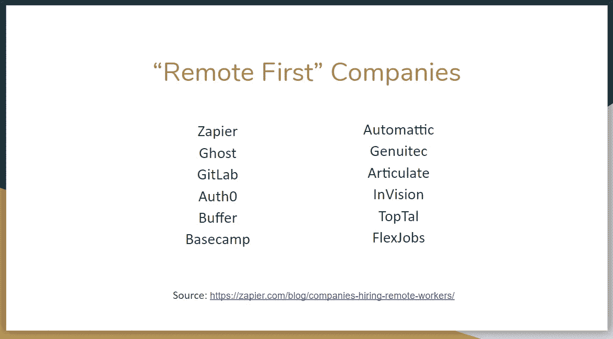

# 新冠肺炎:100%远程工作场所的催化剂

> 原文：<https://betterprogramming.pub/covid-19-the-catalyst-for-100-remote-workplaces-2d5f46a75e36>

## 如果员工无法离开自己的家，公司如何维持生产力？

安妮·斯普拉特在 [Unsplash](https://unsplash.com/) 上的照片

每天我们都听到越来越多的公司告诉他们的员工由于冠状病毒而呆在家里。

经理们现在被迫加快速度，以确保他们的基础设施能够处理即将发生的事情。这种疫情迫使他们思考如何在不与员工面对面交流的情况下继续以最快的速度运营。

能做到吗？绝对的。

我们已经看到世界各地的公司在 100%的远程工作空间中蓬勃发展。

这不是我们是否拥有在纯远程工作场所取得成功所需的工具的问题，而是我们是否能够改变我们对成功和高效工作场所的看法。

这篇文章特别针对软件开发人员和技术行业的个人，因为工作人员只需要一个 Wi-Fi 连接来完成他们的工作。

# 目标

探索阻碍我们实现 100%远程办公的各种障碍，以及我们如何克服它们。

我们将关注以下主题:

*   [职场心态](#0ead)——是什么阻碍了我们？
*   [生产力指标](#227f) —远程优先和基于办公室的团队之间的生产力比较。
*   我们获得了什么？ —远程优先工作经验提供的津贴和福利。
*   [我们牺牲了什么？](#dc68) —物理工作场所中难以替代的元素。
*   [哪些公司已经是远程第一了？](#3794) —看看一些在远程优先文化中蓬勃发展的公司。

# 物理工作场所心态

在当今传统大公司的企业文化中，“在家工作”通常是一种耻辱

更少的见面时间意味着“高层”更少的可见性。更少的曝光率意味着你不太可能在年底升职时被考虑。

如果说我从在这样的公司工作中学到了什么，那就是你在办公室呆的时间越长越好。如果我在四个小时内完成了别人花了 12 个小时完成的同样多的工作，看起来他们会更加努力。

事情就是这样。我们的价值不是基于产量来评估的，而是基于我们工作起来有多努力。

当然，这仅仅是一种概括。不是所有的职场都是这样的。但我觉得正是这种态度阻碍了我们在大型传统公司远程工作。

经理们担心，如果我们不在办公室，我们就会坐在家里的沙发上，一小时又一小时地沉迷于网飞。

# 生产率指标

对这一主题的广泛研究让我相信，远程优先的工作场所确实比基于办公室的工作场所更有效率。

斯坦福大学的一项研究将携程网的 500 名员工分成两组:远程和办公室。远程员工必须有一个私人房间，良好的互联网连接，并在携程网工作六个月。这项研究进行了两年多。

结果令人震惊。公司**不仅为每位员工每月节省了 2000 美元的租金，而且生产率的提高也令人难以置信。工人们能够工作更长的时间，更专注，而且普遍更快乐。**

在家工作的人**的流失率下降了 50%。更不用说他们少用了**PTO**和**更短的**休息。**

另外，Connect Solutions 进行了一项[调查，对远程工作的团队(全职和兼职)和完全在办公室工作的团队进行了比较。](https://www.forbes.com/sites/abdullahimuhammed/2019/05/21/heres-why-remote-workers-are-more-productive-than-in-house-teams/#56d807ad6f9f)

**77%** 的远程员工表示，他们在家工作时效率更高。

30%的人表示他们在更短的时间内完成了更多的工作。

这里的数字说明了一切。

让我们来看看远程优先的工作场所具体能获得什么。

# 我们得到了什么？

## 时间的自由

你将不再浪费一天的时间坐在车里去上班。只要你在你的团队活跃的时候也是活跃的，你就可以在一天的剩余时间里做你想做的事情。掌控你的生活！

此外，你不会被朝九晚五的时间表束缚。对于大多数公司来说，只要你把工作做好，什么时候工作都无所谓。

## 不再浪费时间

在办公室工作经常会有许多不必要的会议。“可以通过电子邮件发送”的会议将通过电子邮件发送！

虽然与同事进行社交互动很好，但有时候，你只是想集中注意力。当你旁边的人不停地问你问题或只是为了聊天而聊天时，很难做到这一点。当你不是面对面的时候，忽略一个人会更容易一点。

## 能够在任何地方工作

你想在泰国的海滩上工作吗？动手吧。只要你有无线网络连接，这个世界上就没有你不能工作的地方。

我个人更喜欢双显示器。但理论上，当你有 Wi-Fi 连接时，你可以工作。这允许你以任何你想要的方式设置你的家庭办公室。

## 减少损耗

根据[全球工作场所分析](https://globalworkplaceanalytics.com/resources/costs-benefits)，67%的人希望在家工作。36%的人会选择它而不是加薪。

如果你快乐，你就不太可能放弃。此外，如果公司提供远程办公的能力，就更有可能吸引顶级人才，因为 80%的员工认为远程工作是一种工作津贴。

## 拯救环境

> “太阳微系统公司报告说，它的 24，000 名参加开放工作计划的美国雇员去年通过减少上下班的开车次数，避免了产生 32，000 公吨的二氧化碳。”— [全球工作场所分析](https://globalworkplaceanalytics.com/resources/costs-benefits)

不仅如此，如果需要支持更少的员工，运行物理建筑的能耗也会大幅降低。

公司可以吹嘘他们有多环保。而且，员工喜欢为环保公司工作！

# 我们牺牲了什么？

然而，并不是办公室工作的所有方面都不好。有些事情我会怀念的。这大部分来自于你与同事面对面的社交互动。

但是，也有替代这些功能的方法。

## 结对编程

这对那些想学习的人特别有用。当我和一个主题专家搭档时，我学到了很多东西。观察他们的每一次击键，并能够观察他们解决问题是有益的。

此外，让他们监视我和我的一举一动迫使我对自己正在做的事情三思而后行，迫使我变得完美。

**更换**:远程工作工具越来越好。筛选分享和通过电话讨论问题的能力可能会被证明同样有效。

此外，全球化的工作场所为新的视角打开了大门:更多的文化，不同类型的思想家。从这个星球上的人们身上可以学到很多东西。

远程工作让你有机会足不出户周游世界。

## 社会方面

在漫长而辛苦的一天工作之后，有时有必要放松一下，和你的同事出去玩玩。无论是喝杯啤酒，玩个游戏，或者只是发泄一下，和你的团队一起立即从艰苦的工作过渡到休闲活动是很好的。

当你作为队友在这个国家(或世界)的另一边时，这是很困难的。

替代:类似于虚拟的咖啡休息时间。只需留出半个小时与你的团队成员交谈，放松一下。

如果这还不够，远程工作让你有更多的时间参与到你的社区中。加入体育联盟或俱乐部。没有通勤，你就有更多的时间和精力去做这样的活动。

## 办公室津贴

在家工作意味着你不能再享用公司提供的小吃或饭菜。你现在将被迫自己做饭或叫外卖。

同样，当办公室不复存在时，在办公室举办的活动也将不复存在。

**替代:**远程优先的公司将在世界各地召开会议，以增强团队凝聚力。

此外，你从通勤和日常旅行中省下的钱可以支付你一周的餐费。

# 远程第一公司

完全远程第一公司的想法并不像你想象的那样遥不可及。在远程优先的文化中，全世界有数百家公司在*蓬勃发展。*

让我们看看所有已经提供 100%远程工作场所的公司:

许多其他公司提供远程工作，但这些公司认为他们的总部是一个 Wi-Fi 连接。

我觉得在接下来的几年里，这个列表会越来越长。

此外，值得注意的是，这些公司都不必担心自己的员工将冠状病毒传播给其他员工。当我们被强制隔离时，他们将不必支付空置办公楼的租金/运营成本。

# 结论

我坚信远程优先的工作场所是软件开发团队的未来，每个人接受这一理念只是时间问题。

冠状病毒正迫使我们进行我们需要的试验。对于上一代企业文化来说，这将让他们看到生产率不仅没有下降，反而得到了提高。

虽然冠状病毒是一个可怕的悲剧，但对于远程优先的倡导者来说，也有一些潜在的好处。