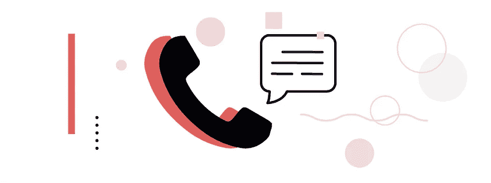
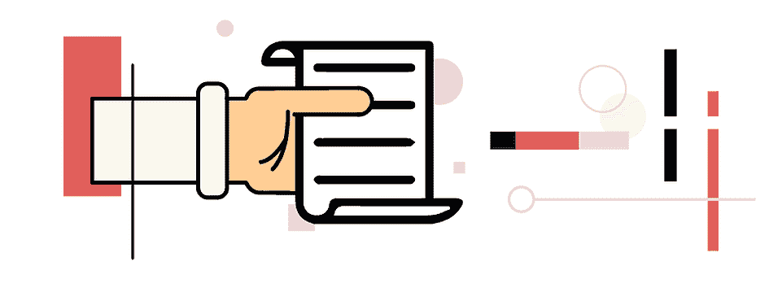
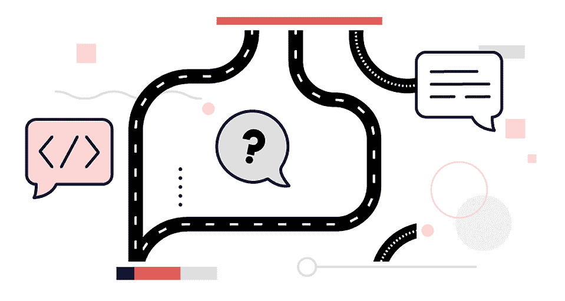
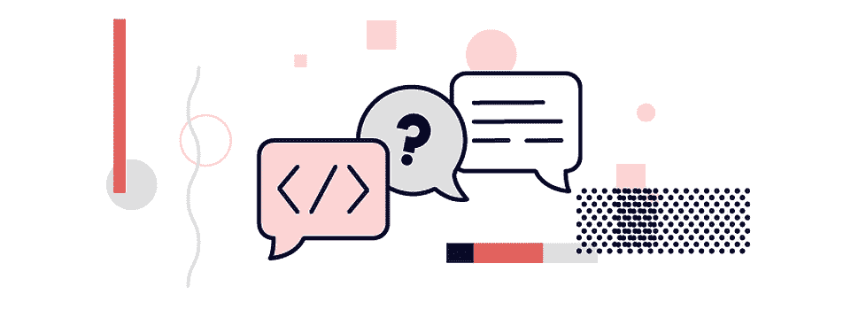

# 破解谷歌编码面试

> 原文：<https://betterprogramming.pub/cracking-the-google-coding-interview-3b8dd29b0d6a>

## 权威的准备指南

图片来源:作者

通过谷歌面试是任何软件开发人员的梦想。这次面试是对你技术能力的终极测试，需要的不是运气或捷径，而是努力工作和准备。幸运的是，谷歌对候选人的期望非常透明。你对谷歌的流程和公司文化了解得越多，你就越有可能成功。所以今天，我们将深入他们的编码和行为面试过程，向你展示如何破解面试。

今天我们将复习以下内容:

*   第一部分。面试概述和常见问题
*   第二部分。谷歌面试流程
*   第三部分。编码面试问题指南
*   第四部分。行为面试问题指南
*   第五部分。资源指南

# 第一部分。谷歌面试概述和常见问题

## 谷歌面试概述

整个面试过程需要两到两个半月才能完成。谷歌对软件开发人员的面试总共包括五到七次面试。这包括与谷歌招聘人员的初步电话筛选，随后是与不同谷歌员工的四至六次现场面试。所有编码挑战都在白板、谷歌文档或 Chromebook 上完成。

谷歌通常在 T3 层招聘，T11 是层的高度。T3 是入门级的全职软件工程师，本科或硕士学历。T3 员工的平均年薪为 11.7 万美元。Google 更喜欢以下编程语言:Java、C++、C Go、Python。

图片来源:作者

在谷歌面试中，你可能会遇到三种类型的编码问题。

*   **系统设计问题:**这些问题测试您在考虑可伸缩性的情况下处理高级系统设计的能力。
*   **编码面试挑战:**这些问题测试你对数据结构和算法的知识，以优化常见问题的解决方案。
*   **一般分析问题:**这些问题通过数学或基于观点的问题来衡量你的思维过程。

## 谷歌面试有什么独特之处？

虽然谷歌的编码面试与其他大型科技公司的相似，但他们的流程有一些独特的方面。那么，有什么不同呢？

**明确预期。谷歌对他们的面试过程并不避讳，所以在准备或期望方面很少猜测。看看谷歌提供的以下资源。**

*   [对软件工程和技术角色的期望](https://careers.google.com/how-we-hire/interview/#interviews-for-software-engineering-and-technical-roles)
*   [Google hang out 面试如何运作](https://careers.google.com/how-we-hire/interview/#phone-hangout-interviews)
*   [谷歌如何招聘](https://careers.google.com/how-we-hire/)

**谷歌文档中的编码。**在最初的手机屏幕上，你将被要求在谷歌文档中编码。研究如何在这个平台上很好地编码是很重要的，因为这需要一些实践。阅读[如何为你的技术面试设置谷歌文档](https://www.codefellows.org/blog/setting-up-google-docs-for-technical-interview-happiness/)。

**招聘委员会。谷歌的目标是不带偏见地审查申请人，所以他们利用一个招聘委员会来招聘所有候选人。**

**分级量表。**根据四项招聘标准，每位面试官的评分范围为 1-4 分，其中 3 分是录用与否的门槛。

**四个招聘标准。**谷歌在候选人审查过程中注重认知能力、谷歌性、领导技能和技术技能。让我们在下一部分对此进行分析。

## 谷歌在候选人身上寻找什么？

**认知能力。**一般认知能力是指你解决问题的能力，抽象思维，好奇心，学习的意愿。谷歌寻找能够对自己、团队和项目进行复杂思考的聪明人。

**谷歌性。像所有组织一样，谷歌有一种特定的公司文化，他们寻找与他们的价值观契合的候选人。谷歌主要关注的是人；他们关心包容性和人类生活的改善同时保持道德。谷歌以鼓励创造力、创新和开放交流的小团队和宽松环境而闻名。**

**领导技能。谷歌聘用具备紧急领导技能的候选人。对谷歌来说，领导力是在需要你的时候介入和摆脱困难问题的能力，同时促进道德和安全。谷歌还寻找那些让他人能够自我组织并促进开放交流的人。查看谷歌的[十大领导力面试问题](https://hire.google.com/articles/leadership-interview-questions/)。**

**技术技能。谷歌雇佣编码能力最强的候选人，他们评估技术技能主要基于概念理解，而不是记忆。他们评估以下主题的编码技能:**

*   算法
*   整理
*   数据结构
*   图表
*   递归
*   面向对象编程
*   大 O 符号
*   蜜蜂
*   如何测试你的代码
*   数学(如 n-choose-k 程序)

# 第二部分。谷歌面试流程

## 第一步。面试前

**准备。**准备编码面试是一个漫长的过程。我鼓励提前三个月做准备。你需要一个准备计划来保持正轨。看看由真正的招聘经理创建的 12 周计划的权威编码面试[准备路线图](https://www.codinginterview.com/interview-roadmap)。一定要准备使用 Google 比较喜欢的语言，比如 C++、Java、Python、Go 或者 C。

更新你的简历。你的简历需要在六秒或更短的时间内引起谷歌招聘人员的注意。有才华的申请人得不到面试机会的最常见原因之一是简历制作不佳。花些时间更新你的简历。

如果你的简历通过了测试，他们会安排一个电话来进一步了解你的技能和经验。大约一个星期后你才会收到招聘人员的消息。

**专业提示:**使用指标驱动的描述。尝试公式“完成 X，用 Y 衡量，用 z 衡量”。例如，如果你的简历写着“减少服务器查询响应时间”，那么把它重新表述为“通过重组我们的 API，减少了 15%的服务器查询响应时间。”

## 第二步。与谷歌员工一起进行预筛选

你的手机屏幕将持续 45-60 分钟，可能在谷歌 Hangouts。谷歌员工会用与数据结构和算法相关的编码问题来测试你。你可以用 20-30 行代码在谷歌文档上解决这些问题。

在你工作的时候，交流你的思维过程是很重要的；这是他们衡量你总体认知能力的方式。

你可以期待一个开放式的编码挑战。提出进一步的问题来澄清是展示解决问题技巧的好方法。如果你在时间结束前完成，寻找优化的方法并检查错误。务必始终考虑拐角和边缘情况。

## 现场采访

如果你通过了预筛选，你将被邀请参加现场面试。你将与四到六名谷歌员工每人会面 45 分钟。

这些现场面试将重点关注编码，关注数据结构和算法。你将在他们提供的白板或 Chromebook 上编写代码。事先询问招聘人员是个好主意，这样你可以适当地练习。

现场面试还包括行为面试问题，以评估你是一名什么样的潜在员工。谷歌希望看到你符合他们的公司价值观，所以一定要准备好行为面试。我们稍后会详细讨论这个问题。

## 提议/不提议

你的得分范围是 1-4 分，3 分是录用或不录用的门槛。一旦你的面试完成，反馈将被发送到招聘委员会作出最终决定。这个过程可能需要几个星期，如果已经过了很长时间，也可以发送一封友好的提醒邮件。

如果你得到了一份工作，准备好讨论薪水和开始日期，所以温习一下谈判技巧是个好主意。如果你没有被录取，你可能要等六个月才能重新申请，这给了你足够的时间来准备和研究你的弱点。

# 第三部分。编码面试问题指南

练习编码问题需要大量的时间、精力和专注。让我们来分析一下谷歌编码的几个主要问题，以及需要准备的可行建议。

## 15 大谷歌编码面试问题

1.  **求一个数流中的第 k 个最大元素。**

问题陈述:设计一个类来有效地找到数字流中的第 k 个最大元素。这个类应该有以下两样东西:

*   该类的构造函数应该接受一个整数数组，该数组包含流中的初始数字和一个整数 k。
*   该类应该公开一个函数 add(int num ),它将存储给定的数字并返回第 k 个最大的数字。

**2。找出 K 个最接近的数字。**

问题陈述:给定一个排序的数字数组和两个整数 K 和 X，在数组中找出 K 个最接近 X 的数字。按排序顺序返回数字。x 不一定出现在数组中。

**3。删除具有给定键的节点。**

问题陈述:给你一个链表的头和一个键。您必须删除包含该给定键的节点。

**4。用任意指针复制链表。**

问题陈述:给你一个链表，其中节点有两个指针。首先是常规的`next`指针。第二个指针叫做`arbitrary_pointer`，它可以指向链表中的任意一个节点。

你的工作是编写代码来深度复制给定的链表。这里的*深度复制*是指对原始列表的任何操作(插入、修改、删除)都不应该影响复制的列表。

**5。镜像二叉树。**

问题陈述:给定二叉树的根节点，交换每个节点的左右子节点。

**6。求所有路径的和。**

问题陈述:给定一棵二叉树和一个数 S，找出从根到叶的所有路径，使得每条路径的所有节点值之和等于 S。

**7。找出不超过 K 个不同字符的最长子字符串的长度。**

问题陈述:给定一个字符串，找出其中不超过 K 个不同字符的最长子字符串的长度。

**8。查找没有重复字符的最长子字符串。**

问题陈述:给定一个字符串，找出它的字母是否可以重新排列，使得没有两个相同的字符相邻。

**9。寻找等和子集划分。**

问题陈述:给定一组正数，找出我们是否能把它分成两个子集，使得两个子集的元素之和相等。

10。确定该数字是否有效。

问题陈述:给定一个输入字符串，判断它是否是一个有效的数字。为简单起见，假设输入中没有空格。

**11。打印平衡括号组合。**

问题陈述:打印给定值 N 的所有括号组合，使它们平衡。

**12。给定一些任务，确定它们是否都可以被安排。**

问题陈述:有 N 个任务，从 0 到 N-1 标记。每个任务都有一些必须完成的先决任务，然后才能进行调度。给定任务的数量和先决条件对的列表，找出是否有可能调度所有的任务。

**13。实现 LRU 缓存。**

问题陈述:最近最少使用(LRU)是一种常见的缓存策略。它定义了一个策略，当缓存满时，从缓存中清除元素，为新元素腾出空间，这意味着它首先丢弃最近最少使用的项目。

**14。找出高低指数。**

问题陈述:给定一个排序的整数数组，返回给定键的高低索引。如果没有找到，返回-1。数组长度可以达到数百万，有许多重复。

**15。合并重叠的间隔。**

问题陈述:给你一个区间对的数组(列表)作为输入，其中每个区间都有一个开始和结束时间戳。输入数组按起始时间戳排序。您需要合并重叠的间隔并返回输出数组(列表)。

## 12 周准备路线图

为谷歌编码面试做准备是战略性的。掌握正确的概念和建立自信需要几个月的准备和练习。让我们来看看被证明有助于求职者在大公司找到工作的明确的 12 周准备计划。

第 0 周。根据谷歌的期望和你的喜好选择一种编程语言。

第一周。回顾你的编程语言的基础。如果你温习了基础知识，你就不太可能在面试中出错。回顾一些概念，如如何从控制台读取输入，以及如何声明和使用 2D 数组。

第二周。熟悉数据结构和算法。这些对于谷歌编码面试是必不可少的。

你应该知道的数据结构:

*   数组
*   链接列表
*   大量
*   行列
*   树
*   图表
*   很
*   哈希集
*   哈希映射/表

你应该知道的算法:

*   广度优先搜索
*   深度优先搜索
*   二进位检索
*   快速排序
*   合并排序
*   A*
*   动态规划
*   各个击破

**第四周&第五周。**在 Educative 或 Leetcode 等网站上练习数据结构和算法挑战。开始练习简单的编码问题。这将使解决更难的问题变得更容易。

**第 6-8 周。**练习复杂的编码问题，自己动手计时。对于每个解决方案，考虑运行时和内存的复杂性是很重要的。

**第 9 周&第 10 周。**学习系统设计面试问题。这些现在都是面试过程中不可或缺的一部分，影响着你的招聘水平。

**第 11 周。**学习 OS 和并发概念。这些问题用来衡量你的招聘水平。温习多线程基础知识，在谷歌的阶梯中脱颖而出。

**第十二周。**学习面向对象编程与设计问题。这些问题衡量你的批判性思维和基于项目的解决问题的能力。

## 练习编码挑战的技巧

练习编码挑战没有捷径或魔棒。这里有一些基本的提示来指导你通过准备阶段。

**牢记时间。**编码面试是有时间限制的，所以牢记这一点做好准备很重要。如果你习惯在有时间限制的情况下准备，实际面试时压力会小得多。

**了解自己的弱点。在你准备的时候，记下你的弱点。每个人都有。谷歌表示，他们关心你的思维过程，所以如果你遇到了弱点，就说出来。这将表明你渴望改进。**

**知道常见的陷阱。在谷歌面试中有三大陷阱:不知道算法的复杂性，不知道谷歌的期望，不清楚你解决问题的过程。工作时请记住这些陷阱。**

阐明你的流程。谷歌希望了解你的思维过程。当你练习的时候，习惯解释为什么和你在做什么。那些清楚自己工作方式的人会脱颖而出。

# 第四部分。行为面试问题指南

行为面试经常被软件开发考生忽略。事实上，这是一场有时会让你成为候选人的面试。谷歌非常关心他们的价值观，所以如果你对这些问题毫无准备，他们会注意到的。

文化和行为面试是为了剔除那些可能有技能但没有心态的人。让我们深入了解一下谷歌行为面试。

## 从谷歌行为面试中可以期待什么

谷歌的行为面试测试你在与就业相关的情况或冲突中的表现，包括积极和消极两方面。行为面试有助于雇主决定你是否是他们想与之共事的人。这些面试将要求你反思自己过去的表现和行为，以了解你在压力下的表现以及你对职业精神的理解。您可能会遇到三种类型的问题:

*   过去的经历
*   假设的情况
*   基于价值观

## 如何准备行为面试

谷歌已经列出了准备行为面试问题的八个步骤。研究这些，用它们来塑造你的准备和答案。

*   **预测未来。你可以预料到你会被问到的大多数问题。你有准备答案的资源。以下是十个常见问题。**
*   **计划。写下你的答案。有策略地练习。不要回避行为问题。**
*   **有后备计划。谷歌建议每个问题有三个答案。这有助于你准备多样、有趣的答案。**
*   **解释一下。谷歌要求你解释你的思维过程和决策。明确陈述你的假设和过程有助于你脱颖而出。**
*   **要数据驱动。**谷歌想要与切实的增长、变化或技能展示直接相关的答案。
*   **澄清。**你可以使用开放式问题来洞察你作为候选人的价值。
*   **提高。**谷歌鼓励你始终专注于改进。你可以从一个蛮力的答案开始，然后努力改进你的过程。
*   **练习。谷歌鼓励你大声练习以构建更清晰的答案。**

## 10 个常见的行为面试问题

谷歌编辑了他们自己的行为面试问题清单，供招聘经理在面试中使用。让我们来看看。

1.  **描述一下你的工作流程。**虽然这个问题没有错误的答案，但它可以用来衡量你的经历如何影响你作为开发人员的日常生活。一个好的答案是你的工作流程、工具和团队合作能力。
2.  告诉我你冒险失败的一次经历。这个问题让你深入了解你是如何学习和应对困难的。一个好的答案展示了面对失败时的诚实和主动学习。
3.  **你引以为豪的成就是什么？**此问题用于构建多元化团队。谷歌正在寻找你的特长、成功感和你的长期价值观。一个好的答案不仅仅是成就，而是对你作为一个人的意义。
4.  **你知道的最复杂的事情是什么？教我一下。**这个问题考察你的技能、沟通技巧以及向他人解释复杂性的能力。一个好的答案关注的不是信息，而是你教学风格的有效性。
5.  如果你加入，你将如何影响你的团队？这个问题考察的是你在一个组织中与他人相处的能力。好的答案说明你对谷歌的价值观做过研究。热门答案说明了谷歌的目标。
6.  **告诉我一个你工作过的非结构化环境。这个问题通过定义非结构化对你的意义来评估你的工作风格。一个好的答案会把你的工作方式和你的职位联系起来。你能适应预定的结构吗？**
7.  你想让我知道哪些我们没有讨论过的关于你的事情？好的答案展示了你可能对谷歌有益的额外技能。他们还会寻找软技能，看看你是否有让他们团队受益的非技术经验。
8.  **你最喜欢的谷歌工具是什么，你会如何改进它？**这个问题评估你对谷歌的了解、创造力以及影响变化的意愿。好的答案是数据驱动但不要太技术化；一定要把重点放在为什么要改变一些事情上。记住:它应该让人们的生活更轻松。
9.  “成为谷歌人”对你来说意味着什么？这个问题是展示你的文化契合度和价值观的机会。一个好的答案应该避免太多的行话，但要说明谷歌文化的潜在价值。
10.  什么让你害怕？这个问题看的是你的弱点和压力源。一个好的答案是自我反省，目的不是简单地克服你的恐惧，而是了解它们如何影响你作为一名员工。

# 第五部分。资源指南

现在你对谷歌面试有了很好的了解，它们与其他公司有什么不同，以及如何准备。我整理了一份你需要学习、练习和建立自信的所有资源的清单，这些都是你在谷歌面试中脱颖而出所需要的。快乐学习！

## 谷歌资源

*   [谷歌面试编码面试指南](https://www.codinginterview.com/google)
*   [谷歌面试准备说明](https://careers.google.com/how-we-hire/interview/#_)