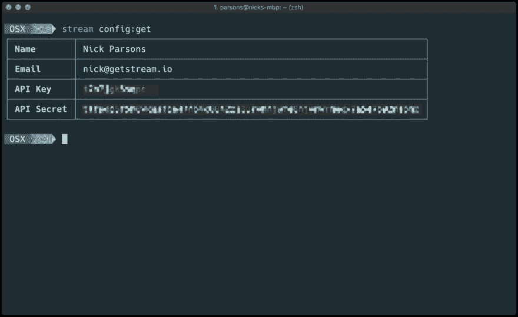

# 打造开发人员喜爱的命令行体验

> 原文：<https://betterprogramming.pub/crafting-a-command-line-experience-that-developers-love-68657b20c28d>

## 设计出色的 CLI 体验


如果您打算构建一个高度可用的开发人员工具，不言而喻，一个合适的 CLI 来与您的 API 交互是至关重要的。由于 Zeit 和 Heroku 已经通过对命令行体验的最佳实践进行广泛的研究，为这些类型的开发人员工具定下了基调，我们通过挖掘他们的发现开始了我们的探索。

由于[流客户端](https://www.npmjs.com/package/getstream-cli)目前处于公测阶段，我们从研究中发现的方法和理念，以及我们自己发掘的方法和理念，在我们的脑海中是新鲜的。我们想花几分钟时间概述一下我们在其他 CLI 工具中发现的最佳实践，以及开发人员在构建合适的 CLI 时的需求。

下面是我们将如何着手构建另一个 CLI 的逐步解释，以及我们为什么选择这样做的一些解释。

# 选择

大量开源项目的出现有助于促进 CLI 的搭建和整体开发。

除了我们在 Stream 的后端基础设施(主要用 Go 编写)之外，我们的许多工具都使用 JavaScript 它在前端和后端项目之间的灵活性、对它的大量开源贡献、它的全球存在和它的易用性(出于上述原因)都使它成为创建一个低门槛的强大工具的显而易见的选择。

同样，如果您开始着手构建 CLI，将有几十个用 JavaScript 构建的开源项目可以帮助您入门。公平地说，当我们开始考虑构建一个 CLI 时， [Commander](https://www.npmjs.com/package/commander) 和[下士](https://www.npmjs.com/package/caporal)几乎在每个搜索中都登上了 Google 和 npm 的榜首，但我们想要更强大的东西——一个经过战斗考验的项目，一次性提供我们需要的一切，而不是一个简单解析参数并随命令传递的包。

那时我们发现了奥克里夫。

# 奥克里夫

oclif 是一个基于 JavaScript 的 CLI 框架，由 Heroku 背后的团队开源。它打包了预建的功能，甚至通过使用插件来提供可扩展性。

乍看之下，当我们研究 oclif 时，有几个突出的主要特性:

*   多命令支持
*   命令参数或标志的自动解析
*   配置支持
*   自动记录代码库

最终，这些特性的可用性也是我们选择使用 oclif 作为我们在 Stream 的 CLI 工具基础的主要原因。

记住，这些只是 oclif 自带的一些内置特性。要获得全面的选项列表，我们建议在这里看一下官方 oclif 文档[。](https://oclif.io/docs)

# 多命令支持与单命令支持

重要的是要注意，如果您有一个单一的端点或者您正在调用的方法，那么您所需要的就是单一命令(例如，`grep`)支持。如果您正在开发一个更大的 CLI 工具，比如我们为 Stream 创建的工具，您可能需要选择多命令支持(例如，`npm`或`git`)。以下是对这种差异的快速分析:

单身:

```
$ stream --api_key=foo --api_secret=bar --name=baz --email=qux
```

多:

```
$ stream config:set --api_key=foo --api_secret=bar --name=baz --email=qux
```

虽然它们看起来相似，但这两个选项之间有一个关键的区别:单个命令不允许子命令，或者我们喜欢称之为作用域。这仅仅意味着复杂的或嵌套的命令在单一命令支持下是不可能的。

无论配置如何，这两种类型的命令都需要参数。如果没有参数，它就不是 CLI。多命令支持的一个优点是，它用冒号分隔调用，允许您组织事情。更好的是，您可以使用嵌套目录来组织您的目录结构，如 [GitHub](https://github.com/GetStream/stream-cli/tree/master/src/commands) 上的 src 代码所示。

有时候在开始的时候有点难以概念化，但是，一旦你第一次动手创建了一个 CLI，它就会变得清晰明了。

# 自动解析

在幕后，oclif 处理解析传入的命令行参数。一般来说，使用 Node.js，您必须从 process.argv 提供的数组中提取参数。虽然这并不特别困难，但肯定容易出错……尤其是当您提出验证或转换为字符串/布尔值的要求时。

如果您不打算使用 oclif 来为您处理解析，而只是需要进行简单的设置，我们推荐使用[minimit](https://www.npmjs.com/package/minimist)，这是一个专门用于命令行参数解析的包。

# 配置支持

对于任何服务器端集成，无论是 API 还是 SDK，您(希望)都可能必须提供某种令牌(出于安全和身份原因)。

对于我们的集成，我们需要将用户的配置凭证(例如，API 密钥和密码、名称和电子邮件)保存在用户计算机上的安全位置。如果不持久存储这种类型的数据，我们就必须确保每个对 Stream 的 API 调用都包含正确的凭证，而且，让我们面对现实吧，没有人希望每个命令都传递参数。

为了解决这个问题，我们利用 oclif 的内置支持来管理配置文件，方法是将用户凭证存储在机器上 config 目录下的一个`config.js`文件中。通常，配置目录在 Unix 机器上驻留在`~/.config/stream-cli`中，在 Windows 机器上驻留在`%LOCALAPPDATA%\stream-cli`中。在 oclif 的帮助下，我们不必担心检测用户的机器类型，因为他们在幕后处理这种区别，使用`this.config.configDir`很容易进入您的命令类。

了解了这一点，我们就能够使用 [fs-extra 包](https://www.npmjs.com/package/fs-extra)创建一个小工具来收集和存储必要的凭证。这里看一下代码[。](https://github.com/GetStream/stream-cli/blob/master/src/utils/config/credentials.js)

Oclif 中配置选项的文档可以在[这里](https://oclif.io/docs/config)找到。

# 自动记录代码库

我们很高兴(也很惊讶)地发现 oclif 支持自动记录命令。如果没有这种功能，我们将不得不在每次进行更改时手动更改我们的 [README](https://github.com/GetStream/stream-cli/blob/master/README.md) 和底层文档，例如添加/删除命令参数、更改命令名称或修改命令子目录中的目录结构。您可以想象在像 Stream CLI 这样的大型 CLI 项目中维护它有多困难。

在 [@oclif/dev-cli](https://www.npmjs.com/package/@oclif/dev-cli) 包的帮助下，我们能够将[单个脚本](https://github.com/GetStream/stream-cli/blob/master/package.json#L30)添加到我们的 package.json 文件中，该文件在构建过程中运行。该命令扫描目录结构并神奇地生成文档，如这里的[所示](https://github.com/GetStream/stream-cli/blob/master/docs/chat.md)。

# 交互式和原始参数支持

有时，当通过 CLI 工具调用一个命令时，您可能最不愿意占用的就是该命令所需的所有参数，尤其是当参数数量很大时。虽然您总是可以使用— help 标志来打印所需的参数，但有时最好提供一个交互式提示，如果所提供的标志中缺少这些信息，它会要求用户提供各种信息。

例如，不要调用:

```
$ stream config:set --api_key=foo --api_secret=bar --name=baz --email=qux
```

用户可以调用(不传递任何参数):

```
$ stream config:set
```

系统会提示他们:


有几个提示用户的选项，我们发现 [Enquirer](https://www.npmjs.com/package/enquirer) 是最容易使用的软件包。虽然这个包在功能上与 [Inquirer](https://www.npmjs.com/package/inquirer) 相似，但 Enquirer API 更宽容，也更容易使用。

如果可能的话，尝试在所有多参数命令上应用这种提示样式的功能是很重要的。但是，一定要检查这些标志，以确保如果用户已经传递了信息，您不会提示用户输入信息。例如:

```
if (!flags.name || !flags.email || !flags.key || !flags.secret) {
    const res = await prompt([
        {
            type: 'input',
            name: 'name',
            message: `What is your full name?`,
            required: true,
        },
        {
            type: 'input',
            name: 'email',
            message: `What is your email address associated with Stream?`,
            required: true,
        },
        {
            type: 'input',
            name: 'key',
            message: `What is your Stream API key?`,
            required: true,
        },
        {
            type: 'password',
            name: 'secret',
            message: `What is your Stream API secret?`,
            required: true,
        },
    ]);

    for (const key in res) {
        if (res.hasOwnProperty(key)) {
            flags[key] = res[key];
        }
    }
}
```

请注意我们是如何检查标志并仅在标志不存在时显示提示的。

# 把它变漂亮

命令行通常被认为是黑色背景上平淡无奇的绿色和白色文本。新闻快讯:实际上没有什么可以阻止你让你的 CLI 脱颖而出。事实上，开发人员喜欢在命令行中引入颜色——颜色有助于将错误与成功消息、事件/时间戳等区分开来。

如果你想让事情变得漂亮，[粉笔](https://www.npmjs.com/package/chalk)就算不是最好的，也是一个很好的选择。它提供了一个扩展的 API，以很少甚至没有开销的方式向您的 CLI 添加颜色。

要将 Chalk 集成到您的 CLI 中:

```
import chalk from ‘chalk’;
```

然后，用粉笔方法、颜色和可选的样式(粗体、斜体等)包裹你的线。)为您的输出添加一些特色:

```
this.log(`This is a response and it’s ${chalk.blue.bold.italic(‘bold, blue, and italicized’)}`);
```

# 使用表格进行大规模回复

让我们面对现实吧，没有一个开发人员愿意梳理你的 API 返回的大量响应。在这种情况下，总是返回一些有意义且易于阅读的内容是很重要的。为用户提供易于理解的输出，我们最喜欢的方法之一是使用表格:



在上面的例子中，我们选择了 [cli-table 包](https://www.npmjs.com/package/cli-table)来帮助显示表格中的数据，因为它提供了一个易于使用且灵活的 API，支持以下内容:

*   垂直和水平显示
*   文本/背景颜色支持
*   带填充的文本对齐方式(左对齐、居中、右对齐)
*   自定义列宽支持
*   基于预定义的宽度自动截断

# 用 Bash 和 jq 打印用于解析的 JSON

提供 CLI 的好处在于它既可以被用户调用，也可以被脚本调用。创建一个高度平易近人和可用的工具的一部分是默认的沟通，立即有意义的用户。也就是说，脚本允许一种不干涉的方法，这在用户想要运行一组命令而不是发出一次性命令时特别有用。

虽然 Stream CLI 默认返回用户友好的(并且人类可读的)输出(请参见 Make It Pretty and Use Tables for Large Responses ),但是我们知道在运行脚本时，您可能希望得到详细的响应，而不是人类可读的消息。为了访问原始响应数据，我们添加了一个`--json`标志，允许用户将原始有效负载指定为响应输出的 JSON。

下面是一个简单的例子，展示了如何从 Stream CLI 获取用户的凭证，将输出直接传送到一个轻量级且灵活的命令行 JSON 处理器 [jq](https://stedolan.github.io/jq/) :

```
#! /bin/bash

run=$(stream config:get --json)

name=$(jq --raw-output '.name' <<< "${run}")
email=$(jq --raw-output '.email' <<< "${run}")
apiKey=$(jq --raw-output '.apiKey' <<< "${run}")
apiSecret=$(jq --raw-output '.apiSecret' <<< "${run}")

echo $name
echo $email
echo $apiKey
echo $apiSecret
```

我们发现，如果用户想要建立他们的聊天基础设施、提供用户和权限等，提供该功能对于流聊天特别有用。无需使用底层的 REST API。

# 出版

发布一个 CLI 可能看起来令人望而生畏，但是它与在 npm 上发布任何其他包没有什么不同。基本步骤如下:

1.  使用 [@oclif/dev-cli](https://www.npmjs.com/package/@oclif/dev-cli) 包提供的工具更新`oclif.manifest.json`文件。该文件扫描目录，并使用 CLI 的更新版本以及用户可用的所有命令更新清单文件。清单文件可以通过从命令行调用`rm -f oclif.manifest.json && oclif-dev manifest`来更新。
2.  更新文档以反映对命令所做的任何更改。这也是一个由 [@oclif/dev-cli](https://www.npmjs.com/package/@oclif/dev-cli) 包提供的工具，可以使用`oclif-dev readme --multi`运行(或者如果您运行的是单命令 cli，可以使用`--single`)。
3.  使用 version 命令(例如`npm version prerelease`)来提升 npm 版本。关于`npm version`命令的完整文档可以在[这里](https://docs.npmjs.com/cli/version.html)找到。
4.  使用`npm publish`命令将发布发布到 npm。

然后，用户可以使用 npm 或 yarn 全局安装 CLI:

```
npm -g install <YOUR_CLI_PACKAGE>
```

或者:

```
yarn global add <YOUR_CLI_PACKAGE>
```

如果您需要以 tarball 的形式分发您的 CLI，我们建议查看由 [@oclif/dev-cli](https://www.npmjs.com/package/@oclif/dev-cli) 包提供的 oclif-dev pack 命令。这个命令将允许您将包部署到 Homebrew 和其他特定于操作系统的包管理器，或者简单地在系统上独立运行它们。

# 关键要点

如果你想深入了解 Stream CLI 背后的完整源代码，你可以在这里找到开源的 GitHub repo。虽然这篇文章中的关键要点并不是我们建议的最佳实践的详尽列表，但我们确实希望您在阅读完这篇文章后，能够学到一些适用于您的 CLI 的额外知识。总结一下我们在这一努力中的主要收获:

*   要获得灵感，请看一下 [Zeit](https://zeit.co/) 和 [Heroku](https://getstream.io/) 在他们的 CLI 中提供的功能，它们创造了令人敬畏的开发者命令行体验。
*   如果您的 API/CLI 需要数据持久性，请将该数据存储在特定于您的 CLI 的缓存目录中。使用一个 [util 文件加载它，就像我们在流](https://github.com/GetStream/stream-cli/blob/master/src/utils/config/credentials.js)中做的那样。另外，请注意 [fs-extra](https://www.npmjs.com/package/fs-extra) 包对于这种类型的事情会很方便(即使 oclif 中内置了支持)。
*   oclif 是一条可行之路，尤其是如果您正在构建一个大型的 CLI，而不是一个单一命令的 CLI。如果您正在构建一个单命令 CLI，您仍然可以使用 oclif 在搭建 CLI 时，请确保指定它是一个单命令 API。
*   不想用框架？没关系！包[minimit](https://www.npmjs.com/package/minimist)在命令行中提供了参数解析，可以很容易地在你的项目中使用。
*   使用[询问器](https://www.npmjs.com/package/enquirer)或您选择的其他软件包时，尽可能使用提示。应该引导用户完成命令的要求，并询问用户正确执行命令所需的数据。请注意，这不应该是必需的(例如，如果用户传递了正确的参数，就让他们绕过提示)。
*   尽可能使用颜色，让你的 CLI 看起来更舒服。粉笔是一个很好的工具。
*   如果您有足够结构化的响应数据，不要只是将它打印给用户(除非这是他们指定的)。相反，使用 [cli-table](https://www.npmjs.com/package/cli-table) 将其放入表格中。
*   总是允许用户指定输出类型(例如，JSON)，但默认为人类可读的消息。
*   保持速度！对于耗时的任务，如文件上传或需要多个 API 调用的命令，我们建议显示一个加载指示器，让用户知道工作正在后台进行。如果你在 npm 上寻找一个包，我们推荐你去看看[或者](https://www.npmjs.com/package/ora)。

像往常一样，我们也很乐意听到你的想法和意见，所以请在下面的评论中提出来！

如果你有兴趣在 Stream 平台上构建一个聊天产品，我们推荐你浏览一下我们的[互动教程](https://getstream.io/chat/get_started/)。有关 Stream Chat API 上的完整文档，您可以在此处[查看](https://getstream.io/chat/docs/js/)。