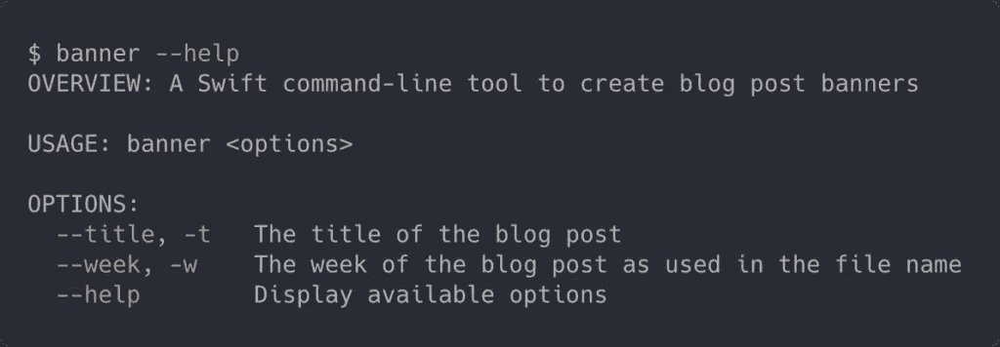

# 使用 Swift 包管理器创建命令行工具

> 原文：<https://betterprogramming.pub/create-a-command-line-tool-using-swift-package-manager-c2eb0e088e69>

## 使用开源的 SPM 实用程序框架，创建一个 Swift 命令行工具来自动化常见任务真的很容易


[自由股票](https://unsplash.com/@freestocks?utm_source=unsplash&utm_medium=referral&utm_content=creditCopyText)在 [Unsplash](https://unsplash.com/s/photos/typing?utm_source=unsplash&utm_medium=referral&utm_content=creditCopyText) 上的照片

命令行工具对于自动化常见任务来提高开发人员的工作效率非常有用。在开发 iOS 应用程序时，我们经常使用命令行工具，如[浪子](https://fastlane.tools/)和 [CocoaPods](https://cocoapods.org/) ，但很少为日常使用编写自己的命令行工具。

Swift 包管理器[使得创建命令行工具变得更加容易，因为我们可以用 Swift 编写它们。一旦您创建了第一个命令行工具，很容易快速设置另一个工具。](https://swift.org/package-manager/)

我已经创建了一个 [Poes](https://github.com/AvdLee/Poes) ，一个在模拟器中测试推送通知的命令行工具，只用了几个小时！

# 什么时候我应该决定创建一个命令行工具？

你不应该为每件事都创建一个命令行工具。但是，您经常重复的常见任务可能适合由 CLI 工具来代替。这至少是一种让重复的任务更容易完成的方法！

## 一个例子:创建博客文章横幅

在我写完每一篇博文后，我都会创建两个博文横幅，在社交媒体上分享。我必须打开[草图](https://www.sketch.com/)，更改两个标题，将其导出到正确的文件夹，并给它起一个与之前的横幅一致的名称。

虽然这花了我不到五分钟的时间，但这仍然是一个容易自动化的重复任务。因此，这是一个可以用命令行工具实现自动化的完美例子。

问自己这样一个问题:“我反复做的事情是什么？”在你的日常工作中记住这一点，并努力识别这些任务。一旦你有了一个，我要求你使用这篇博文并为它写一个命令行工具！

为了给你一点启发，这是我自己创建的两个 CLI 工具:

*   [Poes](https://github.com/AvdLee/Poes) :一个快捷的工具，可以轻松地向 iOS 模拟器发送推送通知
*   [GitBuddy](https://github.com/WeTransfer/GitBuddy) : 你管理和维护 GitHub 库的好伙伴。

# 使用 Swift 软件包管理器创建命令行工具

如果你对 Swift 包管理器不熟悉，我强烈建议你首先阅读我的博客文章，名为 [*在 Xcode*](https://www.avanderlee.com/swift/creating-swift-package-manager-framework/) 中创建 Swift 包框架。

一旦您找到了可以自动化或用命令行工具替代的东西，就该开始创建它了。我们利用 Swift 包管理器初始化一个新项目。

在这个例子中，我将使用名称`Banner`来创建博客文章横幅。

```
$ mkdir Banner
$ cd Banner
$ swift package init --type executable
```

我们首先创建一个名为`Banner`的新文件夹，将目录更改为这个新文件夹，然后初始化这个新包，将类型设置为`executable`。该命令将打印出以下几行:

```
Creating executable package: Banner
Creating Package.swift
Creating README.md
Creating .gitignore
Creating Sources/
Creating Sources/Banner/main.swift
Creating Tests/
Creating Tests/LinuxMain.swift
Creating Tests/BannerTests/
Creating Tests/BannerTests/BannerTests.swift
Creating Tests/BannerTests/XCTestManifests.swift
```

如您所见，它自动将文件夹名作为可执行文件的名称。它还创建了测试、一个自述文件和一个为运行 Swift 包而调整的`.gitignore`文件。

创建的代码非常简单，只包含一个“Hello，world！”打印报表。通过构建和运行代码，您可以看到这一点:

```
$ swift build
$ swift run
Hello, world!
```

这是我们命令行工具的最基本的设置！

# 为用户输入添加参数

下一步是添加参数以允许用户输入。在我们的例子中，我们想为博客文章的标题和横幅文件名中使用的周数添加一个参数。

我们可以通过使用 SPMUtility 框架来做到这一点，该框架是开源的 [Swift Package Manager 存储库](https://github.com/apple/swift-package-manager.git)的一部分。SPMUtility 框架增加了许多使用 Swift Package Manager 创建命令行工具时所需的通用功能。

在将 SPMUtility 框架作为依赖项添加到我们的包文件中之后，我们就可以使用它了。打开`Package.swift`文件，这将在 Xcode 中打开包，并调整文件以匹配以下结果:

该包将被导入 Xcode，然后您可以在构建项目后在`main.swift`文件中使用它:

```
import SPMUtility

print("Hello, world!")
```

请注意，我们还在`Package.swift`文件中添加了一个产品。这是从终端使用我们的可执行文件作为实际命令行工具所必需的。

## 使用 ArgumentsParser 读取用户输入

由于我们现在可以利用 SPMUtility 框架，我们可以开始编写代码来处理参数。

这一切都从读取进程信息中的参数开始。我们放弃第一个参数，因为这是可执行文件的名称，在我们的例子中是:`banner`。

```
import SPMUtility
import Foundation

// We drop the first argument as this is always the execution path. In our case: "banner"
let arguments = ProcessInfo.processInfo.arguments.dropFirst()
```

之后，我们初始化参数解析器，并向其添加参数选项:

这给了参数解析器足够的上下文来处理用户输入。我们可以使用解析器实际解析参数，并读出标题和星期输入参数:

将所有这些加在一起，我们会得到下面几行代码:

我们现在可以再次构建我们的可执行文件，并测试我们当前的工具:

```
$ swift run banner --title "Creating a command-line tool using the Swift Package Manager" --week 60
Creating a banner for title Creating a command-line tool using the Swift Package Manager and week 60
```

我们免费得到的是向用户解释可用参数的`--help`命令:

这是非常整洁的东西，我们不必自己构建，真棒！

显然，要实际创建用于生成横幅的命令行工具，还有很多工作要做。然而，这与这篇博文的上下文无关，所以我将把创建可执行文件的其余部分留给您！

# 创建版本并安装您的命令行工具

在创建了命令行工具之后，您显然会希望安装它来真正试用一下。

我们可以通过构建发布配置来做到这一点。这将在`.build/release`文件夹中创建一个可执行文件。为了实际使用它，我们需要将它复制到`/usr/local/bin`文件夹中。

```
$ swift build --configuration release
$ cp -f .build/release/banner /usr/local/bin/banner
```

这足以使我们的命令行工具成为真正的工具！



用 Swift 编写的命令行工具

是不是很牛逼？

现在，您可以从终端的任何文件夹中开始使用命令行工具。在使用它之前，您不需要构建或运行它。

如果你想公开你的工具，你可以看看我在 [Swift Packages 上的博客文章，了解关于发布](https://www.avanderlee.com/swift/creating-swift-package-manager-framework/)Swift 包的信息。

# 结论

就是这样！我们利用 Swift Package Manager 创建了自己的命令行工具。SPMUtility 框架使得处理参数变得非常容易，并且在创建了发布版本之后，我们可以在任何地方使用我们的工具！

谢谢！