# 创建 Swift 5 静态库:第 2 部分

> 原文：<https://betterprogramming.pub/create-a-swift-5-static-library-part-2-8bea54bb0b9e>

## 让我们使静态库具有通用性

[克里斯托弗·高尔](https://unsplash.com/@cgower?utm_source=medium&utm_medium=referral)在[号宇宙飞船](https://unsplash.com?utm_source=medium&utm_medium=referral)上拍摄的照片

本文考虑的主要思想是如何使静态库*通用*，即包含在模拟器和真实设备之间工作的二进制代码。

要知道如何从头开始在 Swift 5 上创建静态库，请查看本教程的第一部分。

# 使图书馆具有普遍性

为了遵循本文，您可以使用[上一教程](https://medium.com/better-programming/create-swift-5-static-library-f1c7a1be3e45)中的最终项目，或者您可以[从 GitHub 下载](https://github.com/drrost/ios-tutorials/tree/master/201911-StaticLib-Part2-Universal/Starter)即用型入门项目。那里有两个项目。打开名为 Networking 的项目，这是我们将在本教程中用于静态库的项目。

## 添加新目标:聚合器

首先，打开网络项目，并在项目导航器中单击项目名称。然后点击目标列表左下角的灰色+,添加一个新的目标，这将使我们能够在一个二进制文件中聚合两种架构的代码。

您会看到一个新的弹出窗口，您需要在其中选择跨平台选项卡。然后按“聚合”。最后，按下一步。

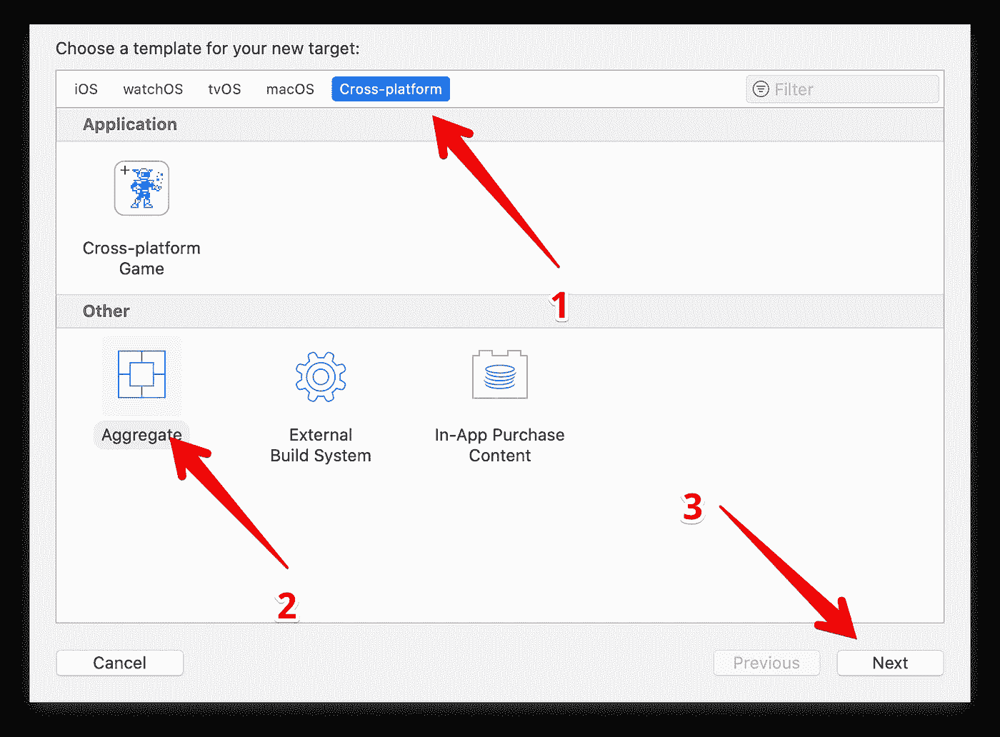

你想给新目标起什么名字都行。在本教程中，我们将其命名为 UniversalLib，然后按“完成”。

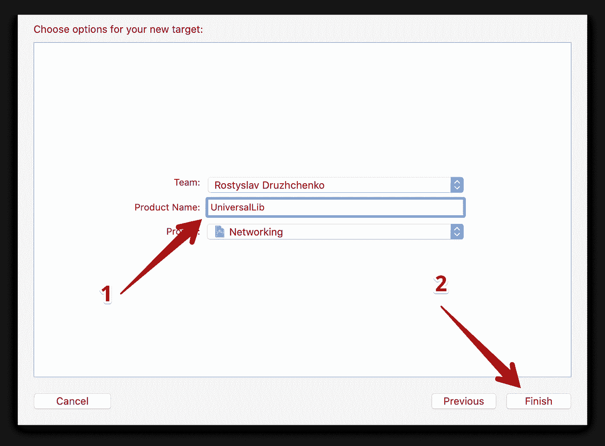

它将在您的项目中创建一个新的目标，用于构建通用库。

## 创建运行脚本

在目标导航器中选择创建的目标(1)。

然后选择构建阶段(2)。

然后按+按钮，如截图(3)所示。

并选择新运行脚本阶段(4)。

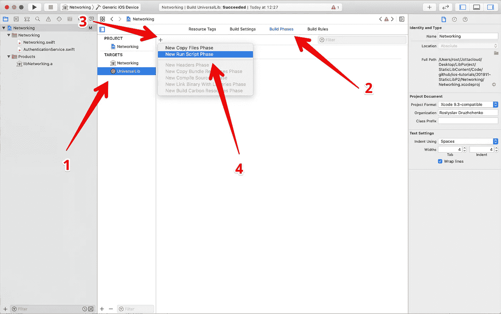

在出现的“运行脚本”部分，按下灰色三角形按钮(1)。然后在出现的文本视图(2)中，选择所有文本，并将其删除。

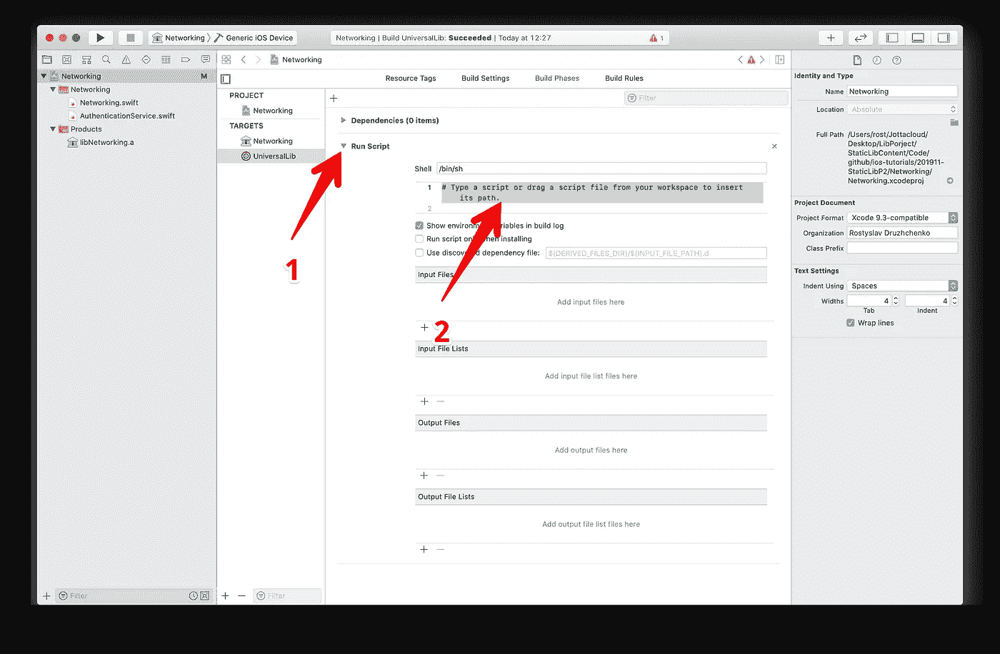

将此代码复制并粘贴到运行脚本的文本视图中:

让我们讨论脚本的要点，找出它实际上是做什么的。

在第 1 节中，它声明了文件夹名称的变量。如果您想管理这些名字，请随意尝试。有一个`LIB_NAME`变量有一个`Networking`值。您可以将该值更改为您想要为库命名的任何值。

第 2 部分运行 xcodebuild 两次，第一次用于模拟器，第二次用于设备。编译后的二进制文件将被放置在相应的文件夹中，如第 1 节所定义。

第 3 部分删除旧的构建结果，如果有的话。然后创建一个必要的文件夹，将`libNetworking.a`文件复制到一个文件夹中，并运行`lipo`命令。这就是本文的核心——`lipo`创造了最终的通用二进制。然后它删除所有不必要的文件。

第 4 部分将两种架构的`*.swiftmodule`和`*.swiftdoc`文件合并到一个文件夹中。

您不能更改此脚本中的任何内容；它应该适用于任何库项目——在另一个项目中唯一必须更改的是`LIB_NAME`变量的值。

## 建造图书馆

这是重要的一步。在方案选择菜单中，选择 UniversalLib 目标(1)，然后选择`Generic iOS Device` (2)。

选择`Generic iOS device`是强制性的。否则，库的构建将是不正确的。你可以在[这篇](https://stackoverflow.com/questions/51558933/error-unable-to-load-standard-library-for-target-arm64-apple-ios10-0-simulator) SO 帖子中找到更多相关信息。

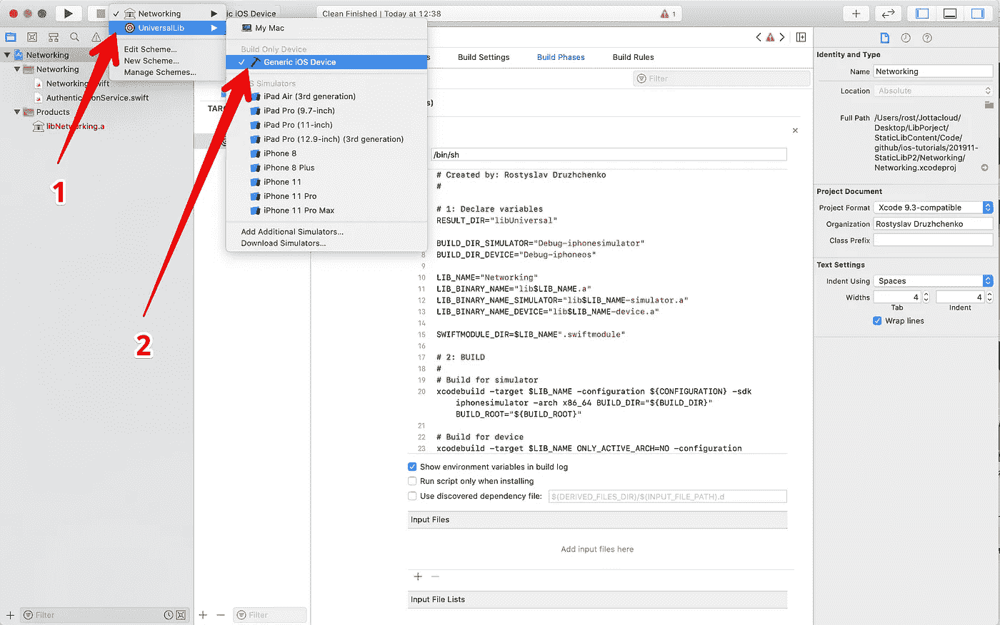

然后按 Cmd+B 构建项目，并确保项目编译无误。

这就是我们在静态库项目中需要改变的全部…所以不多。在下一节中，我们将发现我们编译了什么。

# 研究通用二进制文件

在本节中，我们将考虑我们所创建的内容，并讨论一些细节。如果你只对教程的实践感兴趣，你可以跳过这一部分。

在项目导航器中打开产品，选择 libNetworking，右键单击它，然后选择在 Finder 中显示。

它将打开一个新的 finder 窗口，但它将打开名为`Debug-iphoneos.`的文件夹，其中只有移动设备的二进制文件，不包含模拟器的代码。

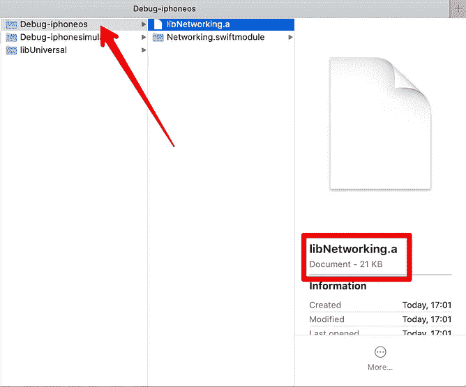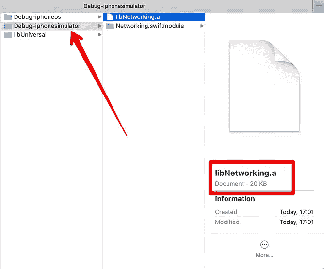

如果我们比较这三个文件夹的内容，我们会发现它们都包含一个`libNetworking.a`文件和一个`Networking.swiftmodule`文件夹。

`Debug-iphoneos`和`Debug-iphonesimulator`文件夹包含两个平台的二进制文件，文件大小几乎相同——大约 20k。但是`libUniversal`文件夹有 41k 大小的二进制文件。这正是我们所需要的——它是包含两个平台的编译代码的二进制文件，我们必须复制`libUniversal`文件夹的内容，并将其粘贴到您的项目中，以便为两个平台构建。

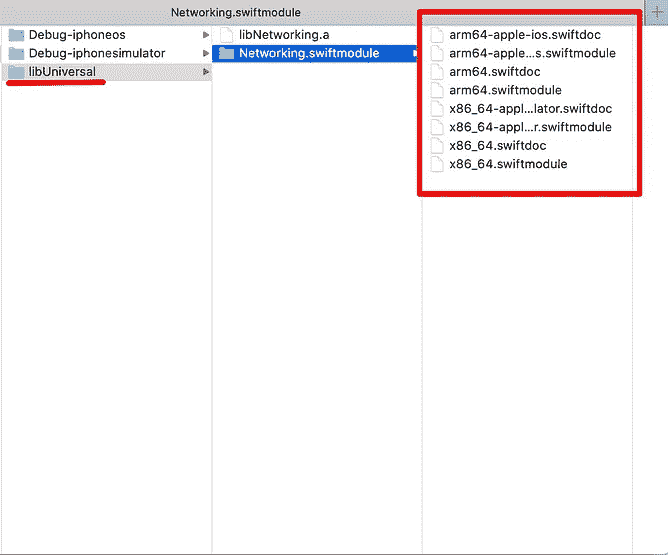

`Networking.swiftmodule`文件夹包含`*.swiftmodule`和`*.swiftdoc`文件，这些文件包含库的接口描述和文档(如果提供的话)。我们将编译器生成的所有文件放在一个文件夹中，并将在我们的项目中使用它们。

# 集成到另一个项目

## 为集成准备项目

然后从 Starter 文件夹中打开 SimpleApplication 项目。在 scheme navigator 中选择 Generic iOS device，然后按 Cmd+B 构建项目。

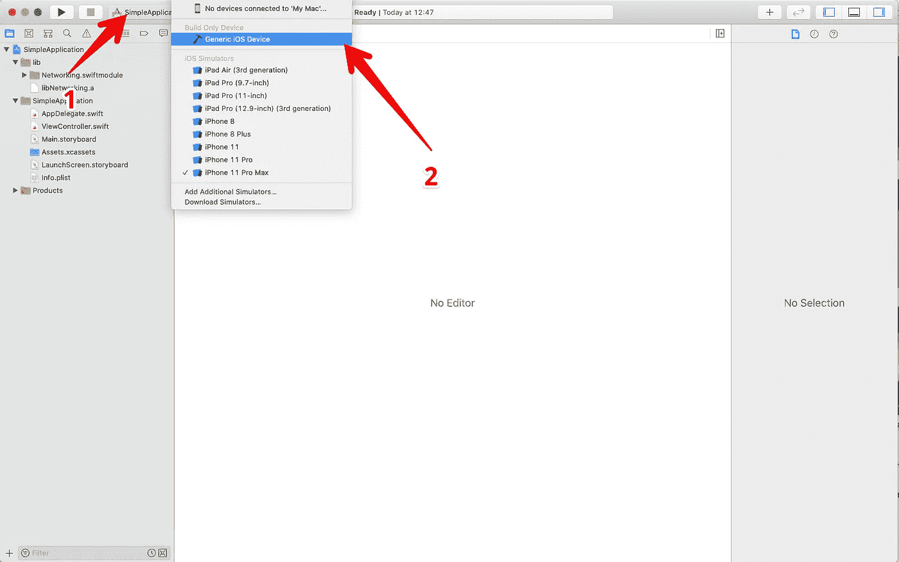

该项目不会建立。相反，您会看到一个错误:

> “简单应用”的签约需要一个开发团队。在签名和功能编辑器中选择开发团队。

这是因为为移动设备构建需要对最终应用程序的二进制文件进行签名。它与库集成过程没有直接关系，但它是在移动设备上运行应用程序的必要步骤。

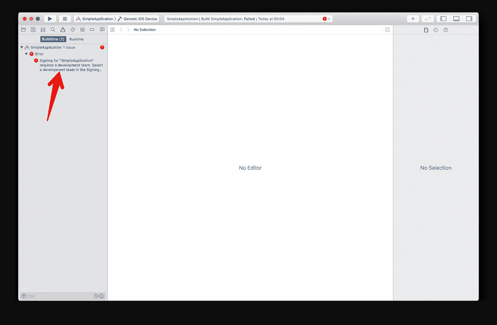

签署应用程序是一个庞大而复杂的过程，有很多可能的情况，在本教程中，我们不打算深入探讨。

如果需要，您可以自己研究这个过程—我们假设您熟悉这个过程，并将演示签署您的应用程序的最简单方法。这意味着你有一个设置和有效的苹果开发者帐户。

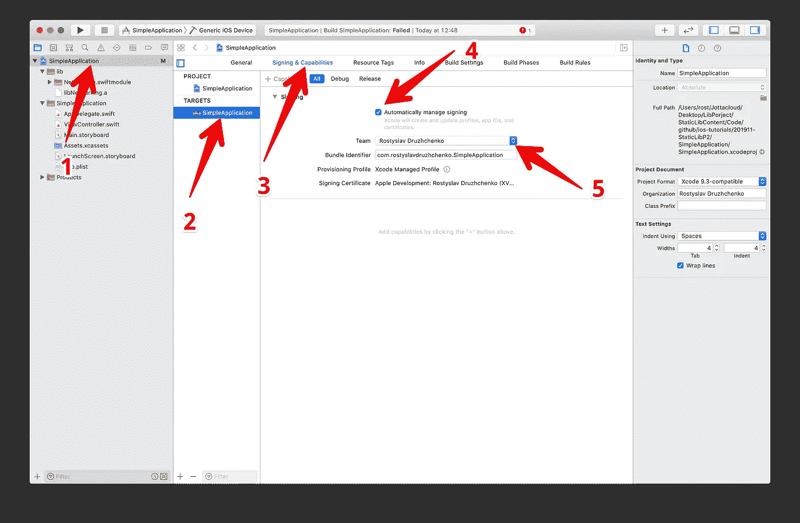

在项目导航器(1)中选择项目，然后为您想要构建的应用程序选择目标(2)。

然后选择签名和功能选项卡(3)。

选中“自动管理签名”(4)，并选择一个有效的团队(5)。

然后尝试再次按下 Cmd-B 来构建。结果，您将看到另一个错误:

> 找不到目标“arm64-apple-ios”的模块“Networking”；找到:x86_64-apple-ios-simulator，x86_64

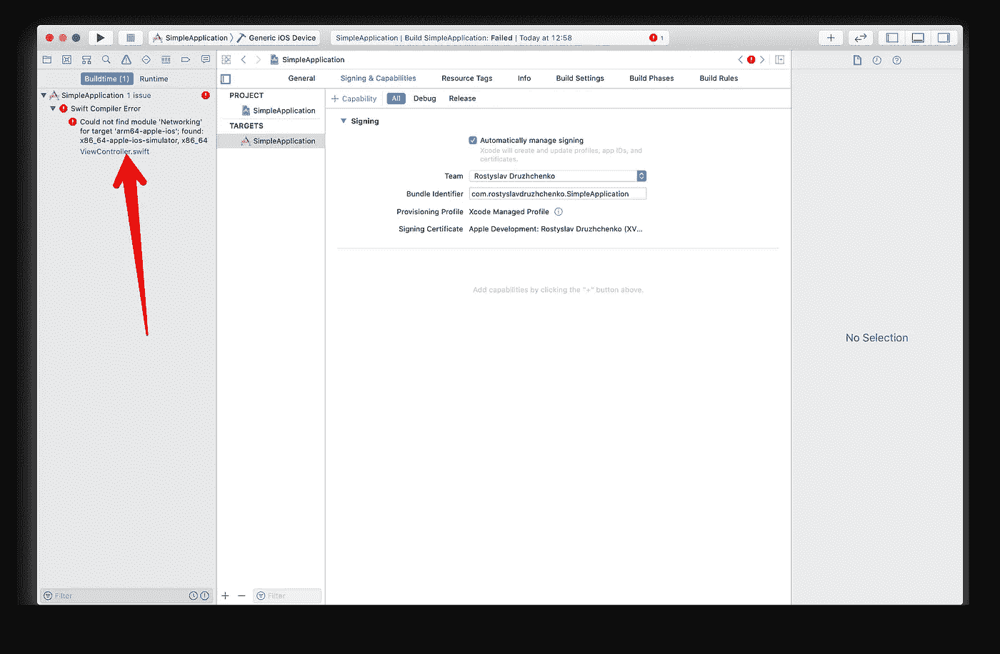

这是完全可以预见的，因为我们还没有为静态库添加合适的二进制文件。所以现在我们准备更新库的二进制文件。

## 更新库的文件

在 SimpleApplication 项目中，打开项目 vavigator，找到我们在之前的教程中构建的`lib`文件夹(它包含仅用于模拟器的二进制文件)，并删除它:

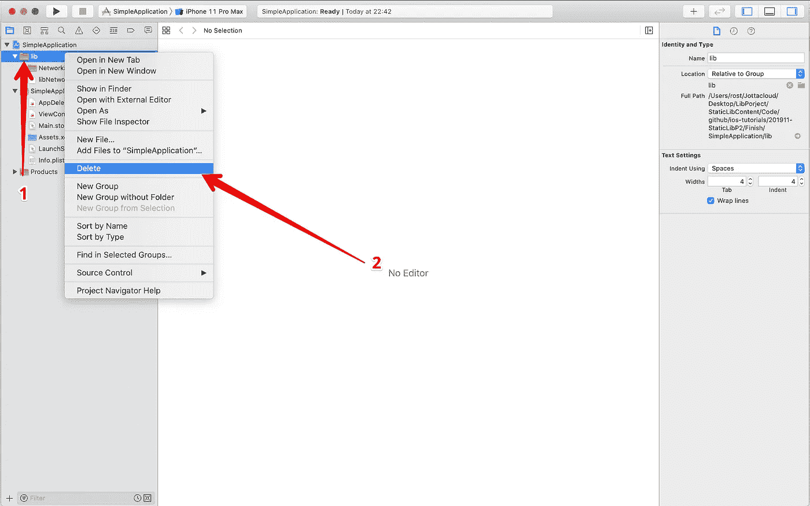

在出现的窗口中按“移到废纸篓”:

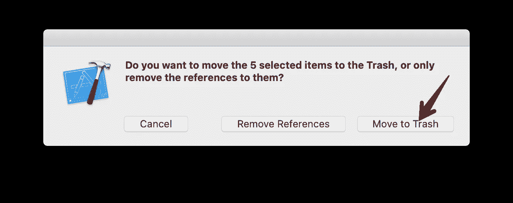

然后在项目导航器中选择项目文件。右键单击它，然后选择在 Finder 中显示:

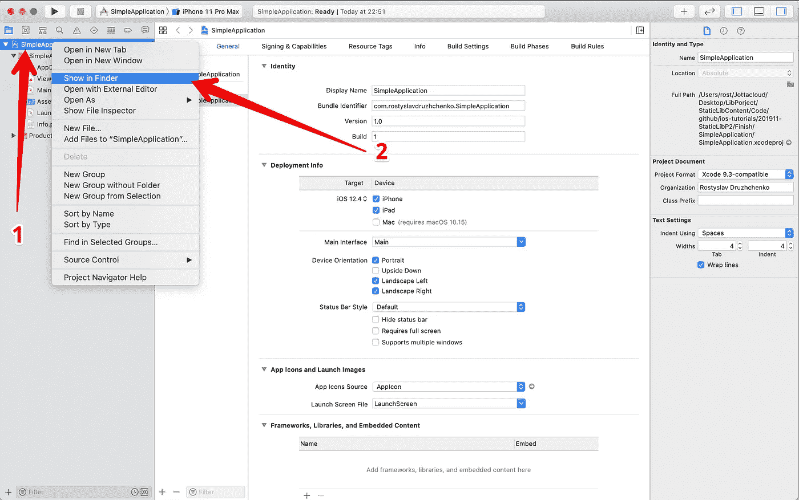

导航到`lib`文件夹，并删除那里的所有文件(如果有的话)。

然后回到网络项目，选择`libNetworking.a`，在 Finder 中按 Show。

导航到包含通用二进制文件和`Networking.swiftmodule`文件夹的文件夹。将它们拖放到`SimpleApplication/lib`文件夹:

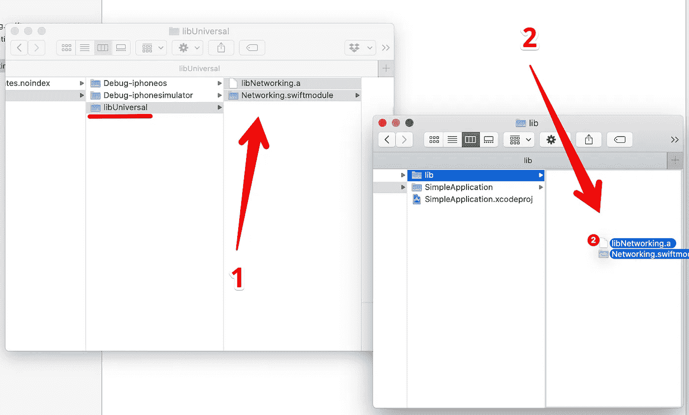

确保你是从`libUniversal`文件夹中，而不是从`Debug-iphoneos`或`Debug-iphonesimulator`中拖动文件。

然后再次打开`SimpleApplication`项目。在项目导航器中选择项目文件。右键单击，并选择将文件添加到“简单应用程序”…:

然后在出现的窗口中，选择`lib`文件夹，并按添加:

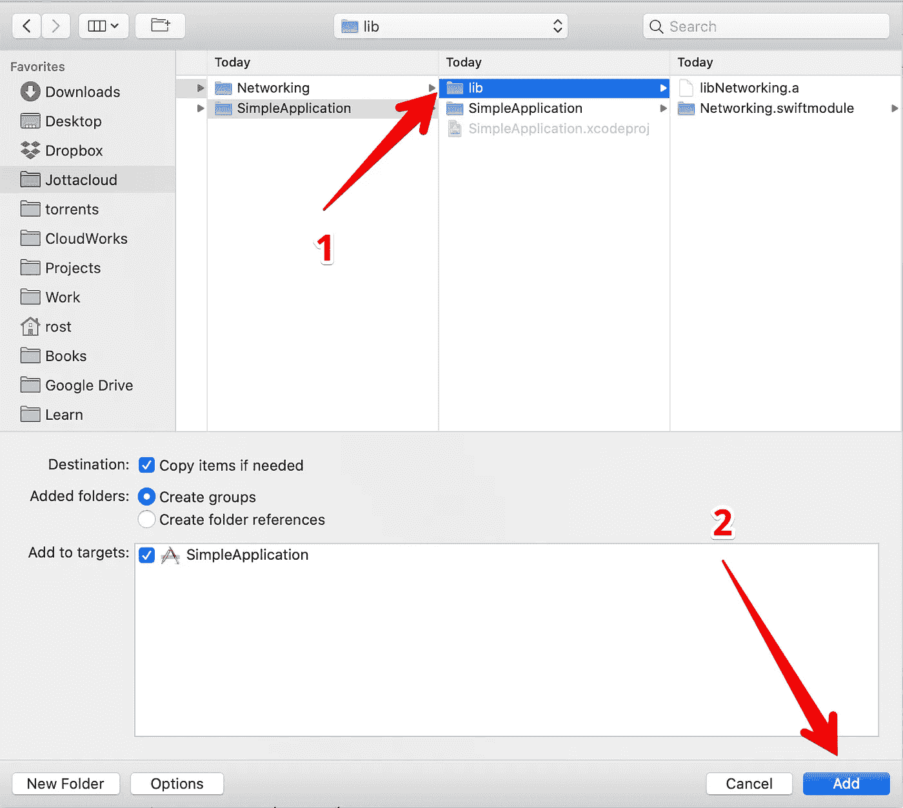

按下 Cmd-opt-shift-K 来清理项目。然后，按 Cmd-B，构建应该会成功。

您可以在真实设备或模拟器上运行应用程序，以确保它正常工作。在 Xcode 的输出中，我们应该会看到类似这样的内容:

# 结论

在本文中，我们做了并考虑了几件事，即:

*   为用 Swift 编写的静态库创建了一个通用二进制文件
*   被认为是可以在任何项目中轻松重用的构建脚本
*   将通用库集成到另一个项目中，并在模拟器和移动设备上运行

# 下一步是什么？

尽管我们创建了一个静态库，并使其代码可用于其他应用程序，但仍有很大的改进空间:

## 自动化

可以自动复制/粘贴库的二进制文件。要做到这一点，应该对运行脚本稍加修改，并且还需要对环境进行一些更改。

## 单元测试

模块化最重要的优势之一是隔离和依赖性制动。它为单元测试和集成测试奠定了良好的基础。

# 参考

*   https://GitHub . com/drrost/IOs-tutorials/tree/master/201911-static libp 2—GitHub 上的完整代码版本，您可以下载并研究
*   [https://medium . com/better-programming/create-swift-5-static-library-f1 c 7 a1 be 3 e 45](https://medium.com/better-programming/create-swift-5-static-library-f1c7a1be3e45)—本教程第 1 部分
*   [https://stack overflow . com/questions/51558933/error-unable-load-standard-library-for-target-arm 64-apple-IOs 10-0-simulator](https://stackoverflow.com/questions/51558933/error-unable-to-load-standard-library-for-target-arm64-apple-ios10-0-simulator)
*   [https://github . com/apple/swift/blob/master/docs/serialization . rst](https://github.com/apple/swift/blob/master/docs/Serialization.rst)—一个 Swift 文档，它揭示了`*.swiftmodule`和`*.swiftdoc`文件