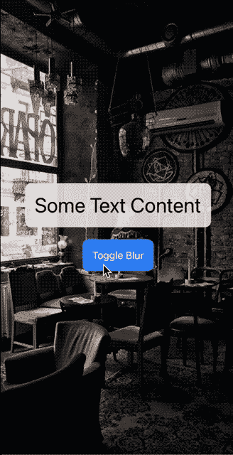

# 使用 SwiftUI 在 iOS 中创建复杂的背景模糊

> 原文：<https://betterprogramming.pub/create-complex-background-blurs-in-ios-with-swiftui-5b35ce2ddbab>

## 让我们在 Swift 中使用泛型的力量


照片由[光柱刘](https://unsplash.com/@lightliu)[上【unsplash.com】下](https://unsplash.com)

虽然这个系列的第一部分是关于在背景图像上创建一个非常简单的模糊效果，但这一次我们将专注于通过模糊化一个完整的视图来创建一个更复杂的版本。

> 这篇文章是基于第一部分，所以如果你还没有读过，我建议你先读一读，然后再继续。

# 目标

我们的目标是从上一部分中提取我们的视图，并用另一个模糊第一个视图的视图覆盖它。



产生的模糊效果

为了简单起见，我们想要重叠的视图非常稀疏，只有一些文本和一个按钮，但是同样的原则适用于任何复杂的视图。

# 视图修改器

上次我们使用了一个简单的视图修改器来完成任务，这次不会有太大的不同，只是我们需要创建一个稍微复杂一点的:

新的修改器看起来与我们之前的几乎相似，但是有一个有趣的区别:

> 通用的

你可能已经注意到，我们的修饰符现在接受了类型`View` *:* 的泛型类型`OverlayContent`

```
struct BlurModifier<OverlayContent: View>: ViewModifier
```

什么是通用？让我们来看看 Swift 文档是如何表述的:

> 泛型代码使您能够编写灵活的、可重用的函数和类型，这些函数和类型可以根据您定义的要求与任何类型一起工作。您可以编写避免重复的代码，并以清晰、抽象的方式表达其意图。

这个类属基本上是我们想要显示的覆盖模糊效果的内容。在第 5 行中，我们有显示内容本身的闭包的定义:

`let content: () -> OverlayContent`

在第 15–17 行中，我们使用变量和适当的修饰符来显示它:

```
self.content()                
  .opacity(showOverlay ? 1 : 0)
  .animation(.easeIn(duration: 0.4))
```

这个通用是必需的，这样我们就可以在模糊效果中包含任何我们想要的内容。如果这里没有泛型，我们将不得不静态定义内容，这样它将被硬编码并且总是相同的。

> ℹ️关于仿制药的更多信息可以在 Swift 官方文档[中找到](https://docs.swift.org/swift-book/LanguageGuide/Generics.html)

第 8–12 行是视图内容本身，我们希望将其模糊化并用自定义内容覆盖。

# 完整的代码

如果您已经阅读了第一部分，下面的代码应该很简单。这基本上是我们的旧观点和上面的新修正的结合:

第 55–73 行是我们上面的修饰符的实现。在闭包内部(第 56–72 行),我们定义了想要在模糊的内容上显示的内容。

轻按按钮会触发模糊效果，轻按内容会禁用模糊效果。

仅此而已！你现在可以在你的视图上应用同样的原理和修改器来模糊它们。