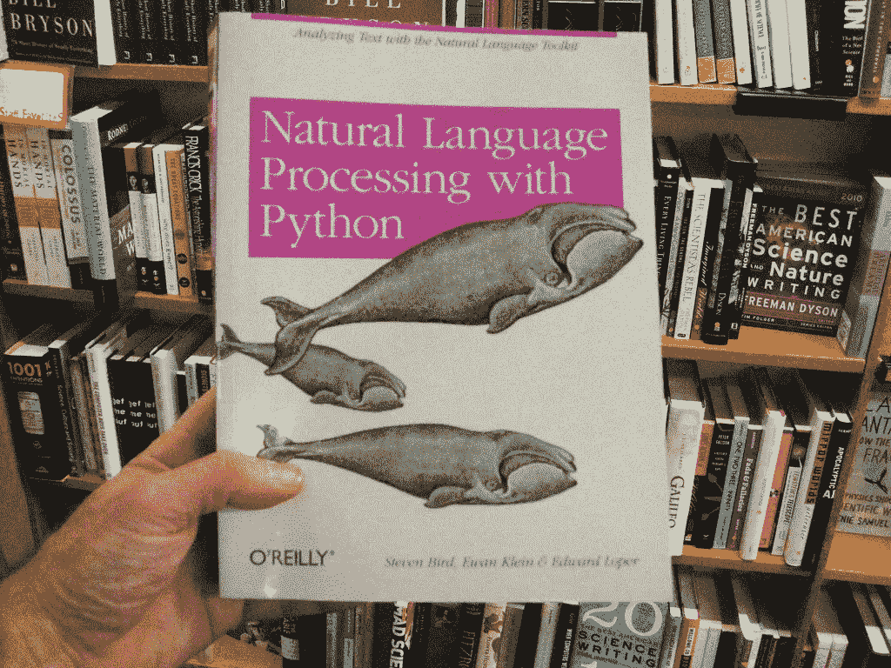

# 使用 Python 创建文本摘要，无需 NLP 库

> 原文：<https://betterprogramming.pub/create-text-summary-using-python-without-nlp-libraries-3b0f94af585f>

## 使用 Python 总结文本的最简单方法



图片来源:[维基共享 CC 2.0](https://commons.wikimedia.org/wiki/File:Natural_Language_Processing_with_Python_-_Flickr_-_brewbooks.jpg)

有几个 NLP 库可以使用，例如，[自然语言工具包](https://www.nltk.org/)(NLTK)[text blob](https://textblob.readthedocs.io/en/dev/)， [CoreNLP](https://stanfordnlp.github.io/CoreNLP/) ， [Gensim](https://github.com/RaRe-Technologies/gensim) ，以及 [spaCy](https://spacy.io/) 。你可以使用这些不可思议的库来处理你的文本。

总结课文的方法有很多。在这篇文章中，我将向你展示不使用任何 NLP 库，把你的文章总结成三句话的最简单的方法。

然而，我们将需要一些库来预处理和排序数据。

# 所需的库

```
import re
import heapq
```

假设我们要总结下面的文本块，它有 600 个单词:

直到 20 世纪 80 年代，大多数自然语言处理系统都是基于复杂的手写规则。然而，从 20 世纪 80 年代末开始，随着用于语言处理的机器学习算法的引入，自然语言处理发生了一场革命。这是由于计算能力的稳步增长(见摩尔定律)和乔姆斯基语言学理论(如转换语法)的主导地位的逐渐削弱，其理论基础不鼓励作为语言处理机器学习方法基础的语料库语言学。[3]一些最早使用的机器学习算法，如决策树，产生了类似于现有手写规则的硬 if-then 规则系统。然而，词性标注将隐马尔可夫模型的使用引入了自然语言处理，并且越来越多的研究集中在统计模型上，统计模型基于将实值权重附加到组成输入数据的特征来做出软的概率决策。许多语音识别系统现在所依赖的高速缓存语言模型就是这种统计模型的例子。当给定不熟悉的输入时，特别是包含错误的输入时(这对于真实世界的数据来说是非常常见的)，这样的模型通常更健壮，并且当集成到包括多个子任务的更大系统中时，产生更可靠的结果。许多显著的早期成功发生在机器翻译领域，特别是由于在 IBM Research 的工作，在那里开发了更复杂的统计模型。这些系统能够利用加拿大议会和欧洲联盟由于法律要求将所有政府程序翻译成相应政府系统的所有官方语言而制作的现有多语种文本语料库。然而，大多数其他系统依赖于专门为这些系统实现的任务开发的语料库，这是(并且经常继续是)这些系统成功的主要限制。因此，大量的研究转向了从有限的数据中更有效地学习的方法。最近的研究越来越多地集中在无监督和半监督学习算法上。这种算法可以从没有用期望的答案手工标注的数据中学习，或者使用标注和未标注数据的组合来学习。通常，该任务比监督学习困难得多，并且对于给定数量的输入数据，通常产生不太准确的结果。然而，有大量的非注释数据可用(其中包括万维网的全部内容)，如果所使用的算法具有足够低的时间复杂度以便实用，那么这些数据通常可以弥补较差的结果。在 2010 年代，表示学习和深度神经网络类型的机器学习方法在自然语言处理中变得广泛，部分原因是一系列结果表明，这种技术[4][5]可以在许多自然语言任务中实现最先进的结果，例如在语言建模，[6]解析，[7][8]和许多其他方面。流行的技术包括使用单词嵌入来捕获单词的语义属性，以及增加更高级任务(例如，问答)的端到端学习，而不是依赖于独立中间任务的流水线(例如，词性标注和依存句法分析)。在某些领域，这种转变已经引起了 NLP 系统设计方式的实质性变化，使得基于深度神经网络的方法可以被视为不同于统计自然语言处理的新范式。例如，术语神经机器翻译(NMT)强调了这样一个事实，即基于深度学习的机器翻译方法直接学习序列到序列的转换，从而消除了对统计机器翻译(SMT)中使用的单词对齐和语言建模等中间步骤的需要。

让我们以字符串的形式加载文本。

```
**text = “Up to the 1980s, most natural language processing systems were based on complex sets of hand-written rules. Starting in the late 1980s, however, there was a revolution in natural language processing with the introduction of machine learning algorithms for language processing. This was due to both the steady increase in computational power (see Moore’s law) and the gradual lessening of the dominance of Chomskyan theories of linguistics (e.g. transformational grammar), whose theoretical underpinnings discouraged the sort of corpus linguistics that underlies the machine-learning approach to language processing.[3] Some of the earliest-used machine learning algorithms, such as decision trees, produced systems of hard if-then rules similar to existing hand-written rules. However, part-of-speech tagging introduced the use of hidden Markov models to natural language processing, and increasingly, research has focused on statistical models, which make soft, probabilistic decisions based on attaching real-valued weights to the features making up the input data. The cache language models upon which many speech recognition systems now rely are examples of such statistical models. Such models are generally more robust when given unfamiliar input, especially input that contains errors (as is very common for real-world data), and produce more reliable results when integrated into a larger system comprising multiple subtasks.Many of the notable early successes occurred in the field of machine translation, due especially to work at IBM Research, where successively more complicated statistical models were developed. These systems were able to take advantage of existing multilingual textual corpora that had been produced by the Parliament of Canada and the European Union as a result of laws calling for the translation of all governmental proceedings into all official languages of the corresponding systems of government. However, most other systems depended on corpora specifically developed for the tasks implemented by these systems, which was (and often continues to be) a major limitation in the success of these systems. As a result, a great deal of research has gone into methods of more effectively learning from limited amounts of data. Recent research has increasingly focused on unsupervised and semi-supervised learning algorithms. Such algorithms can learn from data that has not been hand-annotated with the desired answers or using a combination of annotated and non-annotated data. Generally, this task is much more difficult than supervised learning, and typically produces less accurate results for a given amount of input data. However, there is an enormous amount of non-annotated data available (including, among other things, the entire content of the World Wide Web), which can often make up for the inferior results if the algorithm used has a low enough time complexity to be practical.In the 2010s, representation learning and deep neural network-style machine learning methods became widespread in natural language processing, due in part to a flurry of results showing that such techniques[4][5] can achieve state-of-the-art results in many natural language tasks, for example in language modeling,[6] parsing,[7][8] and many others. Popular techniques include the use of word embeddings to capture semantic properties of words, and an increase in end-to-end learning of a higher-level task (e.g., question answering) instead of relying on a pipeline of separate intermediate tasks (e.g., part-of-speech tagging and dependency parsing). In some areas, this shift has entailed substantial changes in how NLP systems are designed, such that deep neural network-based approaches may be viewed as a new paradigm distinct from statistical natural language processing. For instance, the term neural machine translation (NMT) emphasizes the fact that deep learning-based approaches to machine translation directly learn sequence-to-sequence transformations, obviating the need for intermediate steps such as word alignment and language modeling that was used in statistical machine translation (SMT).”**
```

现在，拆分文本字符串的句子。

```
**sentences = re.split(r’ *[\.\?!][\’”\)\]]* *’, text)**
```

对于预处理，我们将降低文本，并将文本拆分成单词(`word_tokenize`)。

```
**clean_text = text.lower()
word_tokenize = clean_text.split()**
```

我们还需要排除需要总结的语言的停用词。你可以从 Countwordsfree 网站得到你想要的语言的停用词:【https://countwordsfree.com/stopwords

```
**stop_words = [“i”, “me”, “my”, “myself”, “we”, “our”, “ours”, “ourselves”, “you”, “your”, “yours”, “yourself”, “yourselves”, “he”, “him”, “his”, “himself”, “she”, “her”, “hers”, “herself”, “it”, “its”, “itself”, “they”, “them”, “their”, “theirs”, “themselves”, “what”, “which”, “who”, “whom”, “this”, “that”, “these”, “those”, “am”, “is”, “are”, “was”, “were”, “be”, “been”, “being”, “have”, “has”, “had”, “having”, “do”, “does”, “did”, “doing”, “a”, “an”, “the”, “and”, “but”, “if”, “or”, “because”, “as”, “until”, “while”, “of”, “at”, “by”, “for”, “with”, “about”, “against”, “between”, “into”, “through”, “during”, “before”, “after”, “above”, “below”, “to”, “from”, “up”, “down”, “in”, “out”, “on”, “off”, “over”, “under”, “again”, “further”, “then”, “once”, “here”, “there”, “when”, “where”, “why”, “how”, “all”, “any”, “both”, “each”, “few”, “more”, “most”, “other”, “some”, “such”, “no”, “nor”, “not”, “only”, “own”, “same”, “so”, “than”, “too”, “very”, “s”, “t”, “can”, “will”, “just”, “don”, “should”, “now”]**
```

我们已经把英语中所有的停用词放在一个列表中。您可以添加其他语言的停用词并将其追加到此列表中。

接下来，我们将把所有单词标记到字典中，并给它们赋值。

现在，使用来自`word2count`的值，我们将对句子评分。

这里我们只选取了最多 25 个单词，最少 9 个单词的句子进行总结。

之后，我们将创建一个加权直方图。

```
for key in word2count.keys():
    word2count[key] = word2count[key] / max(word2count.values())
```

现在我们只要把最好的树句子排序，看看结果。

```
best_three_sentences = heapq.nlargest(3, sent2score, key=sent2score.get)print(*best_three_sentences)
```

## 输出

*“然而，从 20 世纪 80 年代末开始，随着用于语言处理的机器学习算法的引入，自然语言处理发生了一场革命。许多语音识别系统现在所依赖的缓存语言模型就是这种统计模型的例子。[3]一些最早使用的机器学习算法，如决策树，产生了类似于现有手写规则的硬 if-then 规则系统。”*

我们把一篇 600 字的课文概括成了 65 个字。

# 这是完整的代码

# 结论

还有很多文本摘要的方法。我已经演示了一个非常简单的方法。希望这能对你有所帮助，鼓励你学习更多的自然语言处理知识和更多有趣的项目。