# 在 React 和 Vue.js 中创建匹配匹配/记忆游戏

> 原文：<https://betterprogramming.pub/create-the-match-match-memory-game-in-react-and-vue-js-1026f1df000e>

## 异同用两种不同的框架构建同一个游戏


作为一个孩子，我喜欢比赛比赛的游戏，又名浓度。这是一个很容易理解的纸牌游戏，但是一旦你开始玩，你会很快意识到记住你碰到的每张牌是很困难的。

你玩这个游戏只需要一副牌。规则很简单。所有的牌都面朝下放在一个平面上，每一轮翻两张面朝上。游戏的目的是翻转成对的匹配卡片。

在这一部分中，我们将在 React 和 Vue 中构建匹配匹配的游戏。

我在这两个框架中都有经验，我想如果我在每个框架中记录构建相同应用程序的过程可能会有所帮助。目的是向您展示这两种流行的 JavaScript 框架在代码方面的异同。我不想构建一个标准的应用程序，因为我认为构建一个游戏会更有趣！

# 应该是什么样子？

上面的图像是这个项目应该的结果。我们不会太注重让它看起来漂亮。如果你愿意，你可以添加额外的 CSS。本文的主要目的是让您深入了解 React 和 Vue 在代码方面的异同。请随意添加改进或新功能。

# 该开始了！

我们正在从头开始构建我们的 Match Match 项目，所以我们需要先创建一个应用程序。在 React 中，这可以通过以下命令完成:

```
npx create-react-app match-match
```

*注意，我们为此使用了*[*Create React App*](https://github.com/facebook/create-react-app)*项目。*

我们对 Vue 使用相同的方法。我们通过 [Vue CLI](https://cli.vuejs.org/) 创建我们的项目:

```
vue create match-match
```

一旦您启动并运行了您的项目，您应该会看到类似这样的内容:

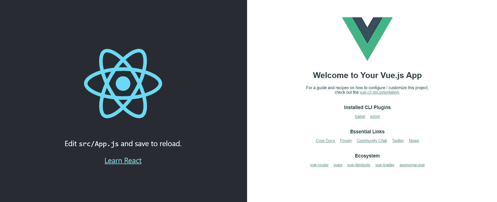

那很容易，不是吗？这就是入门的全部！

# 项目文件结构

现在我们已经创建了 React 和 Vue 项目，我们可以看看文件结构。注意，这是*完成的*项目的文件结构。但是，文件夹的结构保持不变。

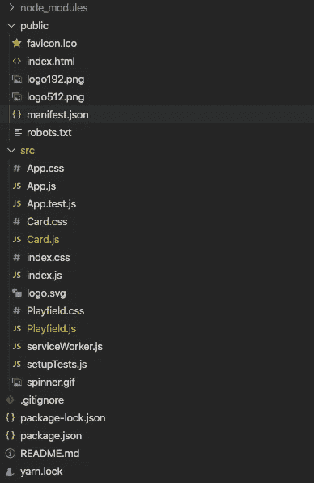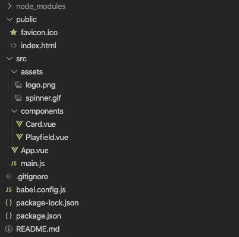

两个项目都有一个`public`、`src`和`node_modules`文件夹。不同的是，Vue 项目在`src`文件夹中有子文件夹。组件存储在`components`文件夹中，图像等资产存储在`assets`文件夹中。默认情况下，React 项目没有子文件夹，但是如果需要，您可以创建子文件夹。

默认情况下，Vue 项目的结构更好，文件比 React 项目少。部分原因是 Vue 项目中不需要单独的样式表。

# 我们需要什么？

首先，我们需要一个操场。然后，我们需要一副配对卡片。

让我们从我们要制作的第一个组件——`playfield`开始。

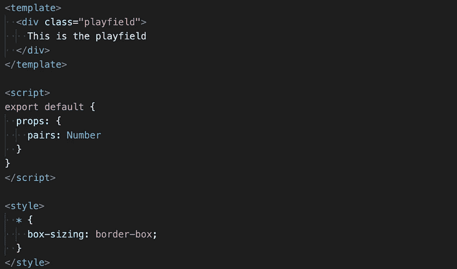

这是 React 和 Vue 中基本组件的外观。我们已经可以在这个例子中发现一些不同之处。在我们的 React 组件中，我们通过使用`import`来包含一个样式表。我们的 Vue 组件的风格包含在组件的其余逻辑中。Vue 中不需要单独的样式表。

另一个微妙的区别是，在 React 中向元素添加类是由`className`属性而不是`class`完成的，因为*类*是一个保留关键字。

请注意，您可以使用 SCSS 来代替 CSS。为了简单起见，我选择在这个项目中使用 CSS。

# 传递道具

你可能已经注意到了`Playfield`组件有一个叫做`pairs`的道具。它现在还没有被使用，但是这个道具会告诉`Playfield`组件它应该在棋盘上放多少副牌。

两个项目都有一个`App`组件，它是最顶层的组件。这将呈现`Playfield`组件，并通过道具传递对子的数量。

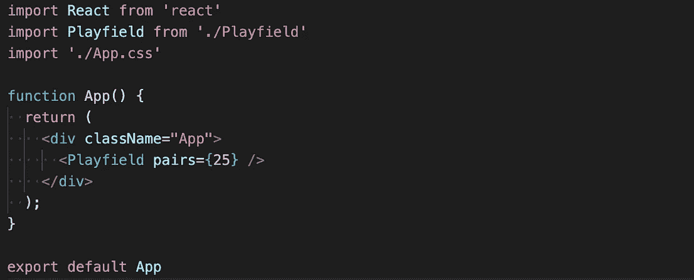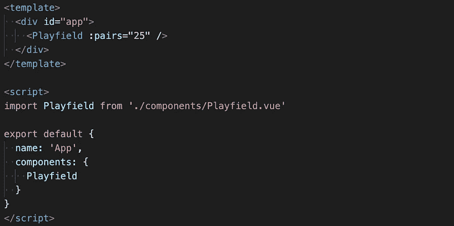

在`App`组件中呈现`Playfield`组件的方式几乎是相同的。

注意在 Vue 例子中的`pairs` prop 之前使用的冒号。如果使用冒号，属性的内容将被视为 Javascript 如果没有，就是一串。通过使用冒号，`pairs`属性被计算为一个数字。

# 为卡提取数据

所有的卡片都需要一个图像。由于卡片的数量是可变的(我们给 Playfield 组件添加了`pairs`道具),我们不知道我们需要多少张图片。这就是为什么我们要使用一个 API 来获取一些图像。

我们将使用 Axios，您可以使用`npm install axios`安装它。

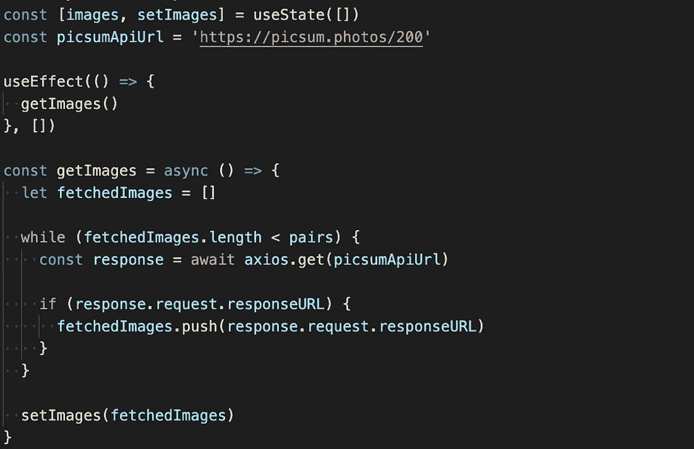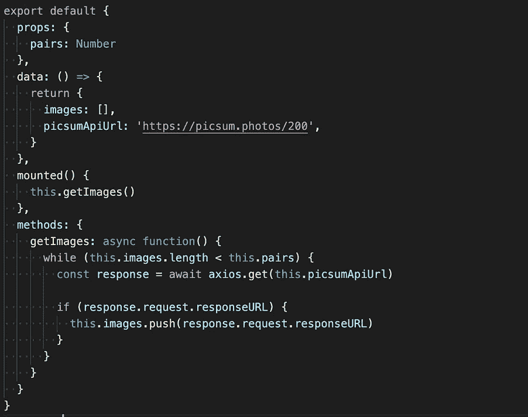

我们只想在组件挂载后从 API 获取图像。Vue 对此有一个`mounted`钩子，我们从这里调用`getImages`函数。在 React 中你可以使用`useEffect`钩子。

通过使用这个钩子，你告诉 React 你的组件需要在渲染之后做一些事情。如果你不指定第二个参数，`useEffect`钩子将在每次渲染后运行。

如果你只想在初始渲染后运行给`useEffect`的函数，你可以给它一个空数组作为第二个参数。

## 功能

React 组件中的函数被存储为`const`变量。另一方面，在 Vue 中，它们被定义在`methods`对象中。

## 变异数据

一旦我们从 API 获取了我们的图像，我们想要改变我们之前存储的数据。默认情况下，`images`变量是空的——现在我们已经获取了图像，我们想改变这一点。

这是 React 和 Vue 的一个关键区别。Vue 的工作非常简单。本质上，它创建了一个`data`对象，其中的数据可以自由更新。另一方面，React 创建了一个 state 对象，在这个对象中执行更新需要更多的努力。

React 要求您有充分的理由做出这种额外的努力——我们将很快深入探讨这一点。但首先，让我们来看看以下片段:


使用状态挂钩的 React 状态变量


Vue 的数据对象

你可以看到我们将同一个`images`数组传递给了两者。在 React 中，状态变量的默认值作为第一个参数传递给`useState`函数。在 Vue 中，只需在`data`对象中给它赋值即可。

正如我们之前提到的，我们如何着手改变这些数据在不同的框架中是不同的。你可能已经注意到了，我们可以直接在 Vue 中更新`data`对象。在`getImages`函数中，我们直接将图像推送到数组中。

React 需要多一点努力。如果我们想更新`images`状态变量，我们必须使用`setImages`函数。所以我们不能简单地调用`images.push(..)`并期望状态更新，与 Vue 相反。

有什么路可走？

我们再来看看`getImages`功能。我们将所有图像存储在一个临时数组中，称为`fetchedImages`。一旦我们获取了所有的图像，我们调用`setImages`函数，将`fetchedImages`作为它的参数。

一开始钩子可能很难掌握——如果你想了解更多，我强烈推荐你阅读[文档](https://reactjs.org/docs/hooks-intro.html)。

# 生成卡片组

在我们开始生成卡片组之前，我们需要等到所有的图像都被获取。在 React 中，我们可以通过使用`useEffect`钩子来做到这一点，就像我们开始获取图像一样。这里不同的是我们提供了`images`变量，而不是一个空数组。这意味着这个钩子只有在`images`变量被更新时才会被调用。

在 Vue 中，有一种不同的方式对数据变化做出反应:观察属性。每当`images`变量改变时，就会调用图像观察函数。

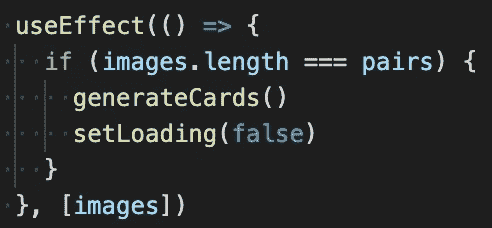

`generateCards`功能本身并不令人兴奋。我们给每张卡一个唯一的数字、一对数字、一个图像和两个布尔值:开和匹配。

这里唯一不同的是状态更新的方式。

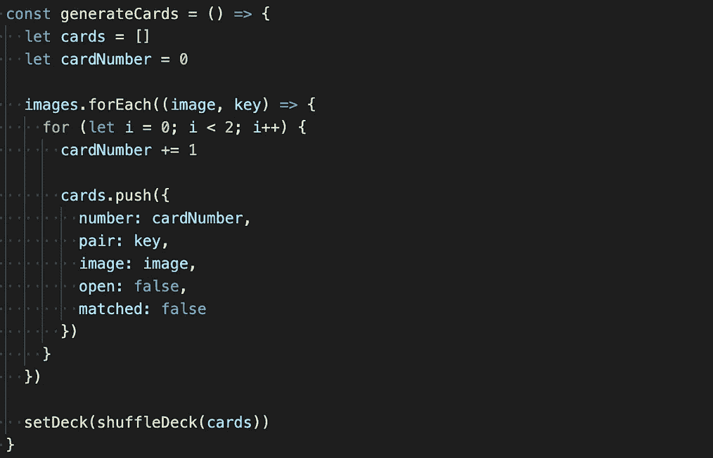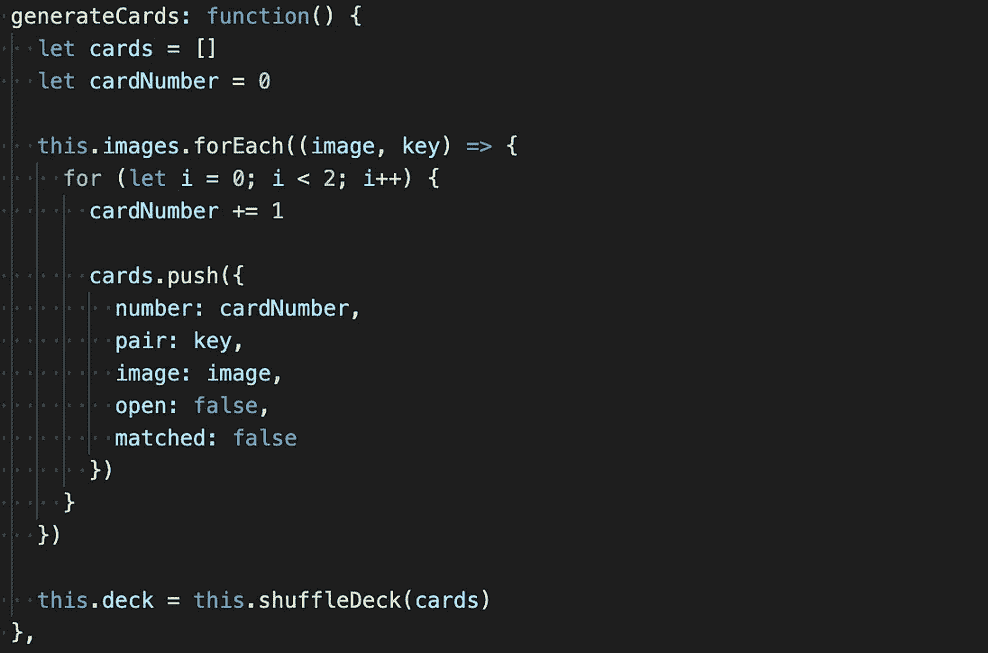

我们还增加了一个`shuffleDeck`功能，随机排列卡片组中的卡片。这两个项目的函数看起来是一样的。


# 添加微调器

由于`getImages`函数是异步的，获取数据可能需要几秒钟——特别是当您有很多对时，因为每对都发送一个请求。为了让事情变得更加用户友好，我们可以添加一个微调器来显示我们的游戏正在加载。

在前面的例子中，你可能已经注意到我们偷偷放入了一个`loading`变量，默认情况下是`true`。一旦卡片生成，该变量被设置为`false`。

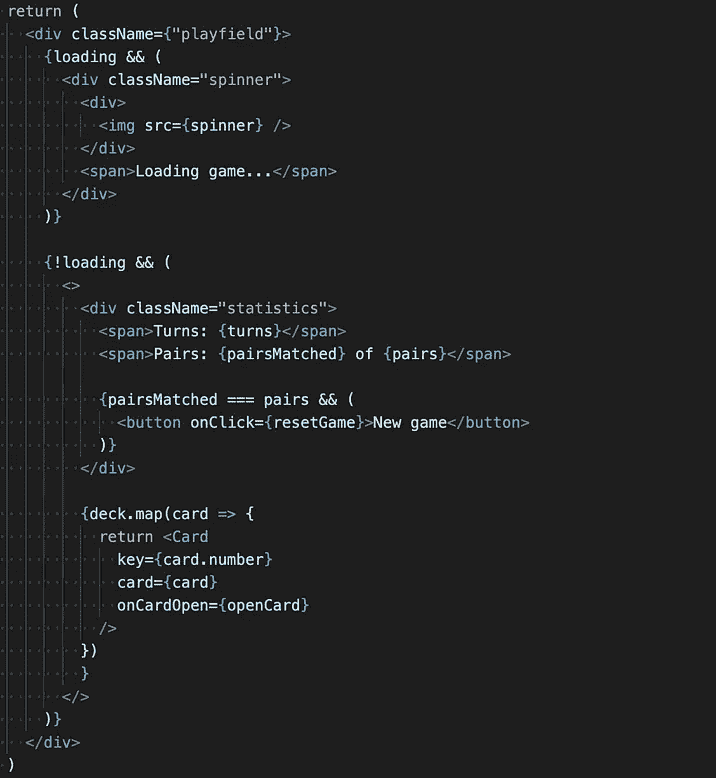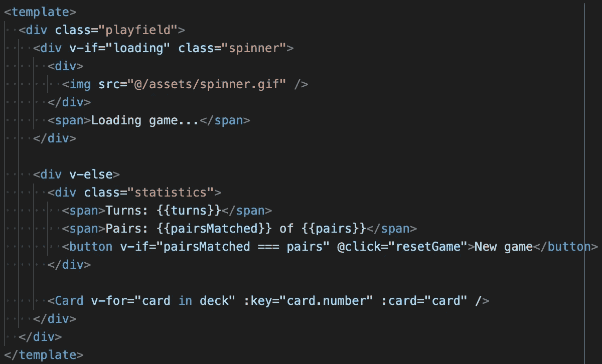

在 React 中，无法在组件的`return`中创建 *if-else* 构造。这导致两个独立的检查:`loading`和`!loading`。在 Vue 中，可以通过使用`v-if`和`v-else`进行 *if-else* 构造。

另外，注意 React 中的数组循环是通过使用`map`函数来完成的。Vue 对此有自己的指令:`v-for`。

# 该卡组件

如前所述，我们还需要一副牌。但是我们还没有一个`Card`组件。这是我们这个项目需要的最后一个组件。

每张牌可以有三种不同的状态:开放、关闭或匹配。如果匹配，我们可以把卡藏起来。当卡片合上时，我们显示一个问号，如果它打开了，我们显示图像。

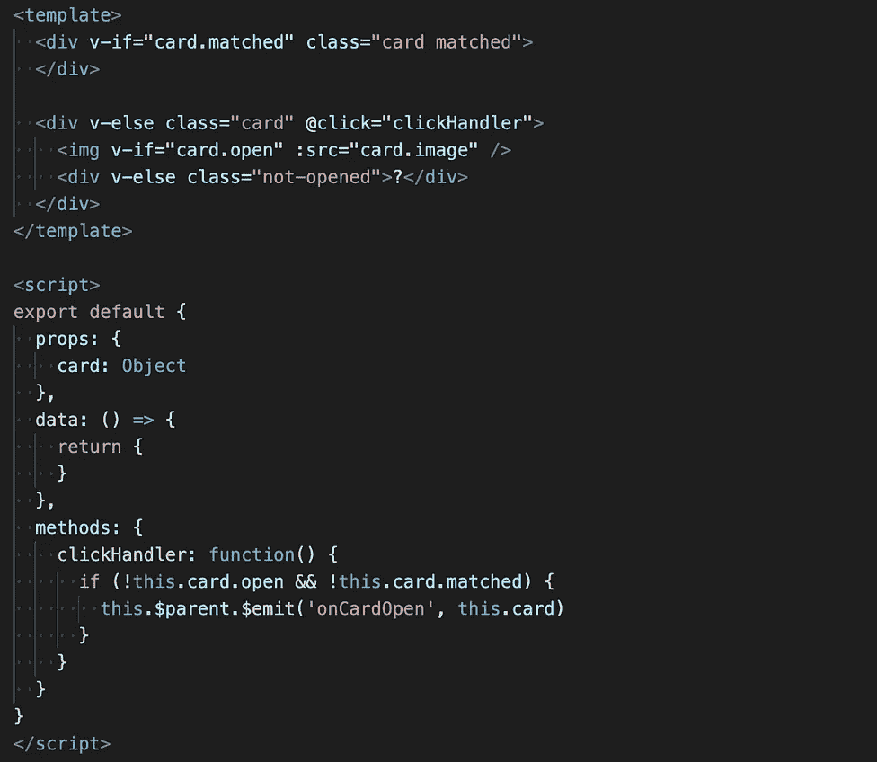

由于我们不能在 React 组件的`return`中执行正确的逻辑，我选择创建一个额外的函数`getCard`来完成这项工作。

React 组件有一个附加属性`onCardOpen`。这是从`Playfield`组件传递的回调函数。这是 React 从子节点调用父节点函数的方式。

这一点在 Vue 中有所不同。这可以通过向父级发出自定义事件来实现。在我们的例子中，我们将事件称为`onCardOpen`，并将`this.card`作为参数传递。

我们可以在父组件(即`Playfield`组件)中监听该事件，并采取相应的行动。在挂载的钩子中，我们监听`onCardOpen`事件。一旦该事件被触发，回调将被执行，这将调用`openCard`函数。


# 检查是否匹配

一旦我们打开了两张卡，我们要检查它们是否匹配。下面的例子中只有一个新概念，你能发现吗？

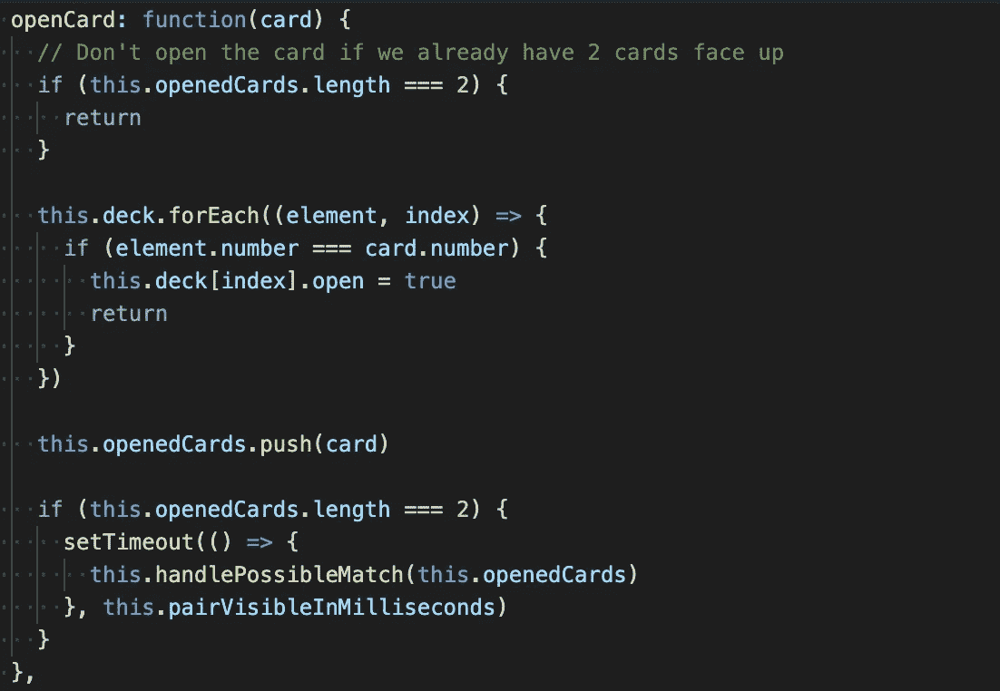

我们唯一没有触及的是下面一行:

```
let newDeck = [...deck]
```

要检测这个数组状态变量的变化，您不能简单地做以下事情:`let newDeck = deck`。因为更新的卡片组看起来很像旧的卡片组，所以我们需要使用 spread 操作符来分配它，以便 React 可以检测到数组中的变化。

# 处理可能的匹配

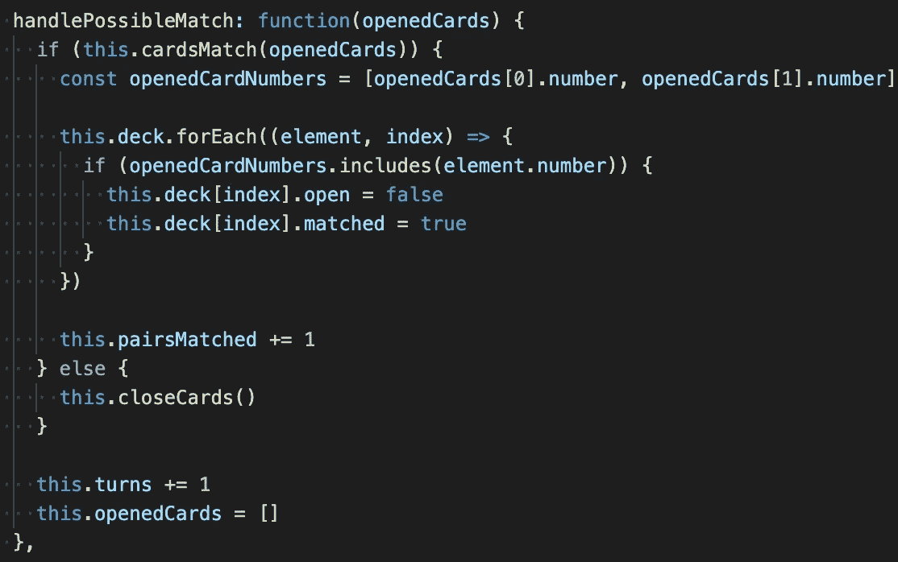

我想在游戏中加入竞争元素，所以我引入了一个回合数计数器。为了给用户更多的信息，我们还将提供匹配的配对数量。这段代码几乎是相同的。


一旦用户匹配了所有配对，我们希望用户能够开始一个新的游戏，所以我们也添加了这个功能。看到这段代码应该不会再让你震惊了！


# 最佳化

游戏开始前需要几秒钟。这是由获取图像的方式造成的。我用过的 [Lorem Picsum API](https://picsum.photos/) ，不支持批量渲染小图片。有一个选项可以让你下载图像列表，但它不允许你控制图像的大小。

我尝试过批量获取图像，因此只发送一个请求，而不是每对图像都发送一个请求。这导致游戏加载速度非常快。然而，游戏变得几乎无法玩，因为一些图像超过 5MB。对于这个例子，我牺牲了一些初始加载速度来提高游戏性。

这个问题可以用多种方法解决。第一个是在你的项目中添加一个图像集，这样你就不用每次想开始一个新游戏的时候都去获取它。那就没那么有趣了——当前的解决方案为你提供了每场比赛的随机图像。解决这个问题的第二个方法是找到一个 API，让您可以批量获取小图像。

# 多走一步

如果你真的想更进一步，你可以建立一个界面，让用户为游戏设置一些选项，比如对子的数量和难度。您可以通过调整一对可见的时间来调整难度级别(变量`pairVisibleInMilliseconds`)。

查看一下 [React GitHub repo](https://github.com/daanfl/match-match-react) 和 [Vue GitHub repo](https://github.com/daanfl/match-match-vue) ，这样如果你不想的话就不必从头开始构建。

# 系列的一部分

我正在考虑制作一系列包含像这篇文章一样的内容的作品。在本系列的每一篇文章中，我都将做一个小的编码项目，深入研究某些编程语言、框架或技术之间的差异。

如果您对本系列的下一部分有任何建议，请告诉我。

非常感谢您的反馈！