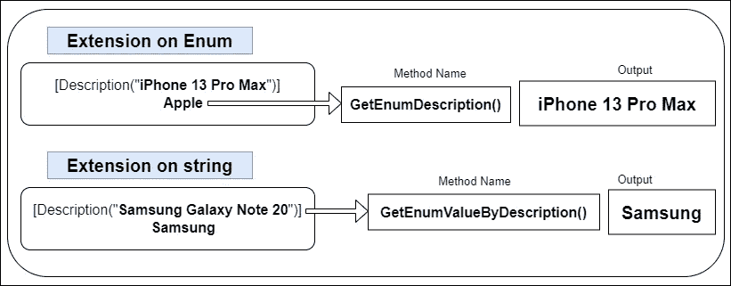

# 在 C#中创建扩展方法

> 原文：<https://betterprogramming.pub/creating-an-extension-methods-in-c-d8c773d6a71c>

## 用附加行为扩展类，而不修改它们


照片由[瓦吉·加利](https://unsplash.com/@romulusprince?utm_source=medium&utm_medium=referral)在 [Unsplash](https://unsplash.com?utm_source=medium&utm_medium=referral) 拍摄

在我们开始创建扩展方法之前，有人能告诉我到底什么是扩展方法吗？

好吧，让我们从一个简单的介绍开始。

# 介绍

按照 [MSDN](https://docs.microsoft.com/en-us/dotnet/csharp/programming-guide/classes-and-structs/extension-methods) 的说法，扩展方法使你能够向现有类型“添加”方法，而无需创建新的派生类型、重新编译或修改原始类型。扩展方法是静态方法，但是调用它们时就好像它们是扩展类型上的实例方法一样。

你猜怎么着听起来不错，微软！但是让我们来解释一下。

扩展方法是[开闭原则](https://www.c-sharpcorner.com/article/solid-design-principles-simplified-with-uml/)的一个完美例子，即“开放用于扩展，关闭用于修改”。软件实体应该对扩展开放，但对修改关闭。这仅仅意味着一个实体应该容易扩展而不需要修改它自己。

*   它说的是，现在你可以显式地添加一个新方法到现有的`"class String"`(那不是很好吗？).
*   如果你想检查一个字符串是否是回文，你可以简单地创建一个扩展方法，一劳永逸地完成。

## **但问题是怎么做？**

为了大家的利益，我们实际上不会使用另一个字符串回文的例子。相反，我们将实现一些有用的东西。

让我们编写一个扩展方法，通过它的值来获得对`enum`的描述。相信我，我不得不在谷歌上搜索这个答案很多次，以至于我决定写这篇文章，以免为了得到我的金枪鱼而游过充满塑料垃圾的太平洋。

# 履行

首先:“你能修改一下`class String`吗？”

答案是:不会，当然不会！就此而言，您不能对系统的类进行任何更改。现在你可能会说我可以继承`"class String"`并通过覆盖它现有的方法来扩展额外的功能？你也不能这么做，因为这是一个密封类。这意味着它对继承也是关闭的。

那么我们如何扩展现有类的行为呢？

快速浏览一下图 1。这是我们将要做的事情的大图。



图 1:类型 enum 和 string 的扩展方法

如上图所示，有两种扩展方法，

*   第一个，`GetEnumDescription()`用于`“type enum”`获取枚举值的`“description”`。
*   第二，扩展方法`GetEnumValueByDescription()`，由`“type string”`通过描述获取`“enum value”`。

现在继续创建一个 enum，如下面的清单 1 所示。这是一系列旗舰手机:

清单 1: FlagshipSmartphone.cs

# GetEnumDescription()

为了获得描述，我们将在 enum 上创建一个扩展方法。

在创建扩展方法时，我们需要注意一些规则。

**规则 1:** 扩展方法被定义为静态的，但是通过使用实例方法语法来调用。在下面的语法中，我们创建了一个静态方法`GetEnumDescription()`。

清单 2:方法 GetEnumDescription 的空主体

**规则 2** :第一个参数指定我们正在为哪个类型创建扩展方法，在本例中是`“Enum”`。参数总是由`“this modifier”`修饰。

清单 3:带有这个参数的 GetEnumDescription()

规则 3: 为了访问扩展方法，必须显式地导入名称空间。为了访问下面的`“GetEnumDescription() method”`，我们需要在 caller 类中添加`“using ExtensionMethod;”`名称空间。

清单 3: GetEnumDescription()及其名称空间

**规则#4:** `“Overriding is strictly prohibited”`，可以使用扩展方法来扩展类或接口的行为，但不能覆盖已有的行为。

现在我们已经完成了所有的规则，让我们给这个空身体添加一些逻辑。在下面的清单中，我所做的就是获取第 3 行中的`“type enum”`的`“fieldinfo”`并且在下一行中搜索自定义属性，如果类型匹配，则返回描述，如果类型匹配，则抛出异常。

清单 4: GetEnumDescription()

一切就绪，让我们看看魔法。根据我们的图表，让我们在`“class Program”`中调用这个扩展方法，在下面的清单 5 中，我们创建了一个类型为`“FlagshipSmartphone enum”`的变量，其值为`“Samsung”`。然后在第 4 行，我们实际上是在()的帮助下调用新创建的扩展方法。)点运算符。

清单 5:调用扩展方法()

运行应用程序，您应该能够看到如图 2 所示的输出。


图 GetEnumDescription()的输出

# GetEnumValueByDescription()

既然我们已经熟悉了所有的细节，让我们直接进入代码吧。我们将重用`“GetEnumDescription()”`以避免重写相同的逻辑。

清单 6: GetEnumValueByDescription()

*   您可能会问，我们在清单 6 中做了什么？
*   首先，我们使用第一个参数`string`作为`“this”`。
*   然后我们将返回一个泛型类型参数`**“<T>”**`,使这个方法可以在所有类型的枚举中重用。
*   就逻辑而言，我们通过枚举值循环寻找匹配的描述。一旦描述匹配，我们就返回枚举值，如果没有描述匹配的枚举，我们就抛出一个异常。你可以用你想要的方式处理它，但是为了简单起见，现在我只是抛出一个异常。

让我们继续在我们的`“class Program”`中调用这个方法。正如您在第 8 行中看到的。我们用的是**(。)**字符串变量上的点运算符`iphone`来调用我们的扩展方法。

清单 7:在第 8 行调用 GetEnumValueByDescription()。

让我们在这里运行这个家伙！您应该能够看到如图 3 所示的输出。


图 GetEnumValueByDescription()的输出

这就是如何扩展现有类的行为，而无需修改它们。你也可以使用其他设计模式来实现这一点，但这是一个你可以使用的捷径。

还有一件更有趣的事。因为它是用户定义的静态类，所以您也可以使用类名直接调用该方法。

清单 8:用静态类调用扩展方法

C#中有一些预定义的扩展方法。

如果以下面的例子为例，我们有一个`“int array”`，我们在阵列上使用了`“FirstOrDefault()”`。

但是你猜怎么着？数组没有任何名为`FirstOrDefault()`的方法。这是因为`FirstOrDefault()`是一个扩展方法，任何实现`“IEnumerable interface”`的集合都可以使用它。

在我们的例子中，Array 按照图 4 实现了`IEnumerable interface`。

清单 9:使用扩展方法 FirstOrDefault()


图 4:类数组

正如我们在清单 8 中了解到的，我们可以直接使用静态类来调用扩展方法。所以我们也可以用下面的代码重写清单 9 中的代码。

注意:第一个参数是，“集合类型的`this`”。这意味着您必须将一个`“integer array”`作为第一个参数传递给`FirstOrDefault()`方法。

清单 10:用静态类调用扩展方法

但是它总是倾向于使用扩展方法，我的意思是这就是为什么它们是为。

extension 方法的这个主题向我们展示了如何在不修改类的情况下扩展类以获得额外的行为。

这也让我们了解了静态类是如何工作的。您可以深入研究系统的类来发现扩展方法。你会惊讶地知道到目前为止你已经使用了多少扩展方法。

感谢阅读。

```
**Want to Connect?**Hit me up on [LinkedIn](https://www.linkedin.com/in/rikampalkar/).
```