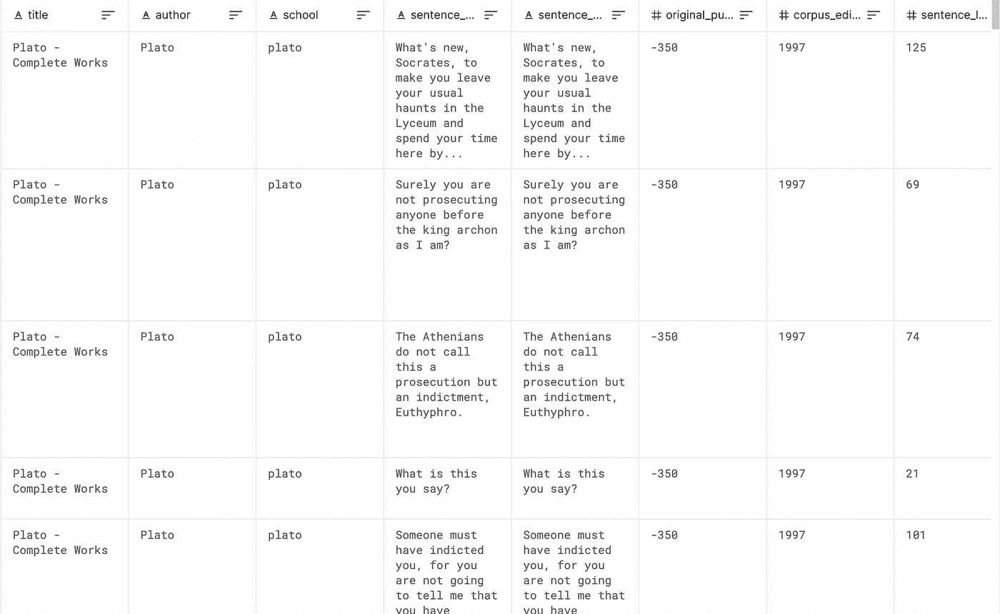
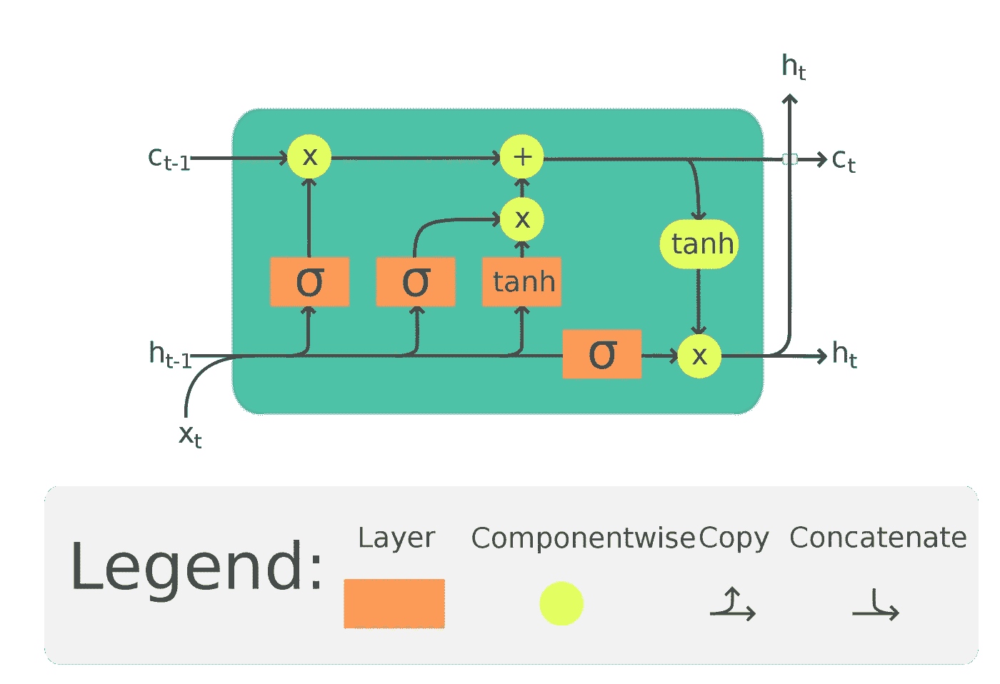
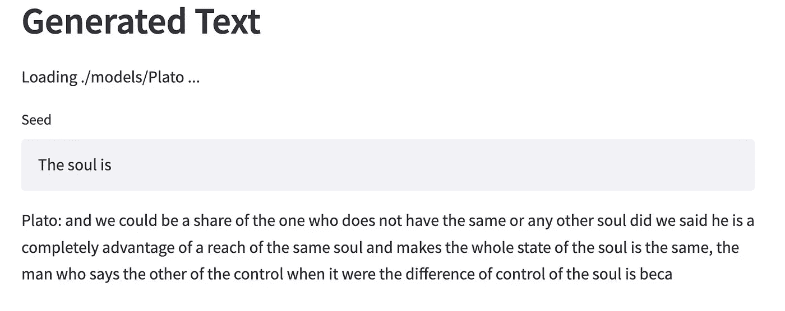
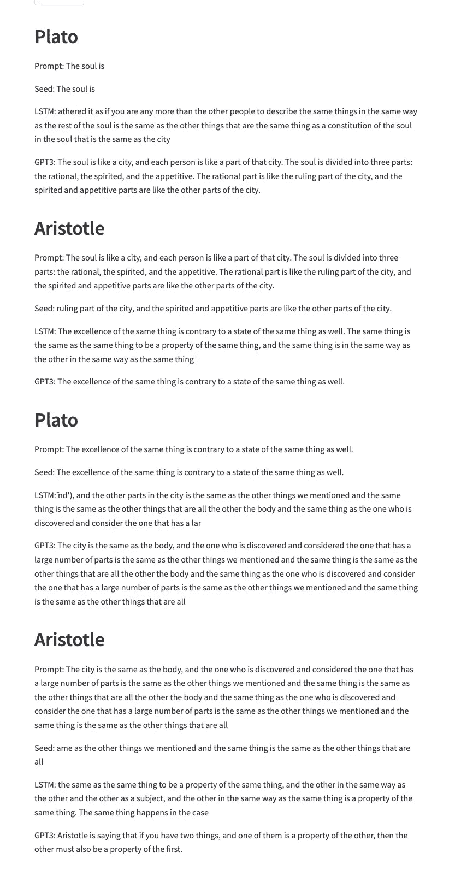
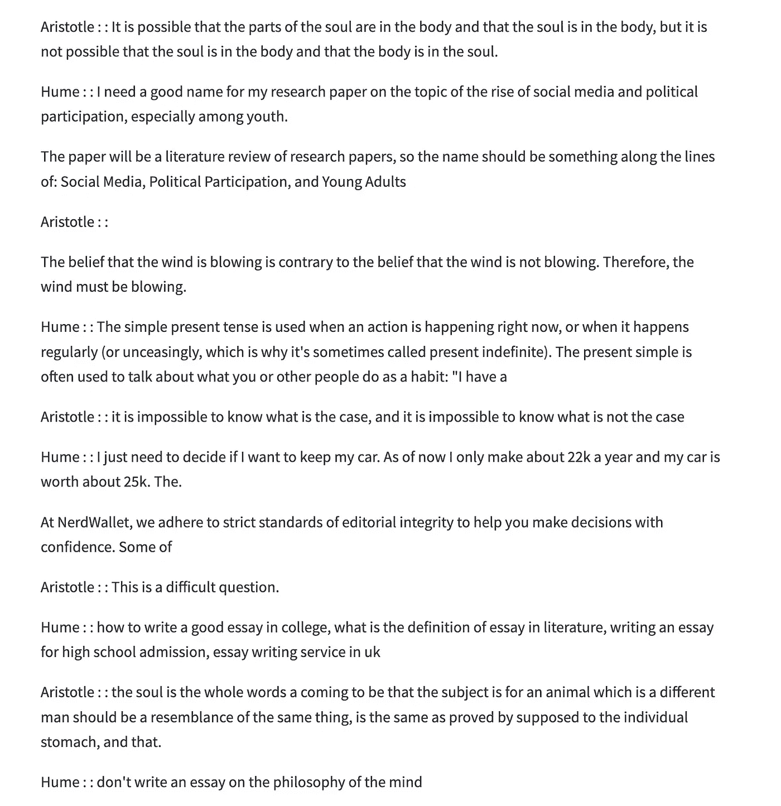
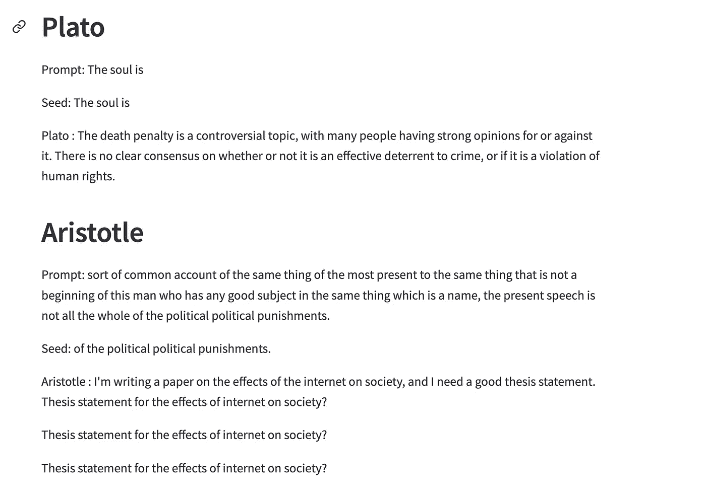
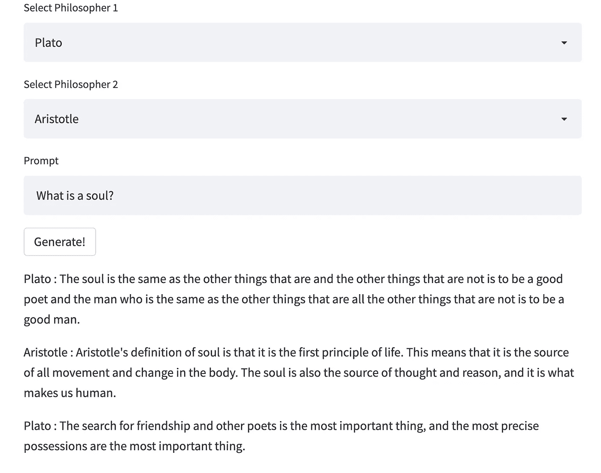

# 使用生成性 LSTM 网络创建哲学家对话

> 原文：<https://betterprogramming.pub/creating-philosopher-conversations-using-a-generative-lstm-network-fd22a14e3318>

## 杰克·博丁、比约恩·路德维希、格蕾丝·阿伦索恩和埃文·特拉比兹


[西方有 3000 年的思想史，涵盖了西方思想和高雅文化中的大部分重要问题，它涉及一种大多数人不会花大部分时间去做的思考。](https://www.youtube.com/watch?v=Rc0K4WhNOvY)

它叫哲学。

相比之下，现代计算机科学的历史可以追溯到仅仅 100 年前——但远非新生技术，该领域已经彻底改变了现代世界，以至于很难想象还有哪个社会部门尚未接触到 CPU 和代码行。事实上，计算机科学对于任何科学来说都是必不可少的。为什么不是哲学呢？

# **目标**

许多哲学家沉思着亚里士多德对休谟、黑格尔对康德、德勒兹对尼采会说些什么，等等。这些思考从未离开过猜测的领域，但随着新型生成神经网络的出现，可能会给这些死去很久的思想家注入新的生命，并让他们尽情辩论。我们试图融合新旧来满足我们的好奇心，甚至可能在这个过程中发现新的东西。

具体来说，我们有两个目标:

1.  在两个机器人之间进行对话，这样做的时候
2.  可能会发现一些关于我们培养的哲学家的新东西。

# **数据**

[](https://www.kaggle.com/datasets/kouroshalizadeh/history-of-philosophy?resource=download) [## 哲学史

### 从跨越哲学史的 51 篇文章中摘录的句子

www.kaggle.com](https://www.kaggle.com/datasets/kouroshalizadeh/history-of-philosophy?resource=download) 

任何好的模型都需要数据。对我们来说幸运的是，有许多对哲学同样感兴趣的数据科学家已经慷慨地创建了数据集。来自创造者:

> 该数据集包含来自 10 个主要哲学流派的 50 多篇文章的 30 多万个句子。代表的流派有:柏拉图、亚里士多德、理性主义、经验主义、德国唯心主义、共产主义、资本主义、现象学、大陆哲学、分析哲学。

我们从数据科学网站 Kaggle 上下载了这个套件，用户可以在这个网站上传或下载各种数据集。我们培训了一批跨越各个学派和时代的哲学家，以提高我们生成的对话的多样性。



这是 Kaggle 上的数据。你可以看到我们合并的不同特征和单个句子。

# **数据预处理**

虽然数据组织得很好，有定义明确的特征和支离破碎的句子，但我们需要做更多的处理，以最便于训练的方式格式化数据。我们喂了。csv 数据文件转换成 Pandas dataframe，去掉了不必要的特征(出版日期、句子长度、版本等。)，最后将句子合并成一个巨大的块，作为用于训练每个哲学家模型的输入。

```
*# convert the data .csv to panda data frame* data_raw = pd.read_csv("data/philosophy_data.csv")*# drop unnecessary features* data_raw = data_raw.drop(['sentence_spacy', 'original_publication_date', 'corpus_edition_date', 'sentence_length', 'sentence_lowered', 'lemmatized_str'], axis=1)*# create list of all philosophers* philosophers = list(dict.fromkeys(data_raw['author'].tolist()))*# amalgamate all sentences for given philosopher into single chunk, 
# which we then use to train the model* selected_data = data_raw.loc[data_raw['author'] == option]
text = ' '.join(selected_data['sentence_str'].tolist())
```

# **LSTM 简介**

[长短期记忆](https://en.wikipedia.org/wiki/Long_short-term_memory) (LSTM)网络是一种[递归神经网络](https://en.wikipedia.org/wiki/Recurrent_neural_network) (RNN)架构，旨在缓解消失梯度问题，其中通过反向传播过程，梯度将“消失”(即趋于零)或“爆炸”(即趋于无穷大)。LSTMs 不像传统的[前馈神经网络](https://en.wikipedia.org/wiki/Feedforward_neural_network)，有反馈连接；所有这些使得它们不仅非常适合于单个数据点(例如图像)，也非常适合数据序列，例如语言，这正是我们使用 LSTM 的目的。



*具有输入和输出门的 LSTM 单元。*图片来自[维基百科](https://en.wikipedia.org/wiki/Long_short-term_memory#/media/File:LSTM_cell.svg)在 [CC BY-SA 4.0](https://creativecommons.org/licenses/by-sa/4.0/) 许可下。

# **我们的战略**

我们为数据集中的每个哲学家训练了一个新的 LSTM 模型，并让它产生长段的文本，然后我们通过由 [OpenAI](https://openai.com/) 开发的[自然语言处理器](https://en.wikipedia.org/wiki/Natural_language_processing)[GPT-3](https://en.wikipedia.org/wiki/GPT-3)来生成合理、干净的文本。为了产生对话，我们将每个回应作为下一个回应的种子。

意识到我们硬件的局限性，我们使用 Bowdoin College server 训练模型，以提高计算能力，并允许我们在模型训练时进行多任务处理。即使有了这个额外的能力，每个模型的训练仍然需要大约 15 分钟，所以我们通常一次训练一到两个哲学家来测试当前的模型，如果满意，我们会训练更多。

我们的生成器使用来自 Keras 的[代码。](https://keras.io/examples/generative/lstm_character_level_text_generation/)

# **第一次尝试**

我们的模型有两层，一个 LSTM 有 128 个节点，一个密集层作为输出。我们使用了 softmax 激活函数、分类交叉熵损失函数和 RMSprop 优化器，配置了 0.01 的学习率。

```
model = Sequential()model.add(LSTM(128, input_shape=(seqlen, len(chars)), return_sequences=True))model.add(Dense(len(chars), activation='softmax'))model.compile(loss='categorical_crossentropy',optimizer=RMSprop(learning_rate=0.01),metrics=['categorical_crossentropy', 'accuracy'])
```

我们训练了 50 个纪元，每批 128 个。

结果…一般。然而，这是意料之中的。任何熟悉计算机科学的人都知道，一个项目第一次尝试的机会近乎奇迹。



不管你怎么想，不可理解并不自动意味着好的哲学。

# **第二次尝试**

我们意识到我们的模型需要更多的复杂性来捕捉我们试图生成的语言的细微差别。因此，我们添加了另一个 LSTM 和密集层，将每个层中的节点增加一倍，并重新训练了哲学家机器人。

```
model = Sequential()
model.add(LSTM(256, input_shape=(seqlen, len(chars)), return_sequences=True))
# new stuff
model.add(Dropout(dropoutFactor))  
model.add(LSTM(256, input_shape=(seqlen, len(chars)),    return_sequences=True))
model.add(Dropout(dropoutFactor))
# end new stuff 
model.add(Dense(len(chars), activation='softmax'))model.compile(
        loss='categorical_crossentropy',
        optimizer=RMSprop(learning_rate=0.01),
        metrics=['categorical_crossentropy', 'accuracy']
    )
```

这种模式运行得更好，产生(某种程度上)可理解的文本。更有趣的是，虽然生成的文本并不总是有意义的，但每个哲学家的风格和主题都在他们的机器人中闪耀，这是对每个人写作风格的迷人见解。

我们还尝试了不同的[辍学率](https://en.wikipedia.org/wiki/Dilution_(neural_networks))，从 0.2 到 0.7 不等，但由于输出变化很小，我们最终确定为 0.2。

# **GPT-3:杰出的口译员**

尽管我们生成的文本有了巨大的改进，但我们最终意识到 LSTM 只能做到这一步。为了获得一致可读的文本，我们不得不引入大家伙。幸运的是，GPT-3 有一个可访问的 API 和大量关于文本生成的选项。

正是在这里，我们更新了我们的策略，让 LSTM 产生比以前更多的文本，当我们希望它在 100 个字符或一个句点之后停止时，无论发生什么情况，都要在 250 个字符之后停止。GPT-3 的完成模型将读入文本，并将其总结成一个清晰、可读的格式。我们展示的就是这个。



我们的调试模式显示了 LSTM 生成的文本和 GPT-3 如何转换它。

GPT-3 的加入从根本上改善了我们的对话，但仍有各种各样的问题出现。为了解决这些各种各样的问题，我们调整了 GPT 3 号上的(许多)小旋钮和按钮。

例如，我们遇到了这样的问题，GPT-3 会包含随机文本，而这些文本肯定不在机器人产生它的哲学家的语料库中。为了解决这个随机文本的问题，我们调整了温度(从 0.5 到 0.1 逐渐增加)，最终添加了一个设置来动态改变它。



Hume 想卖给我们 NerdWallet？

我们解决的另一个问题是哲学家机器人产生了大量重复的文本，这不仅无法理解，而且扭曲了未来的对话，因为重复的部分将被用作对话中下一个响应的样本。改变多样性解决了这个问题，因为 GPT-3 被迫越来越多地使用不同的文本。“频率惩罚”是另一个有帮助的设置，因为它减少了单词在生成的文本中出现后被使用的概率。



上次我们检查了互联网在古代雅典是不存在的…

最后，我们解决了哲学家机器人没有完全回答提示的问题。当然，它们是有意义的，但在对话的背景下，它们还有很长的路要走。关键是我们的小序列长度为 40，这意味着样本只有 40 个字符。我们将序列长度增加了一倍多，达到 100，这极大地提高了响应的相关性。

# **结果**

对话虽然远非全面，但比我们预期的要好得多。坦率地说，我们怀疑我们是否能得到任何关于主题的东西，更不用说我们所做的写作质量了。此外，每一个哲学家机器人都保持着他们被训练出来的哲学家的思想甚至写作风格。这非常有趣，并提出了关于“实用解释学”的进一步问题，即解释哲学的实际书面文字，因为每个哲学家的风格都可能是他们试图解释的思想的内在特征，反之亦然。

以下是我们得到的一些精彩对话:



如果你无视亚里士多德用第一人称称呼自己，那么这是一个相当有说服力的演讲。


有些代人是无意中搞笑的。


虽然维特根斯坦有些麻烦，但笛卡尔实际上直接完成了提示。

# **进一步研究**

如果我们有更多的时间，我们将首先在更大的序列长度上重新训练机器人，并对设置进行其他调整。我们也可以通过强迫每个哲学家从“然而，尽管”这样的词开始，来产生听起来更像对话的对话。另一个改进领域可能是数据本身，即增加更多的数据。每一位哲学家都有很好的代表，但我们总是可以包括更多的来源，以增加可用材料的多样性。

让两个神经网络以我们可以理解的语言相互交流的想法本身非常有趣，但没有像人工智能的其他更性感的应用那样经常被研究。因此，在让机器人相互交谈方面，我们没有太多工作要做，如果我们有更多的时间，我们会研究样本以外的其他方法。

作为心理学研究的一个尝试，我们对序列长度的使用可以被认为类似于短期记忆容量及其在谈话中的使用，在这种情况下，我们必须考虑将序列长度种子放在哪里。一个随机放置的种子与一个智能放置的种子来捕捉某些关键词可能会产生不同的结果；进一步的实验是必需的，但是考虑到我们的哲学家机器人超越了哲学领域是很有趣的。

反思的一点可能是我们如何衡量模型本身的改进。鉴于“好的”哲学对话的复杂性质，我们忽略了文本生成的定量测量，以及我们可以使用的测量只能衡量机器人文本相对于其训练的哲学家的准确性。开发一种对话质量的测量方法，并检查我们的机器人如何堆叠以及改变不同的设置对质量有什么影响，这将是非常有趣的。

一个可能的起点是哲学辩论的原则。为了达到这一点，我们必须训练语法和主题相关的模型([单词嵌入](/(Word embedding could be a possible way))可能是一种可能的方式)，并从那里建立更抽象的原则。

对抗性学习可以是我们如何实现良好对话的定性概念，因为我们可以训练一个[鉴别器](https://en.wikipedia.org/wiki/Generative_adversarial_network)来更好地训练或生成。

可能的，如果所有这些都是为了产生一些体面的辩论，我们可以有一个最终目标，产生一个概念或定义，两个哲学机器人都同意，即一个新的想法。当然，这提出了一个问题，即什么真正构成了一个新的想法，以及这些哲学家机器人是否真的在实践哲学，但这是另一篇博客文章的主题。

# **结论**

虽然我们的结果还没有达到有凝聚力的对话的水平，但我们仍然对机器人的表现感到惊讶，因为还有很大的改进空间。关于人工神经网络生成的对话，我们可以对我们的哲学机器人做很多事情和研究。

现在，这些有什么关系呢？除了超级酷之外，我们相信神经网络这一领域的发展可以在令人信服的文本生成、语言甚至思想哲学本身方面产生有趣的应用，只要我们的哲学家机器人可以产生“新”思想。发展也能阐明谈话心理学中的某些现象。

# **储存库和感谢**

点击查看我们的知识库[。特别感谢](https://github.com/jackbodine/Drunk-Philosophers)[乌尔里希·莫滕森教授](https://i.kym-cdn.com/entries/icons/original/000/001/445/umad_.jpg)和 Kourosh Alizadeh，哲学史数据集的创建者。