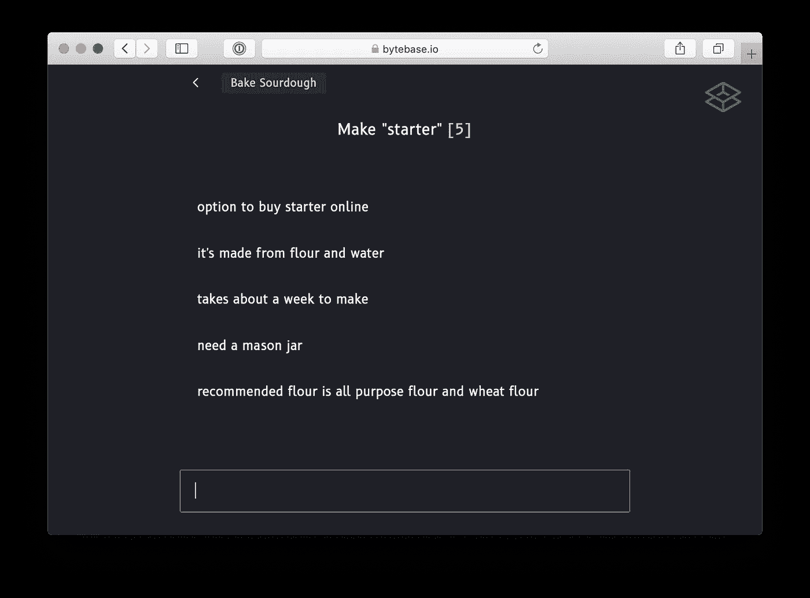
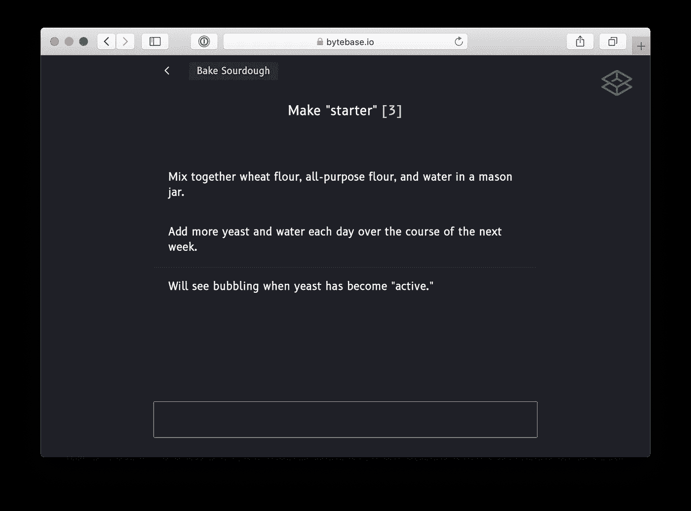

# 培养你的积极态度

> 原文：<https://betterprogramming.pub/cultivate-your-can-do-attitude-10864742d76d>

## 态度积极的人会准备好迎接任何挑战，不管挑战有多大

诺亚·西利曼在 [Unsplash](https://unsplash.com/?utm_source=unsplash&utm_medium=referral&utm_content=creditCopyText) 上的照片

当我们看向我们钦佩的人时，我们可以认识到他们可能不是这样开始的。他们有一套基本的技能和生存方式，但他们努力工作，并采取了积极的态度，成为了今天的他们。

迈克尔·乔丹[的新纪录片](https://www.espn.com/nba/story/_/id/29083351/the-last-dance-episodes-3-4-how-watch-stream-espn-michael-jordan-documentary)很好地提醒了这一点。

迈克尔·乔丹被广泛认为是有史以来最伟大的篮球运动员。看纪录片，可以看到他因为相信自己而变得伟大。他在球场内外都致力于提高自己的水平。他把全部注意力集中在每一次练习和锻炼上。

迈克尔·乔丹坚定不移的“我能行”的态度和自律促使他从一个伟大的篮球运动员成为有史以来最伟大的篮球运动员。

那么你能做些什么来培养你的积极态度呢，无论是在场上还是场下？

# 用感恩提升自己。

照片由 [Unsplash](https://unsplash.com/s/photos/rose?utm_source=unsplash&utm_medium=referral&utm_content=creditCopyText) 上的[埃尔吉塔·塞拉](https://unsplash.com/@gitsela?utm_source=unsplash&utm_medium=referral&utm_content=creditCopyText)拍摄

当事情变得具有挑战性时，很容易变得消极，看不到自己能行的态度。感恩让你立足于重要的事情，并提升你的能量。

加州大学戴维斯分校和迈阿密大学的心理学家进行的一项研究发现，经常写下自己感激的事情的人更乐观，对生活感觉更好，甚至锻炼得更多。

感恩是培养乐观积极态度的好方法。你可以在你的思想、写作或谈话中练习感恩。

# 休息一下

肖恩·奥·在 [Unsplash](https://unsplash.com/s/photos/beach?utm_source=unsplash&utm_medium=referral&utm_content=creditCopyText) 上拍摄的照片

你的“能行”态度是你想要培养成一种终生心态的东西。为了可持续发展，休息是很重要的——你可以花时间放松和后退。

在[的撤销项目](https://www.indiebound.org/book/9780393254594)中，迈克尔·刘易斯讲述了两位著名的心理学家是如何发现人类大脑是如何工作的。其中一位心理学家阿莫斯·特沃斯基说，“你浪费了几年时间，因为你不能浪费时间。”通过后退一步，你可以看到什么是重要的，并为你想承担的任何任务感到耳目一新。

# 分解压倒性的任务

詹姆斯·多诺万在 [Unsplash](https://unsplash.com/s/photos/yosemite?utm_source=unsplash&utm_medium=referral&utm_content=creditCopyText) 上的照片

当你害怕开始一项任务时，通常是因为它太大了。分解任务的第一步是头脑风暴。在脑力激荡阶段，你写下所有可能与任务相关的东西。让你的想法不加编辑地自由流动。

安德鲁·斯坦顿是一名作家。他参与了皮克斯的许多热门电影，包括《玩具总动员》、《怪兽公司》和《海底总动员》。他说，

> 任何事情的第一次经历都将是令人困惑的混乱。

脑力激荡是一种开始理解一项任务需要什么的无压力方式。应该是又乱又快。

例如，假设我第一次烤酸面团面包。我可以从下面的头脑风暴开始:

如何烘焙酸面团。

一旦你记下了所有的事情，从列表中选择一点。看看你是否能从这一点开始写一个小的、可行的任务。如果没有，那就再做一次脑力激荡。

在 sourdough 的例子中，“购买面粉”是可操作的，但是“制作发酵剂”仍然有很多未知数。我们可以再做一次脑力激荡。

如何制作酸面团发酵剂的头脑风暴？

当任务足够小的时候，你可以用特定的动词把它们写下来。

例如，任务“制作酸面团”使用广义动词“制作”太大了。这项任务的一个更可行、更小的部分是“将小麦粉、通用面粉和水混合在一个梅森罐中。”

制作酸面团发酵剂的小任务。

小而具体的任务平易近人；他们帮助你建立势头。这增强了你的积极态度。

# 庆祝小胜利

照片由[杰米街](https://unsplash.com/@jamie452?utm_source=unsplash&utm_medium=referral&utm_content=creditCopyText)在 [Unsplash](https://unsplash.com/s/photos/celebrate?utm_source=unsplash&utm_medium=referral&utm_content=creditCopyText)

不要害怕为自己感到骄傲。你每天都在做伟大的事情——加油吧！

在 Bytebase，我们为我们发布的每个功能都举办了一个“展示派对”。在展示派对上，建造者播放一首高能歌曲的前 30 秒(例如[巴巴·奥赖利](https://www.youtube.com/watch?v=gY5rztWa1TM))，然后他们展示特征。无论规模大小，我们都作为一个团队庆祝航运法规的胜利。

每个人都有值得庆祝的小胜利。定期庆祝可以增强你的动力和积极向上的态度。

# 明确你的动机

莎拉·多维勒在 [Unsplash](https://unsplash.com/s/photos/white-room-minimalist?utm_source=unsplash&utm_medium=referral&utm_content=creditCopyText) 上的照片

无论你想做什么，都要明确你的动机:

*   你为什么要这么做？
*   你在朝着一个更广阔的目标努力吗？
*   这份工作有助于你成为你想成为的人吗？
*   对你爱的人有帮助吗？

当事情变得困难时，理解你的动机对于更大的任务尤其重要。通过强调你为什么在做你正在做的事情，你会更容易坚持下去。

# 享受你所做的

[Lili Popper](https://unsplash.com/@lili_popper?utm_source=unsplash&utm_medium=referral&utm_content=creditCopyText) 在 [Unsplash](https://unsplash.com/s/photos/path?utm_source=unsplash&utm_medium=referral&utm_content=creditCopyText) 上拍摄的照片

通过培养你的积极态度，你不仅能坚持你的目标，还能享受这个过程。看起来可怕和吓人的任务变得简单和可行。你可以花更少的时间感到受阻或不知所措，花更多的时间进入[心流](https://www.indiebound.org/book/9780061339202)。

感谢阅读！

Bytebase 是一个笔记工具，通过使大脑转储变得容易来帮助你培养你的积极态度。请求提前访问[字节库 io](https://bytebase.io) 。

# 来源

*   [关于感恩的研究](https://www.health.harvard.edu/healthbeat/giving-thanks-can-make-you-happier)。
*   阿莫斯·特沃斯基引用迈克尔·刘易斯的[撤销项目](https://www.indiebound.org/book/9780393254594)。
*   脑残的安德鲁·斯坦顿。
*   [小任务使用特定动词](https://blog.amazingmarvin.com/break-large-projects-tasks-bite-sized-tasks/)。
*   [激励上的顶部空间](https://www.headspace.com/blog/2016/09/01/9-ways-to-hack-your-motivation/)。