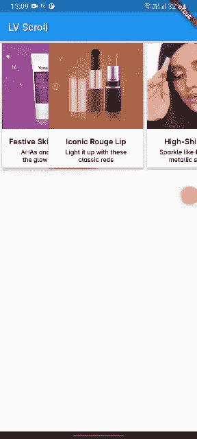

# 在 Flutter 中使用页面视图构建器构建折叠卷轴

> 原文：<https://betterprogramming.pub/custom-horizontal-scroll-with-pageview-builder-10604dad3b30>

## 类似路易威登的 UI


[泰勒·威尔科克斯](https://unsplash.com/@taypaigey?utm_source=medium&utm_medium=referral)在 [Unsplash](https://unsplash.com?utm_source=medium&utm_medium=referral) 上的照片

在本文中，我们将创建一个类似于路易威登手机应用程序的水平滚动列表视图。

最终的应用程序如下所示:



## 视频教程

折叠滚动视图

在深入研究编码之前，让我们讨论一下这个应用程序中将要使用的小部件。

# 页面视图

`PageView`是一个小部件，它生成可滚动的屏幕页面。页面可以是由构建器功能构建的固定页面或重复页面。

`PageView`的行为类似于`ListView`构造元素。`PageView`还允许用户在 Flutter 应用程序的不同屏幕之间切换。

## **页面视图类的构造函数**

```
PageView({Key key, 
Axis scrollDirection, 
bool reverse, 
PageController controller, 
ScrollPhysics physics, 
bool pageSnapping, 
void Function(int) onPageChanged, 
List<Widget> children, 
DragStartBehavior dragStartBehavior, 
bool allowImplicitScrolling})
```

**浏览量控件属性:**

*   `scrollDirection`:定义页面在哪个轴上滚动，即垂直还是水平
*   `reverse`:定义滚动方向。默认情况下，它被设置为 false。
*   `controller`:它让我们操纵哪个页面在`PageView`中可见。
*   `physics`:它定义了当页面不能被拖动时，如何在页面端点动画化。
*   `pageSnapping`:对自定义滚动行为很有用。它接受布尔值。
*   `onPageChanged`:页面发生变化时触发的功能。
*   `children`:保存小部件列表。
*   `dragStartBehaviour`:该属性保存`DragStartBehavior` enum (final)作为对象。它控制拖动行为开始注册的方式。
*   `allowImplicitScrolling`:该属性接受一个*布尔值*作为对象。它控制是否将隐式滚动分配给小部件的页面。

# PageView.builder

PageView.builder 创建一个可滚动列表，使用按需创建的小部件逐页工作。

此构造函数适用于具有大量(或无限)子级的页面视图，因为只为那些实际可见的子级调用构建器。

提供一个非空的`itemCount`让[页面视图](https://api.flutter.dev/flutter/widgets/PageView-class.html)计算最大滚动范围。

## **pageview . builder 小工具的属性**

它拥有浏览量的所有属性，也有自己的一些属性。

*   `itemBuilder`:只有大于等于零且小于`itemcount`的指标才会被调用。
*   `restoralionID`:`restorationID`接受一个字符串作为对象。它用于保存滚动位置并在以后恢复它。
*   `clipBehaviour`:根据该选项内容将被裁剪(或不被裁剪)。
*   `padEnds`:列表两端是否加填充。

# 堆

Stack 是 Flutter SDK 的一个内置小部件，它允许用户将小部件放置在彼此之上，从而形成小部件层。第一个小部件是`bottommost`项，`lastwidget`是`topmost`项。

堆栈小部件的一些要点是:

*   堆栈中的子级可以是定位的，也可以是非定位的。
*   定位的子元素是那些包装在至少有一个非空属性的[定位的](https://api.flutter.dev/flutter/widgets/Positioned-class.html)小部件中的元素。
*   堆栈调整自身大小以包含所有未定位的子元素，这些子元素根据[对齐方式](https://api.flutter.dev/flutter/widgets/Stack/alignment.html)进行定位(在从左到右的环境中默认为左上角，在从右到左的环境中默认为右上角)。
*   然后，根据它们的 top、right、bottom 和 left 属性，相对于堆栈放置定位的子元素。
*   alignment 属性可用于更改小部件的对齐方式。

# 让我们开始吃吧

首先，我们创建将在我们的应用程序中使用的数据。

在`lib` 文件夹内创建`dummy_data.dart` 。在这里，我们放置项目的数组。

`dummy_data.dart`:

哑 _ 数据.镖

数据已经准备好了，现在让我们创建将成为页面视图项目的小部件。在`lib` 文件夹内创建`page_view_item.dart` 。

`page_view_item.dart`

page_view_item .镖

继续前进我们创建我们的`**homepage.dart**` 文件:

首先，我们配置我们的页面视图，并创建提供`viewportFraction`的`PageController`。

```
final _controller = PageController(    viewportFraction: 0.5,  );
```

## **ViewPortFraction**

它定义了每个页面应该占据的视窗部分。默认为 1.0，这意味着每页在滚动方向上填充视口。

当我们的控制器设置好了，我们就可以计算页面视图的单个项目的宽度。

```
late final _itemWidth =MediaQuery.of(context).size.width * _controller.viewportFraction;
```

然后我们初始化`initState`内部的控制器。

```
@override  void initState() {    
super.initState();
_controller.addListener(() => setState(() {          
_page = _controller.page!;        
}));  }
```

这就是我们的`homepage.dart`文件的样子。

`homepage.dart`:

# 让我们连接起来

我们可以成为朋友。在[脸书](https://www.facebook.com/nabin.dhakal.714/)、 [Linkedin](https://www.linkedin.com/in/nabindhakal/) 、 [Github](https://github.com/nbnD) 、 [Youtube](https://www.youtube.com/channel/UCW6oYt_3QSl7J2HSHNqwXWw) 、 [BuyMeACoffee](https://www.buymeacoffee.com/nabindhakal) 和 [Instagram](https://www.instagram.com/nbn_d_/) 上查找。

访问:[颤振连接](https://flutterjunction.com/)

**投稿:** [BuyMeACoffee](https://www.buymeacoffee.com/nabindhakal)

# 结论

希望这篇文章对你有所帮助，让你学到新的东西。我在这篇文章中使用了一些对你们中的一些人来说可能是新的东西。

[](https://github.com/nbnD/lvscroll) [## GitHub - nbnD/lvscroll

### 一个新的颤振项目。这个项目是颤振应用的起点。一些帮助您入门的资源…

github.com](https://github.com/nbnD/lvscroll) 

```
**Want to Connect?**Find me on [Facebook](https://www.facebook.com/nabin.dhakal.714/), [Linkedin](https://www.linkedin.com/in/nabindhakal/), [Github](https://github.com/nbnD), [Instagram](https://www.instagram.com/nbn_d_/).
```