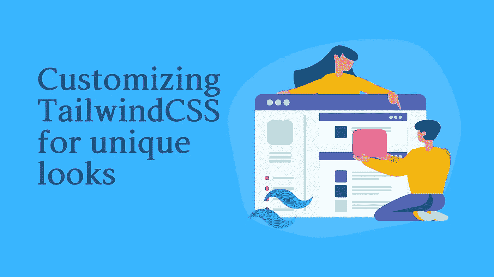

# 自定义 TailwindCSS，给你的站点一个独特的外观

> 原文：<https://betterprogramming.pub/customize-tailwindcss-to-give-your-sites-a-unique-look-bfd7e1bb49cc>

## 了解如何自定义 TailwindCSS 应用程序的默认样式



作者图片

前端开发很吸引人，不仅因为你可以创造神奇的体验，而且可以很容易地看到你的工作成果，还因为有大量的选项可以用来构建 ui。

我们经常面临从奇妙的 JavaScript 框架和 CSS 或可视化设计框架中选择的决定，这些框架发展得如此复杂，以至于它们有自己的学习曲线。

在像 [bootstrap](https://getbootstrap.com/) 这样的框架取得巨大成功之后，趋势已经形成，框架的竞争非常激烈，CSS 每次都被抽象成更多的组件、规则以及这些框架创造的任何东西。但是定制是如何发生的呢？与良好的旧 CSS，或 SCSS 在某些情况下。

但是 [TailwindCSS](https://tailwindcss.com/) 与其他框架不同。

# 什么是顺风 CSS？

TailwindCSS 打破了其他框架遵循的范式，追根溯源，重新思考我们如何设计 ui。

当 React 出现并提出将“HTML”和 JavaScript 移回一个文件的想法时，每个人都吓坏了，但事实证明这是一件伟大的事情。类似地，TailwindCSS 建议通过提供一组不代表自定义组件而是代表 CSS 属性的实用程序类，将样式从 CSS 转移到“HTML”或 JavaScript 文件中，并且它们有所有的类。

等等，什么？我的 CSS 不会很庞大吗？没有。多亏了 tailwind 处理器，你的最终 CSS(是的，最终，你会有一个由 Tailwind 生成的 CSS 文件)将只由你在项目中使用的那些类组成。

让我们来看一个例子，看看我们以前是怎么做的，以及它是如何与 TailwindCSS 一起工作的:

```
<!-- with CSS -->
<style>
.title {
  font-weight: bold;
  color: #333;
  /* ... */
}
</style><h4 class=”title”>Good old fashioned title</h4><!-- with TailwindCSS -->
<h4 class="font-serif text-4xl leading-normal font-bold text-gray-700">Want to dig deeper into Tailwind?</h4>
```

如果你和我一样，你会持怀疑态度，但是相信我，这是有效的。通过简单地查看代码，可以更好更快地理解组件的外观。此外，如果您从事中型或大型项目，CSS 类会失去控制，有“title”或“title2”之类的东西，您永远不知道使用哪一个。

另一个好处是所谓的“预检”，这是一套风格。TailwindCSS 注入在所有浏览器中建立相同的基线，因此 Safari 与 Firefox 或 Chrome 没有什么不同。

但是还有更多。因为 TailwindCSS 是完全可定制的，所以您可以将您的风格准则预设到您的配置中，并轻松地按照您的准则构建界面，这就是我们今天将更多关注的内容。

# 我们会做什么？

如前所述，我们将学习如何定制 TailwindCSS，让您的网站和应用程序呈现独特的外观。为此，我们将构建一个 React 应用程序，演示如何定制 Tailwind，尽管同样的概念也适用于任何其他框架或非框架网站。

如果你有一些使用 Tailwind 的经验，你会从例子中认出它独特的设计，使用一种预设的颜色和字体。如果您尝试构建一个简讯注册表单，它可能看起来像这样:


原始尾翼设计

但是我们的设计师不想使用任何给定的颜色，他们想定制按钮、输入和字体的形状，我们最终产生的设计看起来如下:

不知道这是否更好，但设计师可能知道得更多。


新的改进设计

# 设置您的应用程序

对于一个 CSS 框架来说，设置 TailwindCSS 似乎有点额外的复杂，但是请记住，事情远不止如此。为了有意义，Tailwind 需要了解您的项目，您使用了哪些类来优化构建规模。这些类可能在 JSON 文件中，React 组件中，VueJS 中的东西，所以它必须非常智能，并且有一些特殊的访问权限。

我不会用如何设置它的细节来烦你。这并不是超级复杂，但它确实需要你遵循一些步骤，并且在他们的网站上都有很好的记录。它们还为多种框架提供了指令。

如果您不知道如何操作，请查看[官方安装指南](https://tailwindcss.com/docs/installation)，启动并运行一个项目，然后回到这里继续。

# 使用默认样式构建表单

我们不会在这里花太多时间，我们正在构建一个只有一个输入和一个按钮的简单表单，但是我们基本设计的最终代码如下:

之后，您应该会在您的网站上看到类似这样的内容:


原始设计的演示

# 自定义样式

虽然上面的形式看起来很好，但是如果你的设计师在他们自己的设计系统中加入了新的调色板、间距变化和字体系列更新，那会怎么样呢？

这里是顺风照耀的地方。您可以在几行代码中修改提供给您的默认样式的几乎所有方面，这也并不复杂。它只需要在配置文件中做一些更改，然后嘣，你就可以了！很刺激，对吧？开始配置吧！

# 配置顺风默认预设

转到`tailwind.config.js`文件。让我们来看看我们开箱后得到的每一件物品:

```
module.exports = {
  purge: [],
  darkMode: false, // or 'media' or 'class'
  theme: {
    extend: {},
  },
  // ...
}
```

*   [purge](https://tailwindcss.com/docs/optimizing-for-production) :这是用来树摇未使用的样式，优化你的顺风项目的最终构建大小。它可以接受你想要优化的文件名或文件类型的数组。最有可能的是，你想要优化所有那些以某种方式使用顺风的文件或组件。这里有一个常见的例子:

```
purge: ['./src/**/*.{js,jsx,ts,tsx}', './public/index.html']
```

*   darkMode : Tailwind 包含了一个 dark 变体，当启用 darkMode 时，你可以用不同的方式设计你的站点。我们可以简单地传递“media”作为它的值来开始使用黑暗模式实用程序类。

```
module.exports = {
  darkMode: 'media',
  // ...
}
```

*   [主题](https://tailwindcss.com/docs/theme):您可以在这里定义项目的调色板、字体、字体、断点、边框半径值等等。基本上，这是定制的所有细节实际发生的地方。它也可以有子对象，如[屏幕](https://tailwindcss.com/docs/theme#screens)、[颜色](https://tailwindcss.com/docs/theme#colors)、[间距](https://tailwindcss.com/docs/theme#spacing)等。这里有一个例子:

还有更多选项，但我们将跳过它们，因为它们不在当前的讨论范围内。我们的主要对象是主题部分。

假设我们在表单元素中完成了以下更改:

1.  将颜色更新为#FF4F71(玫红)、#C40429(深玫红)和# fbfb(玫白)。
2.  将字体系列更改为 [Kalam](https://fonts.google.com/specimen/Kalam) 。
3.  添加两个新的边界半径，分别为 1rem(基本)和 5rem(更大)。
4.  边距或填充的新间距应该是 1 雷姆(基本)和 1.5 雷姆(更大)。

现在我们的任务是将这些更改应用到现有的 React 应用程序中。那么我们从哪里开始呢？是的，就在顺风配置文件中！

我们用`colors`、`fontFamily`、`extend`和`spacing`对象扩展主题选项，并传递各自的值。

1.  在 colors 对象上，我们可以通过引用名定义我们需要的三种新颜色，如`roseRed` (#FF4F71)、`darkRoseRed` (#C40429)和`roseWhite` (#FBFBFB)以及它们的十六进制值。这将看起来像这样:

```
colors: {
    roseRed: '#FF4F71',
    darkRoseRed: '#C40429',
    roseWhite: '#FBFBFB',
},
```

现在，每当我们想使用一种特定的颜色时，我们可以使用这些名称来代替十六进制代码，作为`backgroundColor`、`borderColor`、`textColor`等的实用程序类。

1.  接下来，要使用新的字体系列，我们首先需要从 Google Fonts 获得 [@import](https://www.w3schools.com/cssref/pr_import_rule.asp) :

```
@import url('https://fonts.googleapis.com/css2?family=Kalam:wght@400;700&display=swap');
```

这应该被添加到 index.css 的顶部，在它下面我们导入了我们的顺风基础样式。然后，我们创建一个新的`fontFamily`对象:

```
fontFamily: {
    fontHandwritten: 'Kalam',
},
```

这里我们给卡拉姆字体取了一个别名`fontHandwritten`，我们将在我们的标记中使用它。

1.  为了保留主题选项的默认值并添加新的自定义值，我们可以在`theme`对象的[扩展](https://tailwindcss.com/docs/theme#extending-the-default-theme)键下添加我们所有的扩展。我们可以这样做来扩展边界半径。因此，我们使用`borderRadius`对象和我们在设计变更中得到的两个值:

```
borderRadius: {
    borderBase: '1rem',
    borderBig: '5rem',
},
```

1.  最后，对于元素之间的间距，我们使用`spacing`键来定制全局尺寸:

```
spacing: {
    spaceNatural: '1rem',
    spaceNaturalPlus: '1.5rem',
},
```

因此，我们的整个`tailwind.config.js`文件现在看起来像这样:

# 更新我们的标记

现在，让我们伸展四肢，更新输入表单组件的 JSX 标记，以根据配置更改应用最新的更改。

浏览 app.js 文件，现在我们可以如下使用我们的自定义实用程序类:

1.  在`<form>`标签上，我们添加了`font-fontHandwritten`，它将 Kalam 字体系列应用于整个表单。
2.  小填充值(1rem)的填充类更新为`p-spaceNatural`，大填充值(1.5rem)的填充类更新为`px-spaceNaturalPlus`。
3.  保证金价值也是如此。我们现在有了`mr-spaceNatural`而不是`mr-2`。
4.  至于边框和颜色。为了根据我们的设计系统增加新的边界半径，我们在输入和按钮中都使用了`rounded-borderBase`。然后，对于#C40429 彩色边框，我们有`border-darkRoseRed`，我们也可以用`text-darkRoseRed`将它应用于输入中的文本。
5.  该按钮在悬停时分别获得较大圆角半径的`rounded-borderBig` `bg-roseRed` `hover:bg-darkRoseRed`类、红色背景色和较暗的背景色。

以下是更新后的 JSX 标记的完整代码:

这将为您带来想要的结果:


最终设计的演示

# 结论

这就对了。现在，您有了相同的表单元素，但是具有完全不同的样式，这使它从常见的顺风样式中脱颖而出。

在本文中，我们从理解什么是 Tailwind CSS 开始，讨论了它如何通过自己的独特功能(如低级实用程序类)来帮助前端开发人员，并快速演示了如何使用它们来设计文本等基本内容。

接下来，我们开始用默认的 Tailwind 样式构建一个简单的表单元素，以便在 React 应用程序中使用它，并进行设置和安装。然后，我们深入到配置文件中进行配置，以匹配设计系统的变化，并用自定义样式更新我们的代码。

感谢阅读！