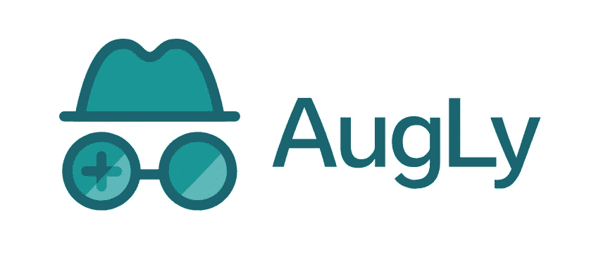

# 用 AugLy 进行数据扩充

> 原文：<https://betterprogramming.pub/data-augmentation-with-augly-d4e9fcd4d803>

## 用于机器学习的一体化增强包



图片取自 [AugLy 的 Github 库](https://github.com/facebookresearch/AugLy)

在机器学习领域，数据扩充是提高最大似然模型性能的最有用的技术之一。

数据扩充用于通过对现有数据的轻微修改或转换来创建合成数据。这有助于:

*   增加训练和测试数据量。
*   减少模型的过度拟合

截至 2021 年 6 月 17 日，脸书正式开源其名为 [AugLy](https://github.com/facebookresearch/AugLy) 的数据增强库。该库可用于提高机器学习模型的鲁棒性。

它目前支持以下模式:

*   声音的
*   图像
*   文本
*   录像

本文只讨论了文本模态，但是您可以自己尝试其他模态。事不宜迟，让我们继续下一节，开始安装 AugLy。

# 设置

强烈建议将它安装在基于 Linux 的操作系统上，尤其是如果您打算在音频数据上使用它。在撰写本文时，对于 Windows 用户来说，安装过程并不那么简单。下面的安装步骤已经在 Python 版本 3.7.7 上运行的 Windows 10 操作系统上进行了测试。

## 奥格丽

在此之前，请确保您已经使用 Python 版本至少 3.6 或更高版本创建了一个新的虚拟环境。激活它并运行以下命令来安装 AugLy:

```
pip install augly[all]
```

事实上，您可以只为单个主机安装依赖项。例如，运行以下命令仅安装音频子库:

```
pip install augly[audio]
```

## Python-magic

运行`pip list`来检查`python-magic`是否安装在您的环境中。如果没有安装，如果您使用的是 Linux，请运行以下命令:

```
apt-get install python3-magic
```

或者，如果您使用的是 Conda，您可以按如下方式安装它:

```
conda install -c conda-forge python-magic
```

对于 Windows 用户，您需要安装 DLL 附带的额外的 python-magic 包，如下所示:

```
pip install python-magic-bin
```

## Matplotlib 修复(针对 Windows 用户)

Augly 的早期版本(0.1.1)要求 matplotlib==3.3.4 作为其依赖项的一部分。如果您遇到以下问题:

```
module 'sip' has no attribute 'setapi'
```

请将您的`matplotlib`版本降级到 3.2，如下所示:

```
pip install matplotlib==3.2
```

您可以安全地忽略不兼容警告。

# 履行

在工作目录中创建一个名为`test_augmenter.py`的新 Python 文件。

## 导入

在文件顶部添加以下`import`声明:

```
import augly.text as textaugs
```

接下来，定义输入文本。您可以将其定义为单个字符串或字符串列表:

```
texts = ["Who are you and what are you doing here?", "Hello, world! Welcome to Speakr!"]
```

[执行增强](https://github.com/facebookresearch/AugLy/tree/main/augly/text)有两种方式:

*   基于类的
*   基于功能的

# 基于类别的增强

让我们看一个在输入文本中插入标点符号的例子。

```
# instantiate the augmenter
transform = textaugs.InsertPunctuationChars(granularity="all", cadence=5.0, vary_chars=True)
# perform transformation on input text
aug_texts = transform(texts)
```

只需实例化 augmenter 类，并将输入文本作为输入参数传递。

# 基于功能的增强

可以使用以下基于功能的增强来执行相同的过程:

```
# perform transformation on the input text
aug_texts = textaugs.insert_punctuation_chars(texts, granularity="all", cadence=5.0, vary_chars=True)
```

运行 Python 文件时，您应该在控制台上获得以下输出(每次运行的结果都不同):

```
['Who a.re yo?u and, what: are ,you d:oing ?here?', "Hello', wor!ld! W-elcom.e to ...Speak.r!"]
```

在官方存储库中查看下面的代码以获得关于可用输入参数的更多信息。

# 可用的文本增强器

AugLy 支持以下[文本扩充](https://github.com/facebookresearch/AugLy/blob/main/augly/text/functional.py):

*   `insert_punctuation_chars`:在每个输入文本中插入标点符号。
*   `insert_zero_width_chars`:在每个输入文本中插入零宽度字符。
*   `replace_bidirectional`:反转每个输入文本中的每个单词(或单词的一部分)，并使用双向标记以其原始顺序呈现文本。它将每个单词分别颠倒，即使换行也能保持单词的顺序。
*   `replace_fun_fonts`:根据粒度用有趣的字体替换单词或字符。
*   `replace_similar_chars`:用相似字符替换每个文本中的字母。
*   `replace_similar_unicode_chars`:用相似的 unicodes 替换每个文本中的字母。
*   `replace_upside_down`:根据粒度将文字上下翻转。
*   `simulate_typos`:使用拼写错误、键盘距离和交换来模拟每个文本中的错别字。
*   `split_words`:将文本中的单词拆分成子单词。

在所有可用的增强器中，`simulate_typos`是生成用于聊天机器人或文本分类的合成数据的最有用的函数之一。

让我们使用下面的代码在这个增强器上运行一个简单的测试:

```
for i in range(5):
    aug_texts = textaugs.simulate_typos(texts)
    print(aug_texts)
```

输出应该如下所示:

```
['Who are you and whaaat arf ytou doing here?', 'Hello, worls! Welcome to Zpeakr!']
['Who aer you andd waht are you doing here?', 'Hello, worls! Welcome to Speark!']
['Who aee you adn waht are you doing here?', 'Hello, worls! Eelcome to Speakr!']
['Who arf ytou anbd what are you doing here?', 'Hello, worls! Welcome ot Speakr!']
['Who are you anbd what are yuo doing htere?', 'Hello, worls! Welcoem to Speakr!']
```

# 结论

在您自己的用例中尝试一下，尤其是在其他模态上。您可以测试适用于其他设备的增强器。您可能需要为一些函数指定相当多的输入参数，否则每次运行都会得到相同的输出。