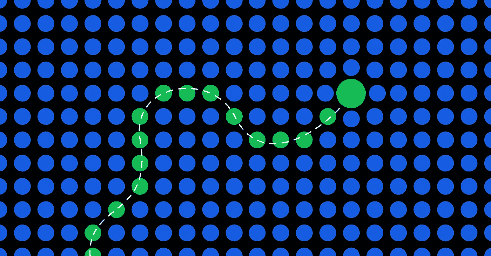
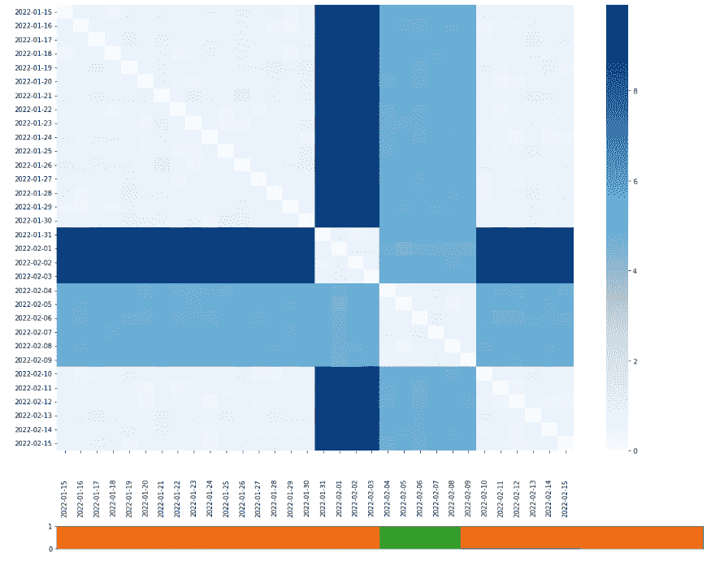
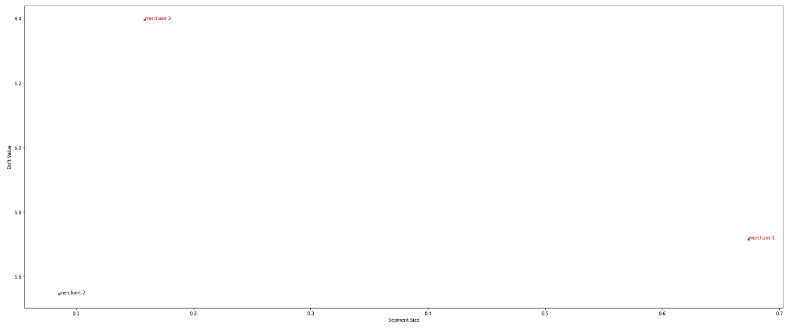
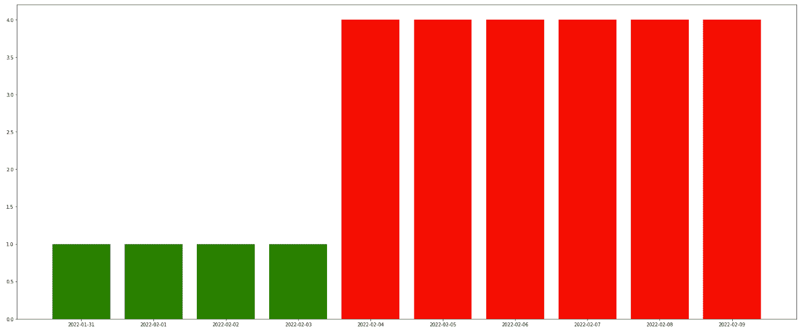

# 具有生产可观察性洞察力的数据驱动再培训

> 原文：<https://betterprogramming.pub/data-driven-retraining-with-production-observability-insights-af539d788cd3>

## 我们能做的任何事情都是至关重要的，以提高完成再培训周期并取得更好成绩的可能性。

数据驱动的再培训

我们都知道，我们的模型在生产中最好的一天将是它生产的第一天。随着时间的推移，模型性能会下降，这是一个简单的事实。ML 试图根据它训练和学习的观察模式来预测现实世界的行为。但是现实世界是动态的，总是在运动；根据您的用例和数据速度，您的模型迟早会衰退，并开始表现出概念漂移、数据漂移，甚至两者都有。

当模型行为不当时，我们经常求助于再培训来试图解决问题。根据经验，数据科学团队通常会从生产中获取最近的数据，比如 2 或 3 个月的数据，并在此基础上重新训练他们的模型，假设“刷新”模型的训练观察将使其能够更好地预测未来的结果。但是，最近的数据是解决模型性能问题并使其回到正轨的最佳数据吗？请这样想，如果一个端到端的软件测试失败了，你会仅仅通过重新运行测试就认为它已经修复了吗？很可能不是。您将对问题进行故障诊断，以查明根本原因，并应用精确的修复来解决问题。ML 团队正是通过模型监控来做到这一点，以查明异常并发现其根本原因，从而在问题影响业务成果之前快速解决问题。但是，当决议需要重新培训时，“新鲜是最好的”并不完全是一种数据驱动的方法。

本文将展示数据科学和 ML 工程团队如何利用 ML 监控来找到最佳的数据和再训练策略组合，以解决机器学习性能问题。这种数据驱动、生产第一的方法支持更周到的再训练选择、更短和更精简的再训练周期，并且可以集成到 MLOps CI/CD 管道中，用于异常检测时的连续模型再训练。

# 将生产洞察力与再培训策略相匹配

以下解释的见解基于在监督模型可观察性平台中检测到的异常，并在提取再培训见解的相应 [jupyter 笔记本](https://colab.research.google.com/drive/18nPnH4Jm7ieBIeFeC5WmCex9_JK1sMci?usp=sharing#scrollTo=85602f22-80eb-4c58-ba49-922f89e34f7c)中进行分析。所有的资产都在 [Superwise 社区版](https://portal.superwise.ai/account/sign-up)下开放使用，你可以用它在自己的数据上运行笔记本。

注意:重要的是要注意，这种方法的价值在于，一旦在根本原因调查中消除了其他可能的问题，就可以确定如何最好地进行再培训。

# 识别再培训组

问题是。下次再培训要用什么数据？

模型受暂时性和季节性的影响。选择受时间异常或流量影响的数据集会导致模型偏斜。来自生产数据的一个重要见解是数据 DNA 或天数分布的相似性。了解数据在日期之间如何变化(日期之间的漂移分数)可以基于相似性和差异进行基于日期的分组。有了这些信息，您可以创建反映或排除生产数据的时态行为的数据重新训练组的组合。

这里我们可以看到一个日期 X 日期的热图矩阵，每个单元格代表两个日期之间的变化。用粗体显示的单元格彼此差异很大，而用浅色显示的单元格表示彼此非常相似的日期。

数据 DNA

正如您在本例中所看到的，数据分为 3 个主要组，橙色、红色和绿色，代表在下一次重新训练中使用的 3 个可选数据集。

*   红色—红色组，反映了我们数据中的重复事件，我们希望对其进行训练。例如，这可能是周末的行为。
*   橙色-橙色组是生产中的正常数据行为。
*   绿色——绿色组，代表一个独特的行为事件。例如，这可能是点击率优化用例中的营销活动。

根据您对领域的理解，包含/排除决策可能会有所不同。如果营销活动取得成功，并且这些见解将推广到所有营销活动中，您可能会决定重新培训绿色和红色。如果该活动是一次性事件或失败的实验，橙色和红色将是更好的再训练数据组选择。

再培训团体

# 识别漂移段

问题是。哪些人群受到影响？

模型的目的是在你的人群中抽象预测，但也就是说，你总是需要在细分水平上监控你的模型的行为，以检测特定的细分是否在漂移。当检测到段漂移时，我们可以考虑以下解决方案，甚至是它们的组合，以及重新训练。

*   模型分割(model split )-为段创建特定模型。
*   优化模型—使模型适合处理当前细分市场。
*   对数据重新采样-更改模型将在特定模型的数据上学习的数据分布。

在这里，我们可以看到段漂移值，其中每个条形显示每个段的漂移分数。在采取行动之前，重要的是要了解段大小与段漂移的关系，以确定段对模型的影响程度。

漂移段

此外，这让我们看到段大小与段漂移值的关系，并确定我们是否需要为该段创建特定的模型。

片段大小与片段漂移的关系

# 识别有完整性问题的日期

问题是。原则上哪些日子应该排除在再培训之外？

原则上，一些数据应该排除在再培训之外，即由于一些管道或上游源问题，我们遇到数据完整性问题的日子。如果在再训练过程中考虑这些数据，可能会导致我们的模型误解“正态”分布，从而导致模型性能进一步下降。

有诚信问题的日子

在这里，我们可以看到数据完整性事件发生天数的条形图。这让我们可以快速识别出应该从下一次再训练中排除的“坏”数据。

# 更智能、更精简的再培训

再培训不是免费的。它占用了跑步训练和你的团队的注意力和努力的资源。因此，我们能做的任何事情都是至关重要的，以提高以更好的表现完成再培训周期的概率。这就是具有生产洞察力的数据驱动再培训的价值。更智能、更精简的再培训，利用模型的可观察性，快速有效地将您从检测中解救出来。