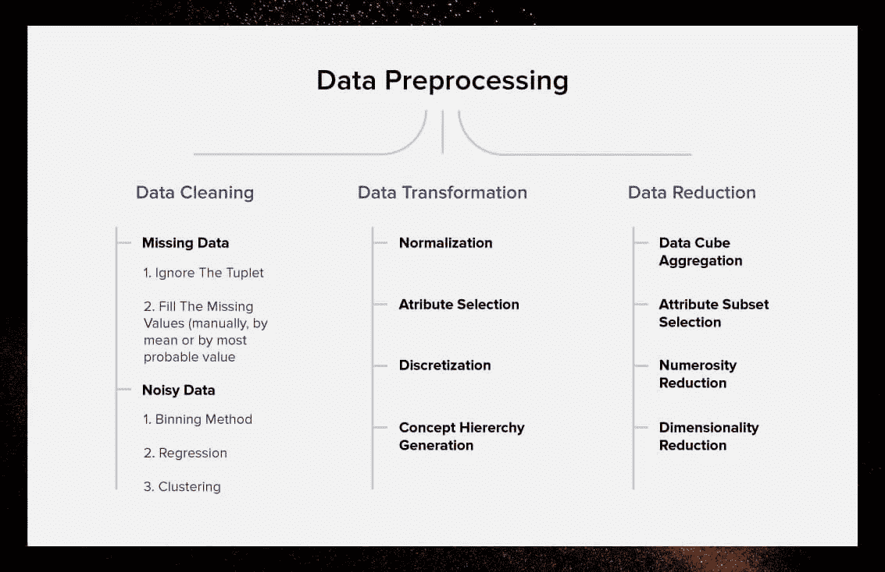
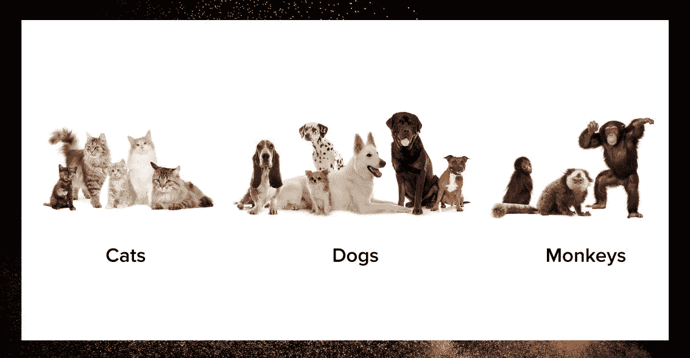
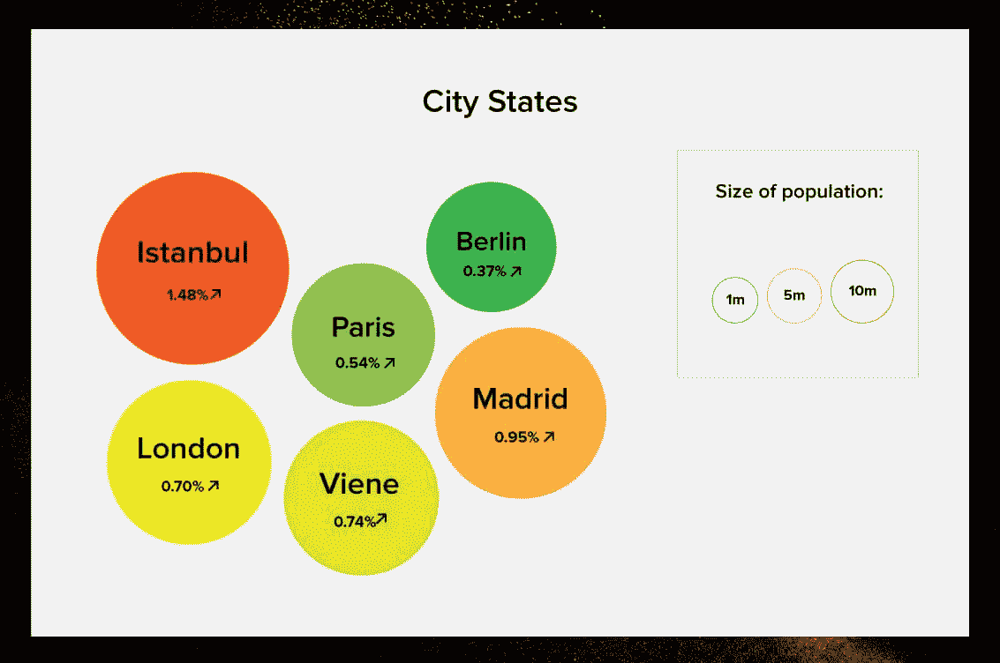
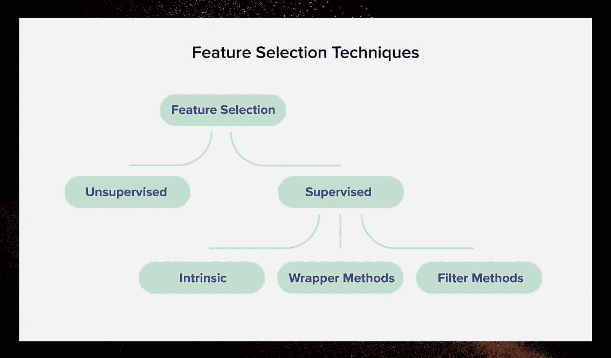
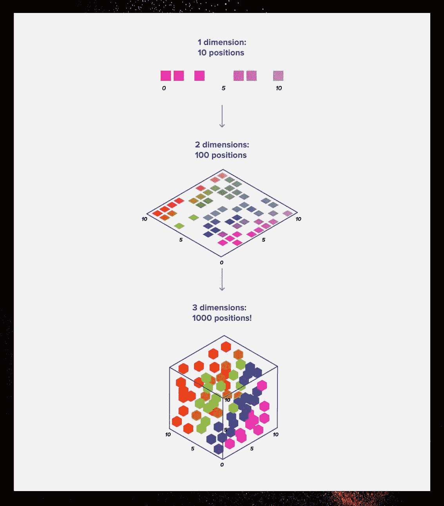

# 机器学习的数据预处理

> 原文：<https://betterprogramming.pub/data-preprocessing-for-machine-learning-3822ace03ae6>

## 了解如何为机器学习正确准备数据

弗兰基·查马基在 [Unsplash](https://unsplash.com/) 上拍摄的照片。

数据准备在您的工作流程中扮演着重要的角色。你需要以计算机能够处理的方式转换数据。

# 数据预处理的步骤

任何数据库都是数据对象的集合。您也可以将它们称为数据样本、事件、观察或记录。然而，它们中的每一个都借助于不同的特征来描述。在数据科学行话中，它们被称为属性或特征。

数据预处理是[建立具有这些特征的模型](https://serokell.io/blog/ai-ml-dl-difference#how-can-machines-learn%3F)之前的必要步骤。

图片来源:作者

通常是分阶段发生的。让我们仔细看看它们。

# 数据质量评估

首先，你需要好好看看你的数据库，并进行数据质量评估。随机收集的数据往往有不相关的位。这里有一些例子。

## 数据类型不匹配

通常，您可能会将使用不同数据格式的数据集混合在一起；因此，出现了不匹配:整数对浮点或者 UTF8 对 ASCII。

## 不同维度的数据阵列

当您聚合来自不同数据集的数据时，例如，来自用于语音识别的五个不同数据数组的数据，其中一个数组中存在的三个字段在其他四个数组中可能会丢失。

## 数据值的混合

假设您从两个独立的来源收集了数据。因此，性别字段对于女性有两个不同的值:*女*和*女*。

要清理这个数据集，您必须确保在数据集内使用相同的名称作为描述符(在我们的例子中可以是 *woman* )。

## 数据集中的异常值

在纽约 200 年的每日气温观测中，夏季有几天气温非常低。

离群值是非常危险的。它们可以强烈影响机器学习模型的输出。通常，研究人员会评估异常值，以确定每个特定记录是数据收集中的错误还是数据处理中应考虑的独特现象。

## 缺失数据

您可能还会注意到一些重要的值丢失了。这些问题是由于人为因素、程序错误或其他原因引起的。它们会影响预测的准确性，因此在对数据库进行进一步操作之前，您需要进行数据清理。

# 为什么我们需要预处理数据？

通过预处理数据，我们可以:

*   使我们的数据库更加准确。我们消除了由于人为因素或错误而导致的不正确或缺失的值。
*   **提高一致性。**当数据存在不一致或重复时，会影响结果的准确性。
*   **使数据库更加完整。**如果需要，我们可以填写缺失的属性。
*   **平滑数据。这种方式让我们更容易使用和解释。**

# 数据清理

数据清理的目标是为机器学习提供简单、完整和清晰的示例集。

## 缺失数据

数据集中缺少数据的情况很常见。在这种情况下，您需要寻找额外的数据集或收集更多的观察值。

当您将两个或更多数据集连接到一个数据库中以获得更大的训练集时，一些数据字段不匹配是很常见的。

当连接的体量中没有显示所有字段时，最好在合并前提前删除这些字段。

**怎么办:**如果任何数据库行或列中有超过 50%的值丢失，您必须删除整个行/列，除非可以填充丢失的值。

想象你做了一个哈斯克尔爱好者的数据库。有几条记录缺少性别列的值:Nik、Jane、Julia 和 Helen。在这种情况下，研究人员可以根据他们的结论添加缺失的数据。然而，这种方法有缺陷，模型必须承担不准确的风险。

## 噪声数据

大量附加的无意义数据称为*噪声。*

图片来源:作者

这可以是:

*   数据记录的副本或半副本
*   对特定研究没有价值的数据段
*   每个变量的不必要的信息字段

例如，假设你需要知道这个人是否会说英语。但是你有一整套的特征，包括他们眼睛的颜色，鞋码，脉搏和血压等等。

您可以应用以下方法之一来解决此问题:

*   **宁滨**如果你有一个排序数据池，使用 [*宁滨*](https://en.wikipedia.org/wiki/Data_binning) 。将所有数据分成相同大小的较小数据段，并在每个数据段上分别应用数据集准备方法。例如，您可以将年龄值分为 21–35、36–59 和 60–79 等类别。
*   **回归。**回归分析有助于确定哪些变量确实有影响。应用回归分析平滑大量数据。这将允许你只处理关键特征，而不是试图分析大量的变量。在我们关于回归的[帖子](https://serokell.io/blog/regression-analysis-overview)中，你可以了解更多关于如何一步一步进行回归分析的信息。
*   **群聚。**最后，您可以应用聚类算法对数据进行分组。这里你需要小心异常值。

离群值是与域的其余部分不相似的奇异数据点。

图片来源:作者

重要的是不要把异常值当成噪音来代替。例如，我们正在构建一个算法，将不同种类的苹果分类。我们可能会在数据集中遇到两种异常值:

*   这些图片包含了奇异的水果，如菠萝和猕猴桃。由于采样错误，它们可能会出现在数据中，并代表数据集中的噪声。
*   也可以有一些奇怪苹果的照片，例如，那些形状奇怪的苹果。当我们的目标是教机器识别苹果的种类时，偏离群体是很重要的。这些异常值将有助于指导 ML 模型识别特殊字符并提高预测的准确性。

当我们谈论的不是像苹果和菠萝这样显而易见的东西时，判断这个项目是重要的还是只是噪音是相当复杂的。在这里，数据科学家的专业知识对 ML 建模的成功有很大的影响。

# 数据转换

事实上，通过清理和平滑数据，我们已经进行了数据修改。然而，通过[数据转换](https://www.geeksforgeeks.org/data-transformation-in-data-mining/?ref=rp)，我们了解了将数据转换成计算机可以学习的适当格式的方法。

**例子**:关于全球烟雾的研究，你有风速的数据。然而，这些数据是混杂的，我们有三种不同的数字:米每秒、英里每秒和公里每小时。我们需要将这些数据转换成相同的比例，用于 ML 建模。

以下是数据转换或数据缩放的技术:

## 聚合

在[数据聚合](https://searchsqlserver.techtarget.com/definition/data-aggregation?_ga=2.169373090.2026354342.1601061799-1619241326.1601061799)的情况下，数据被汇集在一起，并以统一的格式呈现，用于数据分析。

处理大量高质量数据可以从 ML 模型中获得更可靠的结果。

如果我们想要建立一个模拟文森特·梵高风格的神经网络算法，我们需要尽可能多地提供这位著名艺术家的画作，以便为训练提供足够的素材。图像需要有相同的数字格式，我们将使用数据转换技术来实现这一点。

## 正常化

[标准化](https://en.wikipedia.org/wiki/Normalization_(statistics))帮助您在一个范围内缩放数据，以避免在训练和/或执行数据分析时构建不正确的 ML 模型。如果数据范围很宽，就很难比较这些数字。通过各种标准化技术，您可以线性转换原始数据，[执行小数缩放或 Z 分数标准化](https://www.geeksforgeeks.org/data-transformation-in-data-mining/?ref=rp)。

例如，为了比较城市 X 的人口增长(100 多万市民)和城市 Y 的 1000 名新市民，我们需要将这些数字标准化。

图片来源:作者

## 特征选择

特征选择是选择数据中的变量，这些变量是我们想要预测的变量的最佳预测者。

图片来源:作者

如果有很多特征，那么分类器的运行时间会增加。此外，预测准确性通常会降低，尤其是在数据中存在大量垃圾要素(与目标变量不相关)的情况下。在机器学习大师博客中，你可以学习[如何为你的 ML 数据库执行特征选择](https://machinelearningmastery.com/perform-feature-selection-machine-learning-data-weka/)。

## [数]离散化

在[离散化](https://www.computer.org/csdl/proceedings-article/icdm/2007/30180183/12OmNqJ8tw1)过程中，程序员将数据转换成一组小区间。例如，将人们分为*年轻*、*中年*和*年长*几类，而不是用连续的年龄值工作。离散化有助于提高效率。

## 概念层次生成

如果您使用[概念层次生成方法](https://www.sciencedirect.com/topics/computer-science/concept-hierarchy#:~:text=Concept%20hierarchy%20generation%20based%20on,hierarchical%20ordering%20among%20the%20attributes.)，您可以在未指定的属性之间生成一个层次。例如，如果您有包含街道、城市、省份和国家的位置信息，但它们没有等级顺序，此方法可以帮助您转换数据。

## 一般化

借助概化，可以将低级数据特征转换为高级数据特征。例如，住宅地址可以概括为更高层次的定义，如城镇或国家。

# 数据整理

当您处理大量数据时，提出可靠的解决方案会变得更加困难。数据简化可以用来减少数据量，降低分析成本。

研究人员在处理口头语音数据集时确实需要减少数据。大规模数组包含说话人的个人特征，例如感叹词和填充词。在这种情况下，巨大的数据库可以减少到一个代表性的样本进行分析。

以下是一些数据简化的技巧:

## 属性特征选择

数据转换技术也可以用于数据简化。如果为了使数据挖掘过程更有效，您构建了一个结合了给定特征的新特征，它被称为*属性选择*。比如特征*男/女*和*学生*可以构造成*男学生/女学生*。如果我们研究有多少男人和/或女人是学生，但他们的研究领域并不吸引我们，这可能是有用的。

## 降维

用于解决现实生活任务的数据集具有大量的要素。计算机视觉、语音生成、翻译和许多其他任务不能为了质量而牺牲操作速度。可以使用[降维](https://en.wikipedia.org/wiki/Dimensionality_reduction)来减少使用的特征数量。

图片来源:作者

## 数量减少

数量缩减是一种数据缩减方法，它用更小形式的数据表示来替换原始数据。有两种类型的数量减少方法:[参数化和非参数化](https://www.geeksforgeeks.org/numerosity-reduction-in-data-mining/#:~:text=Numerosity%20Reduction%20is%20a%20data,Parametric%20and%20Non%2DParametric%20methods.)。

**参数方法**

参数化方法使用模型来表示数据。通常使用[回归](http://www.scielo.org.mx/scielo.php?script=sci_arttext&pid=S1870-90442016000100031)来建立这样的模型。

**非参数方法**

这些技术允许通过[直方图](https://en.wikipedia.org/wiki/Histogram)、[数据采样](https://searchbusinessanalytics.techtarget.com/definition/data-sampling?_ga=2.181832228.2026354342.1601061799-1619241326.1601061799)和[数据立方体聚集](https://en.wikipedia.org/wiki/Data_cube)来存储数据的简化表示。

如果你对数据简化技术感兴趣，一个很好的资源是 [GeeksforGeeks](https://www.geeksforgeeks.org/data-reduction-in-data-mining/?ref=rp) 。

# 最后的想法

现在，您已经知道了为进行分析而对数据进行预处理所需的所有步骤。之后，您可以开始寻找最佳数据集并选择完美的 ML 算法。