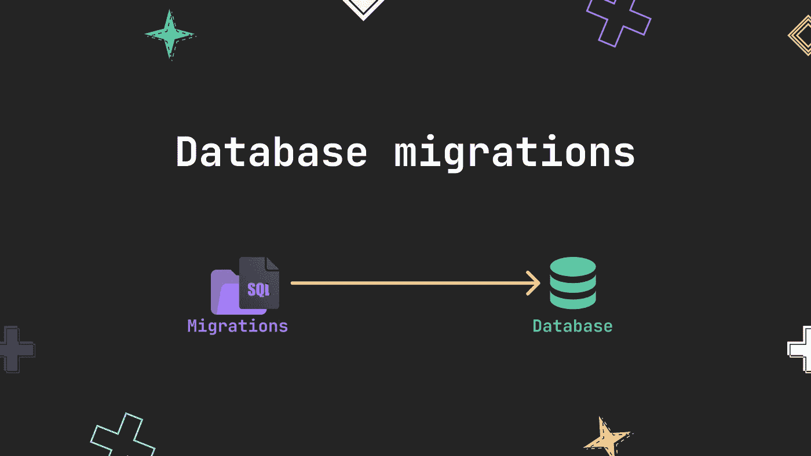
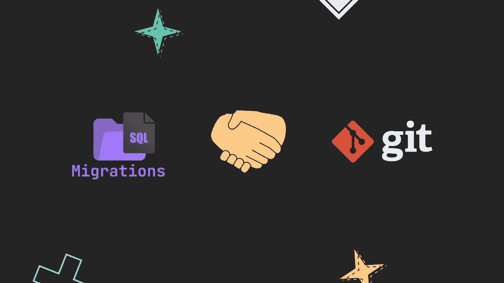
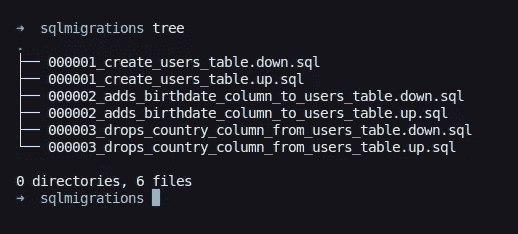

# 使用 Go 跟踪数据库模式的变化

> 原文：<https://betterprogramming.pub/database-migrations-f3a227e29f5f>

## 帮助您更改数据库的提示



迁移帮助您构建数据库模式

# 概观

您是否想过开发人员如何处理项目数据库模式的变化？当添加新的表/列/索引时，或者当删除表、列或索引时，它们做什么？

他们如何确保参与项目的每个人都将所有更改应用到他们的数据库中？为此，他们跟踪对数据库模式所做的每次更改的历史。



带有版本控制系统的 SQL 迁移协议

这是我第一次与其他人一起工作时才知道的，我读了该项目的自述文件，并说我必须运行“迁移”来更新我的数据库模式。

这让我问自己:我以前怎么没想过要处理这么明显的事情？嗯，因为我从来没有关掉电脑或重新格式化我的电脑，所以它让我从零开始重新安装整个项目，以意识到我没有办法在没有备份的情况下恢复我的数据库。

我在本文中的目标是向您展示这种数据库迁移是如何工作的，以便您知道当新的更改应用到数据库时应该做什么，无论您是独自工作还是与其他人一起工作。

# 它是如何工作的

它的工作方式很简单，你必须做和你保存项目代码历史时一样的事情。因此，我们需要一个像 [GIT](https://git-scm.com/) 这样的版本控制系统。在那里，我们可以确保参与项目的每个人都可以拥有最新的数据库变更历史。

在这里，我将向您展示处理数据库迁移的两种方法，但是首先，让我们看看它们有什么共同点:

您将编写包含 SQL 的文件，其名称格式如下:`{version}_{description}.{up/down}.{ext}`

描述可以是对迁移文件用途的简短说明，例如:

1.  `create_users_table`
2.  `adds_birthdate_column_to_users_table`
3.  `drops_country_column_from_users_table`

将更改应用到模式的 SQL(称为向上迁移)和反转这些更改的 SQL(称为向下迁移)

这就是为什么在前一点中，名称格式指示是向上迁移还是向下迁移

**注**:有些库管理一个文件，用注释表示`up` SQL 和`down` SQL

## **按顺序运行迁移的方法**

为此，我们利用文件名格式的版本，您可以输入序列号或创建文件时的时间戳，这样当我们运行迁移时，我们将按升序执行它们。这是必要的，因为您可能会添加依赖于要先执行的其他迁移的迁移。

## **确保我们不会运行两次迁移**

库可能会创建一个表来记录已执行的迁移，这样就不会重复了。

文件的扩展名取决于您选择的处理迁移的方法

它可以是. sql 文件或您的编程语言的扩展

现在我们知道了它们的共同点，让我们来看看每种方法的作用。

# 纯 SQL 的迁移

在这里，您必须创建一个目录来存储`.sql`文件，该文件将包含对数据库模式所做的更改以及撤销这些更改的方法。按照上一节描述的格式，您将得到如下文件:



SQL 迁移目录树

然后在您的迁移文件中，只需写下您想要进行的更改。例如，上图中的`000001_create_users_table.up.sql`迁移应该是这样的:

对于迁移`000001_create_users_table.down.sql`，逆转`up`迁移文件所做的更改所需的 SQL:

```
DROP TABLE IF EXISTS users;
```

**注意**:有些库可以从 GitHub、GitLab、AWS s3 等来源读取 SQL 文件。

对于这种方法，您可以使用以下库:

1.  [https://github.com/golang-migrate/migrate](https://github.com/golang-migrate/migrate)
2.  [https://github.com/pressly/goose](https://github.com/pressly/goose)
3.  [https://www.prisma.io/migrate](https://www.prisma.io/migrate)
4.  [https://pypi.org/project/yoyo-migrations/](https://pypi.org/project/yoyo-migrations/)
5.  [https://github.com/alexyslozada/migrations](https://github.com/alexyslozada/migrations)

# 使用您的编程语言进行迁移

这里应用了与纯 SQL 迁移中相同的约定，但不是使用`.sql`迁移，而是使用编程语言的扩展进行迁移，在我的例子中，我将使用 Golang，所以我之前向您展示的文件结构看起来像这样，带有时间戳版本而不是序列:


转到 SQL 移植目录

如您所见，与前面的方法不同，这里我们只有三个文件。这是为什么呢？这是因为我正在使用的图书馆。我们在同一个文件中指明了`up`和`down`迁移。以下是`users`表的内容:

这里有一个传递给`goose.AddMigration()`的`up`和`down`函数。根据您的编程语言和您使用的库，这显然会有所不同。

对于这种方法，您可以使用以下库:

1.  [https://github.com/pressly/goose](https://github.com/pressly/goose)
2.  [https://laravel.com/docs/9.x/migrations](https://laravel.com/docs/9.x/migrations)
3.  [https://pypi.org/project/yoyo-migrations/](https://pypi.org/project/yoyo-migrations/)

# 如果我处于项目中期并且没有迁移，该怎么办？

为此，您可以创建数据库模式的备份，这样您就可以将它添加为初始迁移，但是您必须确保您使用的库不会在您的本地数据库中执行它(因为您已经有了那些更改)，因此您必须深入到该库以查看它们如何跟踪已经运行的迁移，据我所知，它们会在您的数据库中创建一个表，所以您可以从那里开始。

然后，您可以开始跟踪数据库的变化。如果您想要一个新表，请添加一个迁移。如果你想删除一列？添加迁移。如果你想要一个索引？添加迁移。请记住，对数据库模式的每个更改都必须有一个迁移。

# 结论

在这里，我向您概述了数据库迁移，以及如何处理它们的两种常见方法。就个人而言，我喜欢使用第一种方法，因为我只需要担心编写 SQL，而不用担心用我的编程语言编写代码来执行迁移。我已经用这个方法三年多了，从来没有必要使用第二种方法。

如果您还没有开始使用这些迁移，我希望您今天已经学到了一些新东西并开始使用它们。三年前我不知道如何使用它们，但是通过练习，你会准备好使用它们或者把它们教给其他开发者。

如果您想知道如何自动创建和运行文件迁移，请参考我提到的库。在那里他们解释如何使用它们。

感谢您的阅读，下一篇文章再见。