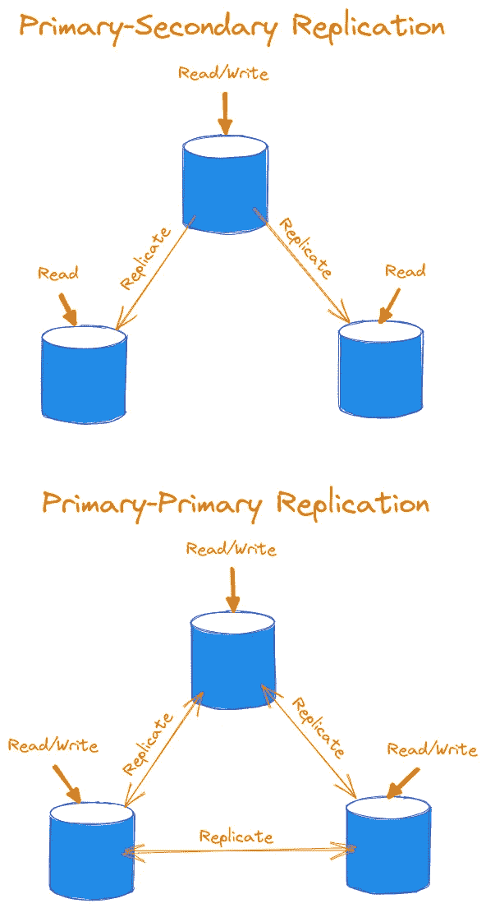
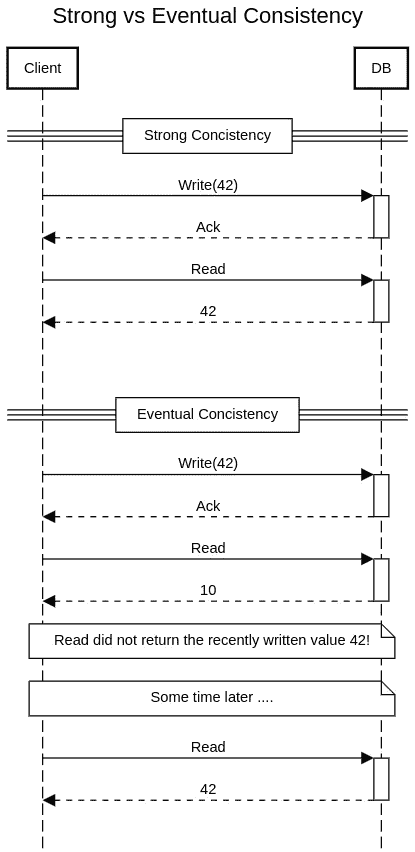
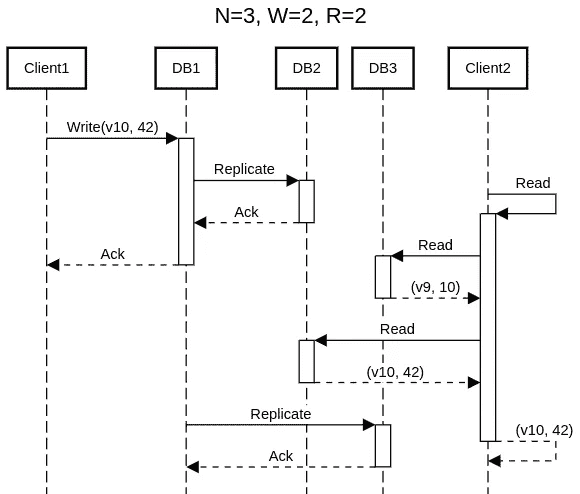

# 数据库复制:好处和缺点

> 原文：<https://betterprogramming.pub/database-replication-benefits-and-trade-offs-d929ca4494c5>

## 通过了解数据库复制的利弊来设计更好的系统

照片由[大卫·迪伯特](https://www.pexels.com/@dibert?utm_content=attributionCopyText&utm_medium=referral&utm_source=pexels)从[派克斯](https://www.pexels.com/photo/flock-of-penguins-near-sea-1299391/?utm_content=attributionCopyText&utm_medium=referral&utm_source=pexels)拍摄

# 利益

*数据库复制*是一种数据库横向扩展方法，将相同的数据复制到多台机器上。这听起来很浪费，但并非没有合理的好处:高可用性和性能提高。

高可用性是通过让节点拥有相同的数据来实现的。如果其中一个节点出现故障，系统仍将工作，因为还有其他节点可用。高可用性通常是人们想要进行复制的主要原因。可用性直接转化为企业的底线。没有人能和不存在的企业做生意。

尽管 DB1 崩溃了，这个系统仍然可用

负载平衡提高了系统的性能。该系统不是由一个节点处理所有流量，而是由多个节点处理一小部分流量。性能改进体现在更低的延迟和/或更高的吞吐量。

流量被负载平衡到三个数据库节点

除了财务成本，复制还有复杂性成本。在深入研究之前，让我们先了解两种复制拓扑:主-辅助和主-主。不同的拓扑会带来不同的复杂性。

复制拓扑

*主从*拓扑允许从任何节点读取，同时限制对指定节点的写入。相比之下，*主-主*拓扑允许在任何节点中执行读取和写入。

# 一致性:强大还是最终？

第一个复杂性是一致性和延迟之间的权衡。高度一致的系统通常比最终一致的系统具有更高的延迟。强一致性保证了读取操作将返回最新的写入数据。相比之下，在最终一致的系统中，读取操作可能会在返回最新写入的数据之前暂时返回陈旧的数据，因此出现了术语“最终”

强一致性与最终一致性

当写入复制的数据库时，有一个选项允许数据库仅在复制到可配置数量的节点后确认写操作。类似地，读取操作可以选择咨询可配置数量的节点，并且只获取最新版本的数据。通过调整这种写入和读取配置，可以实现所需的一致性。

为了在具有 N 个节点的群集中实现强一致性，需要配置写入节点的数量 W 和节点的数量 R，使得 W + R > N。如果写入节点的数量为 1，则在成功地将数据复制到其他节点之前，如果该节点发生故障，则存在丢失数据的风险。

复制的数据库集群非常一致，因为 W + R > N

在 PostgreSQL 中，有一个选项可以在部署时使用[异步和同步复制](https://www.postgresql.org/docs/14/warm-standby.html#SYNCHRONOUS-REPLICATION)来配置 W 的数量。不幸的是，没有内置的方式来配置 R 的数量。相比之下，DynamoDB 仅提供每次操作的[可调 R](https://docs.aws.amazon.com/amazondynamodb/latest/developerguide/HowItWorks.ReadConsistency.html) 而不是 W。aurora db 不提供两个可调 R & W，并且由于[异步复制](https://aws.amazon.com/rds/aurora/faqs/)而最终保持一致。MongoDB 的[写关注点](https://docs.mongodb.com/manual/reference/write-concern/) & [读关注点](https://docs.mongodb.com/manual/reference/read-concern/)可以用来分别配置每个操作的 W & R。它的一个优点是可以选择读写“大多数”节点，即集群大小的一半加 1。例如，在五节点集群中，三个节点占大多数。Cassandra 类似于 MongoDB，因为它为读和写操作都提供了可调一致性。

# 集群成员资格:自动还是手动？

物理节点可能由于各种原因而崩溃。在这种情况下，应该从集群中删除失效节点，并添加一个新的健康节点。有些数据库会自动处理这种情况，而有些则不会。自动化管理更便于操作。

Cassandra 的集群成员是自动的。一个新的 Cassandra 节点连接到集群中[配置的种子节点](https://cassandra.apache.org/doc/latest/cassandra/configuration/cass_yaml_file.html#seed_provider)。其他节点会通过[八卦机制](https://docs.datastax.com/en/cassandra-oss/3.x/cassandra/architecture/archGossipAbout.html#:~:text=Internode%20communications%20%28gossip%29-,Cassandra%20uses%20a%20protocol%20called%20gossip%20to%20discover%20location%20and,other%20nodes%20they%20know%20about.)自动发现这个新节点，最后集群负载重新平衡。与 Cassandra 类似，[cocroach db 成员和负载再平衡也是自动化的](https://www.cockroachlabs.com/docs/stable/demo-replication-and-rebalancing.html#step-6-add-two-more-nodes)。Aurora 和 DynamoDB 等托管数据库也是自动化的。

MongoDB 的集群成员资格需要通过主节点手动管理。PostgreSQL 是一个混合体。对于异步复制，成员关系是自动的，即只有新的辅助节点[需要知道主节点](https://www.postgresql.org/docs/current/warm-standby.html#STANDBY-SERVER-SETUP)。在同步复制中，成员资格是手动的，因为主节点需要一个需要同步完成复制的辅助节点列表。

# 故障转移机制:自动还是手动？

在主从拓扑中，主节点对于群集的运行至关重要。然而，正如我们所知，任何节点都可能崩溃，包括主节点。*故障转移*是一种用新的主节点替换崩溃的主节点的机制。一些数据库有这种自动机制，而另一些没有。主-主拓扑不需要故障转移，因为群集中没有特殊的节点，任何节点都与任何其他节点承担相同的责任。

PostgreSQL 没有内置的故障转移机制。因此需要设计故障转移机制。 [MongoDB 有一个内置的故障转移](https://docs.mongodb.com/manual/core/replica-set-elections/)，其机制类似于 Paxos 算法。[cocroach db 还有一个内置的故障转移](https://www.cockroachlabs.com/docs/stable/architecture/replication-layer.html#raft)机制，带有[Raft 算法](http://thesecretlivesofdata.com/raft/)。

客户端也很复杂。客户端如何知道谁是新的主要用户？PostgreSQL 没有处理这个问题的内置机制。在 MongoDB 中，这个问题是在客户端处理的。官方驱动透明地询问集群哪个节点是领导者。在 CockroachDB 中，这个问题是在数据库端处理的[。客户端可以写入任何节点。然后，该节点会将写操作转发给领导者。](https://www.cockroachlabs.com/docs/stable/architecture/reads-and-writes-overview.html#write-scenario)

# 冲突解决:如何解决？

在主-主拓扑中，写请求可以到达任何节点。对相同数据的写入可能同时来自不同的节点。在这种情况下，冲突就产生了，需要解决。

在 Cassandra 中，这种冲突通过获取最新的书面数据来解决。每一行每一列都标有时间戳。只有当新数据的时间戳比行列中的时间戳新时，才会发生写入。写操作的时间戳由请求写操作的节点提供。因此，在 Cassandra 中，每个节点的时钟保持同步是至关重要的，例如，通过使用 NTP。理论上，在分布式系统中没有办法完美地同步时钟。然而，在实践中，一点点偏差是可以接受的。

在主从拓扑中，冲突解决不是一个问题，因为写入仅在主节点上执行。

# 结论

复制是一种数据库横向扩展技术，将数据复制到多个节点。复制是实现高可用性和提高系统性能的一种方式。复制需要在数据一致性、集群成员、故障转移机制和冲突解决方面进行一些权衡。