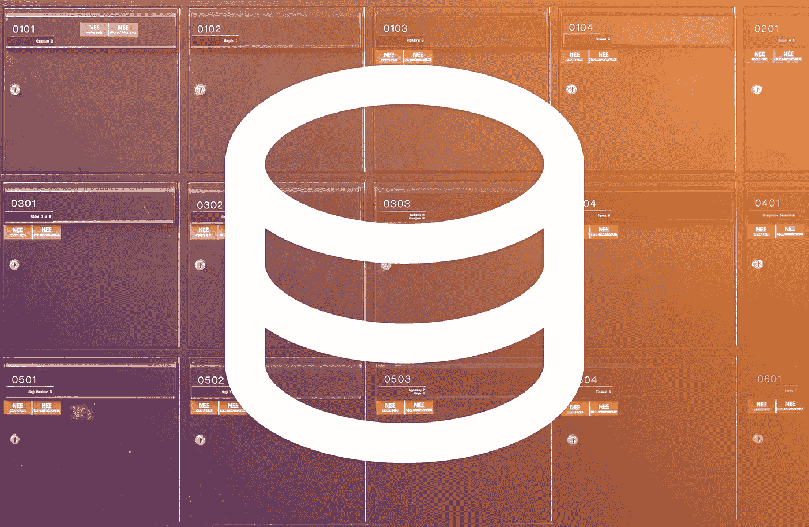

# DB 101:面向开发人员的数据库

> 原文：<https://betterprogramming.pub/db-101-databases-for-developers-f7dc29f46f2c>

## 使用数据库的几个被忽略的方面



[伯纳德·赫尔曼](https://unsplash.com/@bernardhermant?utm_source=unsplash&utm_medium=referral&utm_content=creditCopyText)在 [Unsplash](https://unsplash.com/s/photos/filing-cabinet?utm_source=unsplash&utm_medium=referral&utm_content=creditCopyText) 上的原始照片

在过去的几周里，作为日常工作的一部分，我一直在深入研究数据库，将我们现有的 Postgres 9x 数据库迁移到更新的数据库，如 Postgres 13。作为一名 SRE，除了让我支持的应用程序可用并确保迁移脚本等成功运行之外，我通常不太接触这些应用程序的数据库层。但是这次深入研究让我有时间了解我们的数据库及其结构，并了解我们的应用程序的一些内部工作方式。到目前为止，已经出现了一些文章(还有一些文章，敬请关注！)但是今天我想从一个软件开发人员的角度谈谈数据库——特别是关系数据库，也许可以帮助一些新的和有抱负的开发人员更好地理解他们的数据存储。

# 为工作选择合适的工具

我想谈的第一件事可能是这个列表中最有争议的话题，那就是为您的应用程序选择正确的数据库。我知道不是每个人都能为自己的项目选择 DB，但我认为了解一些最流行的 DB 及其优缺点会有所帮助。

首先，有数据库类型的问题:关系、非关系(或 NoSQL)和键值(或 KV)。

***作者注:*** *我想指出的一点是，SQL 与 NoSQL 的二分法有点用词不当，因为关系数据库不一定要使用 SQL，非关系数据库可以使用 SQL。但是 SQL 和 NoSQL 已经成为关系型和非关系型的简写，所以在本文的其余部分，我将使用这些术语的通俗含义。*

关系数据库(有时缩写为 RDBMS 或 SQL 数据库)存储两种数据:填充数据库的各种数据位以及这些位之间的关系。这使得 SQL 数据库可以灵活地进行查询，并且更容易只获得您正在寻找的数据，因为与 NoSQL 数据库相比，数据更倾向于跨表分解(或*规范化* ) 。规范化减少了数据冗余并提高了数据完整性，因为您只需一次存储一位数据，并在需要时引用它。SQL 数据库的常见例子有 [PostgreSQL](https://www.postgresql.org/) 、 [MariaDB](https://mariadb.org/) 和[微软 SQL Server](https://www.microsoft.com/en-ca/sql-server/sql-server-2019) 。

NoSQL，或者非关系数据库，有许多不同的风格(太多了，这里就不多说了)，但是可能最常见的是文档数据库。数据不是像 SQL DB 那样存储在多个表中，而是作为一个文档存储在一起。文档是半结构化的，因为它们通常以某种编码方式存储，如 JSON 或 XML，但是编码的数据不需要遵循一致的格式。您可以在单个文档数据库中存储不同类型(或模式)的文档。文档数据库具有 SQL DBs 所没有的灵活性优势，根据您正在处理的数据，这可能是一种优势。流行的文档数据库有 [MongoDB](https://www.mongodb.com/) 、 [Elasticsearch](https://www.elastic.co/elasticsearch/) 和 [Couchbase](https://www.couchbase.com/) 。

键值存储类似于 NoSQL 数据库，从技术上讲，文档数据库是 KV 数据库的一个子集。然而，出于我们的目的，我们将保持 KV 数据库独立，因为从应用程序的角度来看，它们服务于不同的目的。键值存储本质上是哈希表，因此在执行查找时会非常快。这就是为什么它们通常被用作应用程序的缓存；他们的阅读成绩非常非常好。然而，通常 KV 数据库的功能集是有限的，因此，与将部分工作卸载到 SQL 或 NoSQL 数据库相比，处理复杂数据需要更多的时间和流程。一些最受欢迎的键值存储是 [Redis](https://redis.io/) 、 [Memcached](https://memcached.org/) 和 [Consul](https://www.consul.io/) 。

既然我们已经对基本的数据库类型有了一个概述，那么我们如何决定使用哪一种呢？您首先要查看的是您的数据，并确定五件事:

## 1.什么样的数据将存储在数据库中？

您将存储日志文件吗？用户帐户？产品信息？JSON 文档？数据类型将有助于确定 SQL 或 NoSQL 数据库是否是正确的选择。

## 2.将要存储的数据有多复杂？

我的数据可以很容易地正常化吗？如果您的数据不能标准化，那么 NoSQL 数据库可能是正确的选择。

## 3.数据的统一程度如何？

所有的数据单元都遵循相同的模式吗？它能被做成适合列的类型吗？如果数据不统一，那么文档数据库可能是正确的选择。

## 4.需要多长时间读一次或写一次？

这个应用程序是读负载还是写负载？大量写入的应用程序可能需要一个在大量写入负载下运行良好的数据库。

## 5.使用数据库时是否有环境或业务方面的考虑？

我们是否有任何合同或许可证会影响对某个品牌或平台的决策？退出合同或考虑事项可能意味着使用像 Microsoft SQL Server 或 Oracle 数据库这样的东西，而不是像 MariaDB 这样的开源产品。

最后，选择哪个数据库不是我能在文章中告诉你的事情。这是一个需要由开发团队在考虑上述所有因素后做出的决定。

# 管理数据库

下一个要问自己的问题是“我想如何管理我的数据库”？这似乎是一个愚蠢的问题，但是在编写原始 SQL 查询、使用 SQL 查询构造函数或使用成熟的 ORM 之间做出选择并不容易。等等，什么是 *ORM* ？

ORM 或对象关系映射器是一种管理数据库中的对象和表示数据库结构(表、列等)的方法。)作为你所选择的编程语言中的对象。通常，表表示为类，类属性表示为列，等等。使用 ORM 可以让生活变得简单很多，尤其是在刚开始的时候，但是 ORM 也有缺点。

ORM 必然是通用的。他们必须能够处理任何类型的数据的任何类型的查询，因此，他们倾向于优化灵活性而不是性能。使用 ORM 查询数据，尤其是在高容量的生产环境中，会导致延迟问题、死锁、锁定等等，导致应用程序逐渐停止。我见过一些 ORM 做一些非常古怪的事情，比如多重嵌套事务之类的。但是他们仍然有自己的位置。早期开发、原型和低容量数据库访问都是使用 ORM 的很好的用例。

或者，您可以简单地编写原始 SQL。虽然这很可能为您提供最高的性能，但也可能是一种更费力的访问数据的方式。此外，与自动转义特殊字符和引号字符串的大多数 ORM 不同，如果您对如何处理外部数据(尤其是用户提供的数据)不够小心，编写原始 SQL 可能会使您的应用程序遭受 SQL 注入攻击。

介于两者之间的是 SQL 构造函数。它们提供了一些与 ORM 相同的工具(SQL 注入缓解，一种更具功能性的查询方式),而没有 ORM 带来的一些开销。它们本质上是为构造 SQL 语句而设计的字符串生成器。它们提供了 ORM 和 DIY SQL 之间的中间地带。

# 指数

关于数据库，最容易被忽视也是最需要理解的一个方面是索引。索引为数据库提供了一种快速查找表中值的方法，而不必遍历表中的所有行。代价是增加了保存索引所需的存储空间，并且在向表中插入新值时增加了写入时间，因为数据库还需要更新索引查找。SQL DB 中的大多数表都有一个由数据库自动索引的主键；此外，您可以指定要索引的表中的其他列。

假设您正在处理一个用户表，并且希望在用户输入用户名时检索他们的电子邮件。我们的表可能看起来像这样:

```
id*| username      | email        
-------------------------------------------------
1  | user_ted      | ted@company.us
2  | user_jill     | jill@company.us
3  | user_annie    | annie@company.us
```

在这种情况下，`id`是我们的主键，因此自动有一个与之关联的索引。然而，您的用户不会提交他们的行 ID，他们将提交他们的`username`。在表中只有三行的情况下，索引在性能方面不会有太大作用，但是当表增长到 100 行时会发生什么呢？1,000?10,000?随着新的行被添加到表中，对用户的`email`的每个查询将花费越来越长的时间。通过向`username`列添加一个索引，我们可以将查询时间减少到一个几乎恒定的时间(或`O(1)`)。同样，这会消耗一些磁盘空间和写性能，但是由于我们查找用户的次数会比添加用户的次数多，所以只要我们不忘乎所以，这种权衡是非常好的。忘乎所以会增加我们不需要的索引，比如`email`上的索引，因为我们从不通过电子邮件地址查找。我们添加一个`email`索引所要做的就是增加更多的插入时间和不必要的磁盘空间。

# 健康检查

当您的应用程序需要长时间连接到数据库时，最好定期检查数据库是否仍然可用。根据数据库驱动程序、语言和其他因素，可能有一些方法可以很容易地做到这一点，比如检查打开的连接，但有时最简单的方法是只运行一个 DB 查询。然而，运行哪种查询取决于您的目标。

## 目标:我想确保我所有的表都在那里

好的，我理解确保您的数据库处于可用状态的愿望。但是，我不建议将此作为常规健康检查。我会在应用程序启动时执行这种验证步骤。首先，获取表的列表会给数据库带来读取负载。它可能很小，但是如果您有应用程序的多个副本同时运行，执行相同的运行状况检查，那么性能影响将会更大。但是，如果您真的执意要这样做，那么一定要记住，您可能会看到性能下降。

## 目标:我想获得数据库统计数据

我喜欢这个。从数据库中获取统计数据，比如读/写负载，将是应用程序可以记录下来供以后使用的有用的东西。除了数据库的可用性状态之外，应用程序本身对这些信息无能为力，但是它可能有助于以后的故障排除。

## 目标:我只是想确保数据库正常运行

这可能是最基本也是最符合逻辑的健康检查，至少对我来说是这样。其他的事情，比如数据库性能或验证等等，都可以通过其他工具单独处理。检查基本可用性实际上是您的应用程序唯一关心的事情，所以在我看来，保持简单是最好的方法。那么，对此应该使用什么样的查询呢？你绝对不想做的是这样的事情:

```
SELECT * FROM 'Customers';
```

不，不，不，不，住手。

是的，这将检查数据库是否处于活动状态。但它也会给你一个所有客户的列表，这个列表会随着你的客户群的增长而增长，这意味着你的健康检查的执行时间也会增长。**不要这样。**这是我最近看到的一件真实的事，所以是的，确实发生了。相反，最好和最简单的查询是这样的:

```
SELECT 1;
```

这在本质上与

```
def my_function():
    return
```

简短，简单，并做了工作。你真的不能做得比这更好。

# 包装它

这只是对使用数据库的所有内容的略述，但我希望它能对一些经常被忽略的领域提供一些见解。记住:数据库通常会成为应用程序的性能瓶颈，所以要好好对待它们，并且总是寻找让它们更快的方法。

我错过了什么吗？你想看我报道什么吗？请在评论中告诉我！