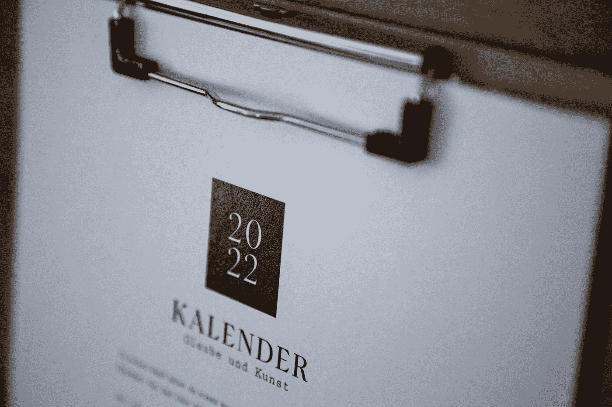

# 在 R 中处理日期和时间

> 原文：<https://betterprogramming.pub/dealing-with-dates-and-times-in-r-891bd1675d74>

## 是时候掌握时间了



[巴鲁·埃尔特尔](https://unsplash.com/@ertelier?utm_source=medium&utm_medium=referral)在 [Unsplash](https://unsplash.com?utm_source=medium&utm_medium=referral) 上的照片

一旦你花了足够的时间做数据工程师，你就会知道两种最难处理的数据类型是时间和日期。对于新手来说，情况更加困难。

在这篇博客文章中，我们将发现 base R 为我们提供的所有实用程序，加上 lubridate，一颗来自 Hadleyverse 星系的闪亮脉冲星。

# POSIXct 和 POSIXlt

在继续之前，我们先解释 R 中的两个基本日期时间类:POSIXct 和 POSIXlt。“ct”和“lt”分别表示日历时间和列表时间。当我们希望在一个变量中存储一个特定的日期时间时，使用 POSIXct，而 POSIXlt 将一个日期时间对象的不同部分存储为一个列表的组件，只有当我们希望分别实现这些组件时，它才是有用的。从现在开始，当我们说日期和时间时，我们只是指 POSIXct 对象，因为它是更常见的对象。

让我们演示这两个类的用法。

```
## [1] "2022-03-24 04:55:44 +03"## [1] "POSIXct" "POSIXt"
```

这是 r 中典型的日期时间的样子。

```
now_lt <- as.POSIXlt(now_ct)
now_lt## [1] "2022-03-24 04:55:44 +03"
```

那么你可以把它当作一个常规列表。

```
## [1] 44.88857## [1] 24## [1] 4
```

有趣的事实:如果你试图解开一个 POSIXct 对象，它会返回从 1970 年 1 月 1 日起过去的秒数。

```
unclass(now_ct)## [1] 1648086945
```

# 从性格到立场。

我在文章开头提到的困难是遇到以各种可笑的形状存储为字符和数字的日期和时间，并且不能将它们转换成正确的日期-时间对象。为了这项单调乏味的任务，我们配备了一堆工具。你最熟悉的应该是`strptime()`。它的主要工作是将字符转换成日期时间。

等等，没那么容易。因为字符可以包含各种形式的日期和时间，所以需要通过格式参数告诉`strptime()`如何理解给定的字符，以便它可以正确地从该字符中提取日期和时间部分。因此，我们使用占位符来表示任何给定字符中的日期和时间信息。下面是这些占位符的详细列表。

*   %一个缩写的工作日，
*   %一个工作日
*   %b 缩写月份
*   %B 个月
*   %c 区域设置日期和时间
*   %d 个十进制日期
*   %H 小时(24 小时制)
*   %I 小时(12 小时)
*   一年中的%j 天
*   %m 个月
*   %M 分钟
*   %p 区域设置上午-下午
*   %S 秒
*   一年中的%U 周(从星期日开始)
*   %w 工作日(从周日开始)
*   一年中的%W 周(从星期一开始)
*   %x 区域特定日期
*   %X 区域特定时间
*   %y 两位数年份
*   %Y 四位数年份
*   从 GMT 偏移%z
*   %Z 时区

不要那么容易被那些占位符吓到。你不需要记住它们。你可以随时打开它查看。

有了例子，你会更好理解。我希望你能原谅我的土耳其月份名。(由于某种原因，我的电脑现在很顽固，不能转换成英语)

```
## [1] "2019-06-02 +03"## [1] "2015-04-15 EEST"## [1] "1996-12-23 07:45:00 EET"## [1] "2022-03-24 20:34:00 +03"
```

# 从 POSIXct 到 character。

虽然它可能不如将字符串转换为日期-时间那样频繁，但我们可能会遇到必须提取日期-时间的一部分并在字符串中使用的情况。在这些情况下，我们应用`strftime()`。

```
## [1] "It's 04:55 on Perşembe 24 Mart, 2022." ## [1] "I was born in 1996\. At 07:45"## [1] "The exam is on the 15th of Haziran"
```

# 时区

当然，我们不能跳过日期时间教程而不谈时区。`strptime()`和`strptime()`的“tz”参数以可接受的方式接受时区信息。

```
## [1] "2022-03-23 18:55:45" ## [1] "2022-03-24 04:55:45"## [1] "2022-03-24 05:55:45"## [1] "2022-03-23 22:55:45"
```

# seq()和 difftime()

我们可以用这两个函数做以下操作。它们对于时间计算非常有用。

```
## Time difference of 796608000 secs## Time difference of 13276800 mins## Time difference of 9220 days
```

以下代码块的输出没有显示，因为它占用了太多空间。你可以自己试试。

```
start <- as.Date('1996/12/23')
end <- as.Date('2022-03-22') seq(start , end , by = 1)
seq(start , end , by = '1 year')
seq(start , end , by = '500 days')
seq(start , end , by = '3 weeks')
```

# 更多内容请参见 base R

要查看我们在这里没有涉及的所有内容，您可以运行下面这段代码，查看您拥有的所有选项。

```
methods(class = 'Date')
methods(class = 'POSIXt')
```

# 还有润滑剂！

如果你没有听说过 Hadley Wickham 这个名字，你可能没有花太多时间学习 R 语言。他是包括 lubridate 在内的几个 R 库的创建者，这使得处理日期和时间变得非常非常容易。

```
**library**(lubridate)
```

`lubridate`用一组非常直观的功能取代了`strptime()`。要开始将字符串转换为日期，您只需要知道相应时间概念的第一个字母。我们已经有了完美的例子。

```
## [1] "1978-08-24"
## [1] "1923-10-29" 
## [1] "1920-04-23" 
## [1] "1996-12-23"
## [1] "23H 45M 12S"
## [1] "1923-10-29 09:59:00 UTC"
## [1] "1996-12-23 15:15:32 UTC"
```

看到了吗？这是难以置信的容易。此外，lubridate 附带了许多实用程序，使时间计算变得容易得多。参见下面的例子。

```
##  [1] "2023-03-24" "2024-03-24" "2025-03-24" "2026-03-24" "2027-03-24"

##  [1] "2022-03-24 01:00:00 UTC" "2022-03-24 02:00:00 UTC"
##  [3] "2022-03-24 03:00:00 UTC" "2022-03-24 04:00:00 UTC"
##  [5] "2022-03-24 05:00:00 UTC" "2022-03-24 06:00:00 UTC"

##  [1] "2022-03-24 00:00:01 UTC" "2022-03-24 00:00:02 UTC"
##  [3] "2022-03-24 00:00:03 UTC" "2022-03-24 00:00:04 UTC"
##  [5] "2022-03-24 00:00:05 UTC" "2022-03-24 00:00:06 UTC"
```

我希望这篇文章能对所有数据爱好者有所帮助。