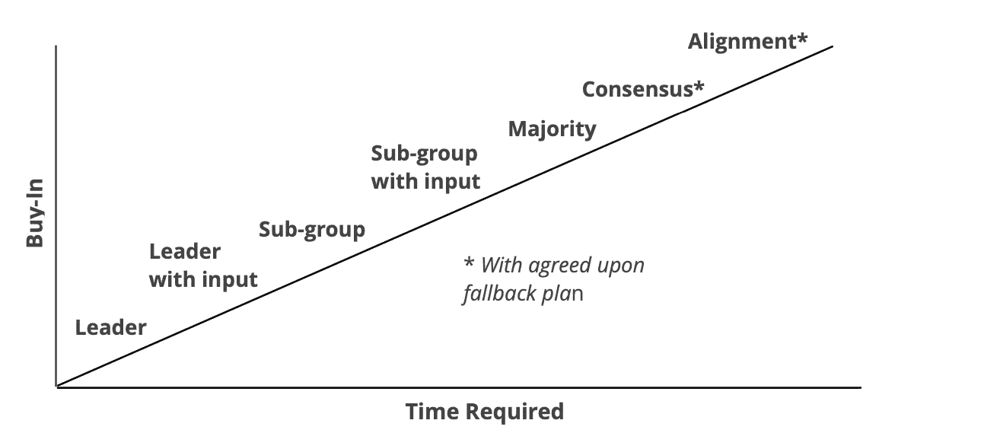

# 决策权——传达如何做出选择

> 原文：<https://betterprogramming.pub/decision-rights-communicating-how-choices-get-made-63a73829af1d>

## 给领导者的建议

贝丝·麦克唐纳在 [Unsplash](https://unsplash.com?utm_source=medium&utm_medium=referral) 上的照片

公司很少有产生想法和解决问题的方法的问题。事实上，你几乎获得了太多的想法，以至于无法筛选、评估并最终实施。但团队面临的一个更大的问题不是产生选项，而是选择哪个选项继续前进。(下一个问题是整合资源，但这是以后的话题)当我们有一群人在处理一个问题，但不清楚谁是决策者时，决定一个行动过程的问题就变得更加严重了。

在[基础技术](https://www.basis.net/)，我们遵循[自觉领导团队](https://conscious.is/)的许多原则和实践。作为一名领导者，我们所接受的培训对我来说是无价的，但迄今为止最好的收获之一是[决策权](https://conscious.is/excercises-guides/defining-decision-rights)的概念。简而言之，决策权是对谁将在任何给定情况下做出决策的明确定义。随着我的团队不断壮大，我们分布在三个国家，我越来越多地使用决策权。随着我的组织的发展，简单的非正式沟通的好处已经开始消失，我需要一些更正式的东西来确保团队在同一页上。

总共有 7 项决策权，每项决策权的变更都会增加达成决策所需的时间以及从集团获得的买入费。当我快速浏览 7 个决策权时，这将更有意义。

# 决策权

*   领导者——我们都非常熟悉领导者的决策权。就像听起来那样，团队的领导者(假设有一个明确的定义)会自己做出决定。
*   提供意见的领导者—领导者在做出决策之前会收集其他人的意见。领导者通常会负责收集他们认为对他们的思考过程有必要的信息。
*   小组——一小组人聚在一起做决定。该团队通常由主题专家(SME)组成，他们负责决策过程的各个方面。
*   有意见的子组——有意见的子组意味着该子组仍然做出决定，但是在做出决定之前也从组外寻求信息。
*   多数投票——接着是某种形式的小组讨论，然后是投票阶段。每个人都应该有机会在投票前表达自己的想法和担忧。把它想象成一场选举，每个候选人(或者我们场景中的观点)都有机会讨论他们对形势的感受。这段时间结束后，进行投票，多数获胜。团体或组织的领导人将决定需要何种形式的多数，是简单多数，还是三分之二多数等。
*   共识——当没有人反对所做的决定时，共识就产生了。这并不意味着他们不能有怀疑或保留，但他们并不积极反对。这是典型的晚餐计划场景。你不反对牛排，尽管你更喜欢吃意大利面，但是其他人想要牛排，你可以支持他们。但是就像你的晚餐计划一样，达成一致的决定是很难的，所以如果你不能达成一致，明智的做法是做一个后备决定。前面提到的任何决策权都可以起作用，但我通常会求助于领导者的意见。
*   结盟——结盟是指*每个人*都全力支持正在做出的决定。没有异议。这是所有决策权中最难遇到的。如果你不能在晚餐上达成一致，那么在转型变革上达成一致会非常困难*。与共识决策权一样，在无法达成一致的情况下，拥有后备决策权也很重要。*

有了这 7 项决策权，我们就可以讨论买入和时间了。根据必须做出的决策的紧急程度，一些决策权可能看起来比其他决策权更明显。

决策权图——来自有意识的领导团队

在上图中，您可以看到各种决策权绘制在一个图表上，轴是买入费和时间。这是我们在做决策时遇到的两个典型的限制。对于大型转型变革来说，接受可能非常重要，但当我们试图在本季度做出决策时，时间可能是至关重要的。选择正确的决策没有正确或错误的答案。这一切都归结于手头的情况和你工作的限制。如果你有更多的时间，获得更多的认同是有意义的，这可以让你获得决策权，比如结盟或共识。任何决策通常都受益于团队的更大投入。问题是，并不是每个决策都有必要的时间来完成，这使得其他一些决策权更有吸引力，更适合当前的情况。

# 传达决策权

在我们团队中，我不会对每个正确的决策都进行正式沟通。我通常把它留给影响广泛的决定，我知道很多人会有感觉。我也不讨论领导者决定时的决策权，因为这样通常就很清楚了。当你没有意见的时候，想到你对一个决定有意见是一种可怕的感觉。如果我带着一个已经做出的决定来到团队，我会通过发布决定来明确这一点。同样，这种情况很少发生，但确实会发生。

当我传达决策权时，通常是用这种古老过时的叫做“会议议程”的方式。你们中的一些人可能还记得那些在过去的日子里，知道你将在生命中的 1.5 小时里做什么是很重要的。在会议议程中，我试着列出一些事情。

*   要做的决定是什么
*   分配给决策的时间范围(通常只是会议的长度)
*   什么是决策权
*   什么是回退决策权(如果适用)
*   用于生成决策选项的任何工具(头脑风暴、利弊、6 顶帽子等)

掌握了这些要点，每个人都清楚地了解了他们在决策过程中的角色以及如何做出决策。即使人们不同意最终的决定，它形成的过程是很好理解和透明的。议程甚至不需要非常详尽。这是我过去用过的一个议程示例。

> 让我们聚在一起讨论名称空间的发展。
> 
> 问题:我们需要决定是否每个环境有一个单一的名称空间，或者名称空间是否会被应用程序分解。单个名称空间在测试环境中是有利的，但是在生产中可能会变得难以控制。多个名称空间会使环境管理变得复杂，并且会强制在 pod 中引用应用程序的特定模式，因为您必须使用 FQDN。这些都不难，但我们需要一个具体的选择。
> 
> 会议结果:决定单个名称空间还是多个名称空间。决策模型:如果我们不能达成一致意见，那么团队的一致意见和领导的支持将由员工的意见来决定。
> 
> [正反意见板 z](https://ideaboardz.com/for/Brainstorm%20Pros%2FCons%20of%20a%20single%20Namespace/4458194)

这只是足够的信息让每个人都在同一页上，而不需要花费大量的时间来制作可能不会被尊重的时间块。(尽管如果你有时间制定更详细的日程安排，这完全值得。我只是说，如果没有议程，简短的议程还是有价值的

# 总结

一旦你超越了领导决策层，决策权就变得棘手了。确保参与决策和受决策影响的人了解决策是如何做出的，可以导致更大的认同，即使是在决策做出后*。传达这些决策权可以极大地促进参与和生产力。它还迫使你对每个决策的两个约束条件，时间和买入，做出合理的决策。你拥有的时间越多，你就越有可能投入更多的买入费。但是如果时间紧迫，你可能不得不减少买入费，这样无论你做什么决定，你都可以开始行动。不管你承认与否，这些压力都存在，所以最好睁大眼睛去面对这种情况。它甚至可以帮助你传达为什么选择这么窄的买入范围。并不是每个决定都有一个可以达成一致甚至共识的时间范围。这是否意味着一些决策是次优的？当然了。但是一个次优的决定比根本没有决定要好的多。*

如果你想进一步了解或看到决策权的可视化表示，我在下面链接了一个视频，我鼓励你去看看[意识领导](https://conscious.is/)小组。