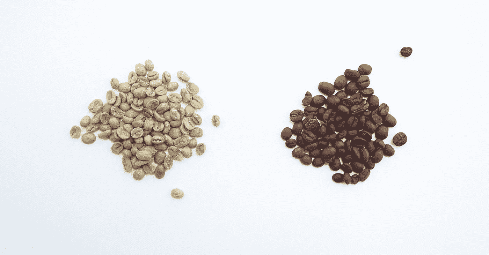

# 装饰模式和 Python 装饰器

> 原文：<https://betterprogramming.pub/decorator-pattern-and-python-decorators-b0b573f4c1ce>

## 为什么它们不一样？

[咖啡极客](https://unsplash.com/@coffeegeek?utm_source=medium&utm_medium=referral)在 [Unsplash](https://unsplash.com?utm_source=medium&utm_medium=referral) 上的照片。

> [装饰图案](http://c2.com/cgi/wiki?DecoratorPattern)是在[设计图案手册](http://c2.com/cgi/wiki?DesignPatternsBook)中描述的图案。这是一种明显修改对象行为的方式，通过用一个相似的接口将它封装在一个装饰对象中。
> 
> 这不要与 [PythonDecorators](https://wiki.python.org/moin/PythonDecorators) 混淆，后者是一种用于动态修改函数或类的语言特性。”——[维基。蟒蛇](https://wiki.python.org/moin/DecoratorPattern)

Python 有一个特性叫做 Decorator，不要和设计模式 Decorator 模式混淆。在本文中，我将通过装饰模式和 Python 装饰器的例子来帮助区分这两者。

# 装饰图案

所以让我们把注意力集中在上面的定义上:“这是一种明显修改对象行为的方式，通过用一个相似的接口把它封装在一个装饰对象中。”

## 行为矫正

让我们想象一个对象 a，如果对它调用方法`foo`，它会以某种方式表现。装饰模式修改了这种行为。所以当对象 A 被修饰时，同样的`foo` 方法现在表现不同。

对于一个具体的例子，让我们创建一个类实现，它通过将两个数相加并返回结果来处理这两个数:

稍微解释一下上面的代码:它实现了类`Add` ，这个类的构造函数有两个参数:`a`和`b`。方法`process`将这两个(`a`和`b`)相加，并返回相加的结果。

现在让我们修改它的行为，使`process`方法的输出乘以一个指定的数字`num`:

`modify_process`方法通过将方法`process`的结果乘以指定的数字`num`来修改`decorated_object`的行为。所以到目前为止，我们已经能够修改行为，但是还没有“用类似的接口将它封装在装饰对象中”我们就这么做吧。

## 封闭对象

我们的下一个任务是封装类`Add`的对象。为此，我们将创建另一个`EnclosedAdd`。`EnclosedAdd` 括住了`Add`类的对象。

正如你所看到的，`EnclosedAdd`没有公开任何方法，似乎我们后退了一步，因为我们失去了类`Add`的功能。为了补救这一点，我们将创建一个类似于类`Add`的接口，这是定义中缺少的最后一样东西。

## 增强型界面

最后，为了创建一个类似的接口，我们从修饰类`Multiply`(从`EnclosedAdd`重命名)中公开方法`process`。`Multiply`用数字`num`初始化，该数字与修饰对象上的方法`process`的结果相乘。`Multiply`通过封装(通过构造函数)来修改对象`add_object`的行为，并提供类似的接口`process`。

## 嵌套

多个装饰器可以应用于被装饰的对象。让我们看看如何将它们嵌套在一起:

在上面的代码中，我们在链中应用了`Multiply`和`Divide`装饰器。当`process`方法在`divide_multiply_add_object`(类`Divide`的实例)上被调用时，`I am divide process` 被打印在控制台中。然后在类的修饰对象上调用`process`。这种情况下就是`multiply_add_object`。它打印`I am multiply process`然后在`add_object`(装饰对象`multiply_add_object`)上调用`process`。那印`I am add process`。`process`的结果沿链向上。`add_object`上的`process`方法产生 *1 + 4 = 5* ，再乘以`multiply_add_object`的`process`中的 *4 (5 * 4 = 20)* 。最后在`divide_multiply_add_object` *的`process`中用 *5 ( 20 / 5 = 4)* 除 *20* 。*

# Python 装饰者

现在让我们看看 Python 装饰器。

> “Python decorator 是对 Python 语法的一种特殊改变，它允许我们更方便地修改函数和方法(以及未来版本中可能的类)。这支持更多可读的 [DecoratorPattern](https://wiki.python.org/moin/DecoratorPattern) 应用程序，也支持其他用途。”— [维基。Python](https://wiki.python.org/moin/PythonDecorators)

## 函数与方法

在继续之前，我想指出这个定义是在区分函数和方法。这是一个重要的区别。方法是对象的一部分，可以改变对象的状态，而函数是独立的，不是对象的一部分。

在上面的代码中，`process`是一个方法，而`add_process`是一个函数。`process`将是类`Add`对象的一部分，而`add_process`是独立的。我希望这澄清了函数和方法之间的区别。在这一节中，我将介绍 Python decorators 的函数和方法的例子。

## 函数上的 Python 装饰器

在我们进入更复杂的 Python 装饰器之前，让我们看一个简单的装饰器。我先从一个简单的`add`方法开始:

上面的函数只需要两个参数:`a`和`b`。该函数的行为是将这两个输入参数相加，并返回相加的结果。

现在我要装饰这个方法，这样方法`add`的结果乘以 2:

为了实现这一点，我创建了函数`multiply_by_two` *。* `multiply_by_two`将另一个函数`func`作为输入。它创建了另一个函数`_multiply_by_two`，该函数有两个参数，这两个参数随后被传递给输入函数`func`——其结果乘以 2。`multiply_by_two` 返回构造的方法`_multiply_by_two`。

我所做的是创建装饰器`multiply_by_two`，它基本上是通过将输入函数`func`乘以 2 来装饰它的功能(顾名思义)。现在让我们来看看它的运行情况:

上面的代码用`multiply_by_two` *修饰了函数`add`。*这样做的构造是在被修饰的函数(`add`)之前，将`@`符号用于被修饰的函数(`multiply_by_two` ) )。

在上面的代码中，同一个装饰器被应用于一个减法函数。在这种情况下，输出为 *-8* 。所以很容易看出装修工是多才多艺的。它们可以相当普遍地应用。

## 方法上的 Python 装饰器

在上面的代码中，`add`是一个方法，也是类`DecoratedAdd`的一部分。我们用一个类似的函数(`multiply_by_two` ) 来装饰它。如果我们执行上面的代码，我们得到 *12* ，根据意图是 *(1 + 5) *2* 。需要注意的一点是，在`_multiply_by_two`中，`self`是一个参数，因为`add`将`self`作为参数，是类`Add`的实例的一个方法。我们可以这样概括，一个单独的`multiply_by_two` 既可以用来修饰函数，也可以用来修饰方法。

现在，我们不是传递预先确定的参数，而是传递`*args, **kw`来概括它。

## 嵌套

现在让我们来看看 Python decorators 的嵌套，decorator 可以一个接一个地应用于一个函数。保持算术主题，我现在将创建另一个方法，`divide_by_three`，它与`multiply_by_two`相同，只是它使用输入`num`将修饰方法的结果除以 3。

要嵌套 decorators，需要在实际的被修饰方法之前，使用与之前使用的`@`符号相同的机制，一次指定一个。

就像上面的代码一样，我先用`multiply_by_two`然后用`divide_by_three`来装饰方法`add`。这产生了嵌套，因为应用了第一个`multiply_by_two`和第二个`divide_by_three`装饰器。应用程序的顺序与它们在代码中出现的顺序相反，这一点值得注意。

# 结论

在本文中，我通过给出代码示例讨论了 Decorator 模式和 Python decorators 之间的区别。此外，嵌套还解释了如何将多个 decorators 应用于同一个对象或方法。希望你觉得有用！